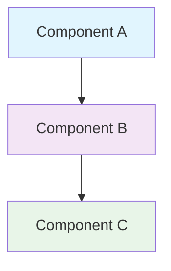
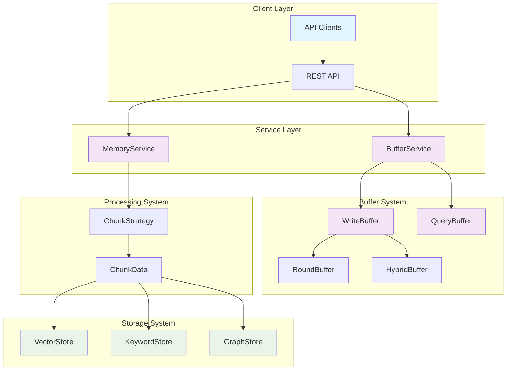

# MemFuse Documentation

## Overview

This directory contains comprehensive documentation for the MemFuse system, organized by functional areas and architectural components.

## Documentation Structure

### 📁 Architecture (`/architecture/`)

Core architectural documentation for system components:

- **[`buffer.md`](architecture/buffer.md)** - Buffer system architecture and implementation
  - WriteBuffer, RoundBuffer, HybridBuffer, QueryBuffer components
  - Data flow pipelines and processing strategies
  - Configuration, performance, and monitoring

- **[`chunking.md`](architecture/chunking.md)** - Chunking system architecture and strategies
  - ChunkStrategy implementations and selection guide
  - Store integration and unified interfaces
  - LLM integration and contextual retrieval

### 📁 Archive (`/archive/`)

Historical documentation and implementation records:

- `buffer_*.md` - Previous buffer implementation documentation
- `sdk_buffer_integration.md` - SDK integration documentation
- `chunking_legacy.md` - Original chunking documentation

### 📁 Assets (`/assets/`)

Documentation assets and resources:

- `logo.png` - MemFuse logo and branding assets

## Quick Start

### For Developers

1. **Understanding the System**: Start with [`architecture/buffer.md`](architecture/buffer.md) for core buffer concepts
2. **Chunking Implementation**: Review [`architecture/chunking.md`](architecture/chunking.md) for data processing
3. **Historical Context**: Check `/archive/` for implementation evolution

### For Architects

1. **System Design**: Review architectural documents for component interactions
2. **Performance Characteristics**: Understand latency and throughput patterns
3. **Integration Patterns**: Learn service integration strategies

## Architecture Summary

### Core Components

| Component | Purpose | Documentation |
|-----------|---------|---------------|
| **WriteBuffer** | Unified entry point for message processing | [`buffer.md`](architecture/buffer.md#writebuffer---unified-entry-point) |
| **RoundBuffer** | Token-based FIFO buffering | [`buffer.md`](architecture/buffer.md#roundbuffer---token-based-fifo) |
| **HybridBuffer** | Dual-format storage management | [`buffer.md`](architecture/buffer.md#hybridbuffer---dual-format-storage) |
| **QueryBuffer** | Intelligent query processing | [`buffer.md`](architecture/buffer.md#querybuffer---intelligent-query-processing) |
| **ChunkStrategy** | Pluggable chunking algorithms | [`chunking.md`](architecture/chunking.md#chunking-strategies) |
| **Store Layer** | Unified storage interface | [`chunking.md`](architecture/chunking.md#storage-integration) |

### Key Features

- ✅ **Unified Architecture**: WriteBuffer as single entry point
- ✅ **Intelligent Buffering**: Token and size-based thresholds
- ✅ **Flexible Chunking**: Multiple strategy implementations
- ✅ **Multi-Store Support**: Vector, Keyword, and Graph storage
- ✅ **Performance Optimization**: Parallel processing and caching
- ✅ **LLM Integration**: Contextual enhancement capabilities

## Documentation Standards

### Writing Guidelines

- **Language**: All documentation in English
- **Structure**: Clear hierarchical organization with proper headings
- **Diagrams**: Mermaid flowcharts for architectural visualization
- **Code Examples**: Practical implementation examples
- **API Documentation**: Comprehensive interface descriptions

### Diagram Standards



**Color Coding**:
- Blue (`#e1f5fe`): Input/Client components
- Purple (`#f3e5f5`): Processing components  
- Green (`#e8f5e8`): Storage/Output components

## Architecture Overview

### System Components



### Key Design Principles

1. **Unified Interfaces**: Consistent APIs across components
2. **Separation of Concerns**: Clear component boundaries
3. **Performance Optimization**: Intelligent batching and caching
4. **Extensibility**: Pluggable strategies and providers
5. **Observability**: Comprehensive monitoring and metrics

## Contributing to Documentation

### Adding New Documentation

1. **Location**: Place in appropriate subdirectory (`/architecture/`, `/api/`, etc.)
2. **Naming**: Use descriptive, lowercase filenames with hyphens
3. **Structure**: Follow established template patterns
4. **Review**: Ensure technical accuracy and clarity

### Updating Existing Documentation

1. **Accuracy**: Keep documentation synchronized with code changes
2. **Versioning**: Note significant architectural changes
3. **Backward Compatibility**: Maintain links and references
4. **Testing**: Verify code examples and configurations

### Documentation Templates

#### Architecture Document Template

```markdown
# Component Name Architecture

## Overview
Brief description of the component and its purpose.

## Core Architecture
System components and their relationships.

## Implementation Details
Technical implementation specifics.

## Configuration
Configuration options and parameters.

## Performance Characteristics
Latency, throughput, and resource usage.

## Integration Patterns
How the component integrates with other systems.

## Future Enhancements
Planned improvements and extensions.
```

## Maintenance

### Regular Updates

- **Quarterly Reviews**: Ensure documentation accuracy
- **Release Synchronization**: Update with major releases
- **Performance Metrics**: Update benchmarks and characteristics
- **API Changes**: Document interface modifications

### Quality Assurance

- **Technical Review**: Verify implementation accuracy
- **Editorial Review**: Ensure clarity and consistency
- **Link Validation**: Check internal and external references
- **Example Testing**: Validate code examples and configurations

## Support

### Getting Help

- **Technical Questions**: Review architecture documentation
- **Implementation Issues**: Check code examples and patterns
- **Performance Concerns**: Review performance characteristics
- **Integration Problems**: Consult integration patterns

### Feedback

- **Documentation Issues**: Report inaccuracies or unclear sections
- **Missing Information**: Request additional documentation
- **Improvement Suggestions**: Propose enhancements
- **New Requirements**: Suggest new documentation needs

---

**Last Updated**: 2025-06-11  
**Version**: 0.1.1  
**Maintainer**: MemFuse Development Team
