# MemFuse Buffer Architecture

## Overview

The MemFuse Buffer system provides intelligent message buffering and batch processing capabilities for high-throughput conversation management. This document outlines the architectural design, component interactions, and implementation strategies for the buffer subsystem.

## Core Architecture

### System Components

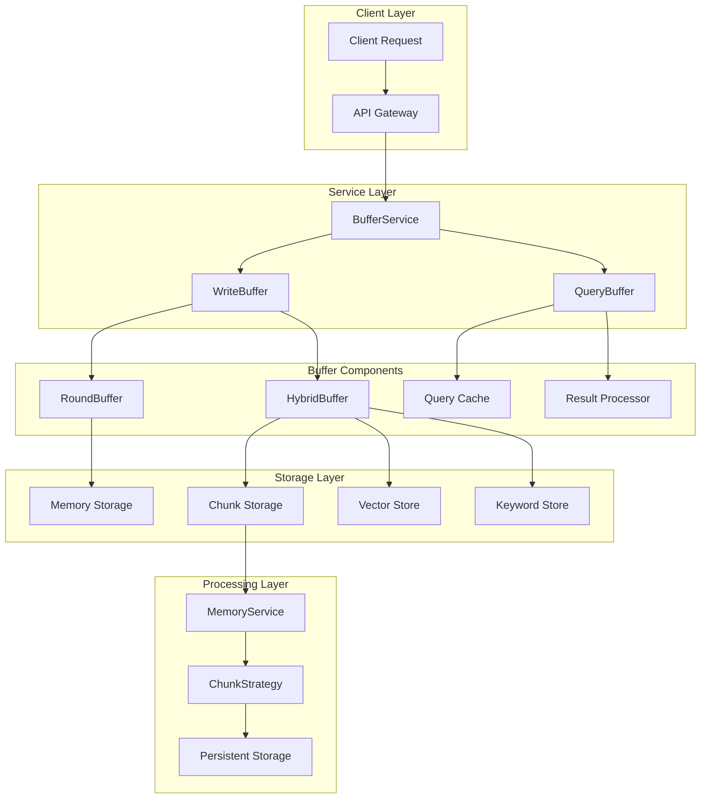

### Architectural Principles

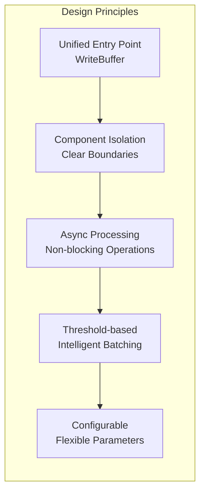

## Buffer Components

### WriteBuffer - Unified Entry Point

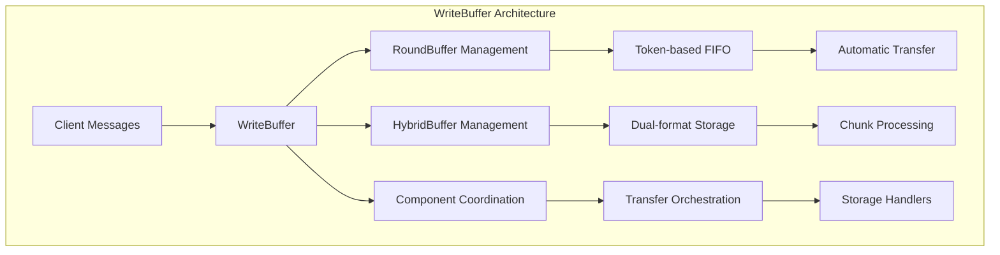

**Key Responsibilities**:
- Unified message entry point
- Component lifecycle management
- Transfer coordination between buffers
- Statistics collection and monitoring

**Interface Design**:
```python
class WriteBuffer:
    async def add(self, messages: MessageList, session_id: str = None) -> Dict[str, Any]
    async def add_batch(self, message_batch_list: MessageBatchList, session_id: str = None) -> Dict[str, Any]
    
    def get_round_buffer(self) -> RoundBuffer
    def get_hybrid_buffer(self) -> HybridBuffer
    
    async def flush_all(self) -> Dict[str, Any]
    def get_stats(self) -> Dict[str, Any]
```

### RoundBuffer - Token-based FIFO

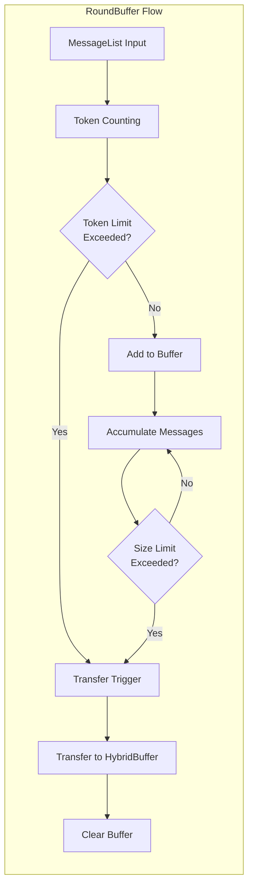

**Configuration Parameters**:
- `max_tokens`: Token threshold for transfer (default: 800)
- `max_size`: Maximum number of rounds (default: 5)
- `token_model`: Model for token counting (default: "gpt-4o-mini")

**Transfer Triggers**:
1. **Token Limit**: When accumulated tokens exceed threshold
2. **Size Limit**: When number of rounds exceeds maximum
3. **Manual Flush**: Explicit transfer request

### HybridBuffer - Dual-format Storage

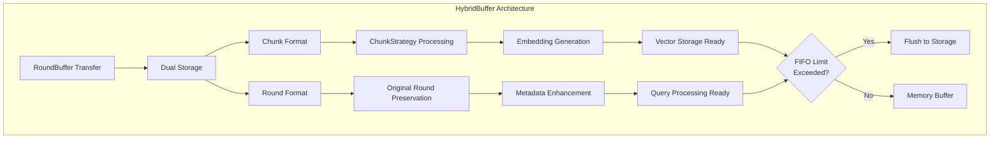

**Storage Formats**:
- **Chunks**: Processed through ChunkStrategy for semantic search
- **Rounds**: Original message structure for context preservation

**FIFO Management**:
- Automatic eviction when size limit exceeded
- Configurable flush behavior (manual/automatic)
- Preservation of recent data for fast access

### QueryBuffer - Intelligent Query Processing

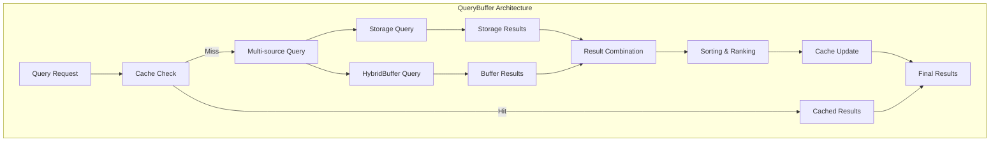

**Query Sources**:
1. **Persistent Storage**: Long-term data via MemoryService
2. **HybridBuffer**: Recent data in memory buffer
3. **Cache**: Previously computed results

**Sorting Options**:
- `score`: Relevance-based ranking (default)
- `timestamp`: Temporal ordering

## Data Flow Architecture

### Message Processing Pipeline

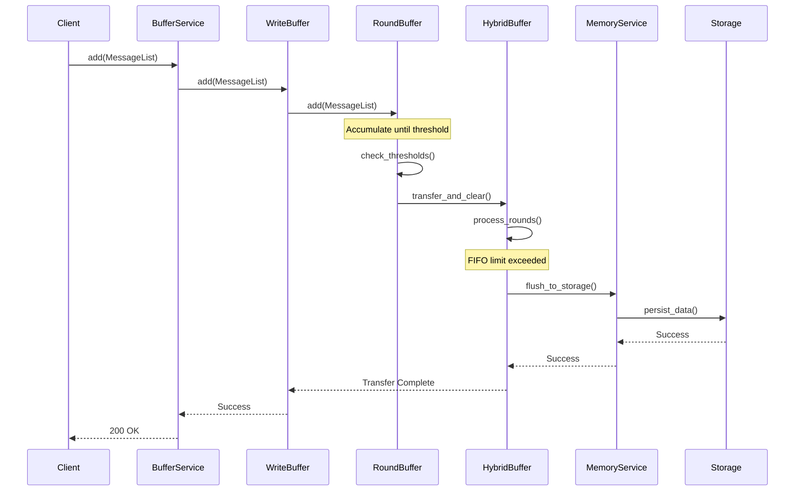

### Query Processing Pipeline

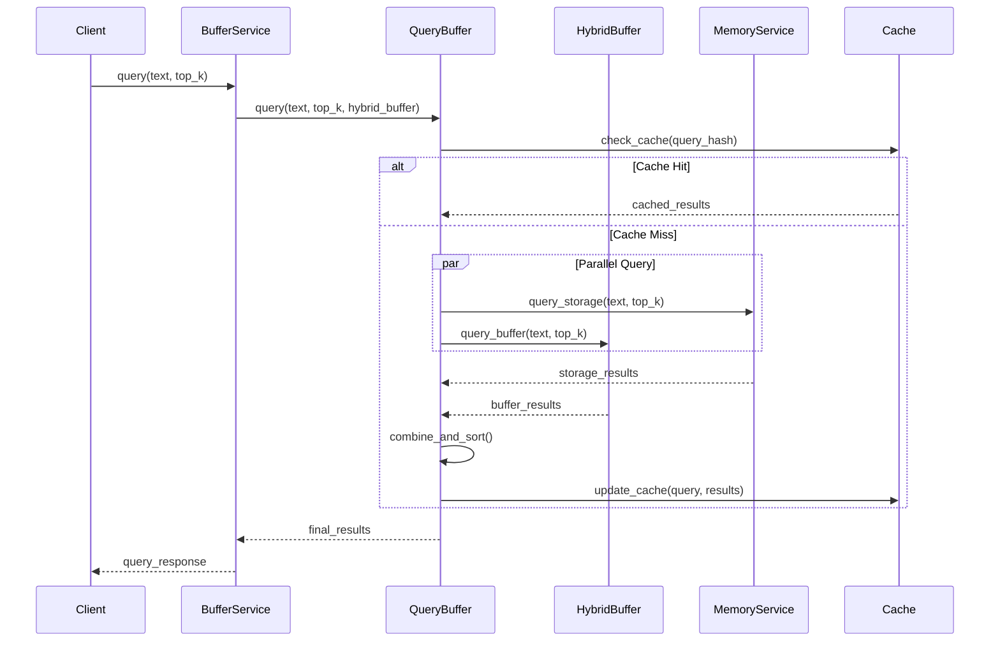

## Configuration Architecture

### Hierarchical Configuration

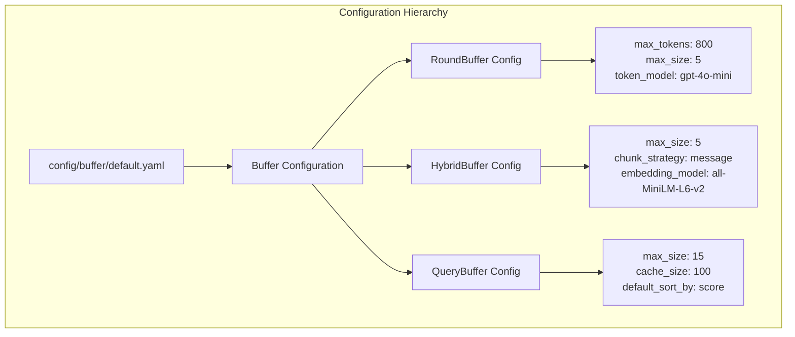

### Configuration Schema

```yaml
buffer:
  enabled: true
  
  # RoundBuffer configuration
  round_buffer:
    max_tokens: 800               # Token threshold for transfer
    max_size: 5                   # Maximum rounds before transfer
    token_model: "gpt-4o-mini"    # Model for token counting
  
  # HybridBuffer configuration
  hybrid_buffer:
    max_size: 5                   # FIFO buffer size
    chunk_strategy: "message"     # Chunking strategy
    embedding_model: "all-MiniLM-L6-v2"  # Embedding model
  
  # QueryBuffer configuration
  query:
    max_size: 15                  # Maximum results per query
    cache_size: 100               # Query cache size
    default_sort_by: "score"      # Default sorting method
    default_order: "desc"         # Default sort order
```

## Performance Architecture

### Throughput Optimization

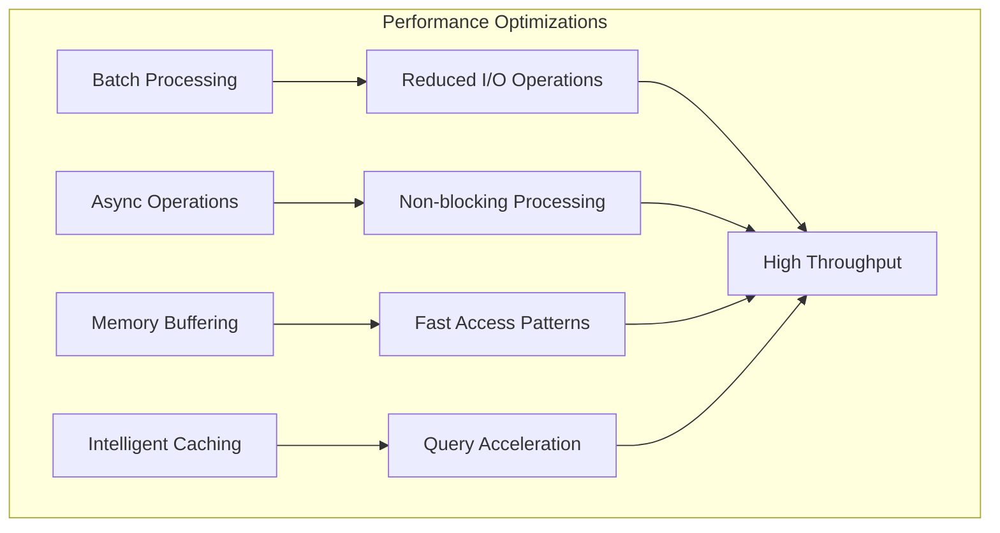

### Latency Characteristics

| Operation | Latency | Description |
|-----------|---------|-------------|
| Message Add | <5ms | Add to RoundBuffer |
| Buffer Transfer | <50ms | RoundBuffer → HybridBuffer |
| Storage Flush | <200ms | HybridBuffer → Persistent Storage |
| Query (Cached) | <10ms | Cache hit response |
| Query (Cold) | <100ms | Multi-source query |

### Memory Management

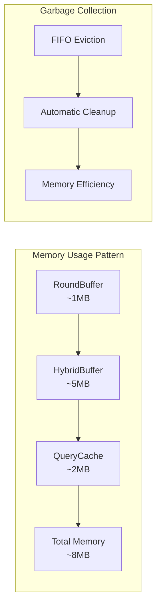

## Error Handling & Resilience

### Fault Tolerance

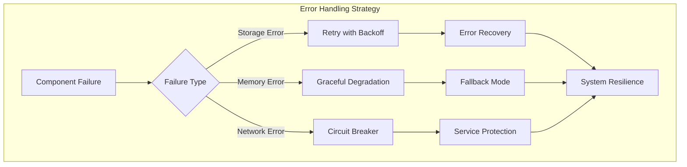

### Recovery Mechanisms

1. **Automatic Retry**: Transient failure recovery
2. **Circuit Breaker**: Prevent cascade failures
3. **Graceful Degradation**: Reduced functionality under stress
4. **Data Persistence**: No data loss during failures

## Monitoring & Observability

### Metrics Collection

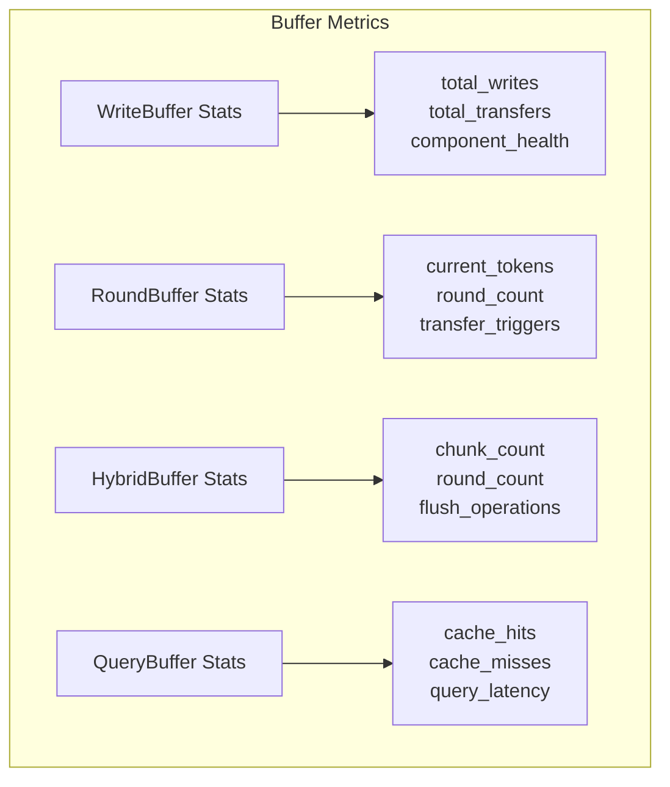

### Health Indicators

| Metric | Healthy Range | Alert Threshold |
|--------|---------------|-----------------|
| Transfer Rate | 10-100/min | >500/min |
| Memory Usage | <50MB | >100MB |
| Query Latency | <100ms | >500ms |
| Cache Hit Rate | >80% | <50% |

## Integration Patterns

### Service Integration

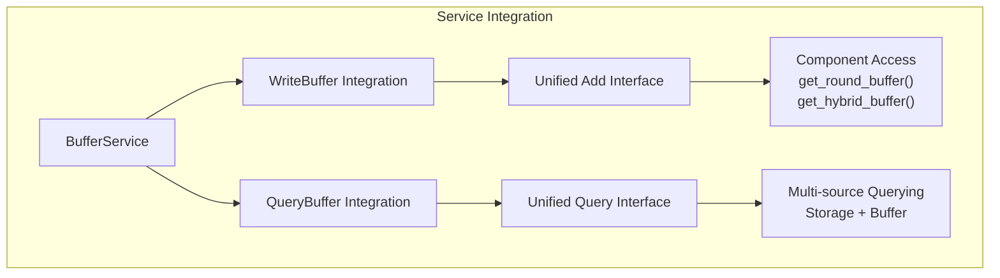

### API Compatibility

```python
# BufferService maintains full API compatibility
class BufferService:
    async def add(self, messages: MessageList, session_id: str = None) -> Dict[str, Any]
    async def add_batch(self, message_batch_list: MessageBatchList, session_id: str = None) -> Dict[str, Any]
    async def query(self, query: str, top_k: int = 10, **kwargs) -> Dict[str, Any]
    async def get_messages_by_session(self, session_id: str, buffer_only: bool = None, **kwargs) -> Dict[str, Any]
```

## Design Benefits

### Architectural Advantages

1. **Unified Entry Point**: WriteBuffer provides clean abstraction
2. **Component Isolation**: Clear separation of concerns
3. **Configurable Behavior**: Flexible parameter tuning
4. **Performance Optimization**: Intelligent batching and caching
5. **Fault Tolerance**: Robust error handling and recovery

### Scalability Features

- **Horizontal Scaling**: Stateless component design
- **Memory Efficiency**: FIFO-based memory management
- **Load Distribution**: Async processing capabilities
- **Resource Optimization**: Intelligent threshold management

## Future Enhancements

### Short-term Improvements

- **Dynamic Thresholds**: Adaptive threshold adjustment
- **Advanced Caching**: Multi-level cache hierarchy
- **Compression**: Memory usage optimization

### Long-term Vision

- **Distributed Buffering**: Multi-node buffer coordination
- **ML-based Optimization**: Intelligent parameter tuning
- **Stream Processing**: Real-time data processing capabilities

This buffer architecture provides a robust, scalable foundation for high-throughput message processing in the MemFuse system, ensuring optimal performance while maintaining data integrity and system reliability.
