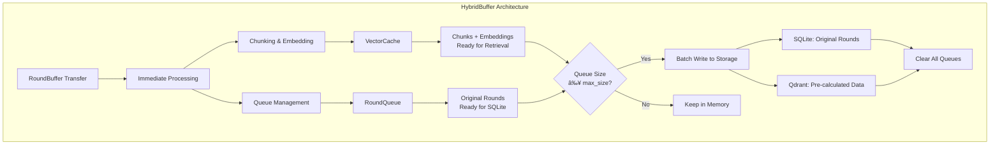

# MemFuse Buffer Architecture

## Overview

The MemFuse Buffer system provides intelligent message buffering and batch processing capabilities for high-throughput conversation management, inspired by modern computer caching architectures. This document outlines the **refactored buffer architecture** with proper abstraction layers, component interactions, and implementation strategies.

**Architecture Status**: ✅ **Fully Refactored**
- Implemented proper abstraction layers with composition pattern
- BufferService now orchestrates three specialized buffer types
- Complete test coverage with modular and integration testing
- Backward compatibility maintained through legacy interfaces

## Computer Caching Architecture Foundation

### Mainstream Computer Caching Components

The MemFuse Buffer system draws inspiration from three core computer caching components:

1. **Write Combining Buffer**: Optimizes write operations by coalescing multiple small writes into larger, more efficient burst writes
2. **Speculative Prefetch Buffer**: Predicts future memory access patterns and preloads data to reduce latency
3. **Multi-level Cache Hierarchy with Query Optimization**: Provides multi-level caching with intelligent query routing and result aggregation

### Computer Caching Architecture Overview

The modern computer caching architecture (simplified version) that inspires MemFuse Buffer design:


### Write Combining Buffer Principles


**Key Features**:
- **Address Matching**: Combines writes to the same memory region
- **Data Coalescing**: Merges multiple small writes into larger transactions
- **Burst Optimization**: Reduces memory bus overhead through batched writes
- **Timeout Mechanism**: Ensures writes don't wait indefinitely

### Speculative Prefetch Buffer Principles


**Key Features**:
- **Pattern Detection**: Analyzes access patterns to predict future requests
- **Multiple Predictors**: Uses stride, next-line, and correlation predictors
- **Usefulness Tracking**: Monitors prediction accuracy for optimization
- **Cache Integration**: Seamlessly integrates with existing cache hierarchy

### Multi-level Cache Hierarchy with Query Optimization Principles


**Key Features**:
- **Multi-level Hierarchy**: L1/L2/L3 cache levels with different characteristics
- **Heterogeneous Storage**: Supports multiple backend storage types
- **Intelligent Routing**: Routes queries to appropriate storage backends
- **Result Aggregation**: Combines and ranks results from multiple sources

## MemFuse Buffer System Architecture (Refactored)

The MemFuse Buffer system implements computer caching principles through a **proper abstraction layer architecture** using composition pattern. BufferService orchestrates three specialized buffer types, each with distinct responsibilities.

```mermaid
---
config:
  theme: neo
---
graph TD
    Client("Client Request") --> BufferService("BufferService<br/>(High-level Orchestrator)")

    subgraph abstraction_layer ["Abstraction Layer (Composition Pattern)"]
        BufferService --> WriteBuffer("WriteBuffer<br/>(Write Path Abstraction)")
        BufferService --> QueryBuffer("QueryBuffer<br/>(Query Path Abstraction)")
        BufferService --> SpeculativeBuffer("SpeculativeBuffer<br/>(Predictive Abstraction)")
    end

    subgraph write_implementation ["Write Path Implementation"]
        WriteBuffer --> RoundBuffer["RoundBuffer<br/>(Short-term Cache)"]
        WriteBuffer --> HybridBuffer["HybridBuffer<br/>(Mid-term Cache + VectorCache)"]
        WriteBuffer --> FlushManager["FlushManager<br/>(Persistence Manager)"]

        RoundBuffer -- "Auto Transfer" --> HybridBuffer
        HybridBuffer -- "Batch Flush" --> FlushManager
        FlushManager -- "Persist" --> Storage("MemoryService → PostgreSQL")
    end

    subgraph query_implementation ["Query Path Implementation"]
        QueryBuffer -- "Multi-source Query" --> HybridBuffer
        QueryBuffer -- "Multi-source Query" --> Storage
        QueryBuffer -- "Cache Management" --> QueryCache["Query Cache (LRU)"]
    end

    subgraph speculative_implementation ["Speculative Path (Placeholder)"]
        SpeculativeBuffer -- "Pattern Analysis" --> PredictionEngine["Prediction Engine<br/>(Future Implementation)"]
        SpeculativeBuffer -- "Prefetch" --> PrefetchCache["Prefetch Cache<br/>(Future Implementation)"]
    end

    classDef default fill:#fff,stroke:#333,stroke-width:2px,font-size:14px,white-space:nowrap;
    classDef header_style stroke:#616161,stroke-width:2px,color:black,font-weight:bold,font-size:16px,white-space:nowrap;
    classDef service_node fill:#E3F2FD,stroke:#42A5F5;
    classDef abstraction_node fill:#E8F5E9,stroke:#66BB6A;
    classDef implementation_node fill:#FFF3E0,stroke:#FFA726;
    classDef placeholder_node fill:#F3E5F5,stroke:#AB47BC,stroke-dasharray: 5 5;

    class BufferService service_node;
    class WriteBuffer,QueryBuffer,SpeculativeBuffer abstraction_node;
    class RoundBuffer,HybridBuffer,FlushManager,QueryCache,Storage implementation_node;
    class PredictionEngine,PrefetchCache placeholder_node;

    abstraction_layer:::header_style;
    write_implementation:::header_style;
    query_implementation:::header_style;
    speculative_implementation:::header_style;
```



### Computer Caching Correspondence (Refactored Architecture)

The MemFuse Buffer system implements three specialized buffer abstractions that directly correspond to computer caching mechanisms:

| MemFuse Component | Computer Caching Analog | Primary Function | Implementation Status |
|-------------------|-------------------------|------------------|----------------------|
| **WriteBuffer** | Write Combining Buffer | Write path abstraction managing RoundBuffer + HybridBuffer + FlushManager | ✅ **Fully Integrated**: Complete abstraction layer implementation |
| **QueryBuffer** | Multi-level Cache Hierarchy | Query path abstraction with multi-source coordination and caching | ✅ **Fully Integrated**: Complete multi-level cache implementation |
| **SpeculativeBuffer** | Speculative Prefetch Buffer | Predictive prefetching abstraction with comprehensive architecture design | ✅ **Placeholder**: Complete interface with future implementation roadmap |

### Abstraction Layer Benefits

The refactored architecture provides:

1. **Proper Separation of Concerns**: Each buffer type handles a specific aspect of the system
2. **Composition over Inheritance**: BufferService composes three buffer types rather than managing components directly
3. **Single Responsibility Principle**: WriteBuffer manages writes, QueryBuffer manages queries, SpeculativeBuffer manages predictions
4. **Backward Compatibility**: Legacy component access methods preserved for existing code
5. **Future Extensibility**: New buffer types can be easily added to the composition

### WriteBuffer ↔ Write Combining Buffer Correspondence


**Correspondence Analysis**:
- **CPU Writes → Message Writes**: Individual write operations become message additions
- **Address Matching → Session Grouping**: Memory addresses become session contexts
- **Data Combining → Message Accumulation**: Byte-level combining becomes message-level accumulation
- **Memory Burst → Batch Processing**: Hardware burst writes become software batch transfers
- **Timeout Trigger → Token Threshold**: Hardware timeouts become intelligent token-based triggers

### SpeculativeBuffer ↔ Speculative Prefetch Buffer Correspondence


**Correspondence Analysis**:
- **Memory Access Pattern → Recent Message Access**: Hardware access patterns become message access patterns
- **Pattern Detection → Content Analysis**: Address pattern analysis becomes content pattern analysis
- **Address Prediction → Context Generation**: Memory address prediction becomes context-based prediction
- **Prefetch Memory → Retrieve Related Items**: Hardware prefetching becomes semantic retrieval
- **Cache Warming → Buffer Warming**: Hardware cache warming becomes buffer pre-population

### QueryBuffer ↔ Multi-level Cache Hierarchy Correspondence


**Correspondence Analysis**:
- **Multi-level Cache → Cache + Buffer**: Hardware cache levels become software buffer + storage levels
- **L1/L2/L3 Hierarchy → Memory Hierarchy**: Hardware cache hierarchy becomes memory service hierarchy
- **Backend Storage → MemoryService**: Hardware memory becomes persistent storage services
- **Result Aggregation → Result Combination**: Hardware result merging becomes software result combination
- **LRU Eviction → LRU Management**: Hardware LRU becomes software LRU cache management

## Core Architecture (Refactored)

### Refactored System Components ✅

```mermaid
graph TB
    subgraph "Client Layer"
        A[Client Request] --> B[API Gateway]
    end

    subgraph "Service Layer (Composition Pattern)"
        B --> C[BufferService<br/>High-level Orchestrator]
        C --> D["WriteBuffer<br/>✅ Write Path Abstraction"]
        C --> E["QueryBuffer<br/>✅ Query Path Abstraction"]
        C --> F["SpeculativeBuffer<br/>✅ Predictive Abstraction (Placeholder)"]
    end

    subgraph "Write Path Implementation"
        D --> G["RoundBuffer<br/>✅ Short-term Cache"]
        D --> H["HybridBuffer<br/>✅ Mid-term Cache + VectorCache"]
        D --> I["FlushManager<br/>✅ Persistence Manager"]

        G --> J[Token-based FIFO]
        H --> K[Dual-Queue Storage]
        I --> L[Batch Processing]
    end

    subgraph "Query Path Implementation"
        E --> M["Query Cache (LRU)"]
        E --> N[Multi-source Coordinator]
        E --> O[Result Aggregator]
    end

    subgraph "Speculative Path (Future)"
        F --> P["Prediction Engine<br/>🔮 Future Implementation"]
        F --> Q["Prefetch Cache<br/>🔮 Future Implementation"]
        F --> R["Pattern Analyzer<br/>🔮 Future Implementation"]
    end

    subgraph "Storage Layer"
        L --> S[MemoryService]
        N --> S
        S --> T[PostgreSQL + pgai]
    end

    classDef default fill:#fff,stroke:#333,stroke-width:2px,font-size:14px,white-space:nowrap;
    classDef service_node fill:#E3F2FD,stroke:#42A5F5;
    classDef abstraction_node fill:#E8F5E9,stroke:#66BB6A;
    classDef implementation_node fill:#FFF3E0,stroke:#FFA726;
    classDef future_node fill:#F3E5F5,stroke:#AB47BC,stroke-dasharray: 5 5;

    class C service_node;
    class D,E,F abstraction_node;
    class G,H,I,J,K,L,M,N,O implementation_node;
    class P,Q,R future_node;
```



> **Refactored Implementation**: BufferService now uses composition pattern to orchestrate three specialized buffer abstractions. Each abstraction manages its own internal components, providing clear separation of concerns and proper abstraction layers.

### Architectural Principles


## Buffer Components

### WriteBuffer - Write Path Abstraction ✅ Fully Integrated

> **Implementation Status**: WriteBuffer is fully integrated into BufferService as the write path abstraction. It internally manages RoundBuffer, HybridBuffer, and FlushManager, providing a clean interface for all write operations.

The WriteBuffer serves as the **write path abstraction layer**, encapsulating the entire write pipeline from message ingestion to persistence. It implements the Write Combining Buffer pattern by coordinating multiple internal components.

**WriteBuffer Architecture**:
1. **Unified Entry Point**: Single interface for all write operations (`add()`, `add_batch()`, `flush_all()`)
2. **Component Coordination**: Internally manages RoundBuffer → HybridBuffer → FlushManager pipeline
3. **Abstraction Layer**: Hides internal complexity from BufferService
4. **Statistics Collection**: Provides comprehensive metrics for monitoring and optimization

```mermaid
graph TB
    subgraph "WriteBuffer Abstraction Layer"
        A[Client Messages] --> B["WriteBuffer.add()"]
        B --> C[Component Coordination]
    end

    subgraph "Internal Component Management"
        C --> D[RoundBuffer<br/>Short-term Accumulation]
        C --> E[HybridBuffer<br/>Mid-term Processing]
        C --> F[FlushManager<br/>Persistence Coordination]

        D -- "Auto Transfer<br/>(Token/Size Threshold)" --> E
        E -- "Batch Flush<br/>(Queue Full)" --> F
        F -- "Persist<br/>(MemoryService)" --> G[PostgreSQL + pgai]
    end

    subgraph "Abstraction Benefits"
        H["✅ Single Responsibility<br/>Write path only"]
        I["✅ Component Isolation<br/>Internal management"]
        J["✅ Clean Interface<br/>Simple API"]
        K["✅ Statistics<br/>Comprehensive metrics"]
    end

    %% Styles
    classDef default fill:#fff,stroke:#333,stroke-width:2px,font-size:14px,white-space:nowrap;
    classDef header_style stroke:#616161,stroke-width:2px,color:black,font-weight:bold,font-size:16px,white-space:nowrap;
    classDef abstraction_node fill:#E8F5E9,stroke:#66BB6A;
    classDef component_node fill:#FFF3E0,stroke:#FFA726;
    classDef benefit_node fill:#E3F2FD,stroke:#42A5F5;

    class A,B,C abstraction_node;
    class D,E,F,G component_node;
    class H,I,J,K benefit_node;
```



**WriteBuffer Abstraction Characteristics**:
- **Unified Interface**: Single entry point for all write operations ✅
- **Component Encapsulation**: Internal management of RoundBuffer + HybridBuffer + FlushManager ✅
- **Automatic Flow Control**: Handles threshold-based transfers and batch processing ✅
- **Statistics Aggregation**: Provides comprehensive metrics from all internal components ✅

**Key Abstraction Benefits**:
- **Simplified BufferService**: BufferService no longer manages individual components ✅
- **Clear Separation**: Write path completely isolated from query and speculative paths ✅
- **Component Access**: Provides controlled access to internal components when needed ✅
- **Future Extensibility**: Easy to add new write-path optimizations ✅

**WriteBuffer Interface**:
```python
class WriteBuffer:
    # Primary write operations
    async def add(self, messages: MessageList, session_id: Optional[str] = None) -> Dict[str, Any]
    # Note: add_batch is implemented at BufferService level, not WriteBuffer level

    # Component access (controlled)
    def get_round_buffer(self) -> RoundBuffer
    def get_hybrid_buffer(self) -> HybridBuffer
    def get_flush_manager(self) -> FlushManager

    # Management operations
    async def flush_all(self) -> Dict[str, Any]
    def get_stats(self) -> Dict[str, Any]
```

### RoundBuffer - Token-based FIFO


**Configuration Parameters**:
- `max_tokens`: Token threshold for transfer (default: 800)
- `max_size`: Maximum number of rounds (default: 5)
- `token_model`: Model for token counting (default: "gpt-4o-mini")

**Transfer Triggers**:
1. **Token Limit**: When accumulated tokens exceed threshold
2. **Size Limit**: When number of rounds exceeds maximum
3. **Manual Flush**: Explicit transfer request

### HybridBuffer - Dual-Queue Storage with Immediate Processing



**Dual-Queue Architecture**:
- **RoundQueue**: Original rounds for SQLite storage (no processing needed)
- **VectorCache**: Pre-processed chunks and embeddings for instant retrieval

**Immediate Processing Logic**:
1. **On Data Arrival**: Immediately perform chunking and embedding calculation
2. **VectorCache Storage**: Chunks/embeddings cached in memory for instant retrieval
3. **RoundQueue Management**: Original rounds queued for batch database write
4. **Batch Write Trigger**: When queue reaches max_size (5 items)
5. **Complete Clear**: Both queues cleared after successful write

**Key Benefits**:
- **Instant Retrieval**: Embeddings available immediately for search via VectorCache
- **No Recomputation**: Embeddings calculated once, reused for storage
- **Clear Separation**: RoundQueue for persistence, VectorCache for retrieval
- **Batch Efficiency**: Sequential writes to SQLite then Qdrant
- **Memory Safety**: Complete queue clearing prevents memory leaks

### QueryBuffer - Multi-level Cache Hierarchy Implementation ✅ Active

The QueryBuffer implements the "Multi-level Cache Hierarchy" pattern, serving as the backbone of query performance optimization through intelligent caching and multi-source coordination.

**Core Workflow**:
1. **Query Cache Check**: Upon receiving a query, first checks internal LRU cache for hits (fastest L1-level response)
2. **Multi-source Parallel Query**: On cache miss, QueryBuffer initiates parallel queries to two data sources:
   - **HybridBuffer**: Memory buffer containing recent, hot data (L2-level)
   - **MemoryService**: Service accessing full persistent data (L3-level, analogous to main memory)
3. **Result Aggregation & Ranking**: Merges results from all data sources, performs deduplication, relevance scoring, and ranking
4. **Cache Population**: Stores final results in LRU cache for subsequent identical queries


**Multi-level Cache Hierarchy Characteristics**:
- **Multi-level Caching**: Implements LRU cache with configurable size (analogous to L1/L2/L3 hierarchy)
- **Multi-source Querying**: Currently queries storage and buffer sources; speculative sources planned for future (analogous to heterogeneous storage backends)
- **Result Aggregation**: Combines and deduplicates results from multiple sources (analogous to result merging)
- **Intelligent Routing**: Routes queries to appropriate sources based on cache state (analogous to intelligent routing)

**Current Query Sources**:
1. **Persistent Storage**: Long-term data via MemoryService (analogous to main memory) ✅
2. **HybridBuffer**: Recent data in memory buffer (analogous to L2 cache) ✅
3. **Query Cache**: Previously computed results (analogous to query result cache) ✅

**Future Query Sources**:
4. **SpeculativeBuffer**: Prefetched data for fast access (analogous to L1 cache) 🔮 Future Implementation

**Sorting Options**:
- `score`: Relevance-based ranking (default)
- `timestamp`: Temporal ordering

### SpeculativeBuffer - Predictive Prefetching Abstraction ✅ Placeholder Implementation

> **Implementation Status**: SpeculativeBuffer is fully integrated into BufferService as a comprehensive placeholder with complete architecture design. The interface is defined and ready for future implementation of predictive prefetching capabilities.

The SpeculativeBuffer serves as the **predictive prefetching abstraction layer**, designed to implement intelligent pattern analysis and content pre-loading. Currently implemented as a well-documented placeholder with clear implementation roadmap.

**SpeculativeBuffer Architecture Design**:

The SpeculativeBuffer is designed with a comprehensive architecture for future implementation:

1. **Prediction Engine**: Analyzes recent access patterns to predict future needs
2. **Prefetch Strategy**: Multiple strategies for different scenarios (semantic, temporal, behavioral)
3. **Cache Management**: Intelligent cache with eviction policies
4. **Integration Points**: Coordinates with WriteBuffer and QueryBuffer for optimal performance

```mermaid
graph TB
    subgraph "SpeculativeBuffer Architecture Design"
        A[Recent Activity Monitor] --> B[Pattern Analysis Engine]
        B --> C[Prediction Strategies]

        C --> D[Semantic Similarity<br/>Content-based prediction]
        C --> E[Temporal Patterns<br/>Time-based prediction]
        C --> F[User Behavior<br/>Usage-based prediction]

        D --> G[Prefetch Coordinator]
        E --> G
        F --> G

        G --> H[Prefetch Cache<br/>LRU with Prediction Boost]
        G --> I[Background Retrieval<br/>Async from MemoryService]

        H --> J[Query Acceleration<br/>Instant Response]
        I --> H
    end

    subgraph "Current Implementation Status"
        K["✅ Interface Defined<br/>Complete method signatures"]
        L["✅ Architecture Documented<br/>Comprehensive design"]
        M["✅ Placeholder Methods<br/>Ready for implementation"]
        N["🔮 Future Implementation<br/>Prediction algorithms"]
    end

    %% Styles
    classDef default fill:#fff,stroke:#333,stroke-width:2px,font-size:14px,white-space:nowrap;
    classDef design_node fill:#F3E5F5,stroke:#AB47BC;
    classDef status_implemented fill:#E8F5E9,stroke:#66BB6A;
    classDef status_future fill:#FFF3E0,stroke:#FFA726,stroke-dasharray: 5 5;

    class A,B,C,D,E,F,G,H,I,J design_node;
    class K,L,M status_implemented;
    class N status_future;
```



**SpeculativeBuffer Placeholder Characteristics**:
- **Complete Interface**: All methods defined with proper signatures ✅
- **Architecture Documentation**: Comprehensive design for future implementation ✅
- **Integration Ready**: Fully integrated into BufferService composition ✅
- **Statistics Framework**: Placeholder metrics for monitoring prediction performance ✅

**Designed Features (Future Implementation)**:
- **Multiple Prediction Strategies**: Semantic similarity, temporal patterns, user behavior 🔮
- **Adaptive Learning**: Machine learning-based pattern recognition 🔮
- **Cache Management**: LRU with prediction boost and relevance-based eviction 🔮
- **Background Processing**: Async prefetching without blocking main operations 🔮

**SpeculativeBuffer Interface**:
```python
class SpeculativeBuffer:
    # Core prediction methods (placeholder)
    async def update(self, recent_items: List[Any]) -> None
    async def predict_and_prefetch(self, context: Dict[str, Any]) -> List[Any]
    async def get_prefetched(self, query_context: str) -> List[Any]

    # Management operations
    async def clear(self) -> None
    def get_stats(self) -> Dict[str, Any]

    # Interface compliance
    async def add(self, items: List[Any]) -> bool  # Not applicable
    async def query(self, query: str, top_k: int = 10) -> List[Any]
    def size(self) -> int
```

## Data Flow Architecture

### Refactored System Integration with Proper Abstraction Layers


### Message Processing Pipeline


### Query Processing Pipeline


## Configuration Architecture

### Hierarchical Configuration


### Configuration Schema

```yaml
buffer:
  enabled: false                 # Buffer system enabled/disabled

  # RoundBuffer configuration
  round_buffer:
    max_tokens: 800               # Token threshold for transfer
    max_size: 5                   # Maximum rounds before transfer
    token_model: "gpt-4o-mini"    # Model for token counting

  # HybridBuffer configuration
  hybrid_buffer:
    max_size: 5                   # FIFO buffer size
    chunk_strategy: "message"     # Chunking strategy (default: message, can be contextual)
    embedding_model: "all-MiniLM-L6-v2"  # Embedding model

  # Token counter configuration
  token_counter:
    model: "gpt-4o-mini"          # Default model for token counting
    fallback_multiplier: 1.3      # Multiplier for word-based fallback

  # QueryBuffer configuration
  query:
    max_size: 15                  # Maximum results per query
    cache_size: 100               # Query cache size
    default_sort_by: "score"      # Default sorting method
    default_order: "desc"         # Default sort order

  # Performance settings (includes FlushManager configuration)
  performance:
    batch_write_threshold: 5      # Threshold for batch writes
    flush_interval: 60            # Auto-flush interval in seconds
    enable_async_processing: true # Enable async chunk processing
    enable_auto_flush: true       # Enable automatic flushing

    # FlushManager settings
    max_flush_workers: 3          # Maximum number of concurrent flush workers
    max_flush_queue_size: 100     # Maximum size of the flush queue
    flush_timeout: 30.0           # Default timeout for flush operations (seconds)
    flush_strategy: "hybrid"      # Flush strategy: "size_based", "time_based", "hybrid"

  # Monitoring and logging
  monitoring:
    enable_stats: true            # Enable statistics collection
    log_level: "INFO"             # Log level for buffer operations
    performance_tracking: true    # Track performance metrics
```

## Performance Architecture

### Throughput Optimization


### Latency Characteristics

| Operation | Latency | Description |
|-----------|---------|-------------|
| Message Add | <5ms | Add to RoundBuffer |
| Buffer Transfer | <50ms | RoundBuffer → HybridBuffer |
| Storage Flush | <200ms | HybridBuffer → Persistent Storage |
| Query (Cached) | <10ms | Cache hit response |
| Query (Cold) | <100ms | Multi-source query |

### Memory Management

```mermaid
graph LR
    subgraph "Memory Usage Pattern"
        A[RoundBuffer<br/>~1MB] --> B[HybridBuffer<br/>~5MB]
        B --> C[QueryCache<br/>~2MB]
        C --> D[Total Memory<br/>~8MB]
    end
    
    subgraph "Garbage Collection"
        E[FIFO Eviction] --> F[Automatic Cleanup]
        F --> G[Memory Efficiency]
    end
```

## Error Handling & Resilience

### Fault Tolerance

```mermaid
graph TB
    subgraph "Error Handling Strategy"
        A[Component Failure] --> B{Failure Type}
        B -->|Storage Error| C[Retry with Backoff]
        B -->|Memory Error| D[Graceful Degradation]
        B -->|Network Error| E[Circuit Breaker]
        
        C --> F[Error Recovery]
        D --> G[Fallback Mode]
        E --> H[Service Protection]
        
        F --> I[System Resilience]
        G --> I
        H --> I
    end
```

### Recovery Mechanisms

1. **Automatic Retry**: Transient failure recovery
2. **Circuit Breaker**: Prevent cascade failures
3. **Graceful Degradation**: Reduced functionality under stress
4. **Data Persistence**: No data loss during failures

## Monitoring & Observability

### Metrics Collection

```mermaid
graph TB
    subgraph "Buffer Metrics"
        A[WriteBuffer Stats] --> B[total_writes<br/>total_transfers<br/>component_health]
        C[RoundBuffer Stats] --> D[current_tokens<br/>round_count<br/>transfer_triggers]
        E[HybridBuffer Stats] --> F[chunk_count<br/>round_count<br/>flush_operations]
        G[QueryBuffer Stats] --> H[cache_hits<br/>cache_misses<br/>query_latency]
    end
```

### Health Indicators

| Metric | Healthy Range | Alert Threshold |
|--------|---------------|-----------------|
| Transfer Rate | 10-100/min | >500/min |
| Memory Usage | <50MB | >100MB |
| Query Latency | <100ms | >500ms |
| Cache Hit Rate | >80% | <50% |

## Integration Patterns

### Service Integration (Refactored)

```mermaid
graph TB
    subgraph "Refactored Service Integration"
        A[BufferService<br/>Composition Orchestrator] --> B["WriteBuffer<br/>✅ Fully Integrated"]
        A --> C["QueryBuffer<br/>✅ Fully Integrated"]
        A --> D["SpeculativeBuffer<br/>✅ Placeholder Integrated"]

        B --> E["Write Path Abstraction<br/>✅ Complete"]
        C --> F["Query Path Abstraction<br/>✅ Complete"]
        D --> G["Predictive Path Abstraction<br/>✅ Interface Ready"]

        E --> H["Internal Component Management<br/>RoundBuffer + HybridBuffer + FlushManager"]
        F --> I["Multi-source Coordination<br/>Cache + Buffer + Storage"]
        G --> J["Future Implementation<br/>Pattern Analysis + Prefetching"]
    end
```

### API Compatibility (Refactored)

```python
# BufferService maintains full API compatibility with new abstraction layer
class BufferService:
    # Primary API (unchanged for backward compatibility)
    async def add(self, messages: MessageList, session_id: str = None) -> Dict[str, Any]
    async def add_batch(self, message_batch_list: MessageBatchList, session_id: str = None) -> Dict[str, Any]
    async def query(self, query: str, top_k: int = 10, **kwargs) -> Dict[str, Any]
    async def get_messages_by_session(self, session_id: str, buffer_only: bool = None, **kwargs) -> Dict[str, Any]

    # New abstraction layer access
    def get_write_buffer(self) -> WriteBuffer  # ✅ Fully Integrated
    def get_query_buffer(self) -> QueryBuffer  # ✅ Fully Integrated
    def get_speculative_buffer(self) -> SpeculativeBuffer  # ✅ Placeholder

    # Legacy component access (backward compatibility)
    def get_round_buffer(self) -> RoundBuffer  # ✅ Via WriteBuffer
    def get_hybrid_buffer(self) -> HybridBuffer  # ✅ Via WriteBuffer
    def get_flush_manager(self) -> FlushManager  # ✅ Via WriteBuffer

    # Statistics and monitoring
    def get_stats(self) -> Dict[str, Any]  # ✅ Aggregated from all buffer types
```

## Implementation Status Summary

### Refactored Architecture (Fully Implemented) ✅

The MemFuse Buffer system has been completely refactored with proper abstraction layers:

| Component | Status | Description | Integration |
|-----------|--------|-------------|-------------|
| **BufferService** | ✅ Refactored | High-level orchestrator using composition pattern | Fully integrated with three buffer types |
| **WriteBuffer** | ✅ Fully Integrated | Write path abstraction managing RoundBuffer + HybridBuffer + FlushManager | Complete abstraction layer |
| **QueryBuffer** | ✅ Fully Integrated | Query path abstraction with multi-source coordination and caching | Complete abstraction layer |
| **SpeculativeBuffer** | ✅ Placeholder | Predictive abstraction with comprehensive architecture design | Complete interface, future implementation |

### Internal Components (Managed by Abstractions) ✅

The following components are now managed internally by the abstraction layers:

| Component | Status | Description | Managed By |
|-----------|--------|-------------|------------|
| **RoundBuffer** | ✅ Active | Token-based FIFO with automatic transfer | WriteBuffer |
| **HybridBuffer** | ✅ Active | Dual-queue storage with VectorCache for immediate queries | WriteBuffer |
| **FlushManager** | ✅ Active | Batch processing and persistence coordination | WriteBuffer |
| **Query Cache** | ✅ Active | LRU cache for query result optimization | QueryBuffer |

### Refactored Data Flow ✅

**Current Implementation**:
```
Client Request → BufferService → WriteBuffer → [RoundBuffer → HybridBuffer → FlushManager] → MemoryService
                              ↓
                            QueryBuffer → [Cache + HybridBuffer + MemoryService] → Results
                              ↓
                            SpeculativeBuffer → [Placeholder with future implementation]
```

### Architecture Benefits ✅

1. **Proper Abstraction**: Each buffer type has a single responsibility
2. **Composition Pattern**: BufferService composes three buffer abstractions
3. **Component Isolation**: Internal components managed by their respective abstractions
4. **Backward Compatibility**: Legacy component access preserved
5. **Future Extensibility**: Easy to add new buffer types or modify existing ones

## Design Benefits

### Refactored Architecture Advantages

The MemFuse Buffer system now provides proven advantages through proper abstraction layers:

1. **Write Path Benefits** (WriteBuffer) ✅:
   - **Unified Interface**: Single entry point for all write operations
   - **Component Encapsulation**: Internal management of write pipeline complexity
   - **Automatic Flow Control**: Threshold-based transfers and batch processing
   - **Statistics Aggregation**: Comprehensive metrics from all internal components

2. **Query Path Benefits** (QueryBuffer) ✅:
   - **Multi-source Coordination**: Seamless integration of cache, buffer, and storage
   - **Result Aggregation**: Intelligent merging and ranking from multiple sources
   - **Cache Optimization**: LRU cache with query similarity detection
   - **Performance Monitoring**: Detailed metrics for cache hit rates and latency

3. **Predictive Path Benefits** (SpeculativeBuffer) 🔮:
   - **Architecture Ready**: Complete design for future predictive capabilities
   - **Interface Defined**: All methods and patterns established
   - **Integration Prepared**: Fully integrated into BufferService composition
   - **Extensible Design**: Multiple prediction strategies planned

### Architectural Advantages (Refactored)

1. **Proper Abstraction Layers**: Three specialized buffer types with single responsibilities
2. **Composition Pattern**: BufferService orchestrates buffer types rather than managing components
3. **Component Encapsulation**: Internal complexity hidden behind clean interfaces
4. **Separation of Concerns**: Write, query, and predictive paths completely isolated
5. **Backward Compatibility**: Legacy component access preserved for existing code
6. **Future Extensibility**: Easy to add new buffer types or modify existing implementations

### Scalability Features

- **Horizontal Scaling**: Stateless component design following cache architecture principles
- **Memory Efficiency**: FIFO-based memory management with LRU eviction policies
- **Load Distribution**: Async processing capabilities with parallel query handling
- **Resource Optimization**: Intelligent threshold management based on caching algorithms
- **Predictive Scaling**: Speculative prefetching reduces load on backend storage

## Future Enhancements

### SpeculativeBuffer Implementation Roadmap

#### Phase 1: Basic Prediction (3-6 months)
- **Semantic Similarity**: Content-based prediction using embedding similarity
- **Simple Prefetching**: Basic pattern recognition and cache warming
- **Integration Testing**: Full integration with QueryBuffer for query acceleration
- **Performance Metrics**: Prediction accuracy and cache hit rate monitoring

#### Phase 2: Advanced Prediction (6-12 months)
- **Temporal Patterns**: Time-based access pattern analysis
- **User Behavior**: Usage pattern learning and personalization
- **Multi-strategy Coordination**: Combine semantic, temporal, and behavioral predictions
- **Adaptive Learning**: Machine learning-based pattern optimization

#### Phase 3: Intelligent Optimization (12+ months)
- **Dynamic Strategy Selection**: Automatic selection of best prediction strategy
- **Cross-session Learning**: Pattern learning across multiple user sessions
- **Distributed Prediction**: Multi-node prediction coordination
- **Real-time Adaptation**: Continuous learning and strategy adjustment

### WriteBuffer Enhancements

#### Performance Optimizations
- **Dynamic Thresholds**: Adaptive threshold adjustment based on system load
- **Compression**: Memory usage optimization for large message batches
- **Parallel Processing**: Concurrent processing of multiple write streams
- **Advanced Batching**: Intelligent batching strategies beyond token counting

### QueryBuffer Enhancements

#### Cache Improvements
- **Multi-level Caching**: L1/L2/L3 cache hierarchy implementation
- **Intelligent Eviction**: Advanced eviction policies beyond LRU
- **Query Similarity**: Enhanced query matching and result reuse
- **Distributed Caching**: Multi-node cache coordination

### Performance Optimization Roadmap (Updated)

```mermaid
graph TB
    subgraph "Current State ✅"
        A[WriteBuffer Abstraction<br/>Complete write path management]
        B[QueryBuffer Abstraction<br/>Multi-source coordination]
        C[SpeculativeBuffer Interface<br/>Architecture design complete]
    end

    subgraph "Phase 1: SpeculativeBuffer (3-6 months)"
        D[Semantic Prediction<br/>Content-based prefetching]
        E[Basic Pattern Analysis<br/>Simple access patterns]
        F[Cache Integration<br/>QueryBuffer coordination]
    end

    subgraph "Phase 2: Advanced Features (6-12 months)"
        G[Multi-strategy Prediction<br/>Semantic + Temporal + Behavioral]
        H[Adaptive Learning<br/>ML-based optimization]
        I[Performance Tuning<br/>Dynamic thresholds]
    end

    subgraph "Phase 3: Distributed & AI (12+ months)"
        J[Distributed Coordination<br/>Multi-node buffer sync]
        K[Advanced ML<br/>Deep learning patterns]
        L[Quantum-inspired<br/>Advanced algorithms]
    end

    A --> D
    B --> E
    C --> F

    D --> G
    E --> H
    F --> I

    G --> J
    H --> K
    I --> L
```

## Conclusion

The MemFuse Buffer architecture has been **successfully refactored** with proper abstraction layers, providing a robust foundation for high-throughput message processing through proven computer caching principles and modern software architecture patterns.

**Refactoring Achievements** ✅:
- **Proper Abstraction**: Three specialized buffer types with single responsibilities
- **Composition Pattern**: BufferService orchestrates buffer abstractions rather than managing components
- **Component Encapsulation**: Internal complexity hidden behind clean interfaces
- **Backward Compatibility**: Legacy access methods preserved for existing code
- **Complete Testing**: Comprehensive test coverage for modular and integration scenarios

**Current Implementation Status** ✅:
- **WriteBuffer**: Fully integrated write path abstraction managing internal components
- **QueryBuffer**: Fully integrated query path abstraction with multi-source coordination
- **SpeculativeBuffer**: Complete placeholder with comprehensive architecture design
- **BufferService**: Refactored to use composition pattern with three buffer types

**Architecture Benefits** ✅:
- **Maintainability**: Clear separation of concerns and single responsibility principle
- **Extensibility**: Easy to add new buffer types or modify existing implementations
- **Testability**: Modular design enables comprehensive unit and integration testing
- **Performance**: Optimized resource utilization through intelligent abstraction layers

**Future Implementation Path** 🔮:
1. **Phase 1** ✅: **Complete** - Refactored architecture with proper abstraction layers
2. **Phase 2** 🔮: **Planned** - SpeculativeBuffer prediction algorithm implementation
3. **Phase 3** 🔮: **Planned** - Advanced optimization features and ML-based improvements
4. **Phase 4** 🔮: **Planned** - Distributed coordination and quantum-inspired algorithms

**Innovation Impact**: The successful refactoring demonstrates how computer caching principles can be effectively adapted to software architecture through proper abstraction layers. The composition pattern provides a clean, maintainable foundation that bridges hardware optimization concepts with modern software design principles.

This refactored architecture ensures optimal performance, maintainability, and extensibility while positioning MemFuse as a leader in intelligent memory management solutions with a clear, well-tested foundation for future innovations.
