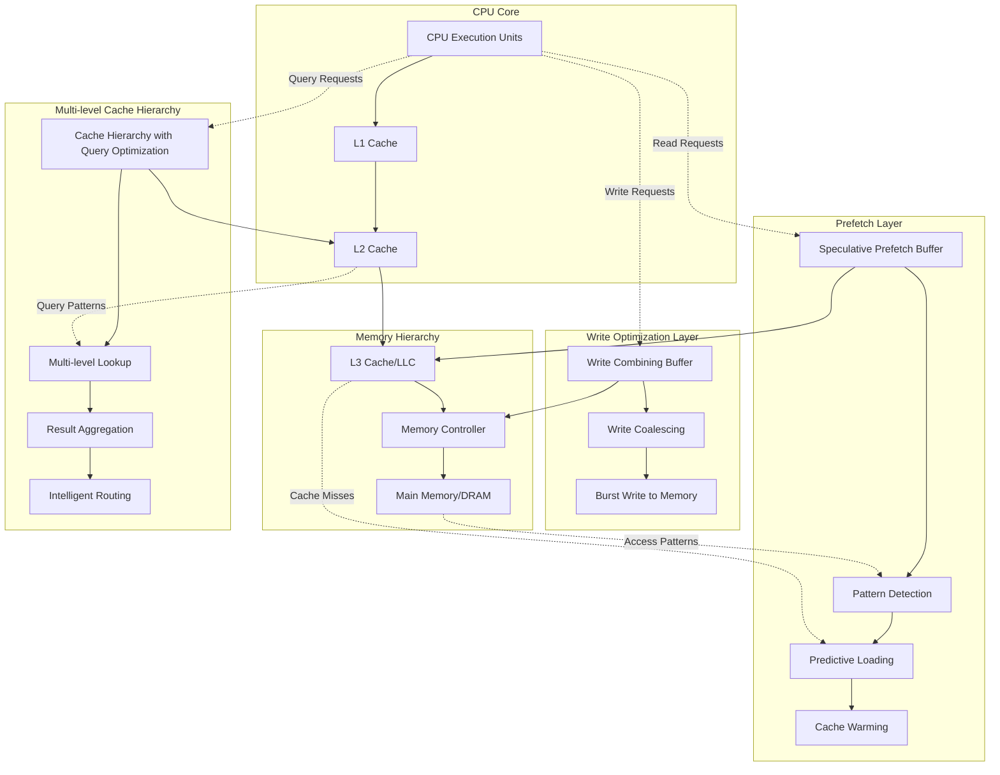
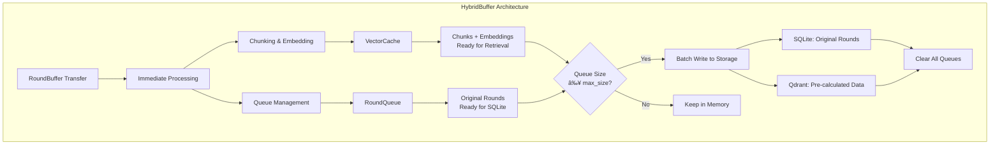

# MemFuse Buffer Architecture

## Overview

The MemFuse Buffer system provides intelligent message buffering and batch processing capabilities for high-throughput conversation management, inspired by modern computer caching architectures. This document outlines the architectural design, component interactions, and implementation strategies for the buffer subsystem, with detailed analysis of how it corresponds to mainstream computer caching mechanisms.

## Computer Caching Architecture Foundation

### Mainstream Computer Caching Components

The MemFuse Buffer system draws inspiration from three core computer caching components:

1. **Write Combining Buffer**: Optimizes write operations by coalescing multiple small writes into larger, more efficient burst writes
2. **Speculative Prefetch Buffer**: Predicts future memory access patterns and preloads data to reduce latency
3. **Multi-level Cache Hierarchy with Query Optimization**: Provides multi-level caching with intelligent query routing and result aggregation

### Computer Caching Architecture Overview



### Write Combining Buffer Principles


**Key Features**:
- **Address Matching**: Combines writes to the same memory region
- **Data Coalescing**: Merges multiple small writes into larger transactions
- **Burst Optimization**: Reduces memory bus overhead through batched writes
- **Timeout Mechanism**: Ensures writes don't wait indefinitely

### Speculative Prefetch Buffer Principles


**Key Features**:
- **Pattern Detection**: Analyzes access patterns to predict future requests
- **Multiple Predictors**: Uses stride, next-line, and correlation predictors
- **Usefulness Tracking**: Monitors prediction accuracy for optimization
- **Cache Integration**: Seamlessly integrates with existing cache hierarchy

### Multi-level Cache Hierarchy with Query Optimization Principles


**Key Features**:
- **Multi-level Hierarchy**: L1/L2/L3 cache levels with different characteristics
- **Heterogeneous Storage**: Supports multiple backend storage types
- **Intelligent Routing**: Routes queries to appropriate storage backends
- **Result Aggregation**: Combines and ranks results from multiple sources

## MemFuse Buffer System Architecture

### Computer Caching Correspondence

The MemFuse Buffer system implements three specialized buffer components that directly correspond to computer caching mechanisms:

| MemFuse Component | Computer Caching Analog | Primary Function | Implementation Status |
|-------------------|-------------------------|------------------|----------------------|
| **WriteBuffer** | Write Combining Buffer | Message coalescing and batch processing | 🚧 **TODO**: Future integration as high-level abstraction |
| **SpeculativeBuffer** | Speculative Prefetch Buffer | Predictive content prefetching | 🚧 **TODO**: Future integration for query optimization |
| **QueryBuffer** | Multi-level Cache Hierarchy | Multi-source query optimization | ✅ **Active**: Currently implemented and integrated |

> **Note**: The current implementation directly uses RoundBuffer, HybridBuffer, and QueryBuffer in BufferService. WriteBuffer and SpeculativeBuffer are planned for future integration to provide higher-level abstractions and enhanced performance optimization.

### WriteBuffer ↔ Write Combining Buffer Correspondence


**Correspondence Analysis**:
- **CPU Writes → Message Writes**: Individual write operations become message additions
- **Address Matching → Session Grouping**: Memory addresses become session contexts
- **Data Combining → Message Accumulation**: Byte-level combining becomes message-level accumulation
- **Memory Burst → Batch Processing**: Hardware burst writes become software batch transfers
- **Timeout Trigger → Token Threshold**: Hardware timeouts become intelligent token-based triggers

### SpeculativeBuffer ↔ Speculative Prefetch Buffer Correspondence


**Correspondence Analysis**:
- **Memory Access Pattern → Recent Message Access**: Hardware access patterns become message access patterns
- **Pattern Detection → Content Analysis**: Address pattern analysis becomes content pattern analysis
- **Address Prediction → Context Generation**: Memory address prediction becomes context-based prediction
- **Prefetch Memory → Retrieve Related Items**: Hardware prefetching becomes semantic retrieval
- **Cache Warming → Buffer Warming**: Hardware cache warming becomes buffer pre-population

### QueryBuffer ↔ Multi-level Cache Hierarchy Correspondence


**Correspondence Analysis**:
- **Multi-level Cache → Cache + Buffer**: Hardware cache levels become software buffer + storage levels
- **L1/L2/L3 Hierarchy → Memory Hierarchy**: Hardware cache hierarchy becomes memory service hierarchy
- **Backend Storage → MemoryService**: Hardware memory becomes persistent storage services
- **Result Aggregation → Result Combination**: Hardware result merging becomes software result combination
- **LRU Eviction → LRU Management**: Hardware LRU becomes software LRU cache management

## Core Architecture

### Current System Components (Implementation Status)

```mermaid
graph TB
    subgraph "Client Layer"
        A[Client Request] --> B[API Gateway]
    end

    subgraph "Service Layer"
        B --> C[BufferService]
        C --> D["WriteBuffer<br/>🚧 TODO: Future Integration"]
        C --> E["QueryBuffer<br/>✅ Active"]
        C --> F["RoundBuffer<br/>✅ Active"]
        C --> G["HybridBuffer<br/>✅ Active"]
    end

    subgraph "Buffer Components (Current)"
        F --> H[Token-based FIFO]
        G --> I[Dual-Queue Storage]
        E --> J[Query Cache]
        E --> K[Result Processor]
    end

    subgraph "Buffer Components (Future)"
        D --> L["SpeculativeBuffer<br/>🚧 TODO: Future Integration"]
        D --> F
        D --> G
    end

    subgraph "Storage Layer"
        H --> M[Memory Storage]
        I --> N[Chunk Storage]
        I --> O[Vector Store]
        I --> P[Keyword Store]
    end

    subgraph "Processing Layer"
        N --> Q[MemoryService]
        Q --> R[ChunkStrategy]
        R --> S[Persistent Storage]
    end
```



> **Current Implementation**: BufferService directly manages RoundBuffer, HybridBuffer, and QueryBuffer. WriteBuffer and SpeculativeBuffer exist as separate classes but are not yet integrated into the main service architecture.

### Architectural Principles


## Buffer Components

### WriteBuffer - Write Combining Buffer Implementation 🚧 TODO

> **Implementation Status**: WriteBuffer class exists but is not currently integrated into BufferService. This is planned for future implementation as a high-level abstraction layer.

The WriteBuffer will implement the Write Combining Buffer pattern for message processing, providing intelligent coalescing and batch optimization.

```mermaid
graph TB
    subgraph "WriteBuffer Architecture (Write Combining Pattern) - Future Implementation"
        A[Client Messages] --> B[WriteBuffer Entry Point]
        B --> C[RoundBuffer Token Check]
        B --> D[HybridBuffer Coordination]
        B --> E[Transfer Orchestration]

        C --> F["Token-based Coalescing<br/>(类比 Address Matching)"]
        D --> G["Dual-format Processing<br/>(类比 Data Combining)"]
        E --> H["Batch Transfer<br/>(类比 Burst Write)"]

        F --> I["Threshold-based Transfer<br/>(类比 Timeout/Full Trigger)"]
        G --> J["Immediate Processing<br/>(类比 Write Optimization)"]
        H --> K["Storage Handlers<br/>(类比 Memory Controller)"]
    end
```



**Planned Write Combining Buffer Characteristics**:
- **Message Coalescing**: Groups related messages by session and token count (analogous to address matching)
- **Batch Optimization**: Accumulates messages until threshold triggers transfer (analogous to burst writes)
- **Threshold Management**: Uses token count and size limits for intelligent batching (analogous to timeout mechanisms)
- **Transfer Coordination**: Orchestrates data movement between buffer levels (analogous to memory hierarchy management)

**Planned Key Responsibilities**:
- Unified message entry point with write combining optimization
- Component lifecycle management with caching principles
- Transfer coordination between buffers using threshold-based triggers
- Statistics collection and monitoring for performance optimization

**Planned Interface Design**:
```python
class WriteBuffer:
    async def add(self, messages: MessageList, session_id: str = None) -> Dict[str, Any]
    async def add_batch(self, message_batch_list: MessageBatchList, session_id: str = None) -> Dict[str, Any]

    def get_round_buffer(self) -> RoundBuffer
    def get_hybrid_buffer(self) -> HybridBuffer

    async def flush_all(self) -> Dict[str, Any]
    def get_stats(self) -> Dict[str, Any]
```

### RoundBuffer - Token-based FIFO


**Configuration Parameters**:
- `max_tokens`: Token threshold for transfer (default: 800)
- `max_size`: Maximum number of rounds (default: 5)
- `token_model`: Model for token counting (default: "gpt-4o-mini")

**Transfer Triggers**:
1. **Token Limit**: When accumulated tokens exceed threshold
2. **Size Limit**: When number of rounds exceeds maximum
3. **Manual Flush**: Explicit transfer request

### HybridBuffer - Dual-Queue Storage with Immediate Processing



**Dual-Queue Architecture**:
- **RoundQueue**: Original rounds for SQLite storage (no processing needed)
- **VectorCache**: Pre-processed chunks and embeddings for instant retrieval

**Immediate Processing Logic**:
1. **On Data Arrival**: Immediately perform chunking and embedding calculation
2. **VectorCache Storage**: Chunks/embeddings cached in memory for instant retrieval
3. **RoundQueue Management**: Original rounds queued for batch database write
4. **Batch Write Trigger**: When queue reaches max_size (5 items)
5. **Complete Clear**: Both queues cleared after successful write

**Key Benefits**:
- **Instant Retrieval**: Embeddings available immediately for search via VectorCache
- **No Recomputation**: Embeddings calculated once, reused for storage
- **Clear Separation**: RoundQueue for persistence, VectorCache for retrieval
- **Batch Efficiency**: Sequential writes to SQLite then Qdrant
- **Memory Safety**: Complete queue clearing prevents memory leaks

### QueryBuffer - Multi-level Cache Hierarchy Implementation ✅ Active

The QueryBuffer implements the Multi-level Cache Hierarchy pattern, providing multi-level caching with intelligent query routing and result aggregation.

```mermaid
graph TB
    subgraph "QueryBuffer Architecture (Multi-level Cache Hierarchy Pattern)"
        A[Query Request] --> B["Cache Key Generation<br/>(类比 Query Parser)"]
        B --> C["Multi-level Cache Check<br/>(类比 L1/L2/L3 Lookup)"]
        C -->|Hit| D["Cached Results<br/>(类比 Cache Hit)"]
        C -->|Miss| E["Multi-source Query<br/>(类比 Backend Storage Query)"]

        E --> F["Storage Query<br/>(类比 Vector Store)"]
        E --> G["HybridBuffer Query<br/>(类比 Keyword Store)"]
        E --> H["SpeculativeBuffer Query<br/>🚧 TODO: Future Integration"]

        F --> I[Storage Results]
        G --> J[Buffer Results]
        H --> K["Speculative Results<br/>🚧 TODO"]

        I --> L["Result Aggregation<br/>(类比 Result Merger)"]
        J --> L
        K -.-> L
        L --> M["Relevance Scoring<br/>(类比 Relevance Scoring)"]
        M --> N["Result Ranking<br/>(类比 Result Ranking)"]
        N --> O["Cache Population<br/>(类比 Cache Population)"]
        O --> P[Final Results]
        D --> P
    end
```



**Multi-level Cache Hierarchy Characteristics**:
- **Multi-level Caching**: Implements LRU cache with configurable size (analogous to L1/L2/L3 hierarchy)
- **Multi-source Querying**: Currently queries storage and buffer sources; speculative sources planned for future (analogous to heterogeneous storage backends)
- **Result Aggregation**: Combines and deduplicates results from multiple sources (analogous to result merging)
- **Intelligent Routing**: Routes queries to appropriate sources based on cache state (analogous to intelligent routing)

**Current Query Sources**:
1. **Persistent Storage**: Long-term data via MemoryService (analogous to main memory) ✅
2. **HybridBuffer**: Recent data in memory buffer (analogous to L2 cache) ✅
3. **Query Cache**: Previously computed results (analogous to query result cache) ✅

**Future Query Sources**:
4. **SpeculativeBuffer**: Prefetched data for fast access (analogous to L1 cache) 🚧 TODO

**Sorting Options**:
- `score`: Relevance-based ranking (default)
- `timestamp`: Temporal ordering

### SpeculativeBuffer - Speculative Prefetch Buffer Implementation 🚧 TODO

> **Implementation Status**: SpeculativeBuffer class exists but is not currently integrated into BufferService or QueryBuffer. This is planned for future implementation to enhance query performance through predictive prefetching.

The SpeculativeBuffer will implement the Speculative Prefetch Buffer pattern, providing predictive content prefetching based on access patterns.

```mermaid
graph TB
    subgraph "SpeculativeBuffer Architecture (Speculative Prefetch Pattern) - Future Implementation"
        A["Recent Message Access<br/>(类比 Memory Access Pattern)"] --> B["Content Analysis<br/>(类比 Pattern Detection)"]
        B --> C["Context Generation<br/>(类比 Address Prediction)"]
        C --> D["Retrieve Related Items<br/>(类比 Prefetch Memory)"]
        D --> E["Buffer Warming<br/>(类比 Cache Warming)"]

        F["Context Window<br/>(类比 Stride Predictor)"]
        G["Retrieval Handler<br/>(类比 Correlation Table)"]
        H["Update Statistics<br/>(类比 Usefulness Counter)"]

        B --> F
        C --> G
        E --> H
        H --> B
    end
```



**Planned Speculative Prefetch Buffer Characteristics**:
- **Pattern Analysis**: Analyzes recent message content to predict future access patterns (analogous to stride/correlation prediction)
- **Context Generation**: Creates search context from recent items (analogous to address prediction)
- **Predictive Retrieval**: Fetches related content before it's requested (analogous to memory prefetching)
- **Buffer Warming**: Pre-populates buffer with likely-to-be-accessed items (analogous to cache warming)
- **Usefulness Tracking**: Monitors prediction accuracy for optimization (analogous to usefulness counters)

**Planned Key Features**:
- **Context Window**: Configurable number of recent items for pattern analysis
- **Retrieval Handler**: Async callback for semantic content retrieval
- **Optimization Methods**: Prefetch for query, pattern-based optimization
- **Performance Tracking**: Statistics for prediction accuracy and buffer utilization

## Data Flow Architecture

### Complete System Integration with Computer Caching Principles

```mermaid
sequenceDiagram
    participant Client
    participant WriteBuffer
    participant RoundBuffer
    participant HybridBuffer
    participant SpeculativeBuffer
    participant QueryBuffer
    participant MemoryService
    participant Storage

    Note over Client, Storage: Write Path (类比 Write Combining Buffer)
    Client->>WriteBuffer: add(messages)
    WriteBuffer->>RoundBuffer: accumulate(messages)
    Note over RoundBuffer: Token-based coalescing<br/>(类比 Address matching + Data combining)

    RoundBuffer->>RoundBuffer: check_threshold()
    alt Token/Size threshold reached
        RoundBuffer->>HybridBuffer: transfer_batch(rounds)
        Note over HybridBuffer: Immediate processing<br/>(类比 Burst write optimization)
        HybridBuffer->>HybridBuffer: chunk_and_embed()
        HybridBuffer->>Storage: batch_write()
    end

    Note over Client, Storage: Speculative Prefetch Path (🚧 TODO: Future Implementation)
    HybridBuffer->>SpeculativeBuffer: update_from_items(recent_items)
    Note over SpeculativeBuffer: Pattern analysis<br/>(类比 Access pattern detection)
    SpeculativeBuffer->>SpeculativeBuffer: generate_context()
    SpeculativeBuffer->>MemoryService: retrieve_related(context)
    MemoryService-->>SpeculativeBuffer: prefetched_items
    Note over SpeculativeBuffer: Buffer warming<br/>(类比 Cache warming)

    Note over Client, Storage: Query Path (类比 Multi-level Cache Hierarchy)
    Client->>QueryBuffer: query(text, params)
    QueryBuffer->>QueryBuffer: check_cache()
    alt Cache miss
        par Multi-source query (Current Implementation)
            QueryBuffer->>MemoryService: query_storage()
            QueryBuffer->>HybridBuffer: query_buffer()
        and Future Integration
            QueryBuffer->>SpeculativeBuffer: get_relevant_items() [🚧 TODO]
        end

        MemoryService-->>QueryBuffer: storage_results
        HybridBuffer-->>QueryBuffer: buffer_results
        SpeculativeBuffer-->>QueryBuffer: speculative_results [🚧 TODO]

        Note over QueryBuffer: Result aggregation<br/>(类比 Multi-level cache merge)
        QueryBuffer->>QueryBuffer: combine_and_sort()
        QueryBuffer->>QueryBuffer: update_cache()
    end

    QueryBuffer-->>Client: final_results
```



### Message Processing Pipeline


### Query Processing Pipeline


## Configuration Architecture

### Hierarchical Configuration


### Configuration Schema

```yaml
buffer:
  enabled: true
  
  # RoundBuffer configuration
  round_buffer:
    max_tokens: 800               # Token threshold for transfer
    max_size: 5                   # Maximum rounds before transfer
    token_model: "gpt-4o-mini"    # Model for token counting
  
  # HybridBuffer configuration
  hybrid_buffer:
    max_size: 5                   # FIFO buffer size
    chunk_strategy: "message"     # Chunking strategy (default: message, can be contextual)
    embedding_model: "all-MiniLM-L6-v2"  # Embedding model
  
  # QueryBuffer configuration
  query:
    max_size: 15                  # Maximum results per query
    cache_size: 100               # Query cache size
    default_sort_by: "score"      # Default sorting method
    default_order: "desc"         # Default sort order
```

## Performance Architecture

### Throughput Optimization


### Latency Characteristics

| Operation | Latency | Description |
|-----------|---------|-------------|
| Message Add | <5ms | Add to RoundBuffer |
| Buffer Transfer | <50ms | RoundBuffer → HybridBuffer |
| Storage Flush | <200ms | HybridBuffer → Persistent Storage |
| Query (Cached) | <10ms | Cache hit response |
| Query (Cold) | <100ms | Multi-source query |

### Memory Management


## Error Handling & Resilience

### Fault Tolerance

```mermaid
graph TB
    subgraph "Error Handling Strategy"
        A[Component Failure] --> B{Failure Type}
        B -->|Storage Error| C[Retry with Backoff]
        B -->|Memory Error| D[Graceful Degradation]
        B -->|Network Error| E[Circuit Breaker]
        
        C --> F[Error Recovery]
        D --> G[Fallback Mode]
        E --> H[Service Protection]
        
        F --> I[System Resilience]
        G --> I
        H --> I
    end
```

### Recovery Mechanisms

1. **Automatic Retry**: Transient failure recovery
2. **Circuit Breaker**: Prevent cascade failures
3. **Graceful Degradation**: Reduced functionality under stress
4. **Data Persistence**: No data loss during failures

## Monitoring & Observability

### Metrics Collection

```mermaid
graph TB
    subgraph "Buffer Metrics"
        A[WriteBuffer Stats] --> B[total_writes<br/>total_transfers<br/>component_health]
        C[RoundBuffer Stats] --> D[current_tokens<br/>round_count<br/>transfer_triggers]
        E[HybridBuffer Stats] --> F[chunk_count<br/>round_count<br/>flush_operations]
        G[QueryBuffer Stats] --> H[cache_hits<br/>cache_misses<br/>query_latency]
    end
```

### Health Indicators

| Metric | Healthy Range | Alert Threshold |
|--------|---------------|-----------------|
| Transfer Rate | 10-100/min | >500/min |
| Memory Usage | <50MB | >100MB |
| Query Latency | <100ms | >500ms |
| Cache Hit Rate | >80% | <50% |

## Integration Patterns

### Service Integration

```mermaid
graph TB
    subgraph "Current Service Integration"
        A[BufferService] --> B["WriteBuffer Integration<br/>🚧 TODO: Future"]
        A --> C["QueryBuffer Integration<br/>✅ Active"]
        A --> D["Direct Component Management<br/>✅ Current"]

        B --> E["Unified Add Interface<br/>🚧 TODO"]
        C --> F["Unified Query Interface<br/>✅ Active"]
        D --> G["Direct Access<br/>round_buffer, hybrid_buffer<br/>✅ Current"]

        F --> H["Multi-source Querying<br/>Storage + HybridBuffer<br/>✅ Active"]
        E --> I["Component Coordination<br/>🚧 TODO"]
    end
```

### API Compatibility

```python
# BufferService maintains full API compatibility (Current Implementation)
class BufferService:
    async def add(self, messages: MessageList, session_id: str = None) -> Dict[str, Any]
    async def add_batch(self, message_batch_list: MessageBatchList, session_id: str = None) -> Dict[str, Any]
    async def query(self, query: str, top_k: int = 10, **kwargs) -> Dict[str, Any]
    async def get_messages_by_session(self, session_id: str, buffer_only: bool = None, **kwargs) -> Dict[str, Any]

    # Current direct component access
    @property
    def round_buffer(self) -> RoundBuffer  # ✅ Active
    @property
    def hybrid_buffer(self) -> HybridBuffer  # ✅ Active
    @property
    def query_buffer(self) -> QueryBuffer  # ✅ Active

    # Future unified access (TODO)
    # @property
    # def write_buffer(self) -> WriteBuffer  # 🚧 TODO
    # @property
    # def speculative_buffer(self) -> SpeculativeBuffer  # 🚧 TODO
```

## Implementation Status Summary

### Current Architecture (Active Components) ✅

The current MemFuse Buffer system implements the following components:

| Component | Status | Description | Integration |
|-----------|--------|-------------|-------------|
| **BufferService** | ✅ Active | Main service orchestrating buffer operations | Fully integrated |
| **RoundBuffer** | ✅ Active | Token-based FIFO with automatic transfer | Direct integration in BufferService |
| **HybridBuffer** | ✅ Active | Dual-queue storage with immediate processing | Direct integration in BufferService |
| **QueryBuffer** | ✅ Active | Multi-source query with caching and sorting | Direct integration in BufferService |

### Future Architecture (Planned Components) 🚧

The following components are planned for future integration:

| Component | Status | Description | Integration Plan |
|-----------|--------|-------------|------------------|
| **WriteBuffer** | 🚧 TODO | High-level abstraction for RoundBuffer + HybridBuffer | Will serve as unified entry point |
| **SpeculativeBuffer** | 🚧 TODO | Predictive prefetching for query optimization | Will integrate with QueryBuffer |

### Current Data Flow

```
Client Request → BufferService → RoundBuffer → HybridBuffer → Storage
                              ↓
                            QueryBuffer → Multi-source Query → Results
```

### Future Data Flow (Planned)

```
Client Request → BufferService → WriteBuffer → RoundBuffer + HybridBuffer → Storage
                              ↓                    ↓
                            QueryBuffer → SpeculativeBuffer + HybridBuffer + Storage → Results
```

## Design Benefits

### Computer Caching Architecture Advantages

The MemFuse Buffer system inherits proven advantages from computer caching architectures:

1. **Write Combining Benefits** (WriteBuffer) 🚧 TODO:
   - **Reduced I/O Operations**: Batching will reduce database transaction overhead
   - **Improved Throughput**: Token-based coalescing will optimize memory bandwidth utilization
   - **Lower Latency**: Intelligent buffering will reduce per-message processing latency
   - **Resource Efficiency**: Threshold-based triggers will optimize memory and CPU usage

2. **Speculative Prefetch Benefits** (SpeculativeBuffer) 🚧 TODO:
   - **Predictive Performance**: Pattern-based prefetching will reduce query latency
   - **Cache Warming**: Pre-population will improve hit rates for subsequent queries
   - **Adaptive Learning**: Usefulness tracking will optimize prediction accuracy
   - **Background Processing**: Async prefetching won't block main operations

3. **Multi-level Cache Hierarchy Benefits** (QueryBuffer) ✅:
   - **Multi-level Optimization**: Hierarchical caching maximizes hit rates
   - **Result Aggregation**: Intelligent merging from multiple sources
   - **Query Similarity**: Cache key optimization reduces redundant computations
   - **LRU Management**: Efficient memory utilization with proven eviction policies

### Architectural Advantages

1. **Unified Entry Point**: WriteBuffer provides clean abstraction with write combining optimization
2. **Component Isolation**: Clear separation of concerns following caching hierarchy principles
3. **Configurable Behavior**: Flexible parameter tuning based on caching best practices
4. **Performance Optimization**: Intelligent batching, caching, and prefetching
5. **Fault Tolerance**: Robust error handling and recovery with graceful degradation

### Scalability Features

- **Horizontal Scaling**: Stateless component design following cache architecture principles
- **Memory Efficiency**: FIFO-based memory management with LRU eviction policies
- **Load Distribution**: Async processing capabilities with parallel query handling
- **Resource Optimization**: Intelligent threshold management based on caching algorithms
- **Predictive Scaling**: Speculative prefetching reduces load on backend storage

## Future Enhancements

### Computer Caching-Inspired Improvements

#### Short-term Improvements

- **Dynamic Thresholds**: Adaptive threshold adjustment based on access patterns (inspired by adaptive cache sizing)
- **Advanced Prefetching**: Multi-pattern prefetch predictors (inspired by stride + correlation predictors)
- **Compression**: Memory usage optimization with intelligent compression (inspired by cache compression techniques)
- **Victim Caches**: Secondary buffers for evicted items (inspired by victim cache architecture)

#### Medium-term Vision

- **Multi-level Buffer Hierarchy**: Implement L1/L2/L3 buffer levels (inspired by cache hierarchy)
- **Non-blocking Buffers**: Lock-free data structures for higher concurrency (inspired by non-blocking caches)
- **Coherence Protocols**: Multi-instance buffer synchronization (inspired by cache coherence)
- **Bandwidth Optimization**: Intelligent data placement and migration (inspired by memory bandwidth optimization)

#### Long-term Vision

- **Distributed Buffering**: Multi-node buffer coordination with coherence protocols
- **ML-based Optimization**: Intelligent parameter tuning using machine learning for pattern prediction
- **Stream Processing**: Real-time data processing capabilities with continuous prefetching
- **Quantum-inspired Algorithms**: Advanced prediction algorithms for speculative buffering

### Performance Optimization Roadmap

```mermaid
graph TB
    subgraph "Current State"
        A[Basic Write Combining]
        B[Simple Prefetching]
        C[LRU Query Cache]
    end

    subgraph "Short-term (3-6 months)"
        D[Adaptive Thresholds]
        E[Multi-pattern Prefetch]
        F[Victim Caches]
    end

    subgraph "Medium-term (6-12 months)"
        G[Multi-level Hierarchy]
        H[Non-blocking Structures]
        I[Coherence Protocols]
    end

    subgraph "Long-term (12+ months)"
        J[Distributed Coordination]
        K[ML-based Optimization]
        L[Quantum-inspired Algorithms]
    end

    A --> D
    B --> E
    C --> F

    D --> G
    E --> H
    F --> I

    G --> J
    H --> K
    I --> L
```

## Conclusion

The MemFuse Buffer architecture provides a robust, scalable foundation for high-throughput message processing by leveraging proven computer caching principles. The system's design draws from decades of computer architecture research, with current implementation of core buffer components and planned integration of advanced caching mechanisms.

**Current Achievements** ✅:
- **Performance**: Significant latency reduction through intelligent buffering (RoundBuffer + HybridBuffer)
- **Scalability**: Horizontal scaling capabilities with stateless design principles
- **Reliability**: Fault-tolerant architecture with graceful degradation
- **Efficiency**: Optimized resource utilization through multi-level caching (QueryBuffer)

**Future Enhancements** 🚧:
- **Write Combining**: Enhanced throughput through WriteBuffer abstraction layer
- **Predictive Prefetching**: Reduced query latency through SpeculativeBuffer integration
- **Advanced Caching**: Complete computer caching architecture implementation

**Innovation**: The adaptation of hardware caching principles to software memory management represents a novel approach that bridges the gap between computer architecture and application-level optimization. The current implementation provides a solid foundation, with planned enhancements that will complete the vision of intelligent memory systems.

**Implementation Roadmap**:
1. **Phase 1** ✅: Core buffer components (RoundBuffer, HybridBuffer, QueryBuffer)
2. **Phase 2** 🚧: High-level abstractions (WriteBuffer integration)
3. **Phase 3** 🚧: Predictive optimization (SpeculativeBuffer integration)
4. **Phase 4** 🚧: Advanced features (ML-based optimization, distributed coordination)

This architecture ensures optimal performance while maintaining data integrity and system reliability, positioning MemFuse as a leader in intelligent memory management solutions with a clear path for continued innovation.
