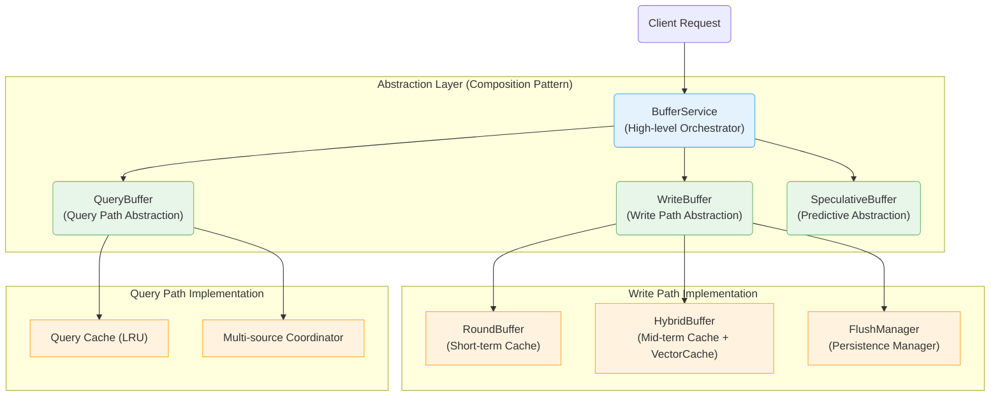

# MemFuse Buffer Architecture Documentation

## Overview

This directory contains comprehensive documentation for the MemFuse Buffer system, a sophisticated message buffering and caching architecture inspired by computer caching principles.

## 🎯 Key Features

- ✅ **Complete bypass capability**: Optional buffer functionality via configuration
- ✅ **Computer caching inspired**: Based on Write Combining Buffer, Speculative Prefetch, and Multi-level Cache principles
- ✅ **Proper abstraction layers**: Composition pattern with three specialized buffer types
- ✅ **Memory Layer integration**: Maintains M0/M1/M2 processing in all modes
- ✅ **Flexible deployment**: Supports both high-throughput and low-latency scenarios

## 📚 Documentation Structure

### Core Architecture
| Document | Description | Status |
|----------|-------------|--------|
| **[overview.md](overview.md)** | Architecture overview and bypass mechanism | ✅ Complete |
| **[write_buffer.md](write_buffer.md)** | WriteBuffer abstraction and write path components | ✅ Complete |
| **[query_buffer.md](query_buffer.md)** | QueryBuffer abstraction and multi-level caching | ✅ Complete |
| **[speculative_buffer.md](speculative_buffer.md)** | SpeculativeBuffer design and future roadmap | ✅ Interface Ready |

### Implementation & Configuration
| Document | Description | Status |
|----------|-------------|--------|
| **[configuration.md](configuration.md)** | Complete configuration guide and scenarios | ✅ Complete |
| **[bypass_mechanism.md](bypass_mechanism.md)** | Detailed bypass functionality and verification | ✅ Verified |
| **[performance.md](performance.md)** | Performance analysis, monitoring, and optimization | ✅ Complete |

### Advanced Topics (Planned)
| Document | Description | Status |
|----------|-------------|--------|
| **[data_flow.md](data_flow.md)** | Detailed data flow patterns and sequence diagrams | 🔮 Planned |
| **[computer_caching.md](computer_caching.md)** | Computer caching principles and correspondence | 🔮 Planned |
| **[integration.md](integration.md)** | Service integration patterns and API compatibility | 🔮 Planned |

### Implementation Notes
| Topic | Coverage | Location |
|-------|----------|----------|
| **Internal Components** | ✅ Integrated | Detailed in individual buffer documents |
| **Component Communication** | ✅ Integrated | Added to write_buffer.md and query_buffer.md |
| **Query-time Controls** | ✅ Complete | Dedicated buffer_only_parameter.md document |
| **Performance Analysis** | ✅ Complete | Dedicated performance.md document |
| **Computer Caching Principles** | ✅ Covered | Included in overview.md and component docs |

## 🚀 Quick Start

### Basic Usage

```python
# Initialize BufferService (automatically detects configuration)
buffer_service = BufferService(memory_service, user_id, config)

# Add messages (works in both enabled and bypass modes)
result = await buffer_service.add_batch(message_batch_list, session_id)

# Query data (works in both enabled and bypass modes)
results = await buffer_service.query("search text", top_k=10)
```

### Configuration Examples

**Production (High Throughput)**:
```yaml
buffer:
  enabled: true
  round_buffer:
    max_tokens: 800
    max_size: 5
  hybrid_buffer:
    max_size: 5
```

**Development (Low Latency)**:
```yaml
buffer:
  enabled: false  # Complete bypass
```

## 🏗️ Architecture Overview

### Component Hierarchy



### Computer Caching Correspondence

| MemFuse Component | Computer Caching Analog | Primary Function |
|-------------------|-------------------------|------------------|
| **WriteBuffer** | Write Combining Buffer | Write path abstraction managing batch processing |
| **QueryBuffer** | Multi-level Cache Hierarchy | Query path abstraction with multi-source coordination |
| **SpeculativeBuffer** | Speculative Prefetch Buffer | Predictive prefetching abstraction |

## 🔄 Buffer Bypass Mechanism

### Configuration Control

```yaml
buffer:
  enabled: true   # true = full buffer functionality, false = complete bypass
```

### Data Flow Comparison

**Buffer Enabled**:
```
Client → BufferService → WriteBuffer → Components → MemoryService → M0/M1/M2
```

**Buffer Bypass**:
```
Client → BufferService → MemoryService (Direct) → M0/M1/M2
```

**Key Insight**: Memory Layer (M0/M1/M2) processing **always remains active** in both modes.

## 📊 Performance Characteristics

| Aspect | Buffer Enabled | Buffer Bypass |
|--------|---------------|---------------|
| **Memory Usage** | ~8MB (buffers + cache) | ~1MB (minimal overhead) |
| **Latency** | Optimized for throughput | Optimized for low latency |
| **Throughput** | High (batch processing) | Medium (direct processing) |
| **Use Cases** | Production, high-volume | Development, low-latency |

## 📖 Reading Guide

### For New Users
1. Start with **[overview.md](overview.md)** for architecture understanding
2. Read **[configuration.md](configuration.md)** for setup guidance
3. Review **[bypass_mechanism.md](bypass_mechanism.md)** for deployment options

### For Developers
1. **[write_buffer.md](write_buffer.md)** - Understand write path implementation
2. **[query_buffer.md](query_buffer.md)** - Learn query optimization strategies
3. **[speculative_buffer.md](speculative_buffer.md)** - Future enhancement roadmap

### For Operations
1. **[configuration.md](configuration.md)** - Production configuration guidance
2. **[bypass_mechanism.md](bypass_mechanism.md)** - Deployment mode selection
3. **[buffer_only_parameter.md](buffer_only_parameter.md)** - Query-time data source control
4. **[performance.md](performance.md)** - Performance monitoring and optimization

## 🔧 Configuration Scenarios

### Production High-Throughput
```yaml
buffer:
  enabled: true
  round_buffer:
    max_tokens: 1200
    max_size: 8
  performance:
    max_flush_workers: 5
```

### Development Low-Latency
```yaml
buffer:
  enabled: false
```

### Memory-Constrained
```yaml
buffer:
  enabled: true
  round_buffer:
    max_tokens: 400
    max_size: 3
  query:
    cache_size: 50
```

## ✅ Implementation Status

| Component | Status | Description |
|-----------|--------|-------------|
| **BufferService** | ✅ Complete | High-level orchestrator with bypass support |
| **WriteBuffer** | ✅ Complete | Write path abstraction layer |
| **QueryBuffer** | ✅ Complete | Query path abstraction layer |
| **SpeculativeBuffer** | ✅ Interface | Complete interface, future implementation |
| **Bypass Mechanism** | ✅ Verified | Comprehensive testing and verification |

## 🔗 Related Documentation

- **[Memory Layer Architecture](../memory_layer.md)** - M0/M1/M2 parallel processing
- **[PgAI Integration](../pgai/overview.md)** - Database integration patterns
- **[Service Architecture](../services.md)** - Overall service design patterns

## 📝 Contributing

When contributing to buffer documentation:

1. **Follow the established structure** - Each document has a specific focus
2. **Update cross-references** - Maintain links between related documents
3. **Include examples** - Provide practical configuration and usage examples
4. **Verify accuracy** - Test configurations and code examples
5. **Update status** - Keep implementation status current

## 🏷️ Document Conventions

- ✅ **Complete**: Fully implemented and documented
- 🔮 **Planned**: Designed but not yet implemented
- ⚠️ **Deprecated**: No longer recommended
- 🔄 **In Progress**: Currently being developed
