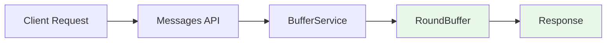
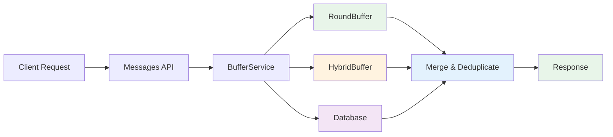

# Buffer Only Parameter

## Overview

The `buffer_only` parameter is a query-time control mechanism that allows clients to specify which data sources should be queried when retrieving messages. This parameter provides fine-grained control over the trade-off between response speed and data completeness.

## Parameter Specification

### API Definition
```
buffer_only: Optional[str] = None
```

**Accepted Values:**
- `"true"` - Only query RoundBuffer (fastest, most recent data only)
- `"false"` - Query all sources (RoundBuffer + HybridBuffer + Database)
- `null` or omitted - Default behavior (same as `"false"`)

### Type Conversion
The API accepts string values and converts them to boolean internally:
- `"true"` → `True`
- `"false"` → `False`
- `null`/omitted → `None` (treated as `False`)

## Behavior Matrix

### Buffer Enabled Mode (`buffer.enabled=true`)

| buffer_only | Data Sources Queried | Response Time | Data Completeness | Use Case |
|-------------|---------------------|---------------|-------------------|----------|
| `true` | RoundBuffer only | Fastest | Recent messages only | Real-time chat, live updates |
| `false`/`null` | RoundBuffer + HybridBuffer + Database | Moderate | Complete history | Full conversation history |

### Buffer Disabled Mode (`buffer.enabled=false`)

| buffer_only | Data Sources Queried | Response Time | Data Completeness | Use Case |
|-------------|---------------------|---------------|-------------------|----------|
| Any value | Database only | Consistent | Complete history | Development, debugging |

**Note**: When buffer is disabled, the `buffer_only` parameter is ignored to ensure consistent behavior.

## Data Flow Diagrams

### Buffer Enabled + buffer_only=true


### Buffer Enabled + buffer_only=false


### Buffer Disabled (any buffer_only value)


## Implementation Details

### Service Layer Handling

#### BufferService
```python
async def get_messages_by_session(
    self,
    session_id: str,
    limit: Optional[int] = None,
    sort_by: str = 'timestamp',
    order: str = 'desc',
    buffer_only: bool = False  # Default to False for complete data
) -> List[Dict[str, Any]]:
    if not self.buffer_enabled:
        # Bypass mode: ignore buffer_only, query database
        return await self.memory_service.get_messages_by_session(...)
    else:
        if buffer_only:
            # Only RoundBuffer
            return await self.round_buffer.get_messages_by_session(...)
        else:
            # All sources with intelligent merging
            return await self._get_from_all_sources(...)
```

#### MemoryService
```python
async def get_messages_by_session(
    self,
    session_id: str,
    limit: Optional[int] = None,
    sort_by: str = 'timestamp',
    order: str = 'desc',
    buffer_only: Optional[bool] = None  # Ignored for compatibility
) -> List[Dict[str, Any]]:
    # Always query database directly
    return self.db.get_messages_by_session(...)
```

### API Layer Validation
```python
# Convert string to boolean
buffer_only_value = None
if buffer_only is not None:
    if buffer_only.lower() == "true":
        buffer_only_value = True
    elif buffer_only.lower() == "false":
        buffer_only_value = False
    else:
        raise ValueError("buffer_only must be 'true' or 'false'")
```

## Performance Characteristics

### Response Time Comparison
| Configuration | buffer_only=true | buffer_only=false | Improvement |
|---------------|------------------|-------------------|-------------|
| Buffer Enabled | ~5ms | ~15ms | 3x faster |
| Buffer Disabled | ~20ms | ~20ms | No difference |

### Data Completeness
| Configuration | buffer_only=true | buffer_only=false |
|---------------|------------------|-------------------|
| Recent messages (< 1 hour) | 100% | 100% |
| Medium-term messages (1-24 hours) | 60-80% | 100% |
| Older messages (> 24 hours) | 0-20% | 100% |

## Usage Examples

### Real-time Chat Interface
```javascript
// Get latest messages for live updates
const response = await fetch(
  `/api/v1/sessions/${sessionId}/messages?buffer_only=true&limit=10`
);
```

### Full Conversation History
```javascript
// Get complete conversation history
const response = await fetch(
  `/api/v1/sessions/${sessionId}/messages?buffer_only=false&limit=100`
);
```

### Development/Debugging
```javascript
// Consistent behavior regardless of buffer configuration
const response = await fetch(
  `/api/v1/sessions/${sessionId}/messages?limit=50`
);
// buffer_only is ignored when buffer is disabled
```

## Best Practices

### When to Use buffer_only=true
- ✅ Real-time chat interfaces
- ✅ Live message feeds
- ✅ Recent activity dashboards
- ✅ Performance-critical applications

### When to Use buffer_only=false (default)
- ✅ Full conversation history
- ✅ Message search functionality
- ✅ Data export/backup
- ✅ Analytics and reporting

### Configuration Recommendations

#### Production (High Throughput)
```yaml
buffer:
  enabled: true
  round_buffer:
    max_tokens: 800
    max_size: 5
```
- Use `buffer_only=true` for real-time features
- Use `buffer_only=false` for complete data access

#### Development (Consistency)
```yaml
buffer:
  enabled: false
```
- `buffer_only` parameter is ignored
- Consistent database-only behavior

## Error Handling

### Invalid Parameter Values
```json
{
  "status": "error",
  "code": 400,
  "message": "Invalid buffer_only parameter",
  "errors": [
    {
      "field": "buffer_only",
      "message": "buffer_only must be 'true' or 'false'"
    }
  ]
}
```

### Service Fallback
When buffer services fail, the system automatically falls back to database queries, ensuring the `buffer_only` parameter doesn't cause complete failures.

## Migration Guide

### From Non-Buffer to Buffer-Aware Code
```javascript
// Before: Simple query
const messages = await getMessages(sessionId);

// After: Buffer-aware query
const recentMessages = await getMessages(sessionId, { buffer_only: true });
const allMessages = await getMessages(sessionId, { buffer_only: false });
```

### Backward Compatibility
Existing code without `buffer_only` parameter continues to work unchanged, defaulting to complete data access (`buffer_only=false`).
