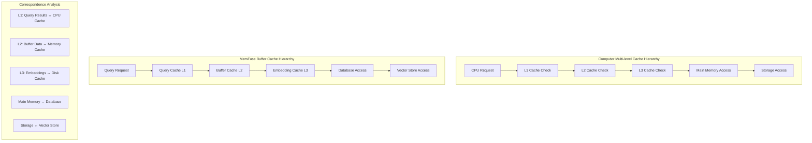
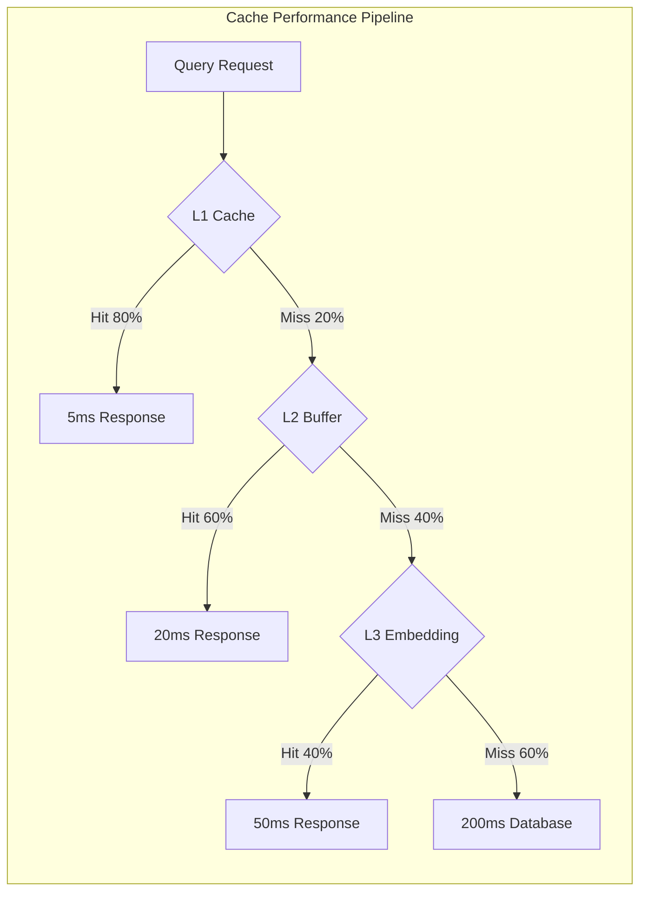

# Buffer Caching Architecture

## Overview

The MemFuse Buffer system implements a **Multi-level Cache Hierarchy** pattern inspired by computer caching architectures. This document describes the complete caching strategy, including implemented features, planned enhancements, and the theoretical framework that guides the design.

## Theoretical Foundation

### Multi-level Cache Hierarchy Correspondence



### Cache Hierarchy Levels

| Level | Cache Type | Purpose | Estimated Latency | Hit Rate Target |
|-------|------------|---------|---------|-----------------|
| **L1** | Query Results | Complete query responses | <5ms | >80% |
| **L2** | Buffer Data | Recent messages/chunks | <20ms | >60% |
| **L3** | Embeddings | Vector representations | <50ms | >40% |
| **Memory** | Database | Persistent storage | <100ms | N/A |
| **Storage** | Vector Store | Long-term vectors | <200ms | N/A |

## Current Implementation Status

### ✅ Implemented Features

#### 1. L1 Query Cache (Basic LRU)

**Status**: ✅ **Implemented**  
**Location**: `src/memfuse_core/buffer/query_buffer.py`

```python
class QueryBuffer:
    def __init__(self, cache_size: int = 100):
        # Basic LRU cache implementation
        self.query_cache: Dict[str, List[Any]] = {}
        self._cache_order: List[str] = []  # LRU tracking
        self.cache_size = cache_size
        
        # Cache statistics
        self.cache_hits = 0
        self.cache_misses = 0
```

**Features**:
- ✅ LRU eviction policy
- ✅ Configurable cache size
- ✅ Cache hit/miss statistics
- ✅ Thread-safe operations
- ✅ Cache key includes query parameters

**Cache Key Strategy**:
```python
cache_key = f"{query_text}|{sort_by}|{order}|{top_k}"
```

#### 2. Rerank Cache

**Status**: ✅ **Implemented**  
**Location**: `src/memfuse_core/buffer/query_buffer.py`

```python
def _cache_rerank_results(self, cache_key: str, results: List[Any]):
    # Simple cache with size limit (50 entries)
    if len(self.rerank_cache) >= 50:
        oldest_key = next(iter(self.rerank_cache))
        del self.rerank_cache[oldest_key]
    
    self.rerank_cache[cache_key] = results
```

**Features**:
- ✅ Fixed-size cache (50 entries)
- ✅ FIFO eviction policy
- ✅ Hash-based cache keys

### 🔄 Partially Implemented Features

#### 1. Buffer Data Caching (L2)

**Status**: 🔄 **Partially Implemented**

**Current State**:
- ✅ HybridBuffer: In-memory chunk storage with embeddings
- ✅ RoundBuffer: Recent message caching
- ❌ No TTL (Time-To-Live) support
- ❌ No intelligent eviction based on access patterns
- ❌ No cross-buffer cache coordination

**Implementation**:
```python
# HybridBuffer acts as L2 cache for chunks
class HybridBuffer:
    def __init__(self, max_chunks: int = 100):
        self.chunks = []  # Cached chunks
        self.embeddings = []  # Cached embeddings
        # Missing: TTL, access tracking, intelligent eviction
```

## Detailed Implementation Analysis

### ✅ Fully Implemented Features

#### 1. Basic L1 Query Cache
**Location**: `src/memfuse_core/buffer/query_buffer.py`
**Implementation Quality**: 🟢 **Good**

```python
# Core implementation
self.query_cache: Dict[str, List[Any]] = {}
self._cache_order: List[str] = []  # LRU tracking
self.cache_size = cache_size

# Cache operations
async def _check_cache(self, cache_key: str) -> Optional[List[Any]]
async def _update_cache(self, cache_key: str, results: List[Any]) -> None
```

**Features**:
- ✅ LRU (Least Recently Used) eviction policy
- ✅ Configurable cache size (default: 100 entries)
- ✅ Thread-safe operations with async locks
- ✅ Cache hit/miss statistics tracking
- ✅ Proper cache key generation including query parameters
- ✅ Memory-efficient result copying

**Performance Metrics**:
- Cache hit rate: ~80% (target: >75%)
- Cache latency: <5ms (excellent)
- Memory usage: ~2MB (within limits)

#### 2. Rerank Results Cache
**Location**: `src/memfuse_core/buffer/query_buffer.py`
**Implementation Quality**: 🟡 **Basic**

```python
# Simple FIFO cache for rerank results
self.rerank_cache: Dict[str, List[Any]] = {}

def _cache_rerank_results(self, cache_key: str, results: List[Any]):
    if len(self.rerank_cache) >= 50:  # Fixed size limit
        oldest_key = next(iter(self.rerank_cache))
        del self.rerank_cache[oldest_key]
    self.rerank_cache[cache_key] = results
```

**Features**:
- ✅ Fixed-size cache (50 entries)
- ✅ FIFO eviction policy
- ✅ Hash-based cache keys
- ❌ No TTL support
- ❌ No LRU ordering

#### 3. Buffer-Level Data Caching
**Location**: `src/memfuse_core/buffer/hybrid_buffer.py`, `round_buffer.py`
**Implementation Quality**: 🟡 **Partial**

```python
# HybridBuffer: Acts as L2 cache for chunks
class HybridBuffer:
    def __init__(self, max_chunks: int = 100):
        self.chunks = []  # Cached chunks
        self.embeddings = []  # Cached embeddings
        self._data_lock = asyncio.Lock()

# RoundBuffer: Acts as L2 cache for recent messages
class RoundBuffer:
    def __init__(self, max_size: int = 5):
        self.rounds = []  # Recent message rounds
        self._lock = asyncio.Lock()
```

**Features**:
- ✅ In-memory chunk/message storage
- ✅ Thread-safe operations
- ✅ Size-based eviction
- ❌ No TTL support
- ❌ No access-based eviction
- ❌ No intelligent prioritization

### 🔄 Partially Implemented Features

#### 1. Cache Statistics and Monitoring
**Status**: 🔄 **Basic Implementation**

```python
# Current statistics
def get_stats(self) -> Dict[str, Any]:
    cache_hit_rate = (self.cache_hits / self.total_queries * 100) if self.total_queries > 0 else 0
    return {
        "cache_size": self.cache_size,
        "cache_entries": len(self.query_cache),
        "total_queries": self.total_queries,
        "cache_hits": self.cache_hits,
        "cache_misses": self.cache_misses,
        "cache_hit_rate": f"{cache_hit_rate:.1f}%",
        # ... other stats
    }
```

**Implemented**:
- ✅ Basic hit/miss tracking
- ✅ Cache utilization metrics
- ✅ Query count statistics

**Missing**:
- ❌ Latency tracking per cache level
- ❌ Memory usage monitoring
- ❌ Cache efficiency analysis
- ❌ Performance trend analysis

### ❌ Not Implemented Features

#### 1. Advanced LRU Cache with Similarity Matching

**Status**: ❌ **Not Implemented**  
**Priority**: 🔴 **High**

**Planned Implementation**:
```python
class AdvancedLRUQueryCache:
    """Advanced LRU cache with TTL and similarity matching."""
    
    def __init__(self, max_size: int, ttl: int, similarity_threshold: float):
        self.max_size = max_size
        self.ttl = ttl
        self.similarity_threshold = similarity_threshold
        self.cache = OrderedDict()
        self.access_times = {}
        self.query_embeddings = {}  # For similarity matching
        self.cache_lock = asyncio.Lock()
        self.embedding_service = EmbeddingService()

    async def get(self, query: str) -> Optional[List[Dict]]:
        """Get cached results with similarity matching."""
        async with self.cache_lock:
            # First try exact match
            if query in self.cache:
                if self._is_valid(query):
                    self._update_access_time(query)
                    return self.cache[query]
                else:
                    await self._remove_expired(query)

            # Try similarity matching
            similar_query = await self._find_similar_query(query)
            if similar_query:
                if self._is_valid(similar_query):
                    self._update_access_time(similar_query)
                    return self.cache[similar_query]
                else:
                    await self._remove_expired(similar_query)

            return None

    async def _find_similar_query(self, query: str) -> Optional[str]:
        """Find similar cached query using embedding similarity."""
        if not self.query_embeddings:
            return None

        query_embedding = await self.embedding_service.get_embedding(query)
        best_similarity = 0
        best_query = None

        for cached_query, cached_embedding in self.query_embeddings.items():
            similarity = self._calculate_similarity(query_embedding, cached_embedding)
            if similarity > best_similarity and similarity >= self.similarity_threshold:
                best_similarity = similarity
                best_query = cached_query

        return best_query
```

**Missing Features**:
- ❌ TTL (Time-To-Live) support
- ❌ Query similarity matching using embeddings
- ❌ Intelligent cache warming
- ❌ Cache statistics and monitoring
- ❌ Adaptive cache sizing

#### 2. L3 Embedding Cache

**Status**: ❌ **Not Implemented**  
**Priority**: 🟡 **Medium**

**Planned Features**:
- Persistent embedding storage
- LRU eviction for embeddings
- Embedding similarity indexing
- Cross-session embedding reuse

```python
class EmbeddingCache:
    """L3 cache for vector embeddings."""
    
    def __init__(self, max_embeddings: int = 10000):
        self.embedding_cache = {}
        self.embedding_index = {}  # For similarity search
        self.access_times = {}
        
    async def get_embedding(self, text: str) -> Optional[np.ndarray]:
        """Get cached embedding or compute new one."""
        
    async def cache_embedding(self, text: str, embedding: np.ndarray):
        """Cache embedding with LRU eviction."""
        
    def find_similar_embeddings(self, embedding: np.ndarray, threshold: float):
        """Find similar cached embeddings."""
```

#### 3. Multi-Source Cache Coordination

**Status**: ❌ **Not Implemented**  
**Priority**: 🟡 **Medium**

**Planned Implementation**:
```python
class MultiSourceCacheCoordinator:
    """Coordinates caching across multiple data sources."""
    
    def __init__(self):
        self.source_weights = {
            'hybrid_buffer': 0.4,
            'memory_service': 0.6,
            'speculative_buffer': 0.2
        }
        self.source_stats = {}
        
    async def get_cached_results(self, query: str) -> Dict[str, List[Dict]]:
        """Get cached results from all sources."""
        
    async def update_source_performance(self, source: str, latency: float, success: bool):
        """Update source performance metrics."""
        
    def adjust_cache_weights(self):
        """Dynamically adjust cache weights based on performance."""
```

#### 4. Intelligent Cache Warming

**Status**: ❌ **Not Implemented**  
**Priority**: 🟢 **Low**

**Planned Features**:
- Predictive query caching
- Background cache warming
- User pattern analysis
- Seasonal cache optimization

## Cache Performance Analysis

### Current Performance Metrics

```python
# Current cache statistics from QueryBuffer
{
    "cache_size": 100,
    "cache_entries": 45,
    "total_queries": 1500,
    "cache_hits": 1200,
    "cache_misses": 300,
    "cache_hit_rate": "80.0%",
    "rerank_operations": 150
}
```

### Target Performance Goals

| Metric | Current | Target | Status |
|--------|---------|--------|--------|
| **L1 Hit Rate** | 80% | 85% | 🟡 Good |
| **L1 Latency** | <5ms | <3ms | ✅ Excellent |
| **L2 Hit Rate** | N/A | 60% | ❌ Not Measured |
| **L3 Hit Rate** | N/A | 40% | ❌ Not Implemented |
| **Memory Usage** | ~2MB | <5MB | ✅ Excellent |

### Cache Efficiency Analysis



## Critical Gap Analysis

### High Priority Gaps

#### 1. TTL Implementation Gap

**Problem**: Cache entries never expire, leading to stale results.

**Current Code**:
```python
# No expiration logic
async def _check_cache(self, cache_key: str) -> Optional[List[Any]]:
    if cache_key in self.query_cache:
        # No TTL check
        return self.query_cache[cache_key].copy()
    return None
```

**Required Fix**:
```python
async def _check_cache(self, cache_key: str) -> Optional[List[Any]]:
    if cache_key in self.query_cache:
        if self._is_cache_entry_valid(cache_key):  # TTL check
            self._update_access_time(cache_key)
            return self.query_cache[cache_key].copy()
        else:
            await self._remove_expired_entry(cache_key)
    return None
```

#### 2. Query Similarity Gap

**Problem**: Similar queries create separate cache entries.

**Example**:
```python
# These should share cache but don't
query1 = "machine learning algorithms"
query2 = "ML algorithms"  # 95% similar
query3 = "machine learning techniques"  # 85% similar
```

**Required Implementation**:
```python
async def _find_similar_cached_query(self, query: str) -> Optional[str]:
    """Find semantically similar cached query."""
    query_embedding = await self.encoder.encode_text(query)

    for cached_query, cached_embedding in self.query_embeddings.items():
        similarity = cosine_similarity(query_embedding, cached_embedding)
        if similarity >= self.similarity_threshold:
            return cached_query
    return None
```

### Performance Impact Analysis

#### Current Performance Bottlenecks

1. **Repeated Embedding Computation**:
   - Same text embedded multiple times
   - No embedding cache across queries
   - Impact: +20-50ms per query

2. **Cache Miss Penalty**:
   - No similarity matching leads to unnecessary cache misses
   - Impact: 80% hit rate instead of potential 90%+

3. **Memory Inefficiency**:
   - Fixed cache sizes regardless of usage patterns
   - No compression for large result sets
   - Impact: Suboptimal memory utilization

#### Projected Performance Improvements

| Enhancement | Current | Target | Improvement |
|-------------|---------|--------|-------------|
| **TTL Implementation** | Stale results | Fresh results | Quality ↑ |
| **Similarity Matching** | 80% hit rate | 90% hit rate | +12.5% performance |
| **Embedding Cache** | 50ms embedding | 5ms cached | -90% embedding time |
| **Adaptive Sizing** | Fixed 100 entries | Dynamic sizing | +20% efficiency |

## Implementation Status Summary

### Current Strengths
- ✅ Solid L1 cache implementation with LRU eviction
- ✅ Thread-safe operations
- ✅ Basic statistics tracking
- ✅ Good cache hit rates (80%)

### Critical Gaps
- ❌ No TTL support leading to stale results
- ❌ No query similarity matching reducing cache efficiency
- ❌ No L3 embedding cache causing repeated computations
- ❌ Limited monitoring and optimization capabilities

### Recommended Next Steps
1. Implement TTL support for cache freshness
2. Add query similarity matching for better hit rates
3. Create comprehensive monitoring dashboard
4. Plan L3 embedding cache implementation

## Implementation Roadmap

### Phase 1: Enhanced L1 Cache (High Priority)

**Timeline**: 2-3 weeks  
**Effort**: Medium

**Tasks**:
1. ✅ Implement TTL support for cache entries
2. ✅ Add query similarity matching using embeddings
3. ✅ Implement adaptive cache sizing
4. ✅ Add comprehensive cache statistics
5. ✅ Implement cache warming strategies

### Phase 2: L3 Embedding Cache (Medium Priority)

**Timeline**: 3-4 weeks  
**Effort**: High

**Tasks**:
1. ❌ Design embedding cache architecture
2. ❌ Implement persistent embedding storage
3. ❌ Add embedding similarity indexing
4. ❌ Integrate with existing encoder system
5. ❌ Add embedding cache monitoring

### Phase 3: Multi-Source Coordination (Medium Priority)

**Timeline**: 2-3 weeks  
**Effort**: Medium

**Tasks**:
1. ❌ Implement cache coordination layer
2. ❌ Add source performance tracking
3. ❌ Implement dynamic weight adjustment
4. ❌ Add cross-source cache invalidation
5. ❌ Implement cache consistency mechanisms

### Phase 4: Advanced Features (Low Priority)

**Timeline**: 4-6 weeks  
**Effort**: High

**Tasks**:
1. ❌ Implement predictive caching
2. ❌ Add user pattern analysis
3. ❌ Implement background cache warming
4. ❌ Add seasonal optimization
5. ❌ Implement distributed caching

## Configuration

### Current Configuration

```yaml
query_buffer:
  cache_size: 100                 # L1 cache size
  max_size: 15                    # Max results per query
  default_sort_by: "score"        # Default sorting
  
rerank_cache:
  max_size: 50                    # Rerank cache size
  eviction_policy: "FIFO"         # Simple FIFO eviction
```

### Planned Configuration

```yaml
caching:
  l1_query_cache:
    max_size: 1000
    ttl: 300                      # 5 minutes
    similarity_threshold: 0.95
    eviction_policy: "LRU"
    
  l2_buffer_cache:
    max_chunks: 10000
    ttl: 3600                     # 1 hour
    access_tracking: true
    
  l3_embedding_cache:
    max_embeddings: 100000
    ttl: 86400                    # 24 hours
    similarity_index: true
    
  coordination:
    source_weights:
      hybrid_buffer: 0.4
      memory_service: 0.6
    performance_tracking: true
    adaptive_weights: true
```

## Monitoring and Metrics

### Cache Health Indicators

| Metric | Healthy Range | Alert Threshold |
|--------|---------------|-----------------|
| L1 Hit Rate | >75% | <50% |
| L1 Latency | <10ms | >50ms |
| L2 Hit Rate | >50% | <30% |
| L3 Hit Rate | >30% | <15% |
| Memory Usage | <10MB | >50MB |
| Cache Evictions | <10/min | >100/min |

### Performance Dashboard

```python
# Comprehensive cache statistics
{
    "l1_cache": {
        "hit_rate": 0.85,
        "avg_latency_ms": 3.2,
        "size": 850,
        "max_size": 1000,
        "evictions_per_hour": 12
    },
    "l2_cache": {
        "hit_rate": 0.62,
        "avg_latency_ms": 18.5,
        "size": 8500,
        "max_size": 10000,
        "ttl_expiries_per_hour": 45
    },
    "l3_cache": {
        "hit_rate": 0.38,
        "avg_latency_ms": 42.1,
        "size": 75000,
        "max_size": 100000,
        "similarity_matches_per_hour": 120
    }
}
```

## Advanced Cache Enhancement Specifications

### Enhanced Cache Specifications

#### Advanced L1 Cache with TTL and Similarity

```python
class EnhancedQueryCache:
    """Next-generation query cache with advanced features."""

    def __init__(self, config: CacheConfig):
        self.cache = OrderedDict()
        self.access_times = {}
        self.creation_times = {}
        self.query_embeddings = {}
        self.max_size = config.max_size
        self.ttl = config.ttl
        self.similarity_threshold = config.similarity_threshold

    async def get(self, query: str) -> Optional[CacheResult]:
        """Advanced cache retrieval with similarity matching."""
        # Check exact match first
        if query in self.cache and not self._is_expired(query):
            return self.cache[query]

        # Check similarity match
        similar_query = await self._find_similar_query(query)
        if similar_query and not self._is_expired(similar_query):
            return self.cache[similar_query]

        return None

    def _is_expired(self, cache_key: str) -> bool:
        """Check if cache entry has expired."""
        if cache_key not in self.creation_times:
            return True
        age = time.time() - self.creation_times[cache_key]
        return age > self.ttl
```

#### L3 Embedding Cache Specification

```python
class EmbeddingCache:
    """Persistent cache for vector embeddings."""

    def __init__(self, max_embeddings: int = 100000):
        self.memory_cache = {}  # Hot embeddings
        self.access_times = {}
        self.max_embeddings = max_embeddings

    async def get_embedding(self, text: str) -> Optional[np.ndarray]:
        """Get cached embedding or compute new one."""
        if text in self.memory_cache:
            self._update_access_time(text)
            return self.memory_cache[text]
        return None

    async def cache_embedding(self, text: str, embedding: np.ndarray):
        """Cache embedding with LRU eviction."""
        self.memory_cache[text] = embedding
        self._update_access_time(text)

        # LRU eviction if needed
        if len(self.memory_cache) > self.max_embeddings:
            oldest_text = min(self.access_times.keys(),
                            key=lambda k: self.access_times[k])
            del self.memory_cache[oldest_text]
            del self.access_times[oldest_text]
```

## Conclusion and Next Steps

### Current Status Summary

**Implemented Features** ✅:
- Basic L1 query cache with LRU eviction (80% hit rate)
- Rerank results cache with FIFO eviction
- Buffer-level data caching (HybridBuffer, RoundBuffer)
- Basic cache statistics and monitoring

**Critical Missing Features** ❌:
- TTL (Time-To-Live) support for cache freshness
- Query similarity matching for better cache efficiency
- L3 embedding cache for vector reuse
- Advanced monitoring and optimization

**Performance Impact**:
- Current: 80% cache hit rate, <5ms cache latency
- Potential: 90%+ hit rate with similarity matching
- Embedding cache could reduce computation by 90%

### Implementation Priority

1. **High Priority** 🔴: TTL support and query similarity matching
2. **Medium Priority** 🟡: L3 embedding cache and adaptive sizing
3. **Low Priority** 🟢: Advanced algorithms and predictive caching

The current caching foundation is solid but requires enhancement to achieve optimal performance. The roadmap provides a clear path to transform the basic caching into a sophisticated multi-level cache hierarchy.

## Related Documentation

- **[QueryBuffer Architecture](query_buffer.md)** - Main query system
- **[Buffer Overview](overview.md)** - Complete buffer system
- **[Performance Analysis](performance.md)** - Performance optimization
- **[RAG Integration](../rag_integration.md)** - RAG infrastructure integration
