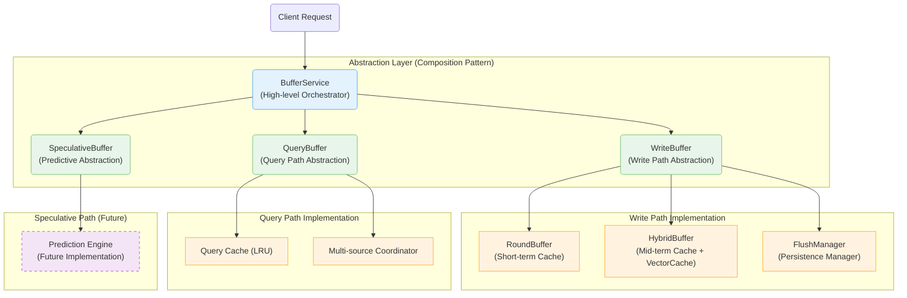
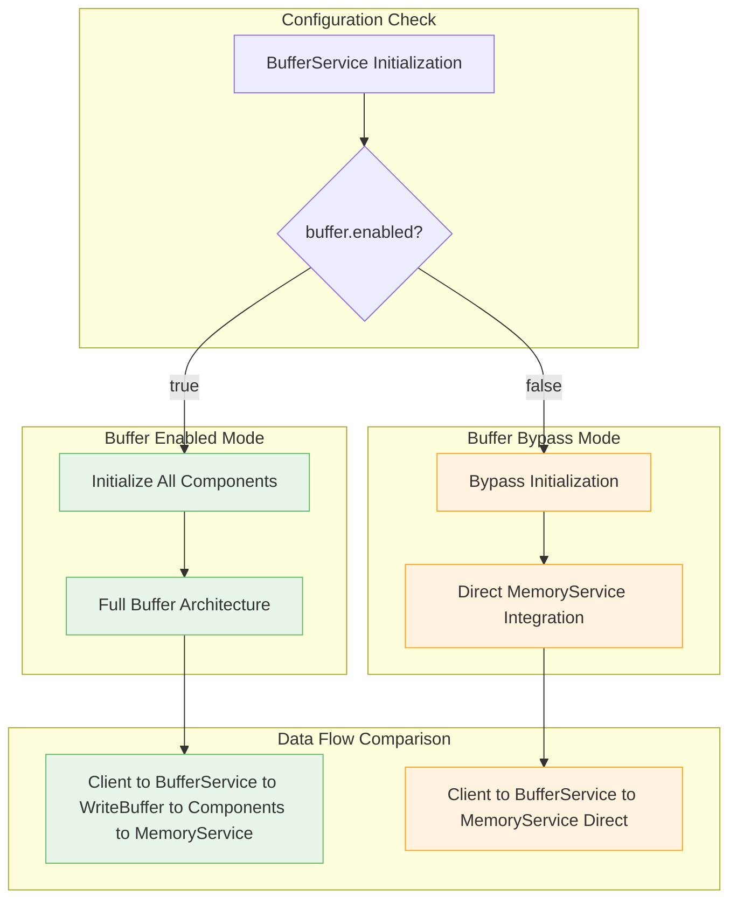

# MemFuse Buffer Architecture Overview

## Introduction

The MemFuse Buffer system provides intelligent message buffering and batch processing capabilities for high-throughput conversation management, inspired by modern computer caching architectures. This document provides an overview of the complete buffer architecture, including the bypass mechanism and component interactions.

## 🎯 Key Features

- ✅ **Complete bypass capability**: Optional buffer functionality via configuration
- ✅ **Computer caching inspired**: Based on Write Combining Buffer, Speculative Prefetch, and Multi-level Cache principles
- ✅ **Proper abstraction layers**: Composition pattern with three specialized buffer types
- ✅ **Memory Layer integration**: Maintains M0/M1/M2 processing in all modes
- ✅ **Flexible deployment**: Supports both high-throughput and low-latency scenarios

## Architecture Overview

### Core Components

The MemFuse Buffer system implements a **proper abstraction layer architecture** using composition pattern:



### Computer Caching Correspondence

| MemFuse Component | Computer Caching Analog | Primary Function | Status |
|-------------------|-------------------------|------------------|--------|
| **WriteBuffer** | Write Combining Buffer | Write path abstraction managing batch processing | ✅ Fully Integrated |
| **QueryBuffer** | Multi-level Cache Hierarchy | Query path abstraction with multi-source coordination | ✅ Fully Integrated |
| **SpeculativeBuffer** | Speculative Prefetch Buffer | Predictive prefetching abstraction | ✅ Interface Ready |

## Buffer Bypass Architecture

### Configuration Control

The buffer system includes a **complete bypass mechanism** controlled by a single parameter:

```yaml
buffer:
  enabled: true   # true = full buffer functionality, false = complete bypass
```

### Bypass Logic Flow



### Key Insight: Memory Layer Always Active

**Critical**: Whether buffer is enabled or disabled, the Memory Layer (M0/M1/M2) parallel processing **always remains active**:

- ✅ **Buffer Enabled**: Client → BufferService → WriteBuffer → MemoryService → M0/M1/M2
- ✅ **Buffer Bypass**: Client → BufferService → MemoryService (Direct) → M0/M1/M2

## Performance Characteristics

| Aspect | Buffer Enabled | Buffer Bypass |
|--------|---------------|---------------|
| **Memory Usage** | ~8MB (buffers + cache) | ~1MB (minimal overhead) |
| **Latency** | Optimized for throughput | Optimized for low latency |
| **Throughput** | High (batch processing) | Medium (direct processing) |
| **Use Cases** | Production, high-volume | Development, low-latency |

## Documentation Structure

This buffer architecture is documented across multiple specialized files:

### Core Documentation
- **[overview.md](overview.md)** - This file: Architecture overview and bypass mechanism
- **[write_buffer.md](write_buffer.md)** - WriteBuffer abstraction and write path components
- **[query_buffer.md](query_buffer.md)** - QueryBuffer abstraction and multi-level caching
- **[speculative_buffer.md](speculative_buffer.md)** - SpeculativeBuffer design and future roadmap

### Implementation Details
- **[configuration.md](configuration.md)** - Complete configuration guide and scenarios
- **[performance.md](performance.md)** - Performance analysis, monitoring, and optimization
- **[data_flow.md](data_flow.md)** - Detailed data flow patterns and sequence diagrams (planned)

### Advanced Topics
- **[bypass_mechanism.md](bypass_mechanism.md)** - Detailed bypass functionality and verification
- **[computer_caching.md](computer_caching.md)** - Computer caching principles and correspondence (covered in component docs)
- **[integration.md](integration.md)** - Service integration patterns and API compatibility (planned)

## Quick Start

### Basic Usage

```python
# Initialize BufferService (automatically detects configuration)
buffer_service = BufferService(memory_service, user_id, config)

# Add messages (works in both enabled and bypass modes)
result = await buffer_service.add_batch(message_batch_list, session_id)

# Query data (works in both enabled and bypass modes)
results = await buffer_service.query("search text", top_k=10)
```

### Configuration Examples

**Production (High Throughput)**:
```yaml
buffer:
  enabled: true
  round_buffer:
    max_tokens: 800
    max_size: 5
  hybrid_buffer:
    max_size: 5
```

**Development (Low Latency)**:
```yaml
buffer:
  enabled: false  # Complete bypass
```

## Implementation Status

| Component | Status | Description |
|-----------|--------|-------------|
| **BufferService** | ✅ Complete | High-level orchestrator with bypass support |
| **WriteBuffer** | ✅ Complete | Write path abstraction layer |
| **QueryBuffer** | ✅ Complete | Query path abstraction layer |
| **SpeculativeBuffer** | ✅ Interface | Complete interface, future implementation |
| **Bypass Mechanism** | ✅ Verified | Comprehensive testing and verification |

## Next Steps

1. **Read [write_buffer.md](write_buffer.md)** for write path details
2. **Read [query_buffer.md](query_buffer.md)** for query optimization
3. **Read [configuration.md](configuration.md)** for deployment guidance
4. **Read [bypass_mechanism.md](bypass_mechanism.md)** for bypass details

## Related Documentation

- **[Memory Layer Architecture](../memory_layer.md)** - M0/M1/M2 parallel processing
- **[PgAI Integration](../pgai/overview.md)** - Database integration patterns
- **[Service Architecture](../services.md)** - Overall service design patterns
