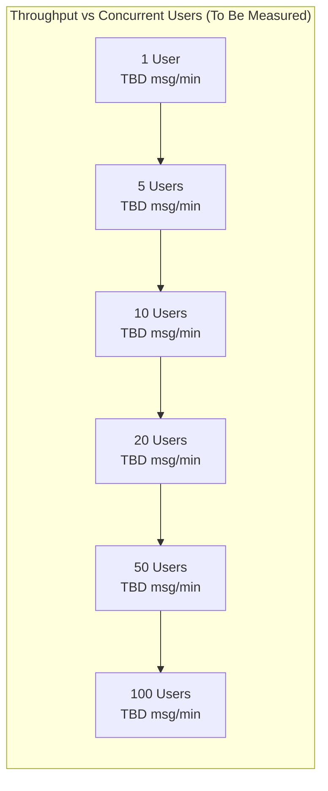
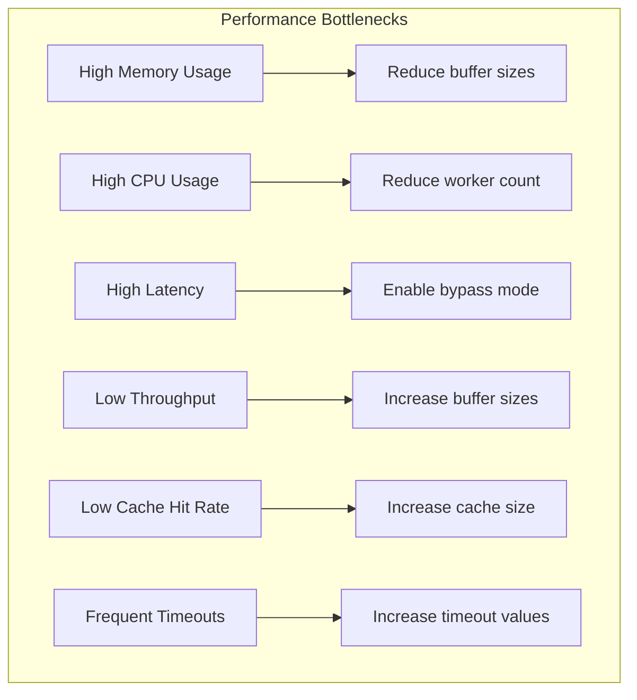
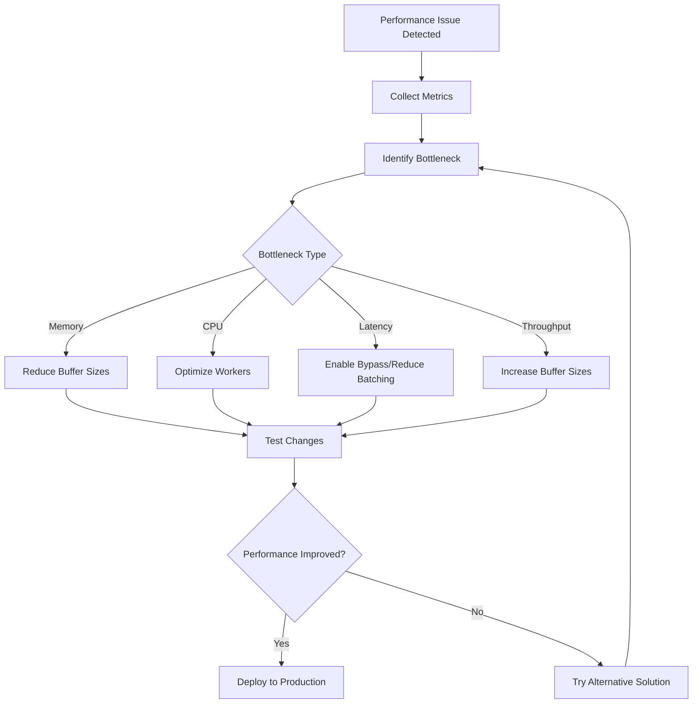

# Buffer Performance Analysis and Monitoring

## Overview

This document provides comprehensive performance analysis, monitoring guidance, and optimization strategies for the MemFuse Buffer system. It covers performance testing plans, tuning guidelines, monitoring setup, and troubleshooting procedures.

## Performance Testing Plan

### Planned Load Testing Scenarios

#### High-Throughput Scenario
**Configuration**: Production high-throughput settings
```yaml
buffer:
  enabled: true
  round_buffer:
    max_tokens: 1200
    max_size: 8
  hybrid_buffer:
    max_size: 8
  performance:
    max_flush_workers: 5
```

**Metrics to Measure**:
| Metric | Target Range | Description |
|--------|--------------|-------------|
| **Peak Throughput** | TBD | Maximum sustained message processing rate |
| **Average Latency** | TBD | End-to-end message processing time |
| **Memory Usage** | TBD | Peak memory consumption |
| **CPU Usage** | TBD | Average CPU utilization |
| **Cache Hit Rate** | TBD | Query cache effectiveness |

#### Low-Latency Scenario
**Configuration**: Bypass mode for minimal latency
```yaml
buffer:
  enabled: false  # Complete bypass
```

**Metrics to Measure**:
| Metric | Target Range | Description |
|--------|--------------|-------------|
| **Average Latency** | TBD | Direct processing latency |
| **Memory Usage** | TBD | Minimal memory footprint |
| **CPU Usage** | TBD | Reduced CPU overhead |
| **Throughput** | TBD | Consistent throughput in bypass mode |

#### Balanced Production Scenario
**Configuration**: Recommended balanced settings
```yaml
buffer:
  enabled: true
  round_buffer:
    max_tokens: 800
    max_size: 5
  hybrid_buffer:
    max_size: 5
  performance:
    max_flush_workers: 3
```

**Metrics to Measure**:
| Metric | Target Range | Description |
|--------|--------------|-------------|
| **Throughput** | TBD | Balanced processing rate |
| **Average Latency** | TBD | Good balance of speed and efficiency |
| **Memory Usage** | TBD | Moderate memory consumption |
| **CPU Usage** | TBD | Efficient resource utilization |
| **Cache Hit Rate** | TBD | Good cache performance |

### Planned Latency Analysis

#### Component-Level Latency Testing Plan

```mermaid
graph TB
    subgraph "Write Path Latency (To Be Measured)"
        A[Message Input] --> B[RoundBuffer: TBD]
        B --> C[Token Calculation: TBD]
        C --> D[Threshold Check: TBD]
        D --> E[HybridBuffer Transfer: TBD]
        E --> F[Embedding Calculation: TBD]
        F --> G[FlushManager: TBD]
        G --> H[MemoryService: TBD]
    end

    subgraph "Query Path Latency (To Be Measured)"
        I[Query Input] --> J[Cache Check: TBD]
        J --> K[Multi-source Query: TBD]
        K --> L[Result Aggregation: TBD]
        L --> M[Response: TBD]
    end
```



#### Planned Latency Distribution Testing

| Percentile | Write Path (Buffer) | Write Path (Bypass) | Query (Cached) | Query (Cold) |
|------------|-------------------|-------------------|----------------|--------------|
| **P50** | TBD | TBD | TBD | TBD |
| **P90** | TBD | TBD | TBD | TBD |
| **P95** | TBD | TBD | TBD | TBD |
| **P99** | TBD | TBD | TBD | TBD |

### Planned Throughput Testing

#### Concurrent User Performance Testing Plan



#### Planned Memory Scaling Testing

| Concurrent Users | Buffer Enabled | Buffer Bypass | Expected Difference |
|------------------|---------------|---------------|-------------------|
| **1** | TBD | TBD | To be measured |
| **5** | TBD | TBD | To be measured |
| **10** | TBD | TBD | To be measured |
| **20** | TBD | TBD | To be measured |
| **50** | TBD | TBD | To be measured |

### Future Testing and Data Collection Plan

#### Testing Methodology
1. **Baseline Testing**: Establish performance baselines for both buffer enabled and bypass modes
2. **Load Testing**: Test with varying concurrent user loads (1, 5, 10, 20, 50, 100 users)
3. **Stress Testing**: Identify breaking points and degradation patterns
4. **Endurance Testing**: Long-running tests to identify memory leaks and performance drift
5. **Comparative Testing**: Direct comparison between buffer modes and bypass mode

#### Data Collection Plan

**Phase 1: Basic Performance Metrics**
- [ ] Message processing throughput (messages/minute)
- [ ] End-to-end latency (P50, P90, P95, P99)
- [ ] Memory usage patterns (peak, average, growth rate)
- [ ] CPU utilization (average, peak)
- [ ] Cache hit rates for query operations

**Phase 2: Component-Level Analysis**
- [ ] RoundBuffer token calculation latency
- [ ] HybridBuffer processing time
- [ ] FlushManager operation latency
- [ ] Query cache performance metrics
- [ ] Multi-source coordinator efficiency

**Phase 3: Scalability Testing**
- [ ] Concurrent user performance curves
- [ ] Memory scaling patterns
- [ ] Throughput degradation points
- [ ] Resource utilization under load
- [ ] Error rates at various load levels

**Phase 4: Optimization Validation**
- [ ] Configuration tuning impact measurements
- [ ] Bypass mode vs buffer mode comparisons
- [ ] Resource allocation optimization results
- [ ] Bottleneck identification and resolution

#### Expected Deliverables

**Performance Baseline Report**:
- Documented performance characteristics for all major configurations
- Recommended configuration guidelines for different use cases
- Performance regression test suite

**Optimization Guidelines**:
- Validated configuration recommendations
- Resource allocation best practices
- Troubleshooting playbooks with actual performance data

**Monitoring Implementation**:
- Calibrated alert thresholds based on actual performance data
- Performance dashboard templates
- Automated performance regression detection

## Performance Tuning Guide

### Configuration Optimization

#### Memory-Constrained Environments

**Problem**: Limited memory availability
**Solution**: Reduce buffer sizes and cache capacity

```yaml
buffer:
  enabled: true
  round_buffer:
    max_tokens: 400        # Reduced from 800
    max_size: 3            # Reduced from 5
  hybrid_buffer:
    max_size: 3            # Reduced from 5
  query:
    cache_size: 50         # Reduced from 100
    max_size: 10           # Reduced from 15
  performance:
    max_flush_workers: 2   # Reduced from 3
```

**Expected Impact** (To be verified through testing):
- Memory usage: Expected reduction
- Latency: May increase slightly
- Throughput: May decrease

#### High-Throughput Optimization

**Problem**: Need maximum throughput
**Solution**: Increase buffer sizes and worker counts

```yaml
buffer:
  enabled: true
  round_buffer:
    max_tokens: 1500       # Increased from 800
    max_size: 10           # Increased from 5
  hybrid_buffer:
    max_size: 10           # Increased from 5
  query:
    cache_size: 300        # Increased from 100
  performance:
    max_flush_workers: 6   # Increased from 3
    flush_strategy: "size_based"  # Optimize for throughput
```

**Expected Impact** (To be verified through testing):
- Throughput: Expected increase
- Memory usage: Expected increase
- Latency: May increase

#### Low-Latency Optimization

**Problem**: Minimize response time
**Solution**: Use bypass mode or reduce buffer sizes

```yaml
# Option 1: Complete bypass
buffer:
  enabled: false

# Option 2: Minimal buffering
buffer:
  enabled: true
  round_buffer:
    max_tokens: 200        # Very small batches
    max_size: 2
  hybrid_buffer:
    max_size: 2
  performance:
    flush_strategy: "time_based"  # Optimize for latency
```

**Expected Impact** (To be verified through testing):
- Latency: Expected significant reduction (bypass) or moderate reduction (minimal)
- Throughput: May decrease (bypass) or slight decrease (minimal)
- Memory usage: Expected significant reduction (bypass) or moderate reduction (minimal)

### Resource Allocation

#### CPU Optimization

**Worker Thread Allocation**:
```yaml
performance:
  max_flush_workers: <CPU_CORES>  # Match CPU cores
  enable_async_processing: true   # Enable async operations
```

**Guidelines**:
- **2-4 cores**: max_flush_workers = 2-3
- **4-8 cores**: max_flush_workers = 3-5
- **8+ cores**: max_flush_workers = 5-8

#### Memory Optimization

**Buffer Size Calculation Framework**:
```python
# Memory usage estimation formula (to be calibrated with actual data)
total_memory = (
    round_buffer_size * avg_message_size * max_size +
    hybrid_buffer_size * (avg_message_size + embedding_size) * max_size +
    query_cache_size * avg_result_size
)

# Example calculation framework (values TBD through testing)
# round_buffer: max_size rounds * avg_message_size * buffer_count
# hybrid_buffer: max_size rounds * (avg_message_size + embedding_size) * buffer_count
# query_cache: cache_size queries * avg_result_size
# Total: base_memory + overhead (to be measured)
```

### Bottleneck Identification

#### Common Bottlenecks



#### Bottleneck Detection Framework

**Memory Bottleneck Indicators** (Thresholds to be determined):
- Memory usage exceeding available capacity
- Frequent garbage collection patterns
- Out of memory errors

**CPU Bottleneck Indicators** (Thresholds to be determined):
- Sustained high CPU usage
- High context switching rates
- Worker queue backlog patterns

**I/O Bottleneck Indicators** (Thresholds to be determined):
- High flush operation latency
- Database connection timeouts
- Storage write delays

## Monitoring and Alerting

### Key Performance Indicators

#### System-Level KPIs

```python
# Core Performance Metrics Framework (Values to be determined through testing)
system_kpis = {
    "throughput": {
        "metric": "messages_per_minute",
        "target": "TBD",
        "warning": "TBD",
        "critical": "TBD"
    },
    "latency": {
        "metric": "p95_latency_ms",
        "target": "TBD",
        "warning": "TBD",
        "critical": "TBD"
    },
    "memory_usage": {
        "metric": "memory_mb",
        "target": "TBD",
        "warning": "TBD",
        "critical": "TBD"
    },
    "error_rate": {
        "metric": "error_percentage",
        "target": "TBD",
        "warning": "TBD",
        "critical": "TBD"
    }
}
```

#### Component-Level KPIs

**WriteBuffer KPIs** (Thresholds to be determined):
```python
write_buffer_kpis = {
    "transfer_rate": {
        "target": "TBD",
        "warning": "TBD",
        "critical": "TBD"
    },
    "buffer_utilization": {
        "target": "TBD",
        "warning": "TBD",
        "critical": "TBD"
    },
    "flush_success_rate": {
        "target": "TBD",
        "warning": "TBD",
        "critical": "TBD"
    }
}
```

**QueryBuffer KPIs** (Thresholds to be determined):
```python
query_buffer_kpis = {
    "cache_hit_rate": {
        "target": "TBD",
        "warning": "TBD",
        "critical": "TBD"
    },
    "query_latency": {
        "target": "TBD",
        "warning": "TBD",
        "critical": "TBD"
    },
    "cache_memory": {
        "target": "TBD",
        "warning": "TBD",
        "critical": "TBD"
    }
}
```

### Monitoring Setup

#### Metrics Collection

```python
# Example monitoring configuration
monitoring_config = {
    "collection_interval": 30,  # seconds
    "retention_period": 7,      # days
    "aggregation_window": 300,  # 5 minutes
    "metrics": [
        "buffer.throughput",
        "buffer.latency.p50",
        "buffer.latency.p95",
        "buffer.memory_usage",
        "buffer.cache_hit_rate",
        "buffer.error_rate",
        "buffer.worker_utilization"
    ]
}
```

#### Health Checks

```python
# Health check endpoints
health_checks = {
    "/health/buffer": {
        "checks": [
            "buffer_service_status",
            "component_health",
            "memory_usage_check",
            "worker_pool_status"
        ],
        "timeout": 5000  # ms
    },
    "/health/performance": {
        "checks": [
            "latency_check",
            "throughput_check",
            "error_rate_check"
        ],
        "timeout": 10000  # ms
    }
}
```

### Alert Configuration

#### Alert Rules

```yaml
# Prometheus-style alert rules (Thresholds to be determined through testing)
alerts:
  - alert: HighBufferLatency
    expr: buffer_latency_p95 > [TBD_THRESHOLD]
    for: 5m
    labels:
      severity: warning
    annotations:
      summary: "Buffer latency is high"

  - alert: LowCacheHitRate
    expr: buffer_cache_hit_rate < [TBD_THRESHOLD]
    for: 10m
    labels:
      severity: warning
    annotations:
      summary: "Cache hit rate is below threshold"

  - alert: HighMemoryUsage
    expr: buffer_memory_usage_mb > [TBD_THRESHOLD]
    for: 2m
    labels:
      severity: critical
    annotations:
      summary: "Buffer memory usage is critical"
```

#### Notification Channels

```yaml
notification_channels:
  - name: "buffer-alerts"
    type: "slack"
    webhook_url: "${SLACK_WEBHOOK_URL}"
    channel: "#memfuse-alerts"

  - name: "critical-alerts"
    type: "email"
    recipients: ["ops@company.com"]

  - name: "performance-alerts"
    type: "pagerduty"
    service_key: "${PAGERDUTY_SERVICE_KEY}"
```

## Troubleshooting Guide

### Common Performance Issues

#### Issue 1: High Memory Usage

**Symptoms** (Specific thresholds to be determined):
- Memory usage exceeding expected limits
- Frequent garbage collection
- Out of memory errors

**Diagnosis**:
```python
# Check buffer statistics
stats = buffer_service.get_stats()
print(f"Round buffer size: {stats['round_buffer']['current_size']}")
print(f"Hybrid buffer size: {stats['hybrid_buffer']['current_size']}")
print(f"Query cache size: {stats['query_buffer']['cache_size']}")
```

**Solutions**:
1. **Reduce buffer sizes**:
   ```yaml
   round_buffer:
     max_size: 3  # Reduce from 5
   hybrid_buffer:
     max_size: 3  # Reduce from 5
   ```

2. **Clear caches periodically**:
   ```python
   # Manual cache clearing
   buffer_service.get_query_buffer().clear_cache()
   ```

3. **Enable bypass mode**:
   ```yaml
   buffer:
     enabled: false
   ```

#### Issue 2: High Latency

**Symptoms** (Specific thresholds to be determined):
- P95 latency exceeding acceptable limits
- User complaints about slow responses
- Timeout errors

**Diagnosis**:
```python
# Analyze latency breakdown
stats = buffer_service.get_stats()
print(f"Average write latency: {stats['performance']['avg_write_latency']}")
print(f"Average query latency: {stats['performance']['avg_query_latency']}")
print(f"Cache hit rate: {stats['query_buffer']['hit_rate']}")
```

**Solutions**:
1. **Enable bypass mode for low latency**:
   ```yaml
   buffer:
     enabled: false
   ```

2. **Reduce batch sizes**:
   ```yaml
   round_buffer:
     max_tokens: 400  # Reduce from 800
   ```

3. **Optimize cache settings**:
   ```yaml
   query:
     cache_size: 200  # Increase cache size
     similarity_threshold: 0.90  # Lower threshold for more hits
   ```

#### Issue 3: Low Throughput

**Symptoms** (Specific thresholds to be determined):
- Messages/minute below expected performance
- Worker pool underutilized
- Batch processing inefficient

**Diagnosis**:
```python
# Check throughput metrics
stats = buffer_service.get_stats()
print(f"Transfer rate: {stats['write_buffer']['transfer_rate']}")
print(f"Worker utilization: {stats['performance']['worker_utilization']}")
print(f"Batch efficiency: {stats['write_buffer']['avg_batch_size']}")
```

**Solutions**:
1. **Increase buffer sizes**:
   ```yaml
   round_buffer:
     max_tokens: 1200  # Increase from 800
     max_size: 8       # Increase from 5
   ```

2. **Add more workers**:
   ```yaml
   performance:
     max_flush_workers: 5  # Increase from 3
   ```

3. **Optimize flush strategy**:
   ```yaml
   performance:
     flush_strategy: "size_based"  # Optimize for throughput
   ```

### Diagnostic Tools

#### Performance Profiling

```python
# Built-in performance profiler
from memfuse_core.buffer.profiler import BufferProfiler

profiler = BufferProfiler(buffer_service)
profile_data = await profiler.profile_operations(duration=60)  # 1 minute

print("Performance Profile:")
print(f"Write operations: {profile_data['write_ops']}")
print(f"Query operations: {profile_data['query_ops']}")
print(f"Memory peaks: {profile_data['memory_peaks']}")
print(f"Bottlenecks: {profile_data['bottlenecks']}")
```

#### Memory Analysis

```python
# Memory usage analyzer
from memfuse_core.buffer.analyzer import MemoryAnalyzer

analyzer = MemoryAnalyzer(buffer_service)
memory_report = analyzer.analyze_memory_usage()

print("Memory Analysis:")
print(f"Component breakdown: {memory_report['components']}")
print(f"Memory leaks: {memory_report['potential_leaks']}")
print(f"Optimization suggestions: {memory_report['suggestions']}")
```

#### Load Testing

```python
# Built-in load testing utility
from memfuse_core.buffer.load_test import BufferLoadTester

load_tester = BufferLoadTester(buffer_service)
results = await load_tester.run_load_test(
    concurrent_users=10,
    duration=300,  # 5 minutes
    message_rate=100  # messages per minute per user
)

print("Load Test Results:")
print(f"Peak throughput: {results['peak_throughput']}")
print(f"Average latency: {results['avg_latency']}")
print(f"Error rate: {results['error_rate']}")
```

### Resolution Strategies

#### Performance Optimization Workflow



#### Escalation Procedures

1. **Level 1**: Automatic configuration adjustment
2. **Level 2**: Manual configuration tuning
3. **Level 3**: Architecture review and optimization
4. **Level 4**: Code-level performance improvements

## Best Practices

### Performance Monitoring

1. **Continuous Monitoring**: Set up automated monitoring for all KPIs
2. **Baseline Establishment**: Establish performance baselines for comparison
3. **Regular Reviews**: Conduct weekly performance reviews
4. **Proactive Alerting**: Set up alerts before issues become critical

### Configuration Management

1. **Environment-Specific Configs**: Use different configurations for different environments
2. **Gradual Changes**: Make incremental configuration changes
3. **A/B Testing**: Test configuration changes with subset of traffic
4. **Rollback Plans**: Always have rollback procedures ready

### Capacity Planning

1. **Growth Projections**: Plan for 2x current load capacity
2. **Resource Monitoring**: Monitor resource utilization trends
3. **Load Testing**: Regular load testing with projected traffic
4. **Scaling Strategies**: Define clear scaling trigger points

## Related Documentation

- **[Overview](overview.md)** - Buffer system overview
- **[Configuration](configuration.md)** - Complete configuration guide
- **[Write Buffer](write_buffer.md)** - Write path architecture
- **[Query Buffer](query_buffer.md)** - Query path architecture
- **[Bypass Mechanism](bypass_mechanism.md)** - Bypass functionality details
