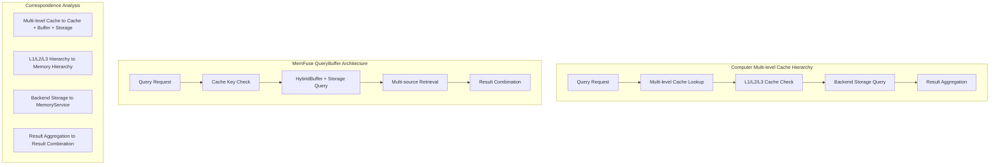
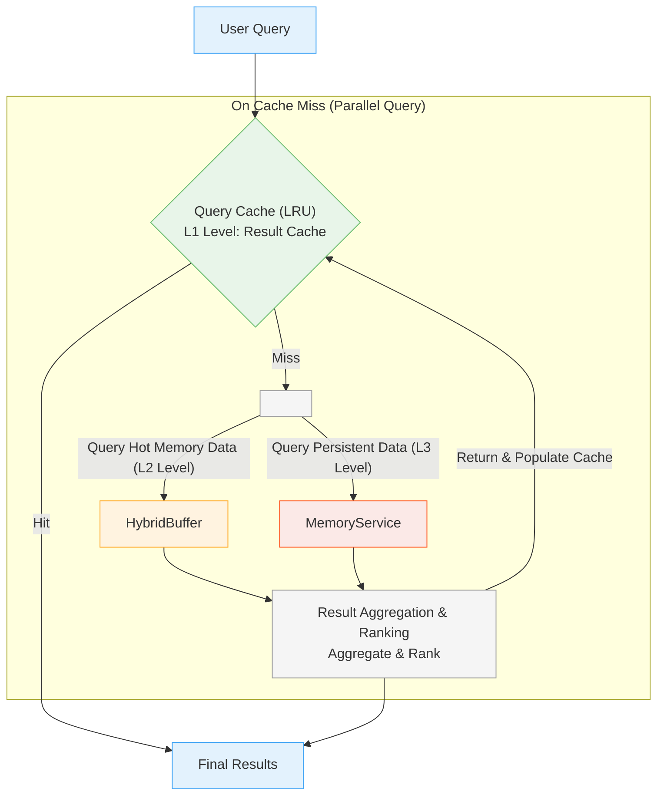
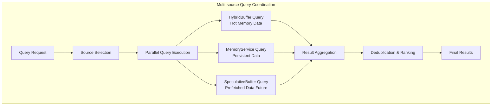
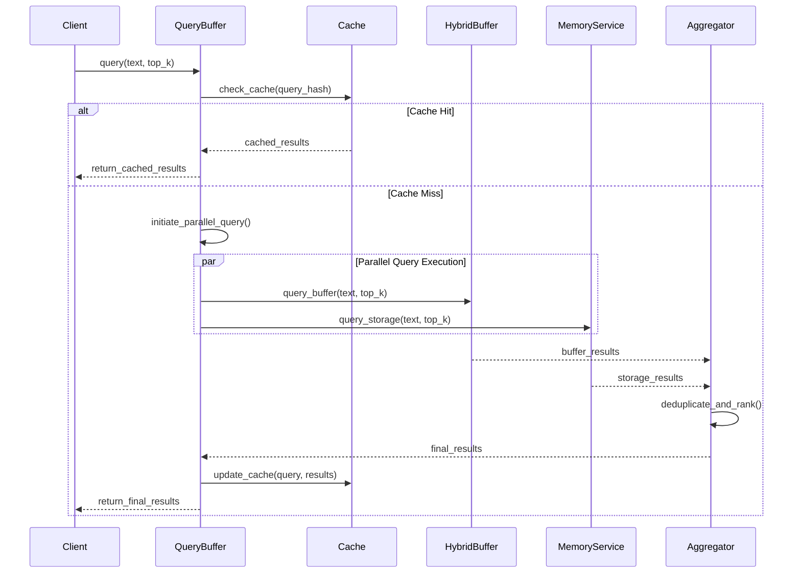
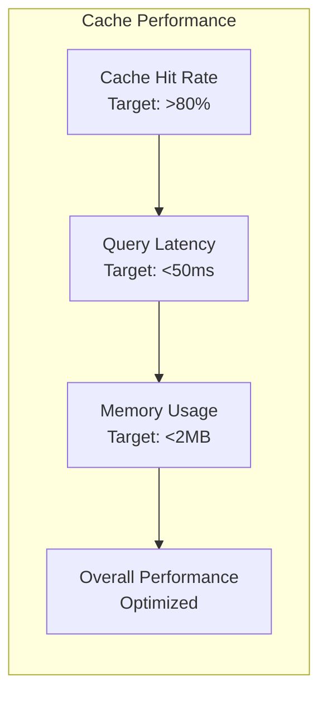
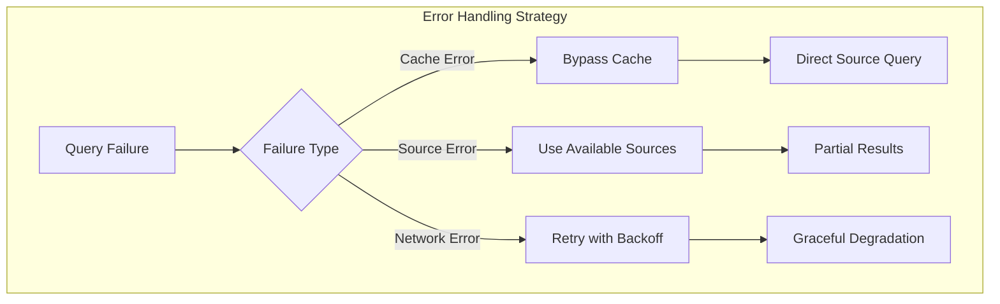

# QueryBuffer Architecture

## Overview

The QueryBuffer implements the **Multi-level Cache Hierarchy** pattern from computer caching architectures, serving as the query path abstraction layer in the MemFuse Buffer system. It provides intelligent caching, multi-source coordination, and result aggregation for optimal query performance.

## Architecture Design

### Multi-level Cache Hierarchy Correspondence



## Core Architecture

### QueryBuffer Workflow



## Core Components

### 1. Query Cache (LRU)

**Purpose**: L1-level cache for previously computed query results

**Key Features**:
- **LRU Eviction**: Least Recently Used eviction policy
- **Query Similarity**: Intelligent query matching and result reuse
- **Configurable Size**: Adjustable cache capacity
- **TTL Support**: Time-to-live for cache entries

```python
# Cache Configuration
query_cache_config = {
    "max_size": 100,        # Maximum cached queries
    "cache_ttl": 300,       # Time-to-live in seconds
    "similarity_threshold": 0.95  # Query similarity threshold
}
```

#### Internal Implementation Details

**LRU Cache Implementation**:
```python
class LRUQueryCache:
    """Advanced LRU cache with TTL and similarity matching."""

    def __init__(self, max_size: int, ttl: int, similarity_threshold: float):
        self.max_size = max_size
        self.ttl = ttl
        self.similarity_threshold = similarity_threshold
        self.cache = OrderedDict()
        self.access_times = {}
        self.query_embeddings = {}
        self.cache_lock = asyncio.Lock()
        self.embedding_service = EmbeddingService()

    async def get(self, query: str) -> Optional[List[Dict]]:
        """Get cached results with similarity matching."""
        async with self.cache_lock:
            # First try exact match
            if query in self.cache:
                if self._is_valid(query):
                    self._update_access_time(query)
                    return self.cache[query]
                else:
                    await self._remove_expired(query)

            # Try similarity matching
            similar_query = await self._find_similar_query(query)
            if similar_query:
                if self._is_valid(similar_query):
                    self._update_access_time(similar_query)
                    return self.cache[similar_query]
                else:
                    await self._remove_expired(similar_query)

            return None

    async def put(self, query: str, results: List[Dict]) -> None:
        """Store results in cache with LRU eviction."""
        async with self.cache_lock:
            # Remove if already exists
            if query in self.cache:
                del self.cache[query]

            # Add to cache
            self.cache[query] = results
            self.access_times[query] = time.time()

            # Store query embedding for similarity matching
            self.query_embeddings[query] = await self.embedding_service.get_embedding(query)

            # Move to end (most recently used)
            self.cache.move_to_end(query)

            # Evict if necessary
            while len(self.cache) > self.max_size:
                oldest_query = next(iter(self.cache))
                await self._remove_expired(oldest_query)

    async def _find_similar_query(self, query: str) -> Optional[str]:
        """Find similar cached query using embedding similarity."""
        if not self.query_embeddings:
            return None

        query_embedding = await self.embedding_service.get_embedding(query)
        best_similarity = 0
        best_query = None

        for cached_query, cached_embedding in self.query_embeddings.items():
            similarity = self._calculate_similarity(query_embedding, cached_embedding)
            if similarity > best_similarity and similarity >= self.similarity_threshold:
                best_similarity = similarity
                best_query = cached_query

        return best_query

    def _calculate_similarity(self, emb1: List[float], emb2: List[float]) -> float:
        """Calculate cosine similarity between embeddings."""
        import numpy as np
        vec1, vec2 = np.array(emb1), np.array(emb2)
        dot_product = np.dot(vec1, vec2)
        norms = np.linalg.norm(vec1) * np.linalg.norm(vec2)
        return dot_product / norms if norms != 0 else 0.0

    def _is_valid(self, query: str) -> bool:
        """Check if cached entry is still valid (not expired)."""
        if query not in self.access_times:
            return False
        return time.time() - self.access_times[query] < self.ttl

    def _update_access_time(self, query: str) -> None:
        """Update access time and move to end of LRU order."""
        self.access_times[query] = time.time()
        self.cache.move_to_end(query)

    async def _remove_expired(self, query: str) -> None:
        """Remove expired entry from cache."""
        if query in self.cache:
            del self.cache[query]
        if query in self.access_times:
            del self.access_times[query]
        if query in self.query_embeddings:
            del self.query_embeddings[query]

    def get_stats(self) -> Dict[str, Any]:
        """Get cache statistics."""
        total_queries = len(self.cache)
        expired_count = sum(
            1 for query in self.cache.keys()
            if not self._is_valid(query)
        )

        return {
            "total_entries": total_queries,
            "valid_entries": total_queries - expired_count,
            "expired_entries": expired_count,
            "cache_utilization": total_queries / self.max_size,
            "avg_entry_age": self._calculate_avg_age()
        }

    def _calculate_avg_age(self) -> float:
        """Calculate average age of cache entries."""
        if not self.access_times:
            return 0.0

        current_time = time.time()
        total_age = sum(current_time - access_time for access_time in self.access_times.values())
        return total_age / len(self.access_times)
```

### 2. Multi-source Coordinator

**Purpose**: Orchestrates parallel queries across multiple data sources

**Data Sources**:
1. **HybridBuffer**: Recent data in memory (L2-level)
2. **MemoryService**: Persistent storage access (L3-level)
3. **SpeculativeBuffer**: Prefetched data (Future implementation)

#### Internal Implementation Details

**Multi-source Coordination Implementation**:
```python
class MultiSourceCoordinator:
    """Coordinates queries across multiple data sources."""

    def __init__(self, hybrid_buffer, memory_service, speculative_buffer=None):
        self.hybrid_buffer = hybrid_buffer
        self.memory_service = memory_service
        self.speculative_buffer = speculative_buffer
        self.source_weights = {
            'hybrid_buffer': 0.4,
            'memory_service': 0.6,
            'speculative_buffer': 0.2
        }
        self.source_stats = {
            'hybrid_buffer': {'queries': 0, 'avg_latency': 0, 'errors': 0},
            'memory_service': {'queries': 0, 'avg_latency': 0, 'errors': 0},
            'speculative_buffer': {'queries': 0, 'avg_latency': 0, 'errors': 0}
        }

    async def query_all_sources(self, query: str, top_k: int) -> Dict[str, List[Dict]]:
        """Query all available sources in parallel."""
        tasks = {}

        # Create query tasks for each source
        if self.hybrid_buffer:
            tasks['hybrid_buffer'] = asyncio.create_task(
                self._query_hybrid_buffer(query, top_k)
            )

        if self.memory_service:
            tasks['memory_service'] = asyncio.create_task(
                self._query_memory_service(query, top_k)
            )

        if self.speculative_buffer:
            tasks['speculative_buffer'] = asyncio.create_task(
                self._query_speculative_buffer(query, top_k)
            )

        # Execute all queries in parallel
        results = {}
        for source, task in tasks.items():
            try:
                start_time = time.time()
                source_results = await task
                latency = time.time() - start_time

                results[source] = source_results
                self._update_source_stats(source, latency, success=True)

            except Exception as e:
                logger.warning(f"Query failed for source {source}: {e}")
                results[source] = []
                self._update_source_stats(source, 0, success=False)

        return results

    async def _query_hybrid_buffer(self, query: str, top_k: int) -> List[Dict]:
        """Query the hybrid buffer for recent data."""
        if not hasattr(self.hybrid_buffer, 'query_buffer'):
            return []

        return await self.hybrid_buffer.query_buffer(query, top_k)

    async def _query_memory_service(self, query: str, top_k: int) -> List[Dict]:
        """Query the memory service for persistent data."""
        result = await self.memory_service.query(query=query, top_k=top_k)

        # Convert MemoryService result format to standard format
        if isinstance(result, dict) and 'data' in result:
            return result['data']
        return result if isinstance(result, list) else []

    async def _query_speculative_buffer(self, query: str, top_k: int) -> List[Dict]:
        """Query the speculative buffer for prefetched data."""
        if not self.speculative_buffer:
            return []

        return await self.speculative_buffer.get_prefetched(query)

    def _update_source_stats(self, source: str, latency: float, success: bool):
        """Update statistics for a data source."""
        stats = self.source_stats[source]
        stats['queries'] += 1

        if success:
            # Update average latency
            current_avg = stats['avg_latency']
            query_count = stats['queries']
            stats['avg_latency'] = (current_avg * (query_count - 1) + latency) / query_count
        else:
            stats['errors'] += 1

    def get_source_performance(self) -> Dict[str, Dict]:
        """Get performance statistics for all sources."""
        performance = {}

        for source, stats in self.source_stats.items():
            total_queries = stats['queries']
            error_rate = stats['errors'] / total_queries if total_queries > 0 else 0

            performance[source] = {
                'total_queries': total_queries,
                'avg_latency_ms': stats['avg_latency'] * 1000,
                'error_rate': error_rate,
                'success_rate': 1 - error_rate,
                'weight': self.source_weights[source]
            }

        return performance

    def adjust_source_weights(self, performance_data: Dict[str, Dict]):
        """Dynamically adjust source weights based on performance."""
        for source, perf in performance_data.items():
            current_weight = self.source_weights[source]

            # Increase weight for high-performing sources
            if perf['success_rate'] > 0.95 and perf['avg_latency_ms'] < 100:
                self.source_weights[source] = min(1.0, current_weight * 1.1)

            # Decrease weight for poor-performing sources
            elif perf['success_rate'] < 0.8 or perf['avg_latency_ms'] > 500:
                self.source_weights[source] = max(0.1, current_weight * 0.9)

        # Normalize weights
        total_weight = sum(self.source_weights.values())
        for source in self.source_weights:
            self.source_weights[source] /= total_weight
```



### 3. Result Aggregator

**Purpose**: Combines and ranks results from multiple sources

**Key Features**:
- **Deduplication**: Removes duplicate results across sources
- **Relevance Scoring**: Combines scores from different sources
- **Result Ranking**: Sorts by relevance, timestamp, or custom criteria
- **Source Attribution**: Tracks result origins for debugging

#### Internal Implementation Details

**Result Aggregation Implementation**:
```python
class ResultAggregator:
    """Aggregates and ranks results from multiple sources."""

    def __init__(self, source_weights: Dict[str, float]):
        self.source_weights = source_weights
        self.deduplication_threshold = 0.95  # Similarity threshold for deduplication
        self.aggregation_stats = {
            'total_aggregations': 0,
            'avg_result_count': 0,
            'deduplication_rate': 0
        }

    async def aggregate_results(
        self,
        source_results: Dict[str, List[Dict]],
        top_k: int,
        sort_by: str = "score"
    ) -> List[Dict]:
        """Aggregate results from multiple sources."""
        start_time = time.time()

        # Step 1: Normalize and weight results
        normalized_results = []
        for source, results in source_results.items():
            weight = self.source_weights.get(source, 1.0)
            for result in results:
                normalized_result = self._normalize_result(result, source, weight)
                normalized_results.append(normalized_result)

        # Step 2: Deduplicate results
        deduplicated_results = await self._deduplicate_results(normalized_results)

        # Step 3: Rank results
        ranked_results = self._rank_results(deduplicated_results, sort_by)

        # Step 4: Return top_k results
        final_results = ranked_results[:top_k]

        # Update statistics
        self._update_aggregation_stats(
            len(normalized_results),
            len(deduplicated_results),
            len(final_results)
        )

        return final_results

    def _normalize_result(self, result: Dict, source: str, weight: float) -> Dict:
        """Normalize result format and apply source weighting."""
        normalized = {
            'content': result.get('content', ''),
            'score': result.get('score', 0.0) * weight,
            'timestamp': result.get('timestamp', time.time()),
            'metadata': result.get('metadata', {}),
            'source': source,
            'original_score': result.get('score', 0.0),
            'source_weight': weight
        }

        # Add unique identifier for deduplication
        content_hash = hashlib.md5(normalized['content'].encode()).hexdigest()
        normalized['content_hash'] = content_hash

        return normalized

    async def _deduplicate_results(self, results: List[Dict]) -> List[Dict]:
        """Remove duplicate results based on content similarity."""
        if not results:
            return []

        deduplicated = []
        seen_hashes = set()

        # First pass: exact hash matching
        for result in results:
            content_hash = result['content_hash']
            if content_hash not in seen_hashes:
                deduplicated.append(result)
                seen_hashes.add(content_hash)

        # Second pass: semantic similarity deduplication
        if len(deduplicated) > 1:
            deduplicated = await self._semantic_deduplication(deduplicated)

        return deduplicated

    async def _semantic_deduplication(self, results: List[Dict]) -> List[Dict]:
        """Remove semantically similar results."""
        if len(results) <= 1:
            return results

        # Get embeddings for all results
        contents = [result['content'] for result in results]
        embeddings = await self._get_embeddings_batch(contents)

        # Track which results to keep
        keep_indices = set(range(len(results)))

        # Compare each pair of results
        for i in range(len(results)):
            if i not in keep_indices:
                continue

            for j in range(i + 1, len(results)):
                if j not in keep_indices:
                    continue

                # Calculate similarity
                similarity = self._calculate_similarity(embeddings[i], embeddings[j])

                if similarity > self.deduplication_threshold:
                    # Keep the result with higher score
                    if results[i]['score'] >= results[j]['score']:
                        keep_indices.discard(j)
                    else:
                        keep_indices.discard(i)
                        break

        return [results[i] for i in sorted(keep_indices)]

    def _rank_results(self, results: List[Dict], sort_by: str) -> List[Dict]:
        """Rank results based on specified criteria."""
        if sort_by == "score":
            return sorted(results, key=lambda x: x['score'], reverse=True)
        elif sort_by == "timestamp":
            return sorted(results, key=lambda x: x['timestamp'], reverse=True)
        elif sort_by == "relevance":
            return self._rank_by_relevance(results)
        else:
            # Default to score-based ranking
            return sorted(results, key=lambda x: x['score'], reverse=True)

    def _rank_by_relevance(self, results: List[Dict]) -> List[Dict]:
        """Advanced relevance ranking combining multiple factors."""
        for result in results:
            # Combine score, recency, and source reliability
            score_factor = result['score']
            recency_factor = self._calculate_recency_factor(result['timestamp'])
            source_factor = self.source_weights.get(result['source'], 1.0)

            # Weighted combination
            relevance_score = (
                score_factor * 0.6 +
                recency_factor * 0.2 +
                source_factor * 0.2
            )

            result['relevance_score'] = relevance_score

        return sorted(results, key=lambda x: x['relevance_score'], reverse=True)

    def _calculate_recency_factor(self, timestamp: float) -> float:
        """Calculate recency factor (0-1) based on timestamp."""
        current_time = time.time()
        age_hours = (current_time - timestamp) / 3600

        # Exponential decay: newer content gets higher scores
        return math.exp(-age_hours / 24)  # Half-life of 24 hours

    async def _get_embeddings_batch(self, contents: List[str]) -> List[List[float]]:
        """Get embeddings for a batch of content."""
        # This would use the embedding service
        # Placeholder implementation
        return [[0.0] * 384 for _ in contents]  # Mock embeddings

    def _calculate_similarity(self, emb1: List[float], emb2: List[float]) -> float:
        """Calculate cosine similarity between embeddings."""
        import numpy as np
        vec1, vec2 = np.array(emb1), np.array(emb2)
        dot_product = np.dot(vec1, vec2)
        norms = np.linalg.norm(vec1) * np.linalg.norm(vec2)
        return dot_product / norms if norms != 0 else 0.0

    def _update_aggregation_stats(self, original_count: int, deduplicated_count: int, final_count: int):
        """Update aggregation statistics."""
        self.aggregation_stats['total_aggregations'] += 1

        # Update average result count
        current_avg = self.aggregation_stats['avg_result_count']
        total_agg = self.aggregation_stats['total_aggregations']
        new_avg = (current_avg * (total_agg - 1) + final_count) / total_agg
        self.aggregation_stats['avg_result_count'] = new_avg

        # Update deduplication rate
        if original_count > 0:
            dedup_rate = (original_count - deduplicated_count) / original_count
            current_dedup_rate = self.aggregation_stats['deduplication_rate']
            new_dedup_rate = (current_dedup_rate * (total_agg - 1) + dedup_rate) / total_agg
            self.aggregation_stats['deduplication_rate'] = new_dedup_rate

    def get_aggregation_stats(self) -> Dict[str, Any]:
        """Get aggregation statistics."""
        return self.aggregation_stats.copy()
```

## QueryBuffer Interface

### Primary Methods

```python
class QueryBuffer:
    # Core query operations
    async def query(
        self, 
        query_text: str, 
        top_k: int = 10,
        sort_by: str = "score",
        order: str = "desc",
        use_rerank: bool = True
    ) -> List[Dict[str, Any]]
    
    # Session-based queries
    async def query_by_session(
        self,
        session_id: str,
        limit: int = 10,
        sort_by: str = "timestamp",
        order: str = "desc"
    ) -> List[Dict[str, Any]]
    
    # Cache management
    def clear_cache(self) -> None
    def get_cache_stats(self) -> Dict[str, Any]
    
    # Statistics and monitoring
    def get_stats(self) -> Dict[str, Any]
```

### Usage Examples

```python
# Basic query with caching
results = await query_buffer.query(
    query_text="machine learning concepts",
    top_k=5,
    sort_by="score"
)

# Session-specific query
session_results = await query_buffer.query_by_session(
    session_id="user_123",
    limit=10,
    sort_by="timestamp"
)

# Cache statistics
cache_stats = query_buffer.get_cache_stats()
print(f"Cache hit rate: {cache_stats['hit_rate']:.2%}")
```

## Query Processing Pipeline

### Detailed Query Flow



## Performance Characteristics

### Query Performance Metrics

| Operation | Latency | Description |
|-----------|---------|-------------|
| **Cache Hit** | <10ms | Direct cache response |
| **Buffer Query** | <50ms | HybridBuffer search |
| **Storage Query** | <100ms | MemoryService search |
| **Cold Query** | <150ms | Multi-source aggregation |

### Cache Performance



## Configuration

### QueryBuffer Configuration

```yaml
query:
  max_size: 15                  # Maximum results per query
  cache_size: 100               # Query cache size
  default_sort_by: "score"      # Default sorting method
  default_order: "desc"         # Default sort order
  cache_ttl: 300               # Cache time-to-live (seconds)
  similarity_threshold: 0.95    # Query similarity threshold
```

### Sorting Options

**Available Sort Fields**:
- `score`: Relevance-based ranking (default)
- `timestamp`: Temporal ordering
- `session_id`: Session-based grouping

**Sort Orders**:
- `desc`: Descending order (default)
- `asc`: Ascending order

## Advanced Features

### Query Similarity Detection

```python
# Query similarity examples
queries = [
    "machine learning algorithms",
    "ML algorithms",              # Similar to first
    "deep learning networks",     # Different topic
]

# QueryBuffer automatically detects similar queries
# and reuses cached results when similarity > threshold
```

### Result Reranking

When `use_rerank=True`, QueryBuffer applies additional ranking:

1. **Semantic Reranking**: Uses advanced models for better relevance
2. **Temporal Boosting**: Recent results get slight score boost
3. **Source Weighting**: Different sources have different weights

### Multi-source Result Fusion

```python
# Result fusion strategy
fusion_weights = {
    "hybrid_buffer": 0.4,    # Recent data weight
    "memory_service": 0.6,   # Persistent data weight
    "speculative": 0.2       # Prefetched data weight (future)
}
```

## Monitoring & Metrics

### Key Performance Indicators

```python
# QueryBuffer Statistics
{
    "total_queries": 2500,
    "cache_hits": 2000,
    "cache_misses": 500,
    "hit_rate": 0.80,           # 80% cache hit rate
    "avg_query_latency": 45.2,  # ms
    "avg_cache_latency": 8.5,   # ms
    "avg_cold_latency": 125.3,  # ms
    "source_distribution": {
        "cache": 0.80,
        "hybrid_buffer": 0.15,
        "memory_service": 0.05
    },
    "memory_usage": 1.8         # MB
}
```

### Health Monitoring

| Metric | Healthy Range | Alert Threshold |
|--------|---------------|-----------------|
| Cache Hit Rate | >70% | <50% |
| Query Latency | <100ms | >500ms |
| Memory Usage | <5MB | >10MB |
| Error Rate | <2% | >10% |

## Error Handling

### Fault Tolerance



### Recovery Mechanisms

1. **Cache Bypass**: Continue operation without cache on cache failures
2. **Partial Results**: Return available results when some sources fail
3. **Automatic Retry**: Retry failed operations with exponential backoff
4. **Graceful Degradation**: Reduce functionality while maintaining core operations

## Best Practices

### Query Optimization

1. **Use Specific Queries**: More specific queries have better cache hit rates
2. **Consistent Formatting**: Consistent query formatting improves cache efficiency
3. **Appropriate top_k**: Use reasonable top_k values to balance performance and completeness
4. **Session Grouping**: Use session-based queries for user-specific data

### Cache Management

1. **Monitor Hit Rates**: Maintain >70% cache hit rate for optimal performance
2. **Adjust Cache Size**: Increase cache size if memory allows and hit rate is low
3. **TTL Tuning**: Adjust TTL based on data freshness requirements
4. **Regular Cleanup**: Periodic cache cleanup prevents memory bloat

## Related Documentation

- **[Overview](overview.md)** - Buffer system overview
- **[Write Buffer](write_buffer.md)** - Write path architecture
- **[Performance](performance.md)** - Performance analysis and tuning
- **[Configuration](configuration.md)** - Complete configuration guide
