# SpeculativeBuffer Architecture

## Overview

The SpeculativeBuffer implements the **Speculative Prefetch Buffer** pattern from computer caching architectures, designed to provide intelligent pattern analysis and content pre-loading capabilities. Currently implemented as a comprehensive placeholder with complete architecture design and interface definition.

## Implementation Status

> **Current Status**: ✅ **Placeholder Implementation with Complete Architecture Design**
> 
> The SpeculativeBuffer is fully integrated into BufferService with a complete interface and comprehensive architecture design. All methods are defined and ready for future implementation of predictive prefetching capabilities.

## Architecture Design

### Speculative Prefetch Buffer Correspondence


## Comprehensive Architecture Design

### SpeculativeBuffer Components

```mermaid
graph TB
    subgraph "SpeculativeBuffer Architecture Design"
        A[Recent Activity Monitor] --> B[Pattern Analysis Engine]
        B --> C[Prediction Strategies]

        C --> D[Semantic Similarity<br/>Content-based prediction]
        C --> E[Temporal Patterns<br/>Time-based prediction]
        C --> F[User Behavior<br/>Usage-based prediction]

        D --> G[Prefetch Coordinator]
        E --> G
        F --> G

        G --> H[Prefetch Cache<br/>LRU with Prediction Boost]
        G --> I[Background Retrieval<br/>Async from MemoryService]

        H --> J[Query Acceleration<br/>Instant Response]
        I --> H
    end

    subgraph "Current Implementation Status"
        K["✅ Interface Defined<br/>Complete method signatures"]
        L["✅ Architecture Documented<br/>Comprehensive design"]
        M["✅ Placeholder Methods<br/>Ready for implementation"]
        N["🔮 Future Implementation<br/>Prediction algorithms"]
    end

    classDef design_node fill:#F3E5F5,stroke:#AB47BC;
    classDef status_implemented fill:#E8F5E9,stroke:#66BB6A;
    classDef status_future fill:#FFF3E0,stroke:#FFA726,stroke-dasharray: 5 5;

    class A,B,C,D,E,F,G,H,I,J design_node;
    class K,L,M status_implemented;
    class N status_future;
```



## Interface Definition

### SpeculativeBuffer Interface

```python
class SpeculativeBuffer:
    """
    Speculative prefetching buffer for intelligent content pre-loading.
    
    Currently implemented as a comprehensive placeholder with complete
    architecture design and interface definition.
    """
    
    # Core prediction methods (placeholder implementation)
    async def update(self, recent_items: List[Any]) -> None:
        """Update the buffer with recent access patterns."""
        pass
    
    async def predict_and_prefetch(self, context: Dict[str, Any]) -> List[Any]:
        """Predict future needs and prefetch relevant content."""
        return []
    
    async def get_prefetched(self, query_context: str) -> List[Any]:
        """Retrieve prefetched content matching query context."""
        return []
    
    # Management operations
    async def clear(self) -> None:
        """Clear all prefetched content and reset predictions."""
        pass
    
    def get_stats(self) -> Dict[str, Any]:
        """Get prediction and prefetch statistics."""
        return {
            "total_predictions": 0,
            "successful_predictions": 0,
            "cache_hits": 0,
            "prefetch_accuracy": 0.0,
            "memory_usage": 0
        }
    
    # Interface compliance methods
    async def add(self, items: List[Any]) -> bool:
        """Add items to speculative analysis (not applicable for prefetch buffer)."""
        return True
    
    async def query(self, query: str, top_k: int = 10) -> List[Any]:
        """Query prefetched content."""
        return []
    
    def size(self) -> int:
        """Get current prefetch cache size."""
        return 0
```

## Designed Features (Future Implementation)

### 1. Multiple Prediction Strategies

#### Semantic Similarity Strategy
```python
# Future implementation concept
class SemanticSimilarityPredictor:
    """Predict based on content similarity using embeddings."""
    
    async def analyze_patterns(self, recent_messages: List[Message]) -> List[str]:
        """Analyze semantic patterns in recent messages."""
        # Extract embeddings from recent messages
        # Find similar content in knowledge base
        # Generate prediction queries
        pass
    
    async def predict_queries(self, context: Dict[str, Any]) -> List[str]:
        """Predict likely future queries based on semantic context."""
        pass
```

#### Temporal Patterns Strategy
```python
# Future implementation concept
class TemporalPatternPredictor:
    """Predict based on time-based access patterns."""
    
    async def analyze_temporal_patterns(self, access_history: List[AccessEvent]) -> Dict[str, Any]:
        """Analyze temporal access patterns."""
        # Identify time-based patterns
        # Predict future access times
        # Generate time-based prefetch schedule
        pass
```

#### User Behavior Strategy
```python
# Future implementation concept
class UserBehaviorPredictor:
    """Predict based on user behavior patterns."""
    
    async def analyze_user_behavior(self, user_sessions: List[Session]) -> Dict[str, Any]:
        """Analyze user behavior patterns."""
        # Track user interaction patterns
        # Identify common query sequences
        # Predict next likely actions
        pass
```

### 2. Adaptive Learning Framework


### 3. Cache Management Strategy

```python
# Future implementation concept
class PrefetchCacheManager:
    """Manage prefetched content with intelligent eviction."""
    
    def __init__(self, max_size: int = 1000):
        self.max_size = max_size
        self.cache = {}  # LRU cache with prediction boost
        self.prediction_scores = {}  # Prediction confidence scores
        self.access_patterns = {}  # Access pattern tracking
    
    async def add_prefetched_content(self, query: str, content: List[Any], confidence: float):
        """Add prefetched content with confidence score."""
        pass
    
    async def get_content(self, query: str) -> Optional[List[Any]]:
        """Retrieve prefetched content if available."""
        pass
    
    def evict_least_useful(self):
        """Evict content with lowest prediction accuracy."""
        pass
```

## Integration with QueryBuffer

### Future QueryBuffer Integration


## Implementation Roadmap

### Phase 1: Basic Prediction (3-6 months)
- ✅ **Interface Complete**: All method signatures defined
- 🔮 **Semantic Similarity**: Content-based prediction using embedding similarity
- 🔮 **Simple Prefetching**: Basic pattern recognition and cache warming
- 🔮 **Integration Testing**: Full integration with QueryBuffer for query acceleration
- 🔮 **Performance Metrics**: Prediction accuracy and cache hit rate monitoring

### Phase 2: Advanced Prediction (6-12 months)
- 🔮 **Temporal Patterns**: Time-based access pattern analysis
- 🔮 **User Behavior**: Usage pattern learning and personalization
- 🔮 **Multi-strategy Coordination**: Combine semantic, temporal, and behavioral predictions
- 🔮 **Adaptive Learning**: Machine learning-based pattern optimization

### Phase 3: Intelligent Optimization (12+ months)
- 🔮 **Dynamic Strategy Selection**: Automatic selection of best prediction strategy
- 🔮 **Cross-session Learning**: Pattern learning across multiple user sessions
- 🔮 **Distributed Prediction**: Multi-node prediction coordination
- 🔮 **Real-time Adaptation**: Continuous learning and strategy adjustment

## Configuration Design

### Future Configuration Schema

```yaml
speculative_buffer:
  enabled: true                    # Enable speculative prefetching
  max_size: 1000                  # Maximum prefetch cache size
  context_window: 5               # Number of recent items to analyze
  prediction_strategies:
    semantic_similarity:
      enabled: true
      threshold: 0.7              # Similarity threshold
      max_predictions: 10         # Max predictions per analysis
    temporal_patterns:
      enabled: true
      window_size: 24             # Hours to analyze
      min_pattern_strength: 0.5   # Minimum pattern confidence
    user_behavior:
      enabled: true
      session_history: 50         # Sessions to analyze
      behavior_weight: 0.3        # Behavior prediction weight
  
  cache_management:
    eviction_policy: "prediction_boost_lru"  # Eviction strategy
    prediction_boost_factor: 2.0   # Boost factor for predicted content
    accuracy_threshold: 0.6        # Minimum accuracy to keep predictions
  
  performance:
    background_prefetch: true      # Enable background prefetching
    max_prefetch_workers: 2        # Concurrent prefetch workers
    prefetch_timeout: 10.0         # Prefetch operation timeout
```

## Monitoring Design

### Future Metrics

```python
# Planned SpeculativeBuffer Statistics
{
    "prediction_metrics": {
        "total_predictions": 5000,
        "successful_predictions": 3500,
        "prediction_accuracy": 0.70,
        "false_positive_rate": 0.15,
        "cache_hit_rate": 0.65
    },
    "strategy_performance": {
        "semantic_similarity": {
            "accuracy": 0.75,
            "usage_rate": 0.60
        },
        "temporal_patterns": {
            "accuracy": 0.68,
            "usage_rate": 0.30
        },
        "user_behavior": {
            "accuracy": 0.72,
            "usage_rate": 0.40
        }
    },
    "cache_metrics": {
        "current_size": 850,
        "max_size": 1000,
        "eviction_count": 120,
        "memory_usage": 15.2  # MB
    },
    "performance": {
        "avg_prediction_time": 25.5,  # ms
        "avg_prefetch_time": 150.0,   # ms
        "background_prefetch_rate": 12.5  # per minute
    }
}
```

## Current Usage

### Placeholder Integration

```python
# Current usage (placeholder implementation)
speculative_buffer = buffer_service.get_speculative_buffer()

# All methods return empty/default values
await speculative_buffer.update(recent_messages)  # No-op
predictions = await speculative_buffer.predict_and_prefetch(context)  # Returns []
prefetched = await speculative_buffer.get_prefetched("query")  # Returns []

# Statistics return zero values
stats = speculative_buffer.get_stats()
# Returns: {"total_predictions": 0, "successful_predictions": 0, ...}
```

## Related Documentation

- **[Overview](overview.md)** - Buffer system overview
- **[Query Buffer](query_buffer.md)** - Query optimization and caching
- **[Write Buffer](write_buffer.md)** - Write path architecture
- **[Performance](performance.md)** - Performance analysis and future optimization
