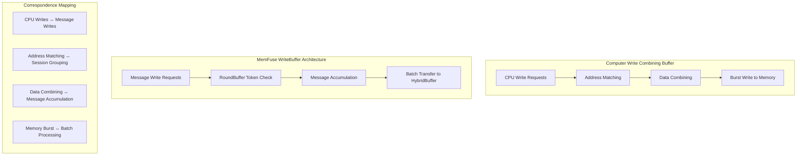
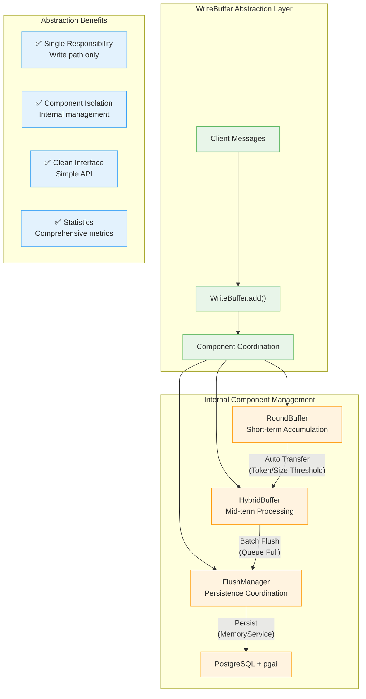
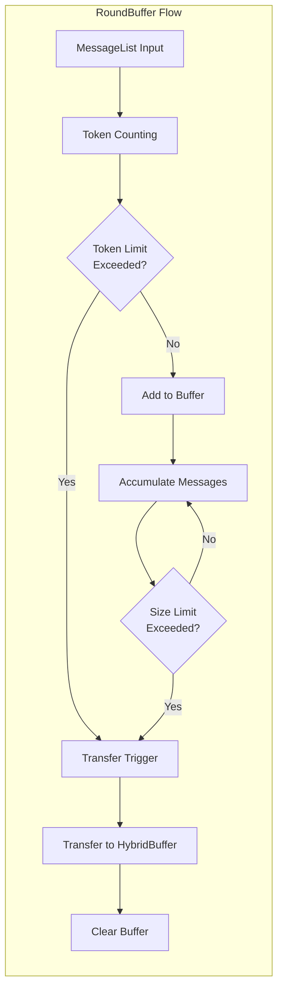
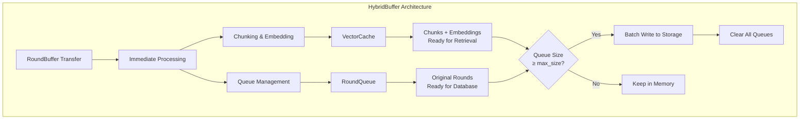
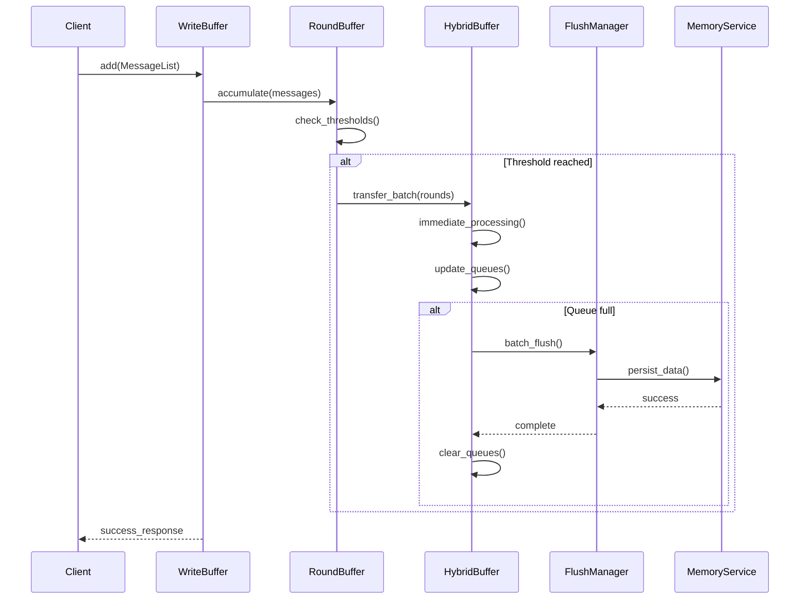
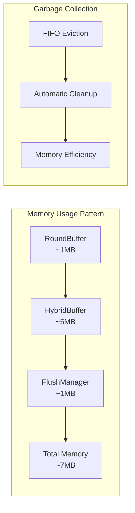
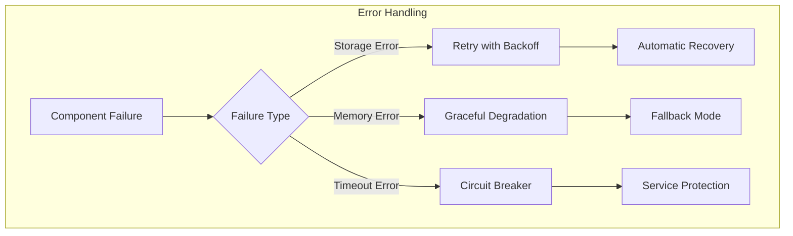

# WriteBuffer Architecture

## Overview

The WriteBuffer serves as the **write path abstraction layer** in the MemFuse Buffer system, implementing the Write Combining Buffer pattern from computer caching architectures. It encapsulates the entire write pipeline from message ingestion to persistence, providing a clean interface while managing complex internal components.

## Architecture Design

### Write Combining Buffer Correspondence

The WriteBuffer implements computer caching principles through a coordinated pipeline:



### WriteBuffer Abstraction Layer



## Core Components

### 1. RoundBuffer - Token-based FIFO

**Purpose**: Short-term message accumulation with intelligent transfer triggers

**Key Features**:
- **Token Counting**: Uses configurable model for accurate token calculation
- **Dual Thresholds**: Token limit (800) and size limit (5 rounds)
- **Session Tracking**: Groups messages by session context
- **Auto Transfer**: Automatic transfer when thresholds are reached



**Configuration**:
```yaml
round_buffer:
  max_tokens: 800               # Token threshold for transfer
  max_size: 5                   # Maximum number of rounds
  token_model: "gpt-4o-mini"    # Model for token counting
```

#### Internal Implementation Details

**Token Calculation Algorithm**:
```python
class TokenCalculator:
    """Handles token counting with fallback mechanisms."""

    def __init__(self, model: str = "gpt-4o-mini"):
        self.model = model
        self.fallback_multiplier = 1.3

    async def count_tokens(self, messages: List[Message]) -> int:
        """Count tokens with model-specific calculation."""
        try:
            # Primary: Use tiktoken for accurate counting
            encoding = tiktoken.encoding_for_model(self.model)
            total_tokens = 0

            for message in messages:
                content = self._serialize_message(message)
                tokens = len(encoding.encode(content))
                total_tokens += tokens

            return total_tokens

        except Exception as e:
            # Fallback: Word-based estimation
            logger.warning(f"Token counting failed, using fallback: {e}")
            return self._fallback_count(messages)

    def _fallback_count(self, messages: List[Message]) -> int:
        """Fallback token estimation based on word count."""
        total_words = sum(len(msg.content.split()) for msg in messages)
        return int(total_words * self.fallback_multiplier)
```

**Threshold Management Logic**:
```python
class ThresholdManager:
    """Manages transfer triggers and threshold checking."""

    def __init__(self, max_tokens: int, max_size: int):
        self.max_tokens = max_tokens
        self.max_size = max_size
        self.current_tokens = 0
        self.current_size = 0

    def should_transfer(self, new_tokens: int) -> bool:
        """Determine if transfer should be triggered."""
        projected_tokens = self.current_tokens + new_tokens
        projected_size = self.current_size + 1

        # Check both token and size thresholds
        token_exceeded = projected_tokens >= self.max_tokens
        size_exceeded = projected_size >= self.max_size

        return token_exceeded or size_exceeded

    def update_counters(self, tokens: int, size_increment: int = 1):
        """Update internal counters."""
        self.current_tokens += tokens
        self.current_size += size_increment

    def reset(self):
        """Reset counters after transfer."""
        self.current_tokens = 0
        self.current_size = 0
```

**Memory Management Strategy**:
```python
class RoundBufferMemoryManager:
    """Manages memory allocation and cleanup for RoundBuffer."""

    def __init__(self, max_memory_mb: int = 10):
        self.max_memory_bytes = max_memory_mb * 1024 * 1024
        self.current_memory = 0
        self.memory_tracker = {}

    def allocate_round(self, round_id: str, estimated_size: int) -> bool:
        """Allocate memory for a new round."""
        if self.current_memory + estimated_size > self.max_memory_bytes:
            logger.warning("Memory limit reached, triggering early transfer")
            return False

        self.memory_tracker[round_id] = estimated_size
        self.current_memory += estimated_size
        return True

    def deallocate_round(self, round_id: str):
        """Deallocate memory for a transferred round."""
        if round_id in self.memory_tracker:
            self.current_memory -= self.memory_tracker[round_id]
            del self.memory_tracker[round_id]

    def get_memory_usage(self) -> Dict[str, Any]:
        """Get current memory usage statistics."""
        return {
            "current_mb": self.current_memory / (1024 * 1024),
            "max_mb": self.max_memory_bytes / (1024 * 1024),
            "utilization": self.current_memory / self.max_memory_bytes,
            "tracked_rounds": len(self.memory_tracker)
        }
```

### 2. HybridBuffer - Dual-Queue Storage

**Purpose**: Mid-term processing with immediate embedding calculation and dual-queue management

**Key Features**:
- **Immediate Processing**: Chunks and embeddings calculated on arrival
- **VectorCache**: Pre-calculated embeddings for instant retrieval
- **RoundQueue**: Original rounds for database persistence
- **Batch Efficiency**: Triggers flush when queue reaches capacity



**Configuration**:
```yaml
hybrid_buffer:
  max_size: 5                   # FIFO buffer size
  chunk_strategy: "message"     # Chunking strategy
  embedding_model: "all-MiniLM-L6-v2"  # Embedding model
```

#### Internal Implementation Details

**Dual-Queue Architecture Implementation**:
```python
class DualQueueManager:
    """Manages the dual-queue architecture of HybridBuffer."""

    def __init__(self, max_size: int):
        self.max_size = max_size
        self.round_queue = deque(maxlen=max_size)  # Original rounds for persistence
        self.vector_cache = {}  # Pre-calculated embeddings for retrieval
        self.queue_lock = asyncio.Lock()

    async def add_round(self, round_data: Dict[str, Any]) -> bool:
        """Add round to both queues with immediate processing."""
        async with self.queue_lock:
            round_id = round_data['id']

            # Add to round queue for persistence
            self.round_queue.append(round_data)

            # Process and add to vector cache
            chunks_with_embeddings = await self._process_round(round_data)
            self.vector_cache[round_id] = chunks_with_embeddings

            # Check if flush is needed
            return len(self.round_queue) >= self.max_size

    async def _process_round(self, round_data: Dict[str, Any]) -> List[Dict[str, Any]]:
        """Process round data into chunks with embeddings."""
        chunks = await self._chunk_messages(round_data['messages'])
        chunks_with_embeddings = []

        for chunk in chunks:
            embedding = await self._calculate_embedding(chunk['content'])
            chunks_with_embeddings.append({
                'chunk_id': chunk['id'],
                'content': chunk['content'],
                'embedding': embedding,
                'metadata': chunk['metadata']
            })

        return chunks_with_embeddings

    async def flush_queues(self) -> Tuple[List[Dict], List[Dict]]:
        """Flush both queues and return data for persistence."""
        async with self.queue_lock:
            # Get data for persistence
            rounds_for_db = list(self.round_queue)
            vector_data = dict(self.vector_cache)

            # Clear queues
            self.round_queue.clear()
            self.vector_cache.clear()

            return rounds_for_db, vector_data
```

**VectorCache vs RoundQueue Management**:
```python
class VectorCacheManager:
    """Specialized manager for vector cache operations."""

    def __init__(self, embedding_model: str):
        self.embedding_model = embedding_model
        self.cache = {}
        self.access_times = {}
        self.embedding_service = EmbeddingService(embedding_model)

    async def store_embeddings(self, round_id: str, chunks: List[Dict]) -> None:
        """Store pre-calculated embeddings in cache."""
        self.cache[round_id] = chunks
        self.access_times[round_id] = time.time()

    async def query_cache(self, query_embedding: List[float], top_k: int = 10) -> List[Dict]:
        """Query the vector cache for similar content."""
        results = []

        for round_id, chunks in self.cache.items():
            for chunk in chunks:
                similarity = self._calculate_similarity(query_embedding, chunk['embedding'])
                results.append({
                    'content': chunk['content'],
                    'similarity': similarity,
                    'round_id': round_id,
                    'chunk_id': chunk['chunk_id']
                })

        # Sort by similarity and return top_k
        results.sort(key=lambda x: x['similarity'], reverse=True)
        return results[:top_k]

    def _calculate_similarity(self, query_emb: List[float], chunk_emb: List[float]) -> float:
        """Calculate cosine similarity between embeddings."""
        import numpy as np
        query_vec = np.array(query_emb)
        chunk_vec = np.array(chunk_emb)

        dot_product = np.dot(query_vec, chunk_vec)
        norms = np.linalg.norm(query_vec) * np.linalg.norm(chunk_vec)

        return dot_product / norms if norms != 0 else 0.0

    def clear_cache(self) -> None:
        """Clear the vector cache."""
        self.cache.clear()
        self.access_times.clear()
```

**Immediate Processing Logic**:
```python
class ImmediateProcessor:
    """Handles immediate processing of incoming data."""

    def __init__(self, chunk_strategy: str, embedding_model: str):
        self.chunk_strategy = chunk_strategy
        self.chunker = self._get_chunker(chunk_strategy)
        self.embedding_service = EmbeddingService(embedding_model)
        self.processing_queue = asyncio.Queue()
        self.workers = []

    async def start_workers(self, num_workers: int = 2):
        """Start background processing workers."""
        for i in range(num_workers):
            worker = asyncio.create_task(self._worker(f"worker-{i}"))
            self.workers.append(worker)

    async def process_immediately(self, round_data: Dict[str, Any]) -> Dict[str, Any]:
        """Process round data immediately upon arrival."""
        start_time = time.time()

        # Step 1: Chunk the messages
        chunks = await self._chunk_messages(round_data['messages'])

        # Step 2: Calculate embeddings in parallel
        embedding_tasks = [
            self.embedding_service.get_embedding(chunk['content'])
            for chunk in chunks
        ]
        embeddings = await asyncio.gather(*embedding_tasks)

        # Step 3: Combine chunks with embeddings
        processed_chunks = []
        for chunk, embedding in zip(chunks, embeddings):
            processed_chunks.append({
                'chunk_id': chunk['id'],
                'content': chunk['content'],
                'embedding': embedding,
                'metadata': chunk['metadata'],
                'round_id': round_data['id']
            })

        processing_time = time.time() - start_time

        return {
            'round_id': round_data['id'],
            'chunks': processed_chunks,
            'processing_time': processing_time,
            'chunk_count': len(processed_chunks)
        }

    async def _chunk_messages(self, messages: List[Message]) -> List[Dict[str, Any]]:
        """Chunk messages based on strategy."""
        if self.chunk_strategy == "message":
            return self._chunk_by_message(messages)
        elif self.chunk_strategy == "contextual":
            return await self._chunk_contextually(messages)
        else:
            raise ValueError(f"Unknown chunk strategy: {self.chunk_strategy}")

    def _chunk_by_message(self, messages: List[Message]) -> List[Dict[str, Any]]:
        """Simple message-based chunking."""
        chunks = []
        for i, message in enumerate(messages):
            chunks.append({
                'id': f"chunk_{i}",
                'content': message.content,
                'metadata': {
                    'message_id': message.id,
                    'timestamp': message.timestamp,
                    'role': message.role
                }
            })
        return chunks

    async def _chunk_contextually(self, messages: List[Message]) -> List[Dict[str, Any]]:
        """Advanced contextual chunking."""
        # Combine messages into larger contextual chunks
        combined_content = " ".join([msg.content for msg in messages])

        # Use semantic chunking based on content similarity
        chunks = await self.chunker.chunk_text(combined_content)

        return [
            {
                'id': f"ctx_chunk_{i}",
                'content': chunk,
                'metadata': {
                    'chunk_type': 'contextual',
                    'source_messages': len(messages)
                }
            }
            for i, chunk in enumerate(chunks)
        ]
```

### 3. FlushManager - Persistence Coordination

**Purpose**: Manages batch persistence operations with error handling and retry logic

**Key Features**:
- **Async Processing**: Non-blocking persistence operations
- **Worker Pool**: Configurable number of concurrent workers
- **Retry Logic**: Automatic retry with exponential backoff
- **Error Handling**: Comprehensive error recovery mechanisms

**Configuration**:
```yaml
performance:
  max_flush_workers: 3          # Concurrent workers
  max_flush_queue_size: 100     # Queue capacity
  flush_timeout: 30.0           # Operation timeout
  flush_strategy: "hybrid"      # Strategy selection
```

#### Internal Implementation Details

**Worker Pool Management**:
```python
class FlushWorkerPool:
    """Manages a pool of flush workers for concurrent processing."""

    def __init__(self, max_workers: int, max_queue_size: int):
        self.max_workers = max_workers
        self.max_queue_size = max_queue_size
        self.flush_queue = asyncio.Queue(maxsize=max_queue_size)
        self.workers = []
        self.worker_stats = {}
        self.is_running = False

    async def start(self):
        """Start the worker pool."""
        self.is_running = True
        for i in range(self.max_workers):
            worker_id = f"flush_worker_{i}"
            worker = asyncio.create_task(self._worker(worker_id))
            self.workers.append(worker)
            self.worker_stats[worker_id] = {
                'tasks_processed': 0,
                'total_time': 0,
                'errors': 0,
                'last_activity': None
            }

    async def submit_flush_task(self, flush_data: Dict[str, Any]) -> bool:
        """Submit a flush task to the worker pool."""
        try:
            await self.flush_queue.put(flush_data, timeout=1.0)
            return True
        except asyncio.TimeoutError:
            logger.warning("Flush queue is full, dropping task")
            return False

    async def _worker(self, worker_id: str):
        """Worker coroutine that processes flush tasks."""
        while self.is_running:
            try:
                # Get task from queue
                flush_data = await self.flush_queue.get()
                start_time = time.time()

                # Process the flush task
                await self._process_flush_task(flush_data)

                # Update statistics
                processing_time = time.time() - start_time
                self.worker_stats[worker_id]['tasks_processed'] += 1
                self.worker_stats[worker_id]['total_time'] += processing_time
                self.worker_stats[worker_id]['last_activity'] = time.time()

                # Mark task as done
                self.flush_queue.task_done()

            except Exception as e:
                logger.error(f"Worker {worker_id} error: {e}")
                self.worker_stats[worker_id]['errors'] += 1

    async def _process_flush_task(self, flush_data: Dict[str, Any]):
        """Process a single flush task."""
        rounds_data = flush_data['rounds']
        vector_data = flush_data['vectors']

        # Flush to MemoryService
        await self._flush_to_memory_service(rounds_data, vector_data)

    async def stop(self):
        """Stop the worker pool gracefully."""
        self.is_running = False

        # Wait for current tasks to complete
        await self.flush_queue.join()

        # Cancel workers
        for worker in self.workers:
            worker.cancel()

        # Wait for workers to finish
        await asyncio.gather(*self.workers, return_exceptions=True)
```

**Retry and Error Recovery**:
```python
class RetryManager:
    """Handles retry logic and error recovery for flush operations."""

    def __init__(self, max_retries: int = 3, base_delay: float = 1.0):
        self.max_retries = max_retries
        self.base_delay = base_delay
        self.retry_stats = {
            'total_retries': 0,
            'successful_retries': 0,
            'failed_operations': 0
        }

    async def execute_with_retry(self, operation: Callable, *args, **kwargs) -> Any:
        """Execute operation with exponential backoff retry."""
        last_exception = None

        for attempt in range(self.max_retries + 1):
            try:
                result = await operation(*args, **kwargs)

                if attempt > 0:
                    self.retry_stats['successful_retries'] += 1
                    logger.info(f"Operation succeeded after {attempt} retries")

                return result

            except Exception as e:
                last_exception = e

                if attempt < self.max_retries:
                    delay = self.base_delay * (2 ** attempt)  # Exponential backoff
                    logger.warning(f"Operation failed (attempt {attempt + 1}), retrying in {delay}s: {e}")

                    self.retry_stats['total_retries'] += 1
                    await asyncio.sleep(delay)
                else:
                    logger.error(f"Operation failed after {self.max_retries} retries: {e}")
                    self.retry_stats['failed_operations'] += 1

        raise last_exception

    def get_retry_stats(self) -> Dict[str, Any]:
        """Get retry statistics."""
        return self.retry_stats.copy()
```

**Batch Processing Strategy**:
```python
class BatchProcessor:
    """Handles different batch processing strategies."""

    def __init__(self, strategy: str = "hybrid"):
        self.strategy = strategy
        self.batch_stats = {
            'total_batches': 0,
            'avg_batch_size': 0,
            'processing_times': []
        }

    async def process_batch(self, batch_data: List[Dict[str, Any]]) -> Dict[str, Any]:
        """Process a batch based on the configured strategy."""
        start_time = time.time()

        if self.strategy == "size_based":
            result = await self._size_based_processing(batch_data)
        elif self.strategy == "time_based":
            result = await self._time_based_processing(batch_data)
        elif self.strategy == "hybrid":
            result = await self._hybrid_processing(batch_data)
        else:
            raise ValueError(f"Unknown batch strategy: {self.strategy}")

        # Update statistics
        processing_time = time.time() - start_time
        self.batch_stats['total_batches'] += 1
        self.batch_stats['processing_times'].append(processing_time)

        # Update average batch size
        current_avg = self.batch_stats['avg_batch_size']
        total_batches = self.batch_stats['total_batches']
        new_avg = (current_avg * (total_batches - 1) + len(batch_data)) / total_batches
        self.batch_stats['avg_batch_size'] = new_avg

        return result

    async def _size_based_processing(self, batch_data: List[Dict]) -> Dict[str, Any]:
        """Optimize for throughput - larger batches."""
        # Process all data in a single large batch
        return await self._execute_batch_operation(batch_data)

    async def _time_based_processing(self, batch_data: List[Dict]) -> Dict[str, Any]:
        """Optimize for latency - smaller, frequent batches."""
        # Process in smaller sub-batches for lower latency
        sub_batch_size = max(1, len(batch_data) // 3)
        results = []

        for i in range(0, len(batch_data), sub_batch_size):
            sub_batch = batch_data[i:i + sub_batch_size]
            result = await self._execute_batch_operation(sub_batch)
            results.append(result)

        return self._merge_results(results)

    async def _hybrid_processing(self, batch_data: List[Dict]) -> Dict[str, Any]:
        """Balanced approach - adaptive batch sizing."""
        # Adapt batch size based on current system load
        system_load = await self._get_system_load()

        if system_load < 0.5:
            # Low load: use larger batches for efficiency
            return await self._size_based_processing(batch_data)
        else:
            # High load: use smaller batches for responsiveness
            return await self._time_based_processing(batch_data)

    async def _execute_batch_operation(self, batch_data: List[Dict]) -> Dict[str, Any]:
        """Execute the actual batch operation."""
        # This would call the MemoryService with the batch
        # Implementation depends on the specific MemoryService interface
        pass

    async def _get_system_load(self) -> float:
        """Get current system load metric."""
        # Simple CPU usage check - could be more sophisticated
        import psutil
        return psutil.cpu_percent(interval=0.1) / 100.0
```

## Component Communication

### Data Transfer Protocols

#### RoundBuffer → HybridBuffer Transfer Protocol

```python
class TransferProtocol:
    """Defines the data transfer protocol between components."""

    @dataclass
    class TransferPacket:
        """Standard data packet for component transfers."""
        packet_id: str
        source_component: str
        target_component: str
        data_type: str
        payload: Dict[str, Any]
        timestamp: float
        metadata: Dict[str, Any]

    @staticmethod
    def create_round_transfer_packet(rounds_data: List[Dict]) -> TransferPacket:
        """Create transfer packet for round data."""
        return TransferProtocol.TransferPacket(
            packet_id=str(uuid.uuid4()),
            source_component="RoundBuffer",
            target_component="HybridBuffer",
            data_type="rounds_batch",
            payload={
                "rounds": rounds_data,
                "batch_size": len(rounds_data),
                "total_tokens": sum(r.get('token_count', 0) for r in rounds_data)
            },
            timestamp=time.time(),
            metadata={
                "transfer_reason": "threshold_reached",
                "buffer_state": "full"
            }
        )

    @staticmethod
    def create_flush_packet(rounds_data: List[Dict], vector_data: Dict) -> TransferPacket:
        """Create transfer packet for flush operation."""
        return TransferProtocol.TransferPacket(
            packet_id=str(uuid.uuid4()),
            source_component="HybridBuffer",
            target_component="FlushManager",
            data_type="flush_batch",
            payload={
                "rounds": rounds_data,
                "vectors": vector_data,
                "batch_size": len(rounds_data)
            },
            timestamp=time.time(),
            metadata={
                "flush_trigger": "queue_full",
                "processing_complete": True
            }
        )
```

### Synchronization Mechanisms

#### Component State Synchronization

```python
class ComponentSynchronizer:
    """Manages synchronization between buffer components."""

    def __init__(self):
        self.component_states = {}
        self.sync_events = {}
        self.state_lock = asyncio.Lock()

    async def register_component(self, component_name: str, initial_state: Dict):
        """Register a component for synchronization."""
        async with self.state_lock:
            self.component_states[component_name] = initial_state
            self.sync_events[component_name] = asyncio.Event()

    async def update_component_state(self, component_name: str, new_state: Dict):
        """Update component state and notify other components."""
        async with self.state_lock:
            self.component_states[component_name] = new_state

            # Notify waiting components
            if component_name in self.sync_events:
                self.sync_events[component_name].set()
                self.sync_events[component_name].clear()

    async def wait_for_component_ready(self, component_name: str, timeout: float = 5.0):
        """Wait for a component to be ready."""
        try:
            await asyncio.wait_for(
                self.sync_events[component_name].wait(),
                timeout=timeout
            )
        except asyncio.TimeoutError:
            logger.warning(f"Timeout waiting for {component_name} to be ready")

    def get_system_state(self) -> Dict[str, Any]:
        """Get the current state of all components."""
        return {
            "components": self.component_states.copy(),
            "sync_status": {
                name: event.is_set()
                for name, event in self.sync_events.items()
            }
        }
```

### Error Propagation

#### Error Handling Chain

```python
class ErrorPropagationManager:
    """Manages error propagation between components."""

    def __init__(self):
        self.error_handlers = {}
        self.error_history = []
        self.max_history = 100

    def register_error_handler(self, component: str, handler: Callable):
        """Register an error handler for a component."""
        if component not in self.error_handlers:
            self.error_handlers[component] = []
        self.error_handlers[component].append(handler)

    async def propagate_error(self, source_component: str, error: Exception, context: Dict):
        """Propagate error through the component chain."""
        error_event = {
            'timestamp': time.time(),
            'source': source_component,
            'error_type': type(error).__name__,
            'error_message': str(error),
            'context': context,
            'propagation_chain': []
        }

        # Add to history
        self.error_history.append(error_event)
        if len(self.error_history) > self.max_history:
            self.error_history.pop(0)

        # Propagate to registered handlers
        for component, handlers in self.error_handlers.items():
            if component != source_component:  # Don't propagate back to source
                for handler in handlers:
                    try:
                        await handler(error_event)
                        error_event['propagation_chain'].append(component)
                    except Exception as handler_error:
                        logger.error(f"Error handler failed in {component}: {handler_error}")

    def get_error_summary(self) -> Dict[str, Any]:
        """Get summary of recent errors."""
        if not self.error_history:
            return {"total_errors": 0, "recent_errors": []}

        recent_errors = self.error_history[-10:]  # Last 10 errors
        error_types = {}

        for error in self.error_history:
            error_type = error['error_type']
            error_types[error_type] = error_types.get(error_type, 0) + 1

        return {
            "total_errors": len(self.error_history),
            "error_types": error_types,
            "recent_errors": recent_errors
        }
```

## WriteBuffer Interface

### Primary Methods

```python
class WriteBuffer:
    # Core write operations
    async def add(self, messages: MessageList, session_id: Optional[str] = None) -> Dict[str, Any]
    
    # Component access (controlled)
    def get_round_buffer(self) -> RoundBuffer
    def get_hybrid_buffer(self) -> HybridBuffer
    def get_flush_manager(self) -> FlushManager
    
    # Management operations
    async def flush_all(self) -> Dict[str, Any]
    def get_stats(self) -> Dict[str, Any]
```

### Usage Example

```python
# Initialize WriteBuffer (managed by BufferService)
write_buffer = buffer_service.get_write_buffer()

# Add messages (automatic threshold management)
result = await write_buffer.add(message_list, session_id="user_session")

# Manual flush if needed
flush_result = await write_buffer.flush_all()

# Get statistics
stats = write_buffer.get_stats()
print(f"Total writes: {stats['total_writes']}")
print(f"Transfer rate: {stats['transfer_rate']}")
```

## Data Flow Patterns

### Normal Operation Flow



## Performance Characteristics

### Throughput Optimization

| Metric | Value | Description |
|--------|-------|-------------|
| **Message Add** | <5ms | Add to RoundBuffer |
| **Buffer Transfer** | <50ms | RoundBuffer → HybridBuffer |
| **Storage Flush** | <200ms | HybridBuffer → Persistent Storage |
| **Batch Size** | 5 rounds | Optimal batch size for efficiency |

### Memory Management



## Error Handling & Resilience

### Fault Tolerance Strategy



### Recovery Mechanisms

1. **Automatic Retry**: Transient failure recovery with exponential backoff
2. **Circuit Breaker**: Prevents cascade failures during persistent issues
3. **Graceful Degradation**: Continues operation with reduced functionality
4. **Data Persistence**: Ensures no data loss during component failures

## Monitoring & Metrics

### Key Metrics

```python
# WriteBuffer Statistics
{
    "total_writes": 1250,
    "total_transfers": 45,
    "transfer_rate": 3.6,  # transfers per minute
    "average_batch_size": 27.8,
    "component_health": {
        "round_buffer": "healthy",
        "hybrid_buffer": "healthy", 
        "flush_manager": "healthy"
    },
    "performance": {
        "avg_write_latency": 4.2,  # ms
        "avg_transfer_latency": 48.5,  # ms
        "memory_usage": 6.8  # MB
    }
}
```

### Health Indicators

| Metric | Healthy Range | Alert Threshold |
|--------|---------------|-----------------|
| Transfer Rate | 1-10/min | >20/min |
| Write Latency | <10ms | >50ms |
| Memory Usage | <10MB | >20MB |
| Error Rate | <1% | >5% |

## Configuration Best Practices

### Production Settings

```yaml
buffer:
  enabled: true
  round_buffer:
    max_tokens: 800      # Balanced for throughput
    max_size: 5          # Optimal batch size
  hybrid_buffer:
    max_size: 5          # Memory efficiency
  performance:
    max_flush_workers: 3 # Concurrent processing
    flush_timeout: 30.0  # Reasonable timeout
```

### Development Settings

```yaml
buffer:
  enabled: false  # Use bypass mode for development
```

## Related Documentation

- **[Configuration](configuration.md)** - Complete configuration guide
- **[Performance](performance.md)** - Performance analysis and tuning
- **[Query Buffer](query_buffer.md)** - Query path architecture
- **[Overview](overview.md)** - Buffer system overview
