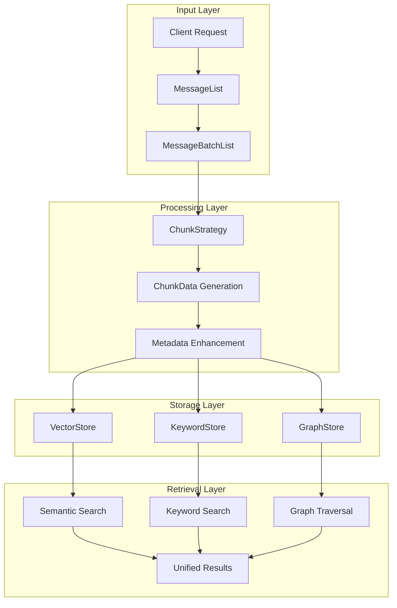
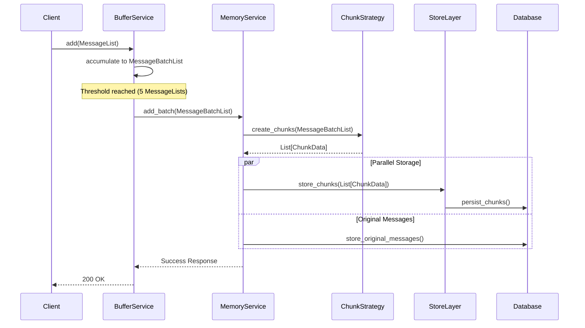
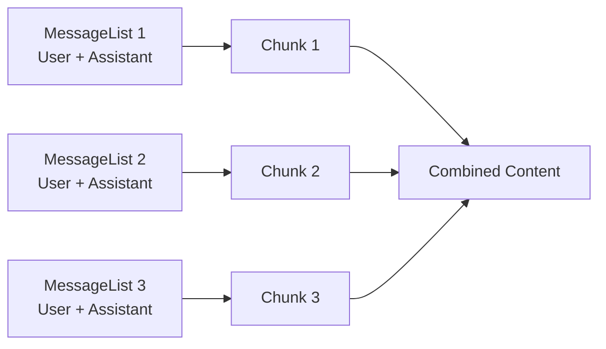
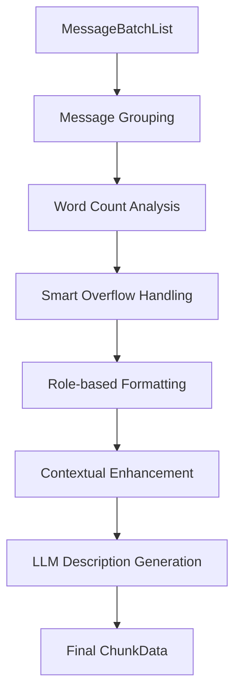
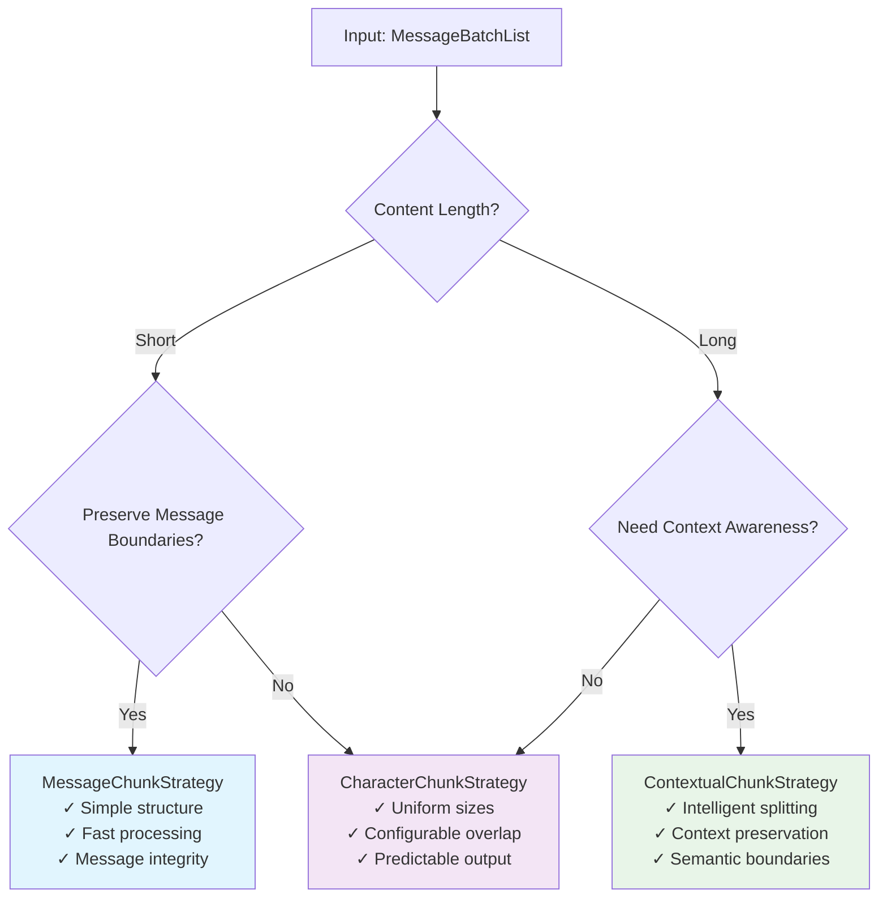
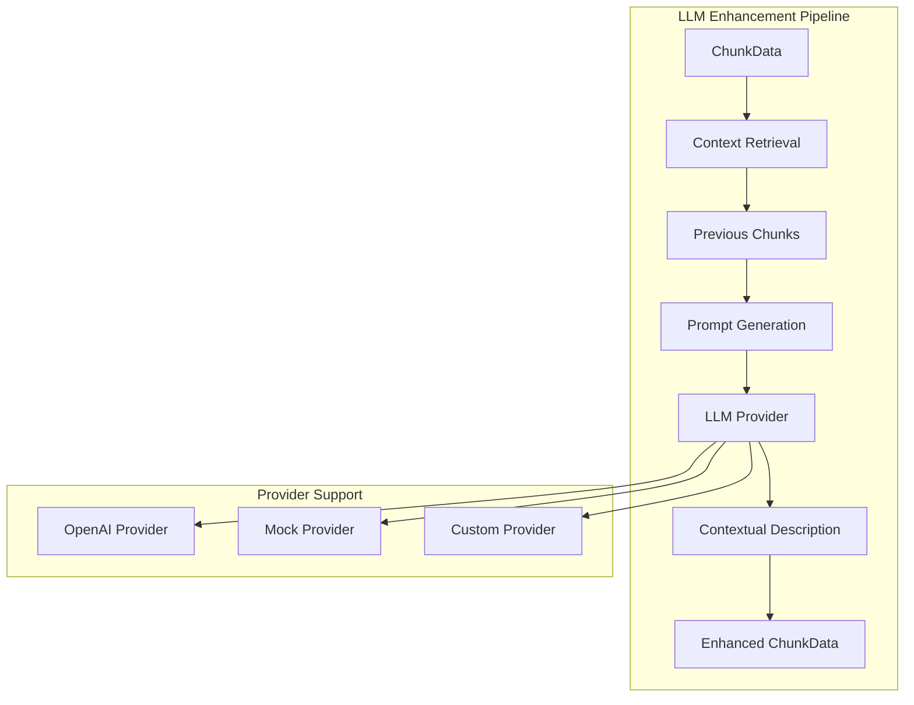
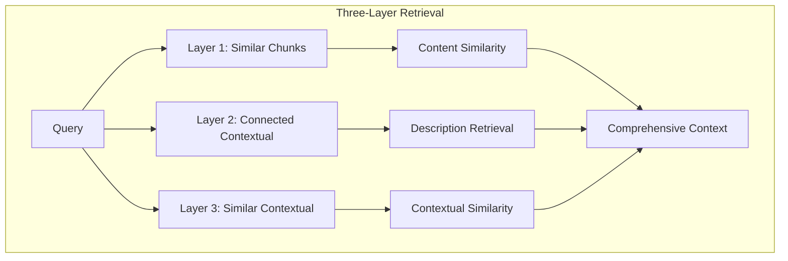
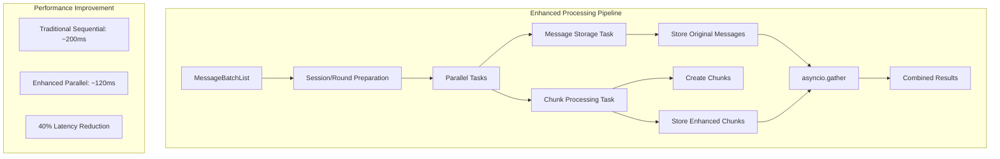

# MemFuse Chunking Architecture

## Overview

The MemFuse chunking system transforms conversation-based messages into retrievable chunks for efficient storage and semantic search. This document outlines the architectural design, component interactions, and implementation strategies for the chunking pipeline.

## Core Architecture

### System Components



### Data Flow Pipeline



## Data Structures

### Core Types

```python
# Type definitions
MessageList = List[Dict[str, Any]]      # List of conversation messages
MessageBatchList = List[MessageList]    # Batch of message lists

@dataclass
class ChunkData:
    """Unified chunk representation across all stores."""
    content: str                        # Text content of the chunk
    chunk_id: str                      # Unique identifier
    metadata: Dict[str, Any]           # Enhanced metadata
```

### Enhanced Metadata Structure

```python
# Comprehensive chunk metadata
chunk_metadata = {
    # Strategy Information
    "strategy": "message",              # Chunking strategy used
    "message_count": 2,                # Number of messages in chunk
    "source": "message_list",          # Source type
    
    # Context Information
    "user_id": "user_123",            # User identifier
    "session_id": "session_456",      # Conversation session
    "round_id": "round_789",          # Conversation round
    "agent_id": "agent_abc",          # AI agent identifier
    
    # Temporal Information
    "created_at": "2025-01-01T12:00:00Z",  # Creation timestamp
    "batch_index": 0,                 # Position in batch
    
    # Content Information
    "roles": ["user", "assistant"],   # Message roles
    "type": "chunk",                  # Data type
    
    # Enhancement Information
    "contextual_description": "...",   # LLM-generated description
    "gpt_enhanced": true              # Enhancement flag
}
```

## Chunking Strategies

### Strategy Interface

```python
class ChunkStrategy(ABC):
    """Abstract base class for chunking strategies."""
    
    @abstractmethod
    async def create_chunks(self, message_batch_list: MessageBatchList) -> List[ChunkData]:
        """Transform message batches into chunks."""
        pass
```

### Available Strategies

#### MessageChunkStrategy
**Purpose**: One chunk per MessageList, preserving conversation structure.



**Use Cases**:
- Short conversations
- Preserving message pairs
- Simple processing requirements

#### MessageCharacterChunkStrategy
**Purpose**: Advanced chunking with intelligent text processing and contextual enhancement.



**Features**:
- CJK language support (Chinese, Japanese, Korean)
- Intelligent message grouping by word count
- LLM-powered contextual descriptions
- Async parallel processing
- Previous chunk context retrieval

#### ContextualChunkStrategy
**Purpose**: Intelligent splitting for long conversations with context preservation.

**Use Cases**:
- Long conversation threads
- Context-aware boundaries
- Intelligent content splitting

#### CharacterChunkStrategy
**Purpose**: Fixed-size chunks with configurable overlap.

**Use Cases**:
- Uniform chunk sizes
- Predictable processing
- Overlap support for continuity

### Strategy Selection Guide



## Storage Integration

### Unified Store Interface

```python
class ChunkStoreInterface(ABC):
    """Unified interface for all chunk storage implementations."""
    
    # CRUD Operations
    async def add(self, chunks: List[ChunkData]) -> List[str]
    async def read(self, chunk_ids: List[str]) -> List[ChunkData]
    async def update(self, chunk_id: str, chunk: ChunkData) -> bool
    async def delete(self, chunk_ids: List[str]) -> List[bool]
    
    # Query Operations
    async def query(self, query: Query, top_k: int = 5) -> List[ChunkData]
    
    # Business Operations
    async def get_chunks_by_session(self, session_id: str) -> List[ChunkData]
    async def get_chunks_by_round(self, round_id: str) -> List[ChunkData]
    async def get_chunks_stats(self) -> Dict[str, Any]
```

### Store Implementations

#### VectorStore (Qdrant)


**Capabilities**:
- Semantic similarity search
- High-dimensional vector operations
- Metadata filtering
- Scalable vector indexing

#### KeywordStore (SQLite FTS)


**Capabilities**:
- Full-text search
- BM25 relevance scoring
- Fast keyword matching
- Lightweight storage

#### GraphStore (NetworkX)


**Capabilities**:
- Relationship modeling
- Graph traversal
- Connected component analysis
- Structural queries

## Advanced Features

### LLM Integration



### Contextual Retrieval



### Parallel Processing



## API Design

### RESTful Endpoints

```http
# Session-based chunk retrieval
GET /api/v1/sessions/{session_id}/chunks
GET /api/v1/sessions/{session_id}/chunks?limit=20&sort_by=created_at&order=desc

# Round-based chunk retrieval
GET /api/v1/rounds/{round_id}/chunks
GET /api/v1/rounds/{round_id}/chunks?limit=20&sort_by=created_at&order=desc

# Chunk statistics
GET /api/v1/chunks/stats?user_id=user_123&store_type=hybrid
```

### Query Parameters

| Parameter | Type | Description | Default |
|-----------|------|-------------|---------|
| `limit` | integer | Maximum chunks to return | 20 |
| `sort_by` | string | Sort field (`created_at`, `chunk_id`) | `created_at` |
| `order` | string | Sort order (`asc`, `desc`) | `desc` |
| `store_type` | string | Store filter (`vector`, `keyword`, `graph`, `hybrid`) | `hybrid` |

### Response Format

```json
{
    "status": "success",
    "data": {
        "chunks": [
            {
                "chunk_id": "chunk_123",
                "content": "Conversation content...",
                "metadata": {
                    "strategy": "message",
                    "session_id": "session_456",
                    "user_id": "user_123",
                    "created_at": "2025-01-01T12:00:00Z"
                }
            }
        ],
        "total_count": 1,
        "session_id": "session_456"
    },
    "message": "Retrieved 1 chunks for session session_456"
}
```

## Performance Characteristics

### Current Metrics

| Operation | Latency | Throughput |
|-----------|---------|------------|
| Chunk Creation | <50ms | 1000 chunks/sec |
| Vector Search | <100ms | 500 queries/sec |
| Keyword Search | <20ms | 2000 queries/sec |
| Graph Traversal | <80ms | 800 queries/sec |

### Optimization Strategies

1. **Parallel Processing**: Simultaneous storage operations
2. **Batch Operations**: Bulk chunk processing
3. **Caching**: Frequently accessed chunks
4. **Indexing**: Optimized database indexes

## Design Principles

### Core Principles

1. **Unified Interface**: Consistent API across all stores
2. **Separation of Concerns**: Clear distinction between CRUD and query operations
3. **Extensibility**: Pluggable chunking strategies
4. **Performance**: Optimized for high-throughput scenarios
5. **Metadata Rich**: Comprehensive context preservation

### Quality Attributes

- **Scalability**: Horizontal scaling support
- **Reliability**: Robust error handling
- **Maintainability**: Clean, modular architecture
- **Testability**: Comprehensive test coverage
- **Observability**: Detailed logging and metrics

## Future Enhancements

### Short-term Goals

- **Chunk Versioning**: Track modifications over time
- **Advanced Filtering**: Sophisticated query capabilities
- **Bulk Operations**: Batch processing optimizations

### Long-term Vision

- **Distributed Processing**: Multi-node chunk processing
- **Streaming Capabilities**: Real-time chunk updates
- **ML-Enhanced Chunking**: Intelligent strategy selection
- **Advanced Analytics**: Usage patterns and optimization insights

## Implementation Guidelines

### Best Practices

1. **Strategy Selection**: Choose appropriate chunking strategy based on content characteristics
2. **Metadata Design**: Include comprehensive context information
3. **Error Handling**: Implement robust error recovery
4. **Testing**: Comprehensive unit and integration tests
5. **Monitoring**: Track performance metrics and usage patterns

### Common Patterns

```python
# Strategy initialization
strategy = MessageCharacterChunkStrategy(
    max_words_per_chunk=800,
    enable_contextual=True,
    llm_provider=openai_provider
)

# Chunk processing
chunks = await strategy.create_chunks(message_batch_list)

# Store operations
chunk_ids = await vector_store.add(chunks)
retrieved_chunks = await vector_store.read(chunk_ids)
```

This architecture provides a robust, scalable foundation for conversation chunking and retrieval in the MemFuse system, supporting diverse use cases while maintaining high performance and extensibility.
