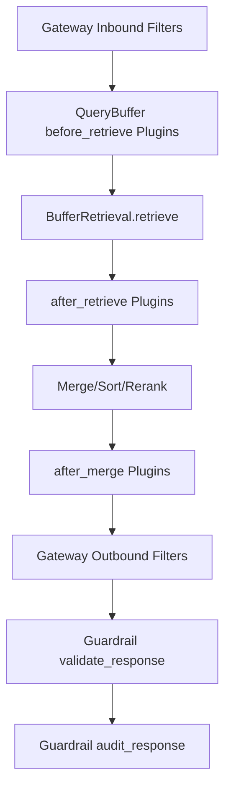

# Execution Order: Gateway × Buffer × Guardrail (Minimal E2E)




This document outlines the minimal execution order and responsibilities across the main pathway.

## Main Pathway
1. Gateway (Inbound Filters)
   - Normalize/validate request (lightweight)
   - No heavy logic here; forward context (user_id, agent_id, session_id, query, top_k)
2. Buffer Layer (QueryBuffer)
   - before_retrieve(ctx) plugins
   - BufferRetrieval.retrieve() (hybrid/round buffers)
   - after_retrieve(results, ctx) plugins
   - Merge/sort/rerank (internal)
   - retrieval_handler() to fetch from persistence when needed
   - after_merge(results, ctx) plugins
3. Gateway (Outbound Filters)
   - Apply lightweight response shaping: PII redaction, toxicity annotation, output field removal
4. Guardrail
   - validate_response() checks
   - audit_response() field removal/sanitization according to config

## Notes
- Plugins and filters are configured via global config manager and can be enabled/disabled independently.
- QueryBuffer default behavior remains unchanged when no plugins are enabled.
- Persistence interface is normalized by RetrievalAdapter/handler to List[dict] (id, content, score, metadata).

## Testing Strategy
- Unit-level tests mock BufferRetrieval to avoid DB dependency.
- End-to-end unit tests wire: Gateway → QueryBuffer (with plugins) → Outbound Filters → Guardrail.
- Persistence tests cover adapters and fallback behavior without external services.


## Configuration examples

Example: enable QueryBuffer plugins and outbound filters.

```yaml
buffer_plugins:
  plugins:
    - name: session_annotator
      enabled: true
    - name: result_enricher
      enabled: true
      params:
        stage: merge
        include_query_len: true
    - name: field_keep_or_remove
      enabled: true
      params:
        remove_fields: ["metadata.source"]

gateway:
  pipeline:
    inbound: []
    outbound:
      - name: pii_redact
        enabled: true
      - name: toxicity_mark
        enabled: true
      - name: output_remove
        enabled: true

guardrail:
  pii:
    enabled: true
    redact: true
  toxicity:
    enabled: true
    threshold: 0.0
  output:
    enabled: true
    remove_fields: ["metadata.source"]
```
