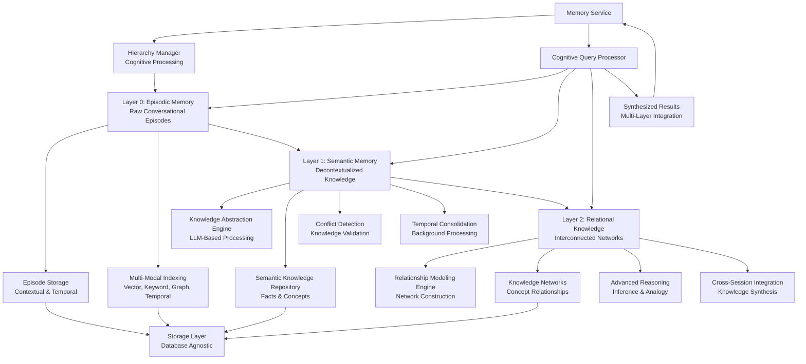
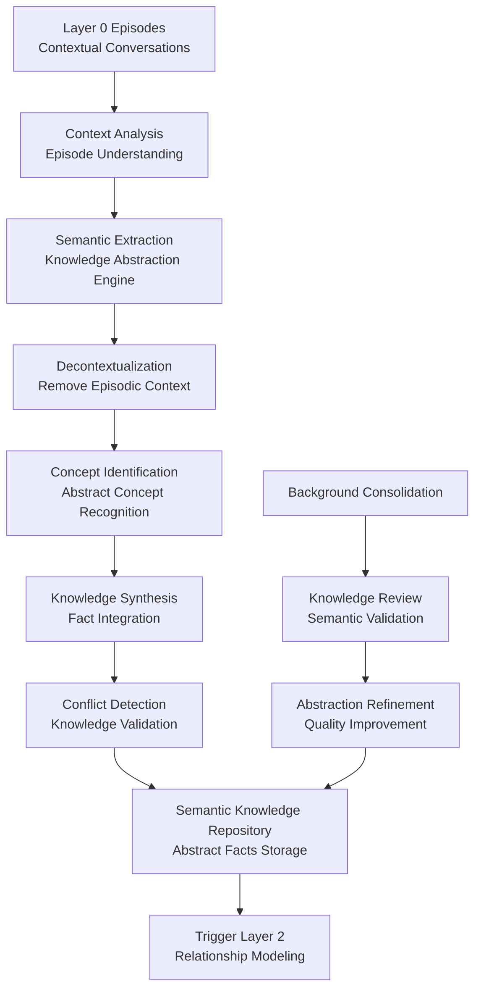
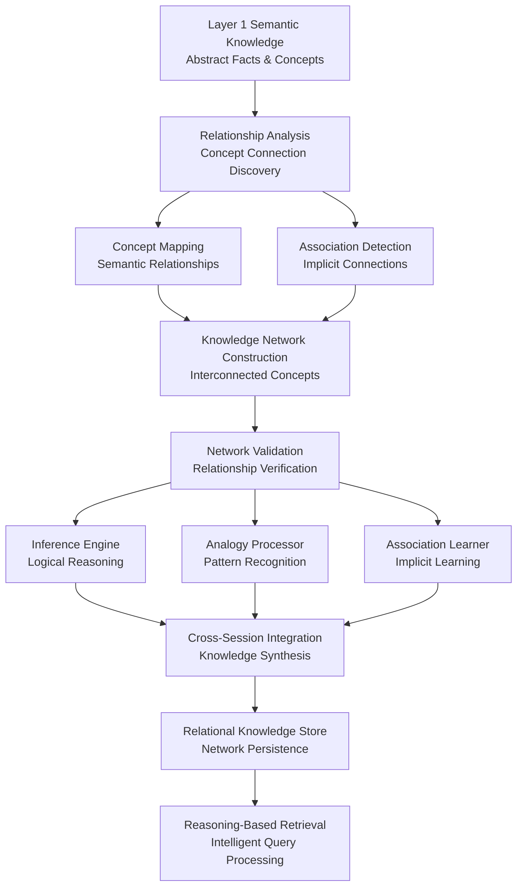
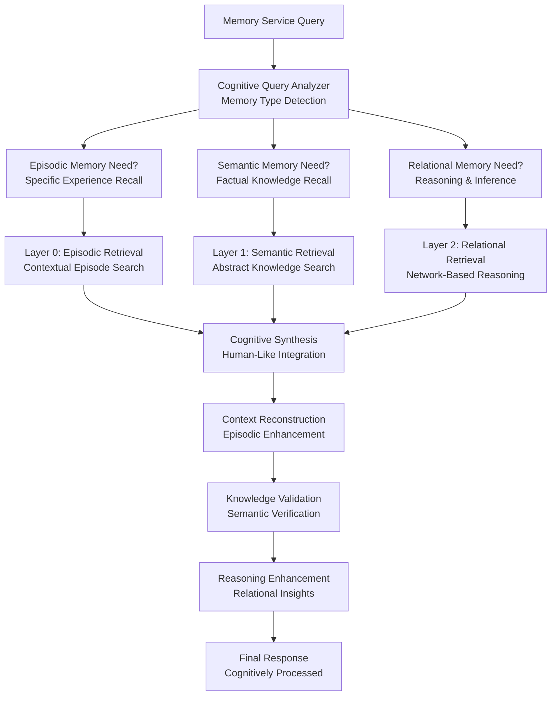

# MemFuse Memory Hierarchy Architecture

## Overview

MemFuse implements a three-layer hierarchical memory system positioned between the Memory Service and Storage Layer, inspired by human cognitive memory processes. This system organizes information at different levels of abstraction to enable sophisticated memory processing, consolidation, and retrieval that mirrors human memory cognition.

## Architecture Principles

### Human Memory Cognitive Theory Foundation

Based on established cognitive neuroscience research, human memory consists of distinct but interconnected systems:

**Declarative Memory System**:
- **Episodic Memory**: Memory for specific events and experiences with temporal and contextual details
- **Semantic Memory**: General knowledge and facts abstracted from specific experiences

**Memory Consolidation Process**:
- **Cellular Consolidation**: Stabilization of synaptic connections at the neural level
- **System Consolidation**: Transfer from hippocampus-dependent to neocortex-dependent storage

### MemFuse Memory Layer Mapping

**Layer 0 - Episodic Memory Layer**:
- Stores raw conversational episodes with full contextual information
- Maintains temporal sequences and experiential details
- Provides immediate access to recent experiences

**Layer 1 - Semantic Memory Layer**:
- Extracts and consolidates factual knowledge from episodic experiences
- Performs conflict detection and temporal reasoning
- Creates structured, validated knowledge representations

**Layer 2 - Relational Knowledge Layer**:
- Builds interconnected knowledge networks from semantic facts
- Enables complex reasoning through relationship modeling
- Supports cross-session knowledge integration and inference

### Architectural Positioning

The memory hierarchy operates as an **intermediate processing layer** between:
- **Memory Service**: High-level memory operations and API interfaces
- **Storage Layer**: Physical data persistence and retrieval mechanisms

This positioning allows for:
- **Cognitive Processing**: Human-like memory consolidation and reasoning
- **Storage Abstraction**: Database-agnostic architectural design
- **Service Integration**: Seamless integration with existing memory services

## Layer Architecture

### Layer 0: Episodic Memory Layer

**Purpose**: Store and maintain raw conversational episodes with full contextual and temporal information, mirroring human episodic memory for specific experiences and events.

**Cognitive Function**: Episodic memory in humans stores autobiographical events with rich contextual details including time, place, emotions, and associated circumstances. This layer preserves the experiential nature of conversations.

#### Core Components

**Episode Storage System**:
- **Conversation Episodes**: Complete user-assistant interaction sequences with temporal ordering
- **Contextual Metadata**: Session information, timestamps, user context, and environmental factors
- **Experiential Details**: Emotional context, interaction patterns, and conversational flow
- **Temporal Sequences**: Chronological ordering and relationship between episodes
- **Source Attribution**: Complete provenance tracking for each conversational episode

**Multi-Modal Indexing Infrastructure**:
- **Vector Indexing**: Semantic embedding-based similarity search across episodes
- **Keyword Indexing**: Full-text search capabilities for content-based retrieval
- **Graph Indexing**: Relationship-based indexing for contextual connections
- **Temporal Indexing**: Time-based access patterns and chronological retrieval
- **Metadata Indexing**: Structured search across contextual attributes

**Storage Abstraction Layer**:
- **Database-Agnostic Design**: Support for multiple storage backends without architectural changes
- **Vector Store Interface**: Pluggable vector database implementations (Qdrant, Weaviate, Pinecone, etc.)
- **Document Store Interface**: Flexible document storage (MongoDB, PostgreSQL, SQLite, etc.)
- **Graph Store Interface**: Configurable graph database support (Neo4j, ArangoDB, etc.)
- **Search Engine Interface**: Adaptable search implementations (Elasticsearch, Solr, etc.)

#### Key Features

**Multi-Modal Indexing Strategy**:
- **Parallel Processing**: Simultaneous indexing across all store types
- **Consistency Guarantees**: ACID transactions for metadata operations
- **Incremental Updates**: Efficient updates without full reindexing
- **Schema Evolution**: Backward-compatible schema migration support

**Chunk-Based Organization**:
- **Atomic Units**: User-assistant message pairs as indivisible chunks
- **Token Management**: Configurable chunking strategies (character, message, contextual)
- **Overlap Handling**: Configurable chunk overlap for context preservation
- **Metadata Preservation**: Rich metadata attached to each chunk

**Memory Service Integration**:
- **Service Layer Interface**: Clean integration with Memory Service APIs
- **Asynchronous Processing**: Non-blocking episode processing and indexing
- **Event-Driven Architecture**: Reactive processing based on memory service events
- **Error Handling**: Robust error recovery and retry mechanisms

**Episodic Access Patterns**:
- **Recency-Based Retrieval**: Recent episodes prioritized for faster access
- **Context-Aware Search**: Retrieval based on conversational context and session
- **Temporal Navigation**: Chronological browsing and time-based filtering
- **Similarity Matching**: Content-based episode similarity and clustering

#### Data Flow Architecture

**Episode Ingestion Pipeline**:
```
Memory Service → Episode Formation → Contextual Enrichment → Multi-Modal Indexing → Layer 1 Trigger
                        ↓                    ↓                        ↓
                Episode Boundaries    Temporal Context      Parallel Processing:
                Session Context       Metadata Extraction   - Vector Embeddings
                User Context         Emotional Context      - Keyword Indexing
                                                           - Graph Relationships
                                                           - Temporal Sequences
```

**Episodic Retrieval Pipeline**:
```
Memory Service Query → Context Analysis → Multi-Modal Search → Episode Reconstruction → Response
                              ↓                  ↓                    ↓
                      Session Context    - Semantic Similarity    Full Episode Context
                      Temporal Context   - Keyword Matching       Temporal Relationships
                      User Context       - Graph Traversal        Contextual Metadata
                                        - Temporal Filtering
```

#### Interface Specifications

**L0Manager Interface**:
```python
class L0Manager(MemoryLayer):
    async def add(self, item: Any) -> str
    async def add_batch(self, items: List[Any]) -> List[str]
    async def get(self, item_id: str) -> Optional[Any]
    async def search(self, query: str, top_k: int = 5, store_types: List[str] = None) -> List[Any]
    async def delete(self, item_id: str) -> bool
    async def update(self, item_id: str, item: Any) -> bool
    async def count(self, store_type: str = None) -> int
    async def clear(self, store_type: str = None) -> bool
```

**Store Integration Interface**:
```python
class StoreCoordinator:
    async def parallel_index(self, chunks: List[ChunkData]) -> Dict[str, List[str]]
    async def unified_query(self, query: str, stores: List[str]) -> Dict[str, List[Any]]
    async def consistency_check(self) -> Dict[str, bool]
    async def optimize_indices(self) -> Dict[str, Any]
```

#### Configuration Options

**Store Configuration**:
```yaml
l0:
  metadata_db:
    path: "data/metadata.db"
    connection_pool_size: 10
    wal_mode: true
  vector_store:
    type: "qdrant"  # qdrant, numpy, sqlite
    embedding_model: "all-MiniLM-L6-v2"
    dimension: 384
    cache_size: 1000
  keyword_store:
    stemming: true
    stop_words: "english"
    min_word_length: 3
    max_phrase_length: 5
  graph_store:
    format: "graphml"
    auto_extract_entities: true
    relationship_threshold: 0.7
```

**Performance Tuning**:
```yaml
l0_performance:
  batch_size: 50
  parallel_workers: 4
  cache_ttl: 3600
  index_optimization_interval: 86400
  consistency_check_interval: 3600
```

### Layer 1: Semantic Memory Layer

**Purpose**: Extract and consolidate semantic knowledge from episodic experiences, mirroring the human semantic memory system that stores general knowledge and facts independent of specific experiential contexts.

**Cognitive Function**: Semantic memory in humans contains general knowledge, facts, and concepts that have been abstracted from specific episodic experiences. This layer transforms contextual episodes into decontextualized, generalizable knowledge.

#### Core Components

**Semantic Knowledge Repository**:
- **Abstract Facts Storage**: Decontextualized factual knowledge extracted from episodes
- **Concept Definitions**: Structured definitions and attributes of identified concepts
- **Knowledge Schemas**: Organized knowledge structures and categorical relationships
- **Abstraction Levels**: Multiple levels of knowledge abstraction and generalization
- **Validation Metadata**: Confidence scores, source strength, and verification status

**Knowledge Abstraction Engine**:
- **LLM-Based Extraction**: Advanced language model integration for semantic extraction
- **Context Removal**: Systematic removal of episodic context to create general knowledge
- **Concept Identification**: Recognition and classification of abstract concepts
- **Knowledge Synthesis**: Combination and integration of related semantic information
- **Abstraction Validation**: Quality assurance for abstracted knowledge

**Conflict Detection Engine**:
- **Logic Validation**: Automated detection of logical contradictions
- **Temporal Conflicts**: Identification of timeline inconsistencies
- **Entity Conflicts**: Detection of conflicting entity attributes
- **Source Credibility**: Weighting facts based on source reliability
- **Confidence Scoring**: ML-based confidence assessment for facts
- **Resolution Strategies**: Automated and manual conflict resolution workflows

**Temporal Processor**:
- **Absolute Time Extraction**: Natural language date/time parsing
- **Relative Time Modeling**: Before/after/during relationship extraction
- **Event Sequencing**: Chronological ordering of extracted facts
- **Duration Modeling**: Time span and duration extraction
- **Temporal Anchoring**: Linking relative times to absolute timestamps
- **Timeline Construction**: Building coherent timelines from facts

**Consolidation Engine**:
- **Background Scheduler**: Configurable periodic consolidation tasks
- **Fact Verification**: Re-validation of historical facts with new context
- **Redundancy Detection**: Identification and merging of duplicate facts
- **Confidence Updates**: Dynamic confidence score adjustments
- **Source Integration**: Incorporation of new sources for existing facts
- **Performance Monitoring**: Consolidation effectiveness tracking

#### Key Features

**Advanced Batch Processing**:
- **Context-Aware Extraction**: Process 5 chunks with overlapping context
- **Sliding Window**: Maintain context across batch boundaries
- **Parallel Processing**: Concurrent fact extraction from multiple batches
- **Priority Queuing**: Prioritize recent or high-importance chunks
- **Adaptive Batching**: Dynamic batch size based on content complexity

**Comprehensive Source Lineage**:
- **Multi-Level Tracking**: Links to L0 chunks, sessions, and users
- **Provenance Graphs**: Visual representation of fact derivation
- **Source Weighting**: Credibility scoring for different source types
- **Update Propagation**: Automatic updates when source data changes
- **Audit Trails**: Complete history of fact modifications and sources

**Advanced Temporal Awareness**:
- **Multi-Granularity Time**: Support for various time scales (seconds to years)
- **Uncertainty Modeling**: Handling of approximate and uncertain times
- **Cultural Time**: Support for different calendar systems and time zones
- **Temporal Reasoning**: Inference of implicit temporal relationships
- **Event Correlation**: Linking related events across time

**Intelligent Conflict Resolution**:
- **Evidence-Based Resolution**: Use source credibility and evidence strength
- **Human-in-the-Loop**: Escalation to human reviewers for complex conflicts
- **Confidence Thresholds**: Automatic resolution based on confidence levels
- **Resolution History**: Tracking of resolution decisions for learning
- **Consensus Building**: Multi-source fact validation and consensus

**Proactive Memory Consolidation**:
- **Incremental Updates**: Efficient processing of new information
- **Fact Lifecycle Management**: Automatic archival of outdated facts
- **Knowledge Refinement**: Continuous improvement of fact quality
- **Cross-Session Learning**: Learning from patterns across sessions
- **Adaptive Scheduling**: Dynamic consolidation frequency based on activity

#### Processing Workflows

**Real-Time Fact Extraction**:
```
L0 Chunks (batch of 5) → Context Assembly → LLM Fact Extraction → Raw Facts
                                                                      ↓
Raw Facts → Conflict Detection → Temporal Processing → Source Lineage → Facts DB
                    ↓                      ↓                ↓
            Conflict Resolution    Time Normalization    Provenance Links
                    ↓                      ↓                ↓
            Updated Facts         Temporal Relations    Lineage Table
                                                              ↓
                                                    Trigger L2 Processing
```

**Background Consolidation Workflow**:
```
Consolidation Timer → Fact Selection → Context Retrieval → LLM Re-validation
                                                                  ↓
Re-validation Results → Conflict Analysis → Confidence Updates → Database Updates
                                ↓
                        Resolution Actions → Fact Merging/Splitting → Audit Log
```

#### Interface Specifications

**L1Manager Interface**:
```python
class L1Manager(MemoryLayer):
    async def process_batch(self, chunks: List[ChunkData]) -> List[str]
    async def extract_facts(self, content: str, context: List[str]) -> List[Fact]
    async def detect_conflicts(self, facts: List[Fact]) -> List[Conflict]
    async def resolve_conflict(self, conflict: Conflict) -> Resolution
    async def consolidate_facts(self, fact_ids: List[str]) -> ConsolidationResult
    async def get_temporal_relations(self, fact_id: str) -> List[TemporalRelation]
    async def search_facts(self, query: str, temporal_filter: TimeRange = None) -> List[Fact]
```

**Fact Data Model**:
```python
@dataclass
class Fact:
    id: str
    content: str
    confidence: float
    source_ids: List[str]
    temporal_info: TemporalInfo
    entity_mentions: List[str]
    fact_type: FactType
    validation_status: ValidationStatus
    created_at: datetime
    updated_at: datetime
```

#### Configuration Options

**Extraction Configuration**:
```yaml
l1:
  extraction:
    batch_size: 5
    context_window: 2  # chunks before/after
    llm_model: "gpt-4"
    max_facts_per_chunk: 10
    min_confidence_threshold: 0.7
  conflict_detection:
    enabled: true
    auto_resolve_threshold: 0.9
    escalation_threshold: 0.5
    resolution_strategies: ["evidence_based", "source_credibility", "temporal_priority"]
  temporal_processing:
    time_extraction: true
    relative_time_resolution: true
    timezone_normalization: "UTC"
    uncertainty_modeling: true
  consolidation:
    enabled: true
    interval: 3600  # seconds
    batch_size: 100
    max_age_for_review: 604800  # 1 week
```

### Layer 2: Relational Knowledge Layer

**Purpose**: Build and maintain interconnected knowledge networks that model complex relationships between semantic concepts, enabling sophisticated reasoning and inference capabilities that extend beyond individual facts.

**Cognitive Function**: This layer represents the human brain's ability to form complex associative networks between concepts, enabling analogical reasoning, inference, and the discovery of implicit relationships between seemingly unrelated knowledge domains.

#### Core Components

**Graph Database (Neo4j-Compatible)**:
- **Entity Nodes**: Rich entity representation with types, attributes, and metadata
- **Relationship Edges**: Typed relationships with weights, confidence, and temporal information
- **Session Subgraphs**: Isolated knowledge graphs per conversation session
- **People Subgraphs**: Cross-session entity graphs centered on individuals
- **Global Graph**: Unified view across all sessions and people
- **Index Management**: Optimized indices for fast traversal and querying

**Entity Extraction Engine**:
- **Named Entity Recognition**: Advanced NER with custom entity types
- **Entity Linking**: Disambiguation and linking to existing entities
- **Entity Classification**: Hierarchical entity type classification
- **Attribute Extraction**: Entity properties and characteristics extraction
- **Coreference Resolution**: Entity mention resolution across contexts
- **Entity Validation**: Confidence scoring and validation workflows

**Relationship Mapping System**:
- **Triplet Extraction**: (Subject, Predicate, Object) relationship extraction
- **Relationship Classification**: Typed relationships with semantic meaning
- **Relationship Weighting**: Confidence and strength scoring
- **Temporal Relationships**: Time-aware relationship modeling
- **Causal Relationships**: Cause-effect relationship identification
- **Hierarchical Relationships**: Parent-child and containment relationships

**Session Organization Framework**:
- **Session Boundaries**: Automatic session detection and segmentation
- **Session Context**: Maintaining session-specific knowledge context
- **Session Inheritance**: Knowledge transfer between related sessions
- **Session Merging**: Combining related sessions when appropriate
- **Session Archival**: Lifecycle management for completed sessions
- **Session Analytics**: Session-level knowledge graph analysis

**People-Centric Knowledge Management**:
- **Person Identification**: Cross-session person entity resolution
- **Person Profiles**: Comprehensive person knowledge aggregation
- **Relationship Networks**: Social and professional relationship mapping
- **Temporal Person Evolution**: Tracking changes in person attributes over time
- **Privacy Controls**: Person-specific privacy and access controls
- **Person Analytics**: Individual knowledge pattern analysis

**Advanced Retrieval System**:
- **Dense Passage Retrieval (DPR)**: Semantic similarity-based retrieval
- **Personalized PageRank (PPR)**: Relationship-importance based ranking
- **Graph Neural Networks**: Advanced graph embedding and reasoning
- **Multi-Hop Reasoning**: Complex relationship chain traversal
- **Contextual Ranking**: Query context-aware result ranking
- **Hybrid Retrieval**: Combination of multiple retrieval strategies

#### Key Features

**Incremental Knowledge Construction**:
- **Real-Time Updates**: Immediate graph updates from L1 facts
- **Incremental Learning**: Continuous knowledge graph refinement
- **Change Propagation**: Efficient updates across related entities
- **Version Control**: Knowledge graph versioning and rollback capabilities
- **Conflict Resolution**: Graph-level conflict detection and resolution
- **Quality Assurance**: Automated quality checks and validation

**Multi-Level Graph Organization**:
- **Hierarchical Structure**: Session → People → Global graph hierarchy
- **Cross-Graph Linking**: Intelligent linking between graph levels
- **Scope Management**: Query scope control (session, person, global)
- **Access Control**: Fine-grained access control per graph level
- **Synchronization**: Consistency maintenance across graph levels
- **Performance Optimization**: Level-specific optimization strategies

**Advanced Reasoning Capabilities**:
- **Transitive Reasoning**: Inference of implicit relationships
- **Temporal Reasoning**: Time-aware relationship inference
- **Causal Reasoning**: Cause-effect chain analysis
- **Analogical Reasoning**: Pattern-based relationship inference
- **Probabilistic Reasoning**: Uncertainty-aware inference
- **Explanation Generation**: Reasoning path explanation and visualization

**Sophisticated Retrieval Strategies**:
- **Multi-Modal Queries**: Support for various query types and modalities
- **Contextual Adaptation**: Query adaptation based on session/person context
- **Relevance Feedback**: Learning from user feedback and interactions
- **Diversity Optimization**: Ensuring diverse and comprehensive results
- **Real-Time Personalization**: Dynamic personalization based on current context
- **Explainable Results**: Transparent reasoning paths for retrieved results

#### Processing Workflows

**Knowledge Graph Construction**:
```
L1 Facts → Entity Extraction → Entity Linking → Relationship Extraction
                                    ↓                    ↓
                            Entity Validation    Relationship Validation
                                    ↓                    ↓
                            Session Graph Update → People Graph Update → Global Graph Update
                                                                              ↓
                                                                    Index Optimization
```

**Advanced Retrieval Pipeline**:
```
User Query → Query Analysis → Context Enrichment → Multi-Strategy Retrieval
                                                            ↓
                                                    DPR Semantic Search
                                                    PPR Relationship Ranking
                                                    GNN Graph Reasoning
                                                            ↓
                                                    Result Fusion → Ranking → Explanation
```

**Background Consolidation**:
```
Consolidation Trigger → Entity Resolution → Relationship Optimization → Graph Pruning
                                ↓                      ↓                    ↓
                        Cross-Session Linking    Redundancy Removal    Performance Tuning
                                ↓                      ↓                    ↓
                        People Graph Update    Relationship Weights    Index Rebuilding
```

#### Interface Specifications

**L2Manager Interface**:
```python
class L2Manager(MemoryLayer):
    async def process_fact(self, fact: Fact) -> GraphUpdateResult
    async def extract_entities(self, fact: Fact) -> List[Entity]
    async def extract_relationships(self, fact: Fact, entities: List[Entity]) -> List[Relationship]
    async def update_session_graph(self, session_id: str, entities: List[Entity], relationships: List[Relationship]) -> bool
    async def update_people_graph(self, person_id: str, entities: List[Entity], relationships: List[Relationship]) -> bool
    async def dpr_search(self, query: str, top_k: int = 10) -> List[Entity]
    async def ppr_search(self, query: str, person_id: str = None, top_k: int = 10) -> List[Entity]
    async def multi_hop_reasoning(self, start_entity: str, target_entity: str, max_hops: int = 3) -> List[Path]
    async def consolidate_graphs(self, scope: str = "all") -> ConsolidationResult
```

**Graph Data Models**:
```python
@dataclass
class Entity:
    id: str
    name: str
    entity_type: str
    attributes: Dict[str, Any]
    confidence: float
    source_fact_ids: List[str]
    session_ids: List[str]
    created_at: datetime
    updated_at: datetime

@dataclass
class Relationship:
    id: str
    subject_id: str
    predicate: str
    object_id: str
    weight: float
    confidence: float
    temporal_info: TemporalInfo
    source_fact_ids: List[str]
    created_at: datetime
    updated_at: datetime
```

#### Configuration Options

**Graph Configuration**:
```yaml
l2:
  graph_database:
    type: "neo4j"  # neo4j, networkx, custom
    connection_url: "bolt://localhost:7687"
    max_connections: 50
    transaction_timeout: 30
  entity_extraction:
    ner_model: "spacy_lg"
    custom_entity_types: ["PERSON", "ORGANIZATION", "CONCEPT", "EVENT"]
    confidence_threshold: 0.8
    coreference_resolution: true
  relationship_extraction:
    extraction_model: "gpt-4"
    relationship_types: ["RELATED_TO", "WORKS_FOR", "LOCATED_IN", "CAUSED_BY"]
    weight_calculation: "confidence_based"
    temporal_relationships: true
  retrieval:
    dpr:
      model: "facebook/dpr-question_encoder-single-nq-base"
      index_type: "faiss"
      embedding_dim: 768
    ppr:
      damping_factor: 0.85
      max_iterations: 100
      convergence_threshold: 1e-6
      personalization_strength: 0.1
  consolidation:
    enabled: true
    interval: 86400  # 24 hours
    entity_resolution_threshold: 0.9
    relationship_pruning_threshold: 0.3
    cross_session_linking: true
```

## Integration Architecture

### Memory Service Integration

The memory hierarchy operates as an intermediate processing layer between the Memory Service and Storage Layer, providing cognitive-level memory processing capabilities:

#### Memory Service Interface Strategy

**Service Layer Integration**:
- **Event-Driven Processing**: React to memory service events for episode formation
- **Asynchronous Processing**: Non-blocking cognitive processing of memory operations
- **Layered Abstraction**: Clean separation between service logic and cognitive processing
- **Configurable Processing**: Selective activation of memory hierarchy layers

**Integration Points**:
```python
class MemoryServiceIntegration:
    def __init__(self, hierarchy_manager: HierarchyMemoryManager):
        self.hierarchy_manager = hierarchy_manager

    async def on_conversation_episode(self, episode: ConversationEpisode) -> None:
        """Called when Memory Service identifies a complete episode"""
        # Trigger Layer 0 processing
        await self.hierarchy_manager.layer0_manager.process_episode(episode)

    async def on_session_completion(self, session_id: str) -> None:
        """Called when a conversation session completes"""
        # Trigger cross-layer consolidation
        await self.hierarchy_manager.consolidate_session(session_id)
```

#### Query Processing Integration

**Cognitive Query Processing**:
- **Multi-Layer Query Coordination**: Intelligent routing across memory hierarchy layers
- **Context-Aware Retrieval**: Query processing based on cognitive memory principles
- **Result Synthesis**: Integration of episodic, semantic, and relational knowledge
- **Adaptive Query Strategies**: Dynamic query optimization based on content type

**Query Flow Integration**:
```python
class CognitiveQueryProcessor:
    async def process_memory_query(self, query: str, context: QueryContext) -> QueryResult:
        """Process query through cognitive memory hierarchy"""
        # Analyze query type and cognitive requirements
        cognitive_strategy = await self.analyze_cognitive_needs(query, context)

        # Execute parallel queries across appropriate layers
        results = await asyncio.gather(
            self.episodic_query(query) if cognitive_strategy.needs_episodes else None,
            self.semantic_query(query) if cognitive_strategy.needs_facts else None,
            self.relational_query(query) if cognitive_strategy.needs_reasoning else None
        )

        # Synthesize results using cognitive principles
        return await self.cognitive_synthesis(results, query, context)
```

### Storage Layer Abstraction

#### Database-Agnostic Architecture

**Storage Interface Abstraction**:
The memory hierarchy implements database-agnostic interfaces that can work with any storage backend:

```python
class StorageLayerInterface:
    """Abstract interface for storage layer integration"""

    def __init__(self, storage_config: StorageConfig):
        self.storage_config = storage_config

    async def store_episode(self, episode: Episode) -> str:
        """Store episode in underlying storage system"""
        pass

    async def query_episodes(self, query: EpisodeQuery) -> List[Episode]:
        """Query episodes from storage system"""
        pass

    async def store_semantic_knowledge(self, knowledge: SemanticKnowledge) -> str:
        """Store semantic knowledge in storage system"""
        pass

    async def query_semantic_knowledge(self, query: SemanticQuery) -> List[SemanticKnowledge]:
        """Query semantic knowledge from storage system"""
        pass
```

**Pluggable Storage Implementations**:
```python
class StorageFactory:
    """Factory for creating storage implementations"""

    @staticmethod
    def create_vector_store(config: VectorStoreConfig) -> VectorStoreInterface:
        """Create vector store implementation based on configuration"""
        if config.type == "qdrant":
            return QdrantVectorStore(config)
        elif config.type == "weaviate":
            return WeaviateVectorStore(config)
        elif config.type == "pinecone":
            return PineconeVectorStore(config)
        else:
            raise ValueError(f"Unsupported vector store type: {config.type}")

    @staticmethod
    def create_document_store(config: DocumentStoreConfig) -> DocumentStoreInterface:
        """Create document store implementation based on configuration"""
        if config.type == "mongodb":
            return MongoDocumentStore(config)
        elif config.type == "postgresql":
            return PostgreSQLDocumentStore(config)
        else:
            raise ValueError(f"Unsupported document store type: {config.type}")
```

#### Service Layer Integration

**MemoryInterface Implementation**:
The `HierarchyMemoryManager` implements the existing `MemoryInterface` to provide drop-in replacement capability:

```python
class HierarchyMemoryManager(MemoryInterface):
    """Hierarchy system implementing standard MemoryInterface"""

    async def add(self, messages: List[Dict[str, Any]]) -> Dict[str, Any]:
        """Add messages through hierarchy pipeline"""
        # Convert messages to chunks
        chunks = await self.convert_messages_to_chunks(messages)

        # Process through hierarchy
        chunk_ids = await self.add_batch(chunks)

        return {
            "status": "success",
            "message_ids": chunk_ids,
            "layers_processed": ["l0", "l1", "l2"]
        }

    async def query(self, query: str, top_k: int = 5, **kwargs) -> Dict[str, Any]:
        """Query through hierarchy system"""
        results = await self.search(query, top_k)

        return {
            "status": "success",
            "results": results,
            "layers_queried": self.get_active_layers(),
            "total_results": len(results)
        }
```

**BufferService Integration**:
```python
class HierarchyBufferService(BufferService):
    """Enhanced BufferService with hierarchy integration"""

    def __init__(self, config: Dict[str, Any]):
        super().__init__(config)
        self.hierarchy_manager = HierarchyMemoryManager(
            user_id=config.get('user_id'),
            data_dir=config.get('data_dir'),
            vector_store=self.vector_store,
            graph_store=self.graph_store,
            keyword_store=self.keyword_store,
            metadata_db=self.metadata_db,
            buffer_manager=self,
            config=config.get('hierarchy', {})
        )

    async def enhanced_query(self, query: str, **kwargs) -> Dict[str, Any]:
        """Enhanced query with hierarchy capabilities"""
        # Use hierarchy system for advanced queries
        if kwargs.get('use_hierarchy', True):
            return await self.hierarchy_manager.query(query, **kwargs)
        else:
            # Fall back to standard buffer query
            return await super().query(query, **kwargs)
```

### Configuration Architecture

**Hierarchical Configuration Schema**:
```yaml
memfuse:
  # Memory hierarchy configuration
  memory_hierarchy:
    enabled: true

    # Layer 0: Episodic Memory
    layer0_episodic:
      enabled: true
      storage_backend: "configurable"  # mongodb, postgresql, etc.
      indexing_strategies: ["vector", "keyword", "temporal", "metadata"]
      episode_retention_policy: "time_based"  # time_based, size_based, hybrid

    # Layer 1: Semantic Memory
    layer1_semantic:
      enabled: true
      abstraction_engine: "llm_based"  # llm_based, rule_based, hybrid
      knowledge_validation: true
      conflict_resolution: "evidence_based"
      consolidation_schedule: "periodic"

    # Layer 2: Relational Knowledge
    layer2_relational:
      enabled: true
      relationship_modeling: "graph_based"  # graph_based, network_based
      reasoning_strategies: ["inference", "analogy", "association"]
      cross_session_integration: true

    # Storage abstraction
    storage:
      vector_store:
        type: "configurable"  # qdrant, weaviate, pinecone, etc.
        embedding_model: "configurable"
        dimension: 768
      document_store:
        type: "configurable"  # mongodb, postgresql, sqlite, etc.
        connection_pool_size: 10
      graph_store:
        type: "configurable"  # neo4j, arangodb, networkx, etc.
        relationship_indexing: true
```

**Migration Strategy**:
```python
class HierarchyMigrationManager:
    """Manages migration from existing system to hierarchy system"""

    async def migrate_existing_data(self) -> MigrationResult:
        """Migrate existing data to hierarchy system"""
        # 1. Export existing data
        existing_data = await self.export_existing_data()

        # 2. Process through hierarchy pipeline
        for batch in self.batch_data(existing_data):
            await self.hierarchy_manager.add_batch(batch)

        # 3. Validate migration
        return await self.validate_migration()

    async def gradual_rollout(self, percentage: float) -> None:
        """Gradually roll out hierarchy system"""
        # Route percentage of traffic to hierarchy system
        self.traffic_router.set_hierarchy_percentage(percentage)
```

## Processing Workflows

### Data Ingestion Workflow

1. **Message Input**: User-assistant message pairs arrive via API
2. **Buffer Processing**: Messages flow through RoundBuffer → HybridBuffer
3. **L0 Storage**: Chunks stored in vector/keyword/graph/metadata stores
4. **L1 Trigger**: Batch of 5 chunks triggers fact extraction
5. **L2 Trigger**: New facts trigger knowledge graph updates

### Query Processing Workflow

1. **Query Analysis**: Determine optimal layer(s) for retrieval
2. **Multi-Layer Search**: 
   - L0: Direct vector/keyword/graph search
   - L1: Fact-based retrieval with temporal filtering
   - L2: Graph traversal with DPR+PPR ranking
3. **Result Fusion**: Combine and rank results from multiple layers
4. **Context Enhancement**: Enrich results with cross-layer information

### Background Consolidation Workflow

1. **L1 Consolidation**: Periodic fact verification and conflict resolution
2. **L2 Consolidation**: Knowledge graph optimization and cross-session linking
3. **Performance Optimization**: Index maintenance and cache warming
4. **Data Lifecycle**: Automated archival and cleanup of old data

## Configuration and Extensibility

### Layer Configuration

```yaml
hierarchy:
  l0:
    enabled: true
    stores: ["vector", "keyword", "graph", "metadata"]
    buffer_integration: true
  l1:
    enabled: true
    extraction_batch_size: 5
    consolidation_interval: 3600  # 1 hour
    conflict_detection: true
    temporal_awareness: true
  l2:
    enabled: true
    session_graphs: true
    people_graphs: true
    dpr_enabled: true
    ppr_enabled: true
    consolidation_interval: 86400  # 24 hours
```

### Extensibility Points

- **Custom Fact Extractors**: Pluggable LLM services for domain-specific extraction
- **Retrieval Strategies**: Configurable retrieval algorithms per layer
- **Consolidation Policies**: Customizable background processing schedules
- **Graph Algorithms**: Extensible graph analysis and ranking methods

## Performance Considerations

### Scalability
- **Asynchronous Processing**: Non-blocking fact extraction and graph updates
- **Batch Optimization**: Efficient batch processing for LLM operations
- **Caching Strategy**: Multi-level caching for frequently accessed data
- **Index Management**: Optimized indexing for fast retrieval across layers

### Resource Management
- **Memory Usage**: Configurable buffer sizes and cache limits
- **CPU Utilization**: Balanced processing across hierarchy layers
- **Storage Optimization**: Efficient data compression and archival
- **Network Efficiency**: Optimized LLM API usage and batching

## Flow Diagrams

### Overall Architecture Flow

The following diagram shows the cognitive memory hierarchy positioned between Memory Service and Storage Layer:



### Layer 1 Semantic Memory Pipeline

The Layer 1 processes episodic memories through semantic abstraction and knowledge consolidation:



### Layer 2 Relational Knowledge Construction

The Layer 2 builds interconnected knowledge networks enabling sophisticated reasoning:



### Cognitive Query Processing Flow

The system processes queries through cognitive memory principles for human-like retrieval:



## Implementation Roadmap

### Phase 1: Foundation (Weeks 1-4)
**L0 Layer Enhancement**:
- [ ] Enhance existing L0Manager with improved store coordination
- [ ] Implement parallel indexing across vector/keyword/graph stores
- [ ] Add comprehensive buffer integration hooks
- [ ] Implement unified query interface for L0 stores
- [ ] Add performance monitoring and metrics collection

**Core Infrastructure**:
- [ ] Refactor hierarchy base classes for better extensibility
- [ ] Implement configuration management system
- [ ] Add comprehensive logging and debugging capabilities
- [ ] Create migration utilities for existing data
- [ ] Establish testing framework for hierarchy components

### Phase 2: Facts Layer (Weeks 5-8)
**L1 Implementation**:
- [ ] Implement advanced LLM service integration
- [ ] Build conflict detection and resolution engine
- [ ] Create temporal processing and time awareness system
- [ ] Develop background consolidation framework
- [ ] Add fact validation and confidence scoring

**Integration Testing**:
- [ ] Test L0 → L1 data flow and processing
- [ ] Validate fact extraction quality and accuracy
- [ ] Performance testing for batch processing
- [ ] Integration testing with existing buffer system
- [ ] End-to-end testing of fact lifecycle

### Phase 3: Knowledge Graph (Weeks 9-12)
**L2 Implementation**:
- [ ] Implement entity extraction and relationship mapping
- [ ] Build session and people-centric graph organization
- [ ] Develop DPR + PPR retrieval system
- [ ] Create graph consolidation and optimization
- [ ] Add advanced reasoning capabilities

**Advanced Features**:
- [ ] Multi-hop reasoning and path analysis
- [ ] Cross-session entity resolution
- [ ] Personalized ranking and recommendation
- [ ] Graph visualization and exploration tools
- [ ] Performance optimization for large graphs

### Phase 4: Integration & Optimization (Weeks 13-16)
**System Integration**:
- [ ] Complete backward compatibility layer
- [ ] Implement gradual rollout mechanisms
- [ ] Add comprehensive monitoring and alerting
- [ ] Create administrative tools and dashboards
- [ ] Finalize API documentation and examples

**Performance & Scalability**:
- [ ] Optimize query performance across all layers
- [ ] Implement caching strategies and cache warming
- [ ] Add horizontal scaling capabilities
- [ ] Optimize memory usage and resource management
- [ ] Conduct load testing and performance tuning

### Phase 5: Advanced Features (Weeks 17-20)
**Enhanced Capabilities**:
- [ ] Implement adaptive learning and optimization
- [ ] Add explainable AI and reasoning transparency
- [ ] Create advanced analytics and insights
- [ ] Implement collaborative memory features
- [ ] Add external knowledge base integration

## Testing Strategy

### Unit Testing
- **Layer-Specific Tests**: Comprehensive tests for each hierarchy layer
- **Interface Compliance**: Tests ensuring interface compatibility
- **Data Flow Tests**: Validation of data flow between layers
- **Error Handling**: Robust error handling and recovery testing
- **Performance Tests**: Benchmarking and performance regression testing

### Integration Testing
- **End-to-End Workflows**: Complete data ingestion and query workflows
- **Buffer Integration**: Testing with existing buffer architecture
- **Store Compatibility**: Validation with all store implementations
- **Service Integration**: Testing with MemoryService and BufferService
- **Configuration Testing**: Various configuration scenarios and edge cases

### Performance Testing
- **Scalability Testing**: Testing with large datasets and high query volumes
- **Latency Testing**: Response time optimization and measurement
- **Memory Usage**: Memory consumption analysis and optimization
- **Concurrent Access**: Multi-user and concurrent operation testing
- **Background Processing**: Consolidation and background task performance

## Monitoring and Observability

### Metrics Collection
```yaml
hierarchy_metrics:
  l0_metrics:
    - chunks_processed_per_second
    - store_indexing_latency
    - query_response_time
    - cache_hit_ratio
  l1_metrics:
    - facts_extracted_per_batch
    - conflict_detection_rate
    - consolidation_effectiveness
    - llm_api_usage
  l2_metrics:
    - entities_extracted_per_fact
    - graph_update_latency
    - retrieval_accuracy
    - reasoning_path_length
```

### Health Checks
- **Layer Health**: Individual layer status and health monitoring
- **Data Consistency**: Cross-layer data consistency validation
- **Performance Thresholds**: Automated alerting for performance degradation
- **Resource Usage**: Memory, CPU, and storage utilization monitoring
- **Error Rates**: Error tracking and anomaly detection

## Future Enhancements

### Advanced Features
- **Multi-Modal Support**: Integration with image, audio, and video processing
- **Federated Learning**: Distributed knowledge graph construction
- **Causal Reasoning**: Advanced temporal and causal relationship modeling
- **Adaptive Consolidation**: ML-driven optimization of consolidation schedules

### Integration Opportunities
- **External Knowledge**: Integration with external knowledge bases
- **Collaborative Memory**: Shared knowledge graphs across users
- **Real-Time Analytics**: Live insights from memory hierarchy patterns
- **Explainable AI**: Transparent reasoning paths through hierarchy layers

## Conclusion

The three-layer memory hierarchy architecture provides a sophisticated foundation for building human-like memory systems in MemFuse. By combining the immediate access of L0 raw data, the structured knowledge of L1 facts, and the relationship intelligence of L2 knowledge graphs, the system enables both efficient retrieval and advanced reasoning capabilities.

The architecture is designed for:
- **Scalability**: Handle growing data volumes and user bases
- **Flexibility**: Adapt to different use cases and requirements
- **Performance**: Optimize for both speed and accuracy
- **Maintainability**: Clean interfaces and modular design
- **Extensibility**: Easy addition of new features and capabilities

This comprehensive design provides a roadmap for implementing a state-of-the-art memory system that can evolve with the needs of users and applications while maintaining compatibility with existing MemFuse infrastructure.
