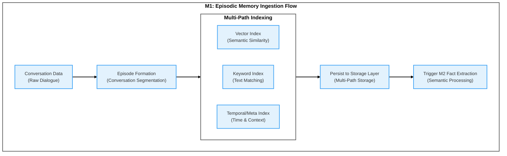
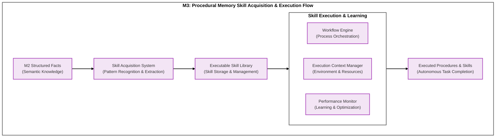
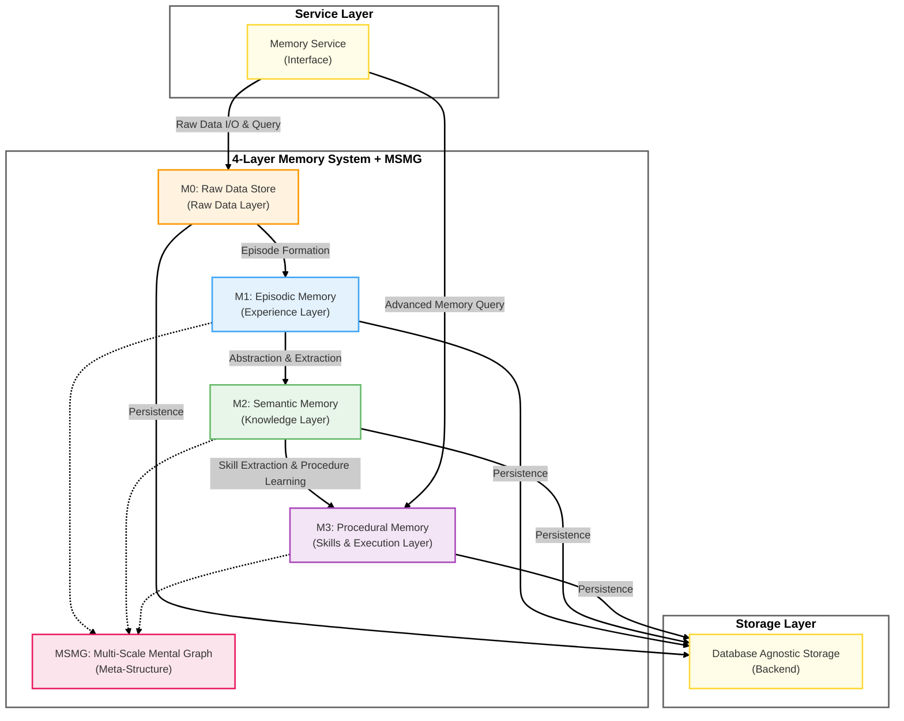
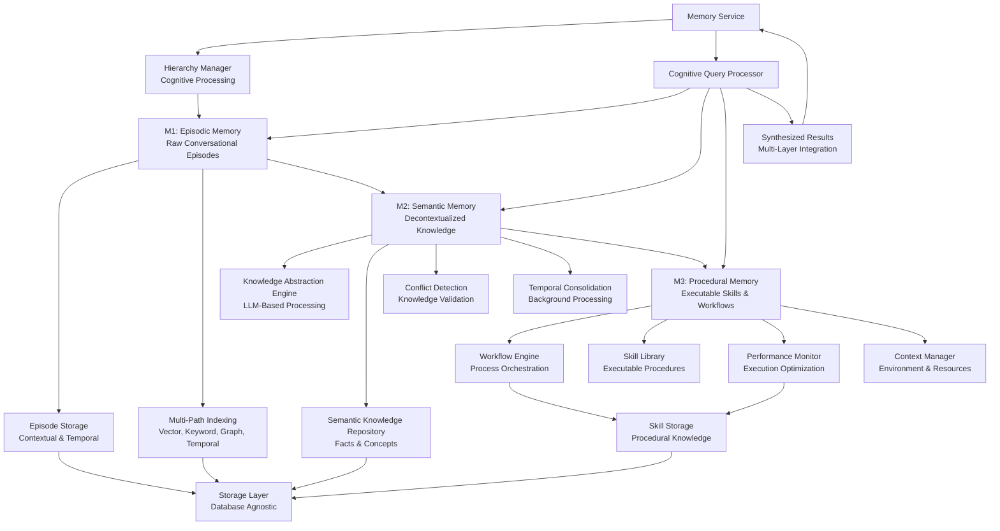
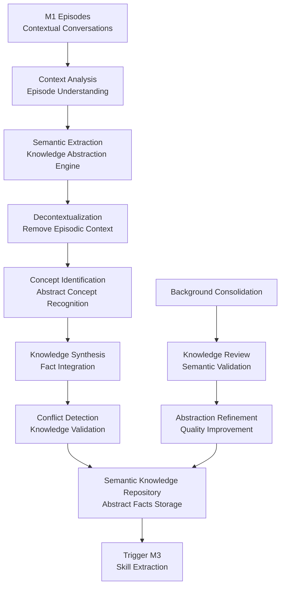
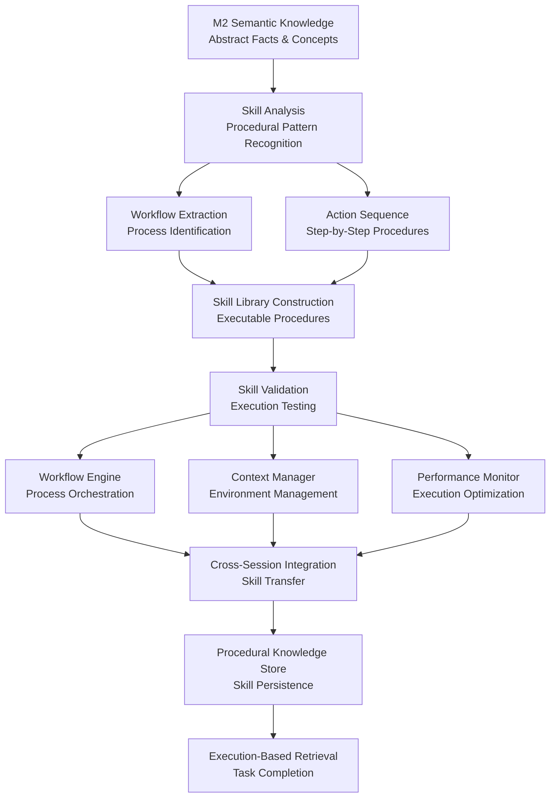
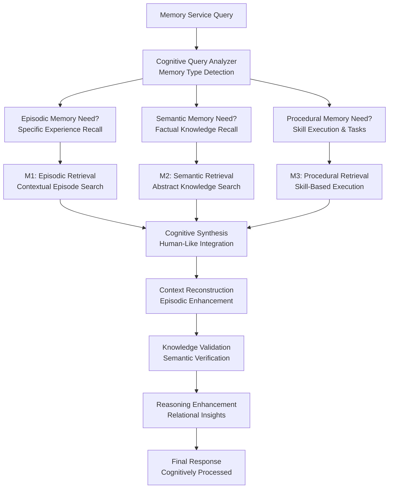

# MemFuse Memory Architecture

## Overview

MemFuse is positioned as a **complete knowledge ecosystem with full lifecycle management capabilities and dynamic evolution**. The core architecture directly maps cognitive science's multi-layered memory theory, depicting a complete information processing pipeline from raw signals to abstract wisdom.

MemFuse's core architecture follows the design philosophy of **"Service Layer Perceives, Memory Layer Thinks, Storage Layer Remembers"**, implementing a progressive information processing pipeline that mirrors human cognitive memory processes.

## Part I: MemFuse Core Architecture

### Positioning

MemFuse is a **knowledge ecosystem with complete lifecycle management capabilities and dynamic evolution**. The core architecture directly maps cognitive science's multi-layered memory theory, describing a complete information processing pipeline from raw signals to abstract wisdom.

### 1.1 Layered Memory Storage & Layer-Specific Managers

MemFuse's storage layer consists of multiple specialized memory types, **each memory type is maintained by a dedicated, tactical-level "Layer-Specific Memory Manager"**.

#### Guiding Principles:
- **Single Responsibility**: Each Manager is only responsible for internal operations (CRUD, indexing, deduplication, etc.) of its corresponding memory type, and provides standardized service APIs to upper layers (C1 routing engine, global KISS engine).
- **Implementation Decoupling**: M1 Manager can use vector databases, M2 Manager can use graph databases. Upper layer modules don't care about specific implementations, only interact through APIs.

#### Core Memory Layers & Corresponding Managers:

#### 1. M0: Raw Data Layer & M0 Manager
- **Description**: The starting point of memory. Stores completely unprocessed raw data in its original form, preserving complete fidelity of incoming information.
- **Implementation**: Multi-backend storage system using vector embeddings, keyword indices, and structured metadata. Implemented as `M0RawDataLayer` class with immediate storage capabilities.
- **Current Status**: ✅ Fully implemented with PgAI integration for automatic embedding generation

#### 2. M1: Episodic Memory Layer & M1 Manager
- **Description**: Event-centered memory storing personal experiences and specific events with rich contextual information.
- **Implementation**: Episode formation from M0 raw data with temporal and contextual metadata preservation. Implemented as `M1EpisodicLayer` class with PgAI integration for automatic embedding.
- **Current Status**: ✅ Implemented with parallel processing architecture, PgAI integration in progress

#### 3. M2: Semantic Memory Layer & M2 Manager
- **Description**: Stores general facts and concepts extracted from episodic experiences, providing abstracted knowledge representation.
- **Implementation**: LLM-based fact extraction from M1 episodes with validation and conflict resolution. Implemented as `M2SemanticLayer` class with fact storage and indexing capabilities.
- **Current Status**: ✅ Basic implementation complete, PgAI integration and advanced fact extraction in development

#### 4. M3: Procedural Memory Layer & M3 Manager
- **Description**: Stores learned patterns, procedures, and behavioral knowledge including skills, habits, and processes.
- **Implementation**: Pattern recognition from semantic knowledge with adaptive learning capabilities. Planned as `M3ProceduralLayer` class with reinforcement learning integration.
- **Current Status**: 🔄 Planned for future implementation - architecture designed but not yet implemented

### 1.2 MSMG: Multi-Scale Mental Graph

- **Positioning**: MSMG is not parallel to M0/M1/M2/M3, but rather the meta-structure that organizes, links, and elevates them.
- **Cognitive Science Foundation**: MSMG's design philosophy integrates psychological Schema Theory, explaining structured knowledge organization; and cognitive neuroscience's Global Neuronal Workspace Theory (GWT), explaining how structured knowledge is dynamically invoked to the conscious level.
  - **Cognitive Schema**: In psychology, schemas are mental frameworks used to organize and interpret information. For example, we have a "restaurant" schema containing tables, chairs, menus (M2 facts), ordering, eating, paying (M3 skills), and memories of specific restaurants we've visited (M1 episodes). MSMG mental graph is the collection and connection network of all Agent schemas.
  - **Global Neuronal Workspace Theory (GWT)**: This theory suggests consciousness arises from a distributed "broadcast system" in the brain, where processing results from different modules (like vision, memory) are broadcast to this global workspace, enabling information integration and unified cognition. MSMG can be seen as the long-term sedimentation and structured representation of this workspace.

- **MSMG Different Levels of Abstraction**:
  1. **Instance Layer**: The bottom layer of the graph, composed of countless Contextual Knowledge Graphs (CKGs), achieving "horizontal expansion" of knowledge. Each CKG corresponds to a specific event (like a chat session, reading a book, executing a workflow). The same entity in different CKGs links to unified nodes in the ontology layer, forming a vast experience network.
  2. **Ontology/Schema Layer**: The skeleton of the graph, achieving "vertical abstraction" of knowledge by defining Classes, Hierarchy relationships, and Properties. It ensures logical consistency of the graph and provides a strict structural foundation for reasoning.
     - **Classes**: Events, places, people, books, etc.
     - **Hierarchy**: Different granularities or organizational level abstractions
     - **Properties**: Additional information for each type or hierarchy relationship
  3. **Meta-cognitive Layer**: The "self-awareness" of the graph, recording knowledge about knowledge. Its core feature is Traceable Knowledge Provenance, i.e., data lineage. It attaches metadata like source, credibility, reasoning paths to each knowledge point, giving the system introspection, self-correction, and explainability capabilities.

### 1.3 KISS: Global Knowledge Integration & Synthesis System

The Layer-Specific Managers interact with the upper-level **KISS (Global Knowledge Integration & Synthesis System)** engine.

#### Relationship with Layer-Specific Managers
- **KISS engine is the "Central Government"**, while Layer-Specific Managers are "Local Governments"
- **KISS does not execute specific storage operations**, but issues strategic directives or performs cross-layer analysis

#### Core Responsibilities:

1. **Initiate Macro Tasks**: Schedule periodic system consolidation and **Forgetting** tasks. Forgetting mechanisms include **Graceful Decay** and **Active Pruning**.

2. **Perform Cross-Layer Synthesis**: KISS's core value lies in analyzing **data across different memory layers** to discover high-order patterns. It requests data from Layer-Specific Managers, analyzes it, and directly creates new abstract relationships in MSMG.

3. **Handle Escalated Exceptions**: When Layer-Specific Managers encounter problems they cannot resolve themselves (such as **Conflict Resolution**), they escalate the issue to KISS, which initiates higher-level **Meta-cognitive Arbitration** processes.

## Part II: Memory Lifecycle

This defines the core mechanism that makes MemFuse a "dynamically evolving" system, including knowledge birth, invocation, elevation, and health management.

### 2.1 Encoding & Indexing: Knowledge Birth

Executed automatically by the internal Knowledge Integration & Synthesis System (KISS), i.e., Reflexive Synthesis Engine, through the following process for knowledge internalization.

- **Process (ETLS)**:
  - **E - Extract**: Extract entities, relationships, time, etc. from M0 raw data
  - **T - Transform**: Transform into M1's vectorized log streams and M2's dual representation (vector + triple)
  - **L - Link**: Link new knowledge to MSMG graph's instance and ontology layers
  - **S - Synthesize**: Discover new patterns and abstractions based on linking

### 2.2 Extraction & Retrieval: Knowledge Invocation

Uses Hybrid Retrieval Funnel, a multi-stage strategy from broad to precise:
1. **Stage 1**: Fast Parallel Vector Recall (Broad Semantic Recall)
2. **Stage 2**: Structured Graph Traversal (Structured Graph Traversal)
3. **Stage 3**: Context Synthesis & Generation (Context Synthesis & Generation)

### 2.3 Learning & Evolution: Knowledge Elevation

Driven by Introspection Loop, including two modes:
- **Active Mode - Introspection**: Event-driven, performing fast, dramatic changes
- **Passive Mode - Consolidation**: Cycle-driven, performing slow, gentle optimization

### 2.4 Maintenance & Dynamics: Knowledge Health Management

- **Conflict Resolution**: Resolve memory contradictions and conflicts
- **Forgetting Mechanisms**: Simulate human brain forgetting mechanisms
- **Temporal Reasoning**: Implemented by storing standardized temporal relationships in MSMG

## Current Implementation Status

The MemFuse memory hierarchy is currently **partially operational** with only M1 layer actively processing data:

- **M1 (Episodic)**: ✅ **Active** - Handles immediate message storage and retrieval through MemoryService
- **M2 (Semantic)**: ❌ **Inactive** - Code exists in hierarchy/ directory but is NOT integrated into MemoryService execution flow
- **M3 (Procedural)**: ❌ **Inactive** - Code exists in hierarchy/ directory but is NOT integrated into MemoryService execution flow

**Current Data Flow**: `API → BufferService → MemoryService → M1 Processing Only → Store Classes`

**Processing Model**: MemoryService currently only processes M1 episodic memory. M2 and M3 layers exist as complete implementations in the hierarchy/ directory but are not activated or integrated into the main execution flow.

**Future Vision**: The architecture is designed for eventual unified Memory Layer abstraction where MemoryService would call a single Memory Layer that handles parallel M1/M2/M3 processing internally, completely decoupled from MemoryService logic.

## Layer Architecture

### M1: Episodic Memory Layer

**Purpose**: Store and maintain raw conversational episodes with full contextual and temporal information, mirroring human episodic memory for specific experiences and events.

**Cognitive Analogy**: Human Episodic Memory - stores specific, autobiographical events with temporal, spatial, and emotional context, preserving the complete experiential nature of conversations.

**Core Function**: Faithfully records everything, preserving complete snapshots of every conversation with all contextual metadata and enabling multi-path indexing for different query optimization paths.

#### Core Components

**Episode Storage System**:
- **Conversation Episodes**: Complete user-assistant interaction sequences with temporal ordering
- **Contextual Metadata**: Session information, timestamps, user context, and environmental factors
- **Experiential Details**: Emotional context, interaction patterns, and conversational flow
- **Temporal Sequences**: Chronological ordering and relationship between episodes
- **Source Attribution**: Complete provenance tracking for each conversational episode

**Multi-Path Indexing Infrastructure**:
- **Vector Indexing**: Semantic embedding-based similarity search across episodes
- **Keyword Indexing**: Full-text search capabilities for content-based retrieval
- **Temporal/Metadata Indexing**: Time-based access patterns and structured contextual search

**Key Technology**: Parallel establishment of Vector and Keyword indices to support both semantic similarity and exact text matching retrieval, enabling comprehensive episode access patterns for different query optimization paths.

#### Key Features

**Multi-Path Indexing Strategy**:
- **Parallel Processing**: Simultaneous indexing across all store types
- **Consistency Guarantees**: ACID transactions for metadata operations
- **Incremental Updates**: Efficient updates without full reindexing
- **Schema Evolution**: Backward-compatible schema migration support

**Chunk-Based Organization**:
- **Atomic Units**: User-assistant message pairs as indivisible chunks
- **Token Management**: Configurable chunking strategies (character, message, contextual)
- **Overlap Handling**: Configurable chunk overlap for context preservation
- **Metadata Preservation**: Rich metadata attached to each chunk

**Memory Service Integration**:
- **Service Layer Interface**: Clean integration with Memory Service APIs
- **Asynchronous Processing**: Non-blocking episode processing and indexing
- **Event-Driven Architecture**: Reactive processing based on memory service events
- **Error Handling**: Robust error recovery and retry mechanisms

**Episodic Access Patterns**:
- **Recency-Based Retrieval**: Recent episodes prioritized for faster access
- **Context-Aware Search**: Retrieval based on conversational context and session
- **Temporal Navigation**: Chronological browsing and time-based filtering
- **Similarity Matching**: Content-based episode similarity and clustering

#### Data Flow Architecture

**M1 Episodic Memory Ingestion Flow**:



**Episode Ingestion Pipeline**:
```
Memory Service → Episode Formation → Contextual Enrichment → Multi-Path Indexing → M2 Trigger
                        ↓                    ↓                        ↓
                Episode Boundaries    Temporal Context      Parallel Processing:
                Session Context       Metadata Extraction   - Vector Embeddings
                User Context         Emotional Context      - Keyword Indexing
                                                           - Temporal Sequences
```

**Episodic Retrieval Pipeline**:
```
Memory Service Query → Context Analysis → Multi-Path Search → Episode Reconstruction → Response
                              ↓                  ↓                    ↓
                      Session Context    - Semantic Similarity    Full Episode Context
                      Temporal Context   - Keyword Matching       Temporal Relationships
                      User Context       - Graph Traversal        Contextual Metadata
                                        - Temporal Filtering
```

#### Interface Specifications

**M1Manager Interface**:
```python
class M1Manager(MemoryLayer):
    async def add(self, item: Any) -> str
    async def add_batch(self, items: List[Any]) -> List[str]
    async def get(self, item_id: str) -> Optional[Any]
    async def search(self, query: str, top_k: int = 5, store_types: List[str] = None) -> List[Any]
    async def delete(self, item_id: str) -> bool
    async def update(self, item_id: str, item: Any) -> bool
    async def count(self, store_type: str = None) -> int
    async def clear(self, store_type: str = None) -> bool
```

**Store Integration Interface**:
```python
class StoreCoordinator:
    async def parallel_index(self, chunks: List[ChunkData]) -> Dict[str, List[str]]
    async def unified_query(self, query: str, stores: List[str]) -> Dict[str, List[Any]]
    async def consistency_check(self) -> Dict[str, bool]
    async def optimize_indices(self) -> Dict[str, Any]
```

#### Configuration Options

**Store Configuration**:
```yaml
m1:
  metadata_db:
    path: "data/metadata.db"
    connection_pool_size: 10
    wal_mode: true
  vector_store:
    type: "qdrant"  # qdrant, numpy, sqlite
    embedding_model: "all-MiniLM-L6-v2"
    dimension: 384
    cache_size: 1000
  keyword_store:
    stemming: true
    stop_words: "english"
    min_word_length: 3
    max_phrase_length: 5
  graph_store:
    format: "graphml"
    auto_extract_entities: true
    relationship_threshold: 0.7
```

**Performance Tuning**:
```yaml
m1_performance:
  batch_size: 50
  parallel_workers: 4
  cache_ttl: 3600
  index_optimization_interval: 86400
  consistency_check_interval: 3600
```

### M2: Semantic Memory Layer

**Purpose**: Extract and consolidate semantic knowledge from episodic experiences, mirroring the human semantic memory system that stores general knowledge and facts independent of specific experiential contexts.

**Cognitive Analogy**: Human Semantic Memory - stores decontextualized, universal facts that have been abstracted from specific episodic experiences, creating a repository of general knowledge.

**Core Function**: Extracts universal knowledge from M1 episodes through LLM-based abstraction, performing knowledge validation, conflict detection, temporal processing, and memory consolidation to produce high-quality, structured fact repositories.

#### Core Components

**Semantic Knowledge Repository**:
- **Abstract Facts Storage**: Decontextualized factual knowledge extracted from episodes
- **Concept Definitions**: Structured definitions and attributes of identified concepts
- **Knowledge Schemas**: Organized knowledge structures and categorical relationships
- **Abstraction Levels**: Multiple levels of knowledge abstraction and generalization
- **Validation Metadata**: Confidence scores, source strength, and verification status

**Knowledge Abstraction Engine**:
- **LLM-Based Extraction**: Advanced language model integration for semantic extraction
- **Context Removal**: Systematic removal of episodic context to create general knowledge
- **Concept Identification**: Recognition and classification of abstract concepts
- **Knowledge Synthesis**: Combination and integration of related semantic information
- **Abstraction Validation**: Quality assurance for abstracted knowledge

**Conflict Detection Engine**:
- **Logic Validation**: Automated detection of logical contradictions
- **Temporal Conflicts**: Identification of timeline inconsistencies
- **Entity Conflicts**: Detection of conflicting entity attributes
- **Source Credibility**: Weighting facts based on source reliability
- **Confidence Scoring**: ML-based confidence assessment for facts
- **Resolution Strategies**: Automated and manual conflict resolution workflows

**Temporal Processor**:
- **Absolute Time Extraction**: Natural language date/time parsing
- **Relative Time Modeling**: Before/after/during relationship extraction
- **Event Sequencing**: Chronological ordering of extracted facts
- **Duration Modeling**: Time span and duration extraction
- **Temporal Anchoring**: Linking relative times to absolute timestamps
- **Timeline Construction**: Building coherent timelines from facts

**Memory Consolidation Engine**:
- **Background Scheduler**: Configurable periodic consolidation tasks (analogous to sleep-time memory consolidation)
- **Fact Verification**: Re-validation of historical facts with new context
- **Redundancy Detection**: Identification and merging of duplicate facts
- **Confidence Updates**: Dynamic confidence score adjustments
- **Source Integration**: Incorporation of new sources for existing facts
- **Performance Monitoring**: Consolidation effectiveness tracking

**Key Process**: Memory Consolidation - a critical background process where the system periodically reviews, validates, merges, and optimizes existing facts, similar to how the human brain organizes memories during sleep.

#### Key Features

**Advanced Batch Processing**:
- **Context-Aware Extraction**: Process 5 chunks with overlapping context
- **Sliding Window**: Maintain context across batch boundaries
- **Parallel Processing**: Concurrent fact extraction from multiple batches
- **Priority Queuing**: Prioritize recent or high-importance chunks
- **Adaptive Batching**: Dynamic batch size based on content complexity

**Comprehensive Source Lineage**:
- **Multi-Level Tracking**: Links to M1 chunks, sessions, and users
- **Provenance Graphs**: Visual representation of fact derivation
- **Source Weighting**: Credibility scoring for different source types
- **Update Propagation**: Automatic updates when source data changes
- **Audit Trails**: Complete history of fact modifications and sources

**Advanced Temporal Awareness**:
- **Multi-Granularity Time**: Support for various time scales (seconds to years)
- **Uncertainty Modeling**: Handling of approximate and uncertain times
- **Cultural Time**: Support for different calendar systems and time zones
- **Temporal Reasoning**: Inference of implicit temporal relationships
- **Event Correlation**: Linking related events across time

**Intelligent Conflict Resolution**:
- **Evidence-Based Resolution**: Use source credibility and evidence strength
- **Human-in-the-Loop**: Escalation to human reviewers for complex conflicts
- **Confidence Thresholds**: Automatic resolution based on confidence levels
- **Resolution History**: Tracking of resolution decisions for learning
- **Consensus Building**: Multi-source fact validation and consensus

**Proactive Memory Consolidation**:
- **Incremental Updates**: Efficient processing of new information
- **Fact Lifecycle Management**: Automatic archival of outdated facts
- **Knowledge Refinement**: Continuous improvement of fact quality
- **Cross-Session Learning**: Learning from patterns across sessions
- **Adaptive Scheduling**: Dynamic consolidation frequency based on activity

#### Processing Workflows

**M2 Semantic Memory Abstraction & Consolidation Flow**:

```mermaid
---
config:
  theme: neo
---
graph TD
    subgraph m2_flow ["M2: Semantic Memory Abstraction & Consolidation Flow"]
        Input["M1 Episodic Chunks<br/>(Conversation Episodes)"] --> AbstractionEngine["Knowledge Abstraction Engine (LLM)<br/>(Fact Extraction)"]
        subgraph processing_sub ["Fact Processing Pipeline"]
            direction LR
            ConflictDetection["Conflict Detection"] --> TemporalProcessing["Temporal Processing"] --> Consolidation["Memory Consolidation"]
        end
        AbstractionEngine -- "Extract Raw Facts" --> processing_sub
        processing_sub --> Output["Structured Facts<br/>(Knowledge Repository)<br/>Store in Database"]
        Output --> TriggerM3["Trigger M3 Relationship Building<br/>(Graph Construction)"]
    end
    classDef default fill:#fff,stroke:#333,stroke-width:2px,font-size:14px,white-space:nowrap;
    classDef header_style stroke:#616161,stroke-width:2px,color:black,font-weight:bold,font-size:16px,white-space:nowrap;
    classDef node_style fill:#E8F5E9,stroke:#66BB6A;
    class Input,AbstractionEngine,ConflictDetection,TemporalProcessing,Consolidation,Output,TriggerM3 node_style;
    m2_flow:::header_style;
    processing_sub:::header_style;
```



**Real-Time Fact Extraction**:
```
M1 Chunks (batch of 5) → Context Assembly → LLM Fact Extraction → Raw Facts
                                                                      ↓
Raw Facts → Conflict Detection → Temporal Processing → Source Lineage → Facts DB
                    ↓                      ↓                ↓
            Conflict Resolution    Time Normalization    Provenance Links
                    ↓                      ↓                ↓
            Updated Facts         Temporal Relations    Lineage Table
                                                              ↓
                                                    Trigger M3 Processing
```

**Background Consolidation Workflow**:
```
Consolidation Timer → Fact Selection → Context Retrieval → LLM Re-validation
                                                                  ↓
Re-validation Results → Conflict Analysis → Confidence Updates → Database Updates
                                ↓
                        Resolution Actions → Fact Merging/Splitting → Audit Log
```

#### Interface Specifications

**M1Manager Interface**:
```python
class M1Manager(MemoryLayer):
    async def process_batch(self, chunks: List[ChunkData]) -> List[str]
    async def extract_facts(self, content: str, context: List[str]) -> List[Fact]
    async def detect_conflicts(self, facts: List[Fact]) -> List[Conflict]
    async def resolve_conflict(self, conflict: Conflict) -> Resolution
    async def consolidate_facts(self, fact_ids: List[str]) -> ConsolidationResult
    async def get_temporal_relations(self, fact_id: str) -> List[TemporalRelation]
    async def search_facts(self, query: str, temporal_filter: TimeRange = None) -> List[Fact]
```

**Fact Data Model**:
```python
@dataclass
class Fact:
    id: str
    content: str
    confidence: float
    source_ids: List[str]
    temporal_info: TemporalInfo
    entity_mentions: List[str]
    fact_type: FactType
    validation_status: ValidationStatus
    created_at: datetime
    updated_at: datetime
```

#### Configuration Options

**Extraction Configuration**:
```yaml
m1:
  extraction:
    batch_size: 5
    context_window: 2  # chunks before/after
    llm_model: "gpt-4"
    max_facts_per_chunk: 10
    min_confidence_threshold: 0.7
  conflict_detection:
    enabled: true
    auto_resolve_threshold: 0.9
    escalation_threshold: 0.5
    resolution_strategies: ["evidence_based", "source_credibility", "temporal_priority"]
  temporal_processing:
    time_extraction: true
    relative_time_resolution: true
    timezone_normalization: "UTC"
    uncertainty_modeling: true
  consolidation:
    enabled: true
    interval: 3600  # seconds
    batch_size: 100
    max_age_for_review: 604800  # 1 week
```

### M3: Procedural Memory Layer

**Purpose**: Store and manage procedural knowledge about "how to do" skills, habits, workflows, and executable processes, enabling the system to learn, retain, and execute complex behavioral patterns and operational procedures.

**Cognitive Analogy**: Human Procedural Memory - represents the brain's ability to store and execute learned skills, habits, and motor sequences without conscious effort, such as riding a bike or typing on a keyboard.

**Core Function**: Encapsulates Standard Operating Procedures (SOPs), successful action trajectories, and executable workflows as reusable "skills" that can be invoked, combined, and refined over time to enable autonomous task execution and behavioral learning.

#### Core Components

**Executable Skill Library**:
- **Skill Definitions**: Structured representations of procedural knowledge and workflows
- **Action Sequences**: Step-by-step procedures and operational sequences
- **Skill Parameters**: Configurable parameters and input/output specifications
- **Skill Metadata**: Execution context, success rates, and performance metrics
- **Skill Versioning**: Version control and evolution tracking for skills
- **Skill Dependencies**: Inter-skill relationships and prerequisite management

**Workflow Engine**:
- **Process Orchestration**: Coordination and execution of complex multi-step workflows
- **Task Scheduling**: Temporal scheduling and dependency management
- **Error Handling**: Exception handling and recovery mechanisms
- **State Management**: Workflow state tracking and persistence
- **Parallel Execution**: Concurrent execution of independent workflow branches
- **Workflow Validation**: Pre-execution validation and feasibility checking

**Skill Acquisition System**:
- **Pattern Recognition**: Identification of successful action patterns from M2 semantic knowledge
- **Skill Extraction**: Automatic extraction of procedural knowledge from successful experiences
- **Skill Generalization**: Abstraction of specific actions into reusable skill templates
- **Skill Validation**: Testing and validation of extracted skills
- **Skill Optimization**: Performance optimization and refinement of existing skills
- **Skill Composition**: Combination of simple skills into complex procedures

**Execution Context Manager**:
- **Environment Modeling**: Representation of execution environments and constraints
- **Resource Management**: Allocation and management of computational and external resources
- **Context Switching**: Management of different execution contexts and environments
- **State Persistence**: Saving and restoring execution states across sessions
- **Context Validation**: Verification of execution prerequisites and conditions
- **Context Analytics**: Analysis of execution patterns and context effectiveness

**Skill Performance Monitor**:
- **Execution Tracking**: Real-time monitoring of skill execution and performance
- **Success Metrics**: Collection and analysis of skill success rates and outcomes
- **Performance Analytics**: Statistical analysis of skill effectiveness over time
- **Failure Analysis**: Root cause analysis of skill execution failures
- **Optimization Recommendations**: Suggestions for skill improvement and optimization
- **Learning Feedback**: Integration of execution results back into skill refinement

**Procedural Knowledge Graph**:
- **Skill Nodes**: Graph representation of individual skills and procedures
- **Dependency Edges**: Relationships between skills, prerequisites, and compositions
- **Execution Paths**: Optimal paths for achieving specific goals through skill combinations
- **Skill Clustering**: Grouping of related skills by domain, complexity, or function
- **Knowledge Inheritance**: Hierarchical organization of skills from general to specific
- **Cross-Domain Linking**: Connections between skills across different domains and contexts

**Key Value**: Procedural memory enables autonomous task execution, behavioral learning, and the development of increasingly sophisticated operational capabilities through experience and practice.

#### Key Features

**Incremental Knowledge Construction**:
- **Real-Time Updates**: Immediate graph updates from M1 facts
- **Incremental Learning**: Continuous knowledge graph refinement
- **Change Propagation**: Efficient updates across related entities
- **Version Control**: Knowledge graph versioning and rollback capabilities
- **Conflict Resolution**: Graph-level conflict detection and resolution
- **Quality Assurance**: Automated quality checks and validation

**Multi-Level Graph Organization**:
- **Hierarchical Structure**: Session → People → Global graph hierarchy
- **Cross-Graph Linking**: Intelligent linking between graph levels
- **Scope Management**: Query scope control (session, person, global)
- **Access Control**: Fine-grained access control per graph level
- **Synchronization**: Consistency maintenance across graph levels
- **Performance Optimization**: Level-specific optimization strategies

**Advanced Reasoning Capabilities**:
- **Transitive Reasoning**: Inference of implicit relationships
- **Temporal Reasoning**: Time-aware relationship inference
- **Causal Reasoning**: Cause-effect chain analysis
- **Analogical Reasoning**: Pattern-based relationship inference
- **Probabilistic Reasoning**: Uncertainty-aware inference
- **Explanation Generation**: Reasoning path explanation and visualization

**Sophisticated Retrieval Strategies**:
- **Multi-Path Queries**: Support for various query types and modalities
- **Contextual Adaptation**: Query adaptation based on session/person context
- **Relevance Feedback**: Learning from user feedback and interactions
- **Diversity Optimization**: Ensuring diverse and comprehensive results
- **Real-Time Personalization**: Dynamic personalization based on current context
- **Explainable Results**: Transparent reasoning paths for retrieved results

#### Processing Workflows

**M3 Procedural Memory Skill Acquisition & Execution Flow**:



**Knowledge Graph Construction**:
```
M1 Facts → Entity Extraction → Entity Linking → Relationship Extraction
                                    ↓                    ↓
                            Entity Validation    Relationship Validation
                                    ↓                    ↓
                            Session Graph Update → People Graph Update → Global Graph Update
                                                                              ↓
                                                                    Index Optimization
```

**Advanced Retrieval Pipeline**:
```
User Query → Query Analysis → Context Enrichment → Multi-Strategy Retrieval
                                                            ↓
                                                    DPR Semantic Search
                                                    PPR Relationship Ranking
                                                    GNN Graph Reasoning
                                                            ↓
                                                    Result Fusion → Ranking → Explanation
```

**Background Consolidation**:
```
Consolidation Trigger → Entity Resolution → Relationship Optimization → Graph Pruning
                                ↓                      ↓                    ↓
                        Cross-Session Linking    Redundancy Removal    Performance Tuning
                                ↓                      ↓                    ↓
                        People Graph Update    Relationship Weights    Index Rebuilding
```

#### Interface Specifications

**M2Manager Interface**:
```python
class M2Manager(MemoryLayer):
    async def process_fact(self, fact: Fact) -> GraphUpdateResult
    async def extract_entities(self, fact: Fact) -> List[Entity]
    async def extract_relationships(self, fact: Fact, entities: List[Entity]) -> List[Relationship]
    async def update_session_graph(self, session_id: str, entities: List[Entity], relationships: List[Relationship]) -> bool
    async def update_people_graph(self, person_id: str, entities: List[Entity], relationships: List[Relationship]) -> bool
    async def dpr_search(self, query: str, top_k: int = 10) -> List[Entity]
    async def ppr_search(self, query: str, person_id: str = None, top_k: int = 10) -> List[Entity]
    async def multi_hop_reasoning(self, start_entity: str, target_entity: str, max_hops: int = 3) -> List[Path]
    async def consolidate_graphs(self, scope: str = "all") -> ConsolidationResult
```

**Graph Data Models**:
```python
@dataclass
class Entity:
    id: str
    name: str
    entity_type: str
    attributes: Dict[str, Any]
    confidence: float
    source_fact_ids: List[str]
    session_ids: List[str]
    created_at: datetime
    updated_at: datetime

@dataclass
class Relationship:
    id: str
    subject_id: str
    predicate: str
    object_id: str
    weight: float
    confidence: float
    temporal_info: TemporalInfo
    source_fact_ids: List[str]
    created_at: datetime
    updated_at: datetime
```

#### Configuration Options

**Graph Configuration**:
```yaml
m2:
  graph_database:
    type: "neo4j"  # neo4j, networkx, custom
    connection_url: "bolt://localhost:7687"
    max_connections: 50
    transaction_timeout: 30
  entity_extraction:
    ner_model: "spacy_lg"
    custom_entity_types: ["PERSON", "ORGANIZATION", "CONCEPT", "EVENT"]
    confidence_threshold: 0.8
    coreference_resolution: true
  relationship_extraction:
    extraction_model: "gpt-4"
    relationship_types: ["RELATED_TO", "WORKS_FOR", "LOCATED_IN", "CAUSED_BY"]
    weight_calculation: "confidence_based"
    temporal_relationships: true
  retrieval:
    dpr:
      model: "facebook/dpr-question_encoder-single-nq-base"
      index_type: "faiss"
      embedding_dim: 768
    ppr:
      damping_factor: 0.85
      max_iterations: 100
      convergence_threshold: 1e-6
      personalization_strength: 0.1
  consolidation:
    enabled: true
    interval: 86400  # 24 hours
    entity_resolution_threshold: 0.9
    relationship_pruning_threshold: 0.3
    cross_session_linking: true
```

## Integration Architecture

### Memory Service Integration

The memory hierarchy operates as an intermediate processing layer between the Memory Service and Storage Layer, providing cognitive-level memory processing capabilities:

#### Memory Service Interface Strategy

**Service Layer Integration**:
- **Event-Driven Processing**: React to memory service events for episode formation
- **Asynchronous Processing**: Non-blocking cognitive processing of memory operations
- **Layered Abstraction**: Clean separation between service logic and cognitive processing
- **Configurable Processing**: Selective activation of memory hierarchy layers

**Integration Points**:
```python
class MemoryServiceIntegration:
    def __init__(self, hierarchy_manager: HierarchyMemoryManager):
        self.hierarchy_manager = hierarchy_manager

    async def on_conversation_episode(self, episode: ConversationEpisode) -> None:
        """Called when Memory Service identifies a complete episode"""
        # Trigger M1 processing
        await self.hierarchy_manager.m1_manager.process_episode(episode)

    async def on_session_completion(self, session_id: str) -> None:
        """Called when a conversation session completes"""
        # Trigger cross-layer consolidation
        await self.hierarchy_manager.consolidate_session(session_id)
```

#### Query Processing Integration

**Cognitive Query Processing**:
- **Multi-Layer Query Coordination**: Intelligent routing across memory hierarchy layers
- **Context-Aware Retrieval**: Query processing based on cognitive memory principles
- **Result Synthesis**: Integration of episodic, semantic, and relational knowledge
- **Adaptive Query Strategies**: Dynamic query optimization based on content type

**Query Flow Integration**:
```python
class CognitiveQueryProcessor:
    async def process_memory_query(self, query: str, context: QueryContext) -> QueryResult:
        """Process query through cognitive memory hierarchy"""
        # Analyze query type and cognitive requirements
        cognitive_strategy = await self.analyze_cognitive_needs(query, context)

        # Execute parallel queries across appropriate layers
        results = await asyncio.gather(
            self.episodic_query(query) if cognitive_strategy.needs_episodes else None,
            self.semantic_query(query) if cognitive_strategy.needs_facts else None,
            self.relational_query(query) if cognitive_strategy.needs_reasoning else None
        )

        # Synthesize results using cognitive principles
        return await self.cognitive_synthesis(results, query, context)
```

### Storage Layer Abstraction

#### Database-Agnostic Architecture

**Storage Interface Abstraction**:
The memory hierarchy implements database-agnostic interfaces that can work with any storage backend:

```python
class StorageLayerInterface:
    """Abstract interface for storage layer integration"""

    def __init__(self, storage_config: StorageConfig):
        self.storage_config = storage_config

    async def store_episode(self, episode: Episode) -> str:
        """Store episode in underlying storage system"""
        pass

    async def query_episodes(self, query: EpisodeQuery) -> List[Episode]:
        """Query episodes from storage system"""
        pass

    async def store_semantic_knowledge(self, knowledge: SemanticKnowledge) -> str:
        """Store semantic knowledge in storage system"""
        pass

    async def query_semantic_knowledge(self, query: SemanticQuery) -> List[SemanticKnowledge]:
        """Query semantic knowledge from storage system"""
        pass
```

**Pluggable Storage Implementations**:
```python
class StorageFactory:
    """Factory for creating storage implementations"""

    @staticmethod
    def create_vector_store(config: VectorStoreConfig) -> VectorStoreInterface:
        """Create vector store implementation based on configuration"""
        if config.type == "qdrant":
            return QdrantVectorStore(config)
        elif config.type == "weaviate":
            return WeaviateVectorStore(config)
        elif config.type == "pinecone":
            return PineconeVectorStore(config)
        else:
            raise ValueError(f"Unsupported vector store type: {config.type}")

    @staticmethod
    def create_document_store(config: DocumentStoreConfig) -> DocumentStoreInterface:
        """Create document store implementation based on configuration"""
        if config.type == "mongodb":
            return MongoDocumentStore(config)
        elif config.type == "postgresql":
            return PostgreSQLDocumentStore(config)
        else:
            raise ValueError(f"Unsupported document store type: {config.type}")
```

#### Service Layer Integration

**MemoryInterface Implementation**:
The `HierarchyMemoryManager` implements the existing `MemoryInterface` to provide drop-in replacement capability:

```python
class HierarchyMemoryManager(MemoryInterface):
    """Hierarchy system implementing standard MemoryInterface"""

    async def add(self, messages: List[Dict[str, Any]]) -> Dict[str, Any]:
        """Add messages through hierarchy pipeline"""
        # Convert messages to chunks
        chunks = await self.convert_messages_to_chunks(messages)

        # Process through hierarchy
        chunk_ids = await self.add_batch(chunks)

        return {
            "status": "success",
            "message_ids": chunk_ids,
            "layers_processed": ["m1", "m2", "m3"]
        }

    async def query(self, query: str, top_k: int = 5, **kwargs) -> Dict[str, Any]:
        """Query through hierarchy system"""
        results = await self.search(query, top_k)

        return {
            "status": "success",
            "results": results,
            "layers_queried": self.get_active_layers(),
            "total_results": len(results)
        }
```

**BufferService Integration**:
```python
class HierarchyBufferService(BufferService):
    """Enhanced BufferService with hierarchy integration"""

    def __init__(self, config: Dict[str, Any]):
        super().__init__(config)
        self.hierarchy_manager = HierarchyMemoryManager(
            user_id=config.get('user_id'),
            data_dir=config.get('data_dir'),
            vector_store=self.vector_store,
            graph_store=self.graph_store,
            keyword_store=self.keyword_store,
            metadata_db=self.metadata_db,
            buffer_manager=self,
            config=config.get('hierarchy', {})
        )

    async def enhanced_query(self, query: str, **kwargs) -> Dict[str, Any]:
        """Enhanced query with hierarchy capabilities"""
        # Use hierarchy system for advanced queries
        if kwargs.get('use_hierarchy', True):
            return await self.hierarchy_manager.query(query, **kwargs)
        else:
            # Fall back to standard buffer query
            return await super().query(query, **kwargs)
```

### Configuration Architecture

**Hierarchical Configuration Schema**:
```yaml
memfuse:
  # Memory hierarchy configuration
  memory_hierarchy:
    enabled: true

    # M1: Episodic Memory
    m1_episodic:
      enabled: true
      storage_backend: "configurable"  # mongodb, postgresql, etc.
      indexing_strategies: ["vector", "keyword", "temporal", "metadata"]
      episode_retention_policy: "time_based"  # time_based, size_based, hybrid

    # M2: Semantic Memory
    m2_semantic:
      enabled: true
      abstraction_engine: "llm_based"  # llm_based, rule_based, hybrid
      knowledge_validation: true
      conflict_resolution: "evidence_based"
      consolidation_schedule: "periodic"

    # M3: Procedural Memory
    m3_procedural:
      enabled: true
      skill_modeling: "executable_library"  # executable_library, workflow_based
      execution_strategies: ["orchestration", "monitoring", "optimization"]
      cross_session_skill_transfer: true

    # Storage abstraction
    storage:
      vector_store:
        type: "configurable"  # qdrant, weaviate, pinecone, etc.
        embedding_model: "configurable"
        dimension: 768
      document_store:
        type: "configurable"  # mongodb, postgresql, sqlite, etc.
        connection_pool_size: 10
      graph_store:
        type: "configurable"  # neo4j, arangodb, networkx, etc.
        relationship_indexing: true
```

**Migration Strategy**:
```python
class HierarchyMigrationManager:
    """Manages migration from existing system to hierarchy system"""

    async def migrate_existing_data(self) -> MigrationResult:
        """Migrate existing data to hierarchy system"""
        # 1. Export existing data
        existing_data = await self.export_existing_data()

        # 2. Process through hierarchy pipeline
        for batch in self.batch_data(existing_data):
            await self.hierarchy_manager.add_batch(batch)

        # 3. Validate migration
        return await self.validate_migration()

    async def gradual_rollout(self, percentage: float) -> None:
        """Gradually roll out hierarchy system"""
        # Route percentage of traffic to hierarchy system
        self.traffic_router.set_hierarchy_percentage(percentage)
```

## Processing Workflows

### Data Ingestion Workflow

1. **Raw Data Input**: Multi-modal raw data arrives via API
2. **M0 Storage**: Raw data stored in multi-modal object storage
3. **M1 Processing**: Episode formation and vectorized log stream creation
4. **M2 Trigger**: Batch of 5 chunks triggers fact extraction and abstraction
5. **M3 Trigger**: New facts trigger skill extraction and procedural learning
6. **MSMG Integration**: All layers contribute to Multi-Scale Mental Graph construction

### Query Processing Workflow

1. **Query Analysis**: Determine optimal layer(s) for retrieval
2. **Multi-Layer Search**:
   - M0: Raw data access and retrieval
   - M1: Direct vector/keyword/graph search on episodes
   - M2: Fact-based retrieval with temporal filtering
   - M3: Skill-based execution and procedural task completion
3. **MSMG Reasoning**: Multi-scale mental graph traversal and reasoning
4. **Result Fusion**: Combine and rank results from multiple layers
5. **Context Enhancement**: Enrich results with cross-layer information

### Background Consolidation Workflow

1. **M2 Consolidation**: Periodic fact verification and conflict resolution
2. **M3 Consolidation**: Skill optimization and procedural knowledge refinement
3. **MSMG Optimization**: Mental graph structure optimization and pruning
4. **Performance Optimization**: Index maintenance and cache warming
5. **Data Lifecycle**: Automated archival and cleanup of old data

## Configuration and Extensibility

### Layer Configuration

```yaml
hierarchy:
  m0:
    enabled: true
    storage_type: "multi_modal_object_store"
    supported_formats: ["text", "pdf", "image", "audio", "video"]
  m1:
    enabled: true
    stores: ["vector", "keyword", "graph", "metadata"]
    buffer_integration: true
    episode_formation: true
  m2:
    enabled: true
    extraction_batch_size: 5
    consolidation_interval: 3600  # 1 hour
    conflict_detection: true
    temporal_awareness: true
  m3:
    enabled: true
    skill_extraction: true
    workflow_engine: true
    execution_monitoring: true
    skill_optimization: true
    consolidation_interval: 86400  # 24 hours
  msmg:
    enabled: true
    instance_layer: true
    ontology_layer: true
    meta_cognitive_layer: true
    knowledge_provenance: true
```

### Extensibility Points

- **Custom Fact Extractors**: Pluggable LLM services for domain-specific extraction
- **Retrieval Strategies**: Configurable retrieval algorithms per layer
- **Consolidation Policies**: Customizable background processing schedules
- **Graph Algorithms**: Extensible graph analysis and ranking methods

## Performance Considerations

### Scalability
- **Asynchronous Processing**: Non-blocking fact extraction and graph updates
- **Batch Optimization**: Efficient batch processing for LLM operations
- **Caching Strategy**: Multi-level caching for frequently accessed data
- **Index Management**: Optimized indexing for fast retrieval across layers

### Resource Management
- **Memory Usage**: Configurable buffer sizes and cache limits
- **CPU Utilization**: Balanced processing across hierarchy layers
- **Storage Optimization**: Efficient data compression and archival
- **Network Efficiency**: Optimized LLM API usage and batching

## Flow Diagrams

### Overall Architecture Flow

The following diagram shows the four-layer memory hierarchy implementing the progressive information processing pipeline from raw data to abstract wisdom:



The following diagram shows the cognitive memory hierarchy positioned between Memory Service and Storage Layer:



## Summary of Architecture Updates

### Major Structural Changes

1. **Expanded Memory Hierarchy**: Updated from 3-layer (M0/M1/M2) to 4-layer (M0/M1/M2/M3) architecture:
   - **M0**: Raw Data Store (new layer for unprocessed multi-modal data) *(Future Feature)*
   - **M1**: Episodic Memory (previously M0, now handles episode formation)
   - **M2**: Semantic Memory (previously M1, handles fact extraction and abstraction)
   - **M3**: Procedural Memory (new layer for skills, workflows, and executable procedures)

2. **Added Layer-Specific Memory Managers**: Introduced dedicated tactical-level managers for each memory layer:
   - **M0 Manager**: Raw data storage and multi-modal object management
   - **M1 Manager**: Episodic memory and vectorized log stream management
   - **M2 Manager**: Semantic memory and dual-representation fact base management
   - **M3 Manager**: Procedural memory and executable skill library management

3. **Added KISS Global System**: Introduced Knowledge Integration & Synthesis System as the central coordination engine:
   - **Central Government Role**: Strategic directive issuing and cross-layer analysis
   - **Macro Task Management**: System consolidation and forgetting mechanisms
   - **Meta-cognitive Arbitration**: High-level conflict resolution and exception handling

4. **Added MSMG Meta-Structure**: Introduced Multi-Scale Mental Graph as the organizing meta-structure:
   - **Instance Layer**: Contextual Knowledge Graphs (CKGs) for specific events
   - **Ontology/Schema Layer**: Classes, hierarchies, and properties for knowledge organization
   - **Meta-cognitive Layer**: Knowledge provenance and data lineage tracking

5. **Enhanced Cognitive Science Foundation**: Integrated advanced cognitive theories:
   - **Schema Theory**: Mental frameworks for information organization
   - **Global Neuronal Workspace Theory**: Distributed consciousness and information integration
   - **Knowledge Lifecycle Management**: Complete birth-to-evolution knowledge processes

### Architectural Philosophy Updates

1. **Knowledge Ecosystem Positioning**: Redefined MemFuse as a complete knowledge ecosystem with full lifecycle management capabilities and dynamic evolution, rather than just a memory hierarchy.

2. **Progressive Information Processing**: Enhanced the pipeline from raw signals to abstract wisdom:
   - Raw Data → Episodes → Facts → Relationships → Mental Graph
   - ETLS Process: Extract → Transform → Link → Synthesize

3. **Memory Lifecycle Integration**: Added comprehensive lifecycle management:
   - **Encoding & Indexing**: Knowledge birth through KISS (Knowledge Integration & Synthesis System)
   - **Extraction & Retrieval**: Knowledge invocation via Hybrid Retrieval Funnel
   - **Learning & Evolution**: Knowledge elevation through Introspection Loop
   - **Maintenance & Dynamics**: Knowledge health management

### Implementation Status Updates

1. **Current State Clarification**: Updated implementation status to reflect M1-only active processing:
   - M1 (Episodic): ✅ Active
   - M2 (Semantic): ❌ Inactive (code exists but not integrated)
   - M3 (Relational): ❌ Inactive (code exists but not integrated)

2. **Future Vision**: Enhanced architectural roadmap for unified Memory Layer abstraction with parallel M1/M2/M3 processing.

### Technical Enhancements

1. **Multi-Modal Support**: Added M0 raw data store supporting text, PDF, image, audio, video formats *(Future Feature)*.

2. **Layer-Specific Management**: Implemented dedicated managers with single responsibility principle:
   - **Implementation Decoupling**: Each manager uses optimal storage technology for its layer
   - **Standardized APIs**: Uniform interfaces for upper-layer interaction
   - **Independent Scaling**: Each layer can scale independently based on workload

3. **Advanced Procedural Capabilities**: Enhanced M3 with sophisticated procedural memory:
   - Executable Skill Library with workflow orchestration
   - Skill acquisition and pattern recognition from semantic knowledge
   - Performance monitoring and skill optimization
   - Context-aware execution and resource management

4. **KISS Coordination System**: Implemented global knowledge integration:
   - Cross-layer synthesis and pattern discovery
   - Macro task scheduling and forgetting mechanisms
   - Meta-cognitive arbitration for complex conflicts

5. **Comprehensive Configuration**: Updated configuration schema to support all layers, managers, and MSMG components.

### Flow Diagram Updates

1. **Overall Architecture Flow**: Updated to show 4-layer + MSMG structure with proper data flow relationships.

2. **Processing Workflows**: Enhanced data ingestion, query processing, and consolidation workflows to reflect new architecture.

3. **Layer-Specific Flows**: Updated M2 and M3 flow diagrams with correct input/output relationships.

These updates transform the documentation from a simple 3-layer memory hierarchy to a comprehensive knowledge ecosystem architecture that better reflects MemFuse's cognitive science foundations and advanced capabilities.

### M2 Semantic Memory Pipeline

The M2 layer processes episodic memories through semantic abstraction and knowledge consolidation:



### M3 Procedural Memory Construction

The M3 layer builds executable skills and workflows enabling autonomous task execution:



### Cognitive Query Processing Flow

The system processes queries through cognitive memory principles for human-like retrieval:



## Implementation Roadmap

### Phase 1: Foundation (Weeks 1-4)
**M1 Layer Enhancement**:
- [ ] Enhance existing M1Manager with improved store coordination
- [ ] Implement parallel indexing across vector/keyword/graph stores
- [ ] Add comprehensive buffer integration hooks
- [ ] Implement unified query interface for M1 stores
- [ ] Add performance monitoring and metrics collection

**Core Infrastructure**:
- [ ] Refactor hierarchy base classes for better extensibility
- [ ] Implement configuration management system
- [ ] Add comprehensive logging and debugging capabilities
- [ ] Create migration utilities for existing data
- [ ] Establish testing framework for hierarchy components

### Phase 2: Facts Layer (Weeks 5-8)
**M1 Implementation**:
- [ ] Implement advanced LLM service integration
- [ ] Build conflict detection and resolution engine
- [ ] Create temporal processing and time awareness system
- [ ] Develop background consolidation framework
- [ ] Add fact validation and confidence scoring

**Integration Testing**:
- [ ] Test M1 → M2 data flow and processing
- [ ] Validate fact extraction quality and accuracy
- [ ] Performance testing for batch processing
- [ ] Integration testing with existing buffer system
- [ ] End-to-end testing of fact lifecycle

### Phase 3: Knowledge Graph (Weeks 9-12)
**M2 Implementation**:
- [ ] Implement entity extraction and relationship mapping
- [ ] Build session and people-centric graph organization
- [ ] Develop DPR + PPR retrieval system
- [ ] Create graph consolidation and optimization
- [ ] Add advanced reasoning capabilities

**Advanced Features**:
- [ ] Multi-hop reasoning and path analysis
- [ ] Cross-session entity resolution
- [ ] Personalized ranking and recommendation
- [ ] Graph visualization and exploration tools
- [ ] Performance optimization for large graphs

### Phase 4: Integration & Optimization (Weeks 13-16)
**System Integration**:
- [ ] Complete backward compatibility layer
- [ ] Implement gradual rollout mechanisms
- [ ] Add comprehensive monitoring and alerting
- [ ] Create administrative tools and dashboards
- [ ] Finalize API documentation and examples

**Performance & Scalability**:
- [ ] Optimize query performance across all layers
- [ ] Implement caching strategies and cache warming
- [ ] Add horizontal scaling capabilities
- [ ] Optimize memory usage and resource management
- [ ] Conduct load testing and performance tuning

### Phase 5: Advanced Features (Weeks 17-20)
**Enhanced Capabilities**:
- [ ] Implement adaptive learning and optimization
- [ ] Add explainable AI and reasoning transparency
- [ ] Create advanced analytics and insights
- [ ] Implement collaborative memory features
- [ ] Add external knowledge base integration

## Testing Strategy

### Unit Testing
- **Layer-Specific Tests**: Comprehensive tests for each hierarchy layer
- **Interface Compliance**: Tests ensuring interface compatibility
- **Data Flow Tests**: Validation of data flow between layers
- **Error Handling**: Robust error handling and recovery testing
- **Performance Tests**: Benchmarking and performance regression testing

### Integration Testing
- **End-to-End Workflows**: Complete data ingestion and query workflows
- **Buffer Integration**: Testing with existing buffer architecture
- **Store Compatibility**: Validation with all store implementations
- **Service Integration**: Testing with MemoryService and BufferService
- **Configuration Testing**: Various configuration scenarios and edge cases

### Performance Testing
- **Scalability Testing**: Testing with large datasets and high query volumes
- **Latency Testing**: Response time optimization and measurement
- **Memory Usage**: Memory consumption analysis and optimization
- **Concurrent Access**: Multi-user and concurrent operation testing
- **Background Processing**: Consolidation and background task performance

## Monitoring and Observability

### Metrics Collection
```yaml
hierarchy_metrics:
  m1_metrics:
    - chunks_processed_per_second
    - store_indexing_latency
    - query_response_time
    - cache_hit_ratio
  m2_metrics:
    - facts_extracted_per_batch
    - conflict_detection_rate
    - consolidation_effectiveness
    - llm_api_usage
  m3_metrics:
    - skills_extracted_per_fact
    - workflow_execution_latency
    - execution_success_rate
    - skill_optimization_effectiveness
```

### Health Checks
- **Layer Health**: Individual layer status and health monitoring
- **Data Consistency**: Cross-layer data consistency validation
- **Performance Thresholds**: Automated alerting for performance degradation
- **Resource Usage**: Memory, CPU, and storage utilization monitoring
- **Error Rates**: Error tracking and anomaly detection

## Future Enhancements

### Advanced Features
- **Multi-Path Support**: Integration with image, audio, and video processing
- **Federated Learning**: Distributed knowledge graph construction
- **Causal Reasoning**: Advanced temporal and causal relationship modeling
- **Adaptive Consolidation**: ML-driven optimization of consolidation schedules

### Integration Opportunities
- **External Knowledge**: Integration with external knowledge bases
- **Collaborative Memory**: Shared knowledge graphs across users
- **Real-Time Analytics**: Live insights from memory hierarchy patterns
- **Explainable AI**: Transparent reasoning paths through hierarchy layers

## Conclusion

The four-layer memory hierarchy architecture provides a sophisticated foundation for building human-like memory systems in MemFuse. By combining the raw data foundation of M0, the experiential richness of M1 episodic memory, the structured knowledge of M2 semantic facts, and the executable intelligence of M3 procedural skills, the system enables comprehensive cognitive capabilities from perception to action.

The architecture is designed for:
- **Scalability**: Handle growing data volumes and user bases
- **Flexibility**: Adapt to different use cases and requirements
- **Performance**: Optimize for both speed and accuracy
- **Maintainability**: Clean interfaces and modular design
- **Extensibility**: Easy addition of new features and capabilities

This comprehensive design provides a roadmap for implementing a state-of-the-art memory system that can evolve with the needs of users and applications while maintaining compatibility with existing MemFuse infrastructure.
