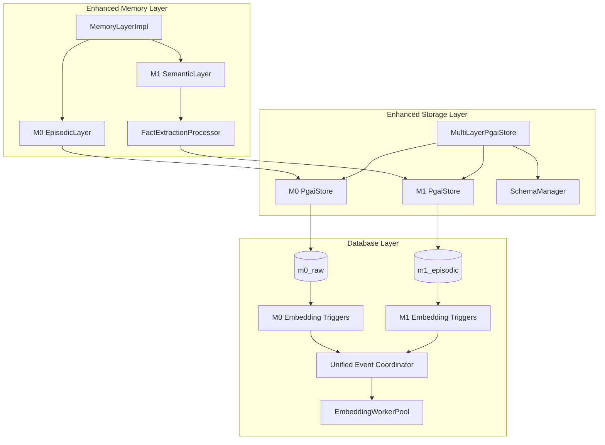
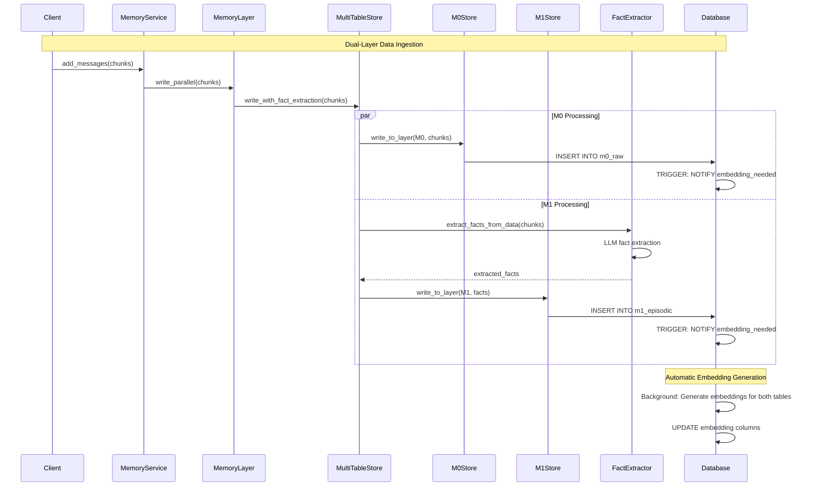

# Multi-Layer PgAI Embedding System Architecture

## Overview

The Multi-Layer PgAI Embedding System extends MemFuse's existing PgAI architecture to support M0 (episodic) and M1 (semantic) memory layers with automatic embedding generation. This system maintains backward compatibility while adding sophisticated fact extraction and multi-layer processing capabilities.

## Key Features

- **Multi-Layer Processing**: Support for M0 episodic and M1 semantic memory layers
- **Automatic Fact Extraction**: LLM-based extraction of structured facts from M0 conversational data
- **Embedding Generation**: Consistent embedding infrastructure across layers
- **Event-Driven Architecture**: Real-time processing with PostgreSQL NOTIFY/LISTEN triggers
- **Configuration-Driven**: Enable/disable layers and customize behavior through configuration
- **Backward Compatibility**: Seamless integration with existing M0-only implementations

## Architecture Overview

### System Integration

The multi-layer system integrates with MemFuse's existing architecture:

```
Client Layer
    ↓
Service Layer (BufferService → MemoryService)
    ↓
Memory Layer (MemoryLayerImpl) ← Enhanced for dual-layer support
    ↓
Storage Layer (PgAI Stores) ← Extended with MultiLayerPgaiStore
    ↓
Database Layer (PostgreSQL with pgvector + pgai)
```

### Component Architecture



## Core Components

### 1. MultiLayerPgaiStore

**Purpose**: Unified interface for managing both M0 and M1 memory layers with automatic embedding generation.

**Key Features**:
- Configuration-driven layer management
- Automatic fact extraction from M0 to M1
- Independent embedding generation for each layer
- Unified statistics and monitoring
- Backward compatibility with single-layer usage

**Usage Example**:
```python
from src.memfuse_core.store.pgai_store.multi_table_store import MultiLayerPgaiStore, LayerType

# Initialize with configuration
store = MultiLayerPgaiStore(config)
await store.initialize()

# Write to specific layer
m0_ids = await store.write_to_layer(LayerType.M0, chunks)

# Write with automatic fact extraction
results = await store.write_with_fact_extraction(chunks)
# Returns: {'m0': ['id1', 'id2'], 'm1': ['fact_id1', 'fact_id2']}

# Query all layers
all_results = await store.query_all_layers("Python programming")
# Returns: {'m0': [chunk1, chunk2], 'm1': [fact1]}
```

### 2. FactExtractionProcessor

**Purpose**: LLM-based extraction of structured facts from M0 episodic data for M1 semantic storage.

**Key Features**:
- Multiple fact types: personal, preference, decision, general, temporal
- Confidence-based filtering
- Batch processing with context awareness
- Error handling and retry logic
- Comprehensive statistics tracking

**Supported Fact Types**:
- **Personal**: Information about the user (name, job, location, etc.)
- **Preference**: User likes, dislikes, and preferences
- **Decision**: User decisions and future plans
- **General**: General factual information
- **Temporal**: Time-sensitive information with temporal context

**Usage Example**:
```python
from src.memfuse_core.store.pgai_store.fact_extraction_processor import FactExtractionProcessor

processor = FactExtractionProcessor(config)
await processor.initialize()

# Extract facts from single chunk
result = await processor.extract_facts_from_chunk(chunk, context_chunks)

# Batch processing
results = await processor.extract_facts_batch(chunks)

# Get processing statistics
stats = processor.get_stats()
```

### 3. SchemaManager

**Purpose**: Database schema management for dual-layer system including creation, migration, and validation.

**Key Features**:
- Automatic schema creation for both M0 and M1 tables
- Schema version tracking and migration
- Validation of table structure and triggers
- Safe migration from M0-only to dual-layer setup

**Database Schema**:

#### M0 Raw Data Table (Enhanced)
```sql
CREATE TABLE m0_raw (
    id TEXT PRIMARY KEY,
    content TEXT NOT NULL,
    metadata JSONB DEFAULT '{}'::jsonb,
    embedding VECTOR(384),
    needs_embedding BOOLEAN DEFAULT TRUE,
    retry_count INTEGER DEFAULT 0,
    last_retry_at TIMESTAMP,
    retry_status TEXT DEFAULT 'pending',
    created_at TIMESTAMP DEFAULT CURRENT_TIMESTAMP,
    updated_at TIMESTAMP DEFAULT CURRENT_TIMESTAMP
);
```

#### M1 Episodic Table (New)
```sql
CREATE TABLE m1_episodic (
    id TEXT PRIMARY KEY,
    source_id TEXT,  -- References m0_raw.id
    source_session_id TEXT,
    source_user_id TEXT,
    episode_content TEXT NOT NULL,
    episode_type TEXT,  -- Open-ended episode type, no constraints for extensibility
    episode_category JSONB DEFAULT '{}'::jsonb,  -- Flexible categorization system
    confidence FLOAT NOT NULL CHECK (confidence >= 0.0 AND confidence <= 1.0),
    entities JSONB DEFAULT '[]'::jsonb,  -- Extracted entities from episode
    temporal_info JSONB DEFAULT '{}'::jsonb,  -- Temporal information (dates, times, etc.)
    source_context TEXT,  -- Brief context about where episode came from
    metadata JSONB DEFAULT '{}'::jsonb,
    embedding VECTOR(384),
    needs_embedding BOOLEAN DEFAULT TRUE,
    retry_count INTEGER DEFAULT 0,
    last_retry_at TIMESTAMP,
    retry_status TEXT DEFAULT 'pending',
    created_at TIMESTAMP DEFAULT CURRENT_TIMESTAMP,
    updated_at TIMESTAMP DEFAULT CURRENT_TIMESTAMP
);
```

## Configuration

### Enhanced pgai.yaml Configuration

```yaml
# Memory layer specific configurations with PgAI integration
memory_layers:
  # M0 layer configuration (Episodic Memory)
  m0:
    enabled: true
    priority: 1
    table_name: "m0_raw"
    
    # PgAI-specific settings for M0
    pgai:
      auto_embedding: true
      immediate_trigger: true
      embedding_model: "all-MiniLM-L6-v2"
      embedding_dimensions: 384
      
    # Performance settings
    performance:
      max_retries: 3
      retry_interval: 5.0
      worker_count: 2
      queue_size: 100
      batch_size: 10
      
    # Storage backend preferences
    storage_backends: ["vector", "keyword", "sql"]
    
  # M1 layer configuration (Semantic Memory)
  m1:
    enabled: true
    priority: 2
    table_name: "m1_episodic"
    
    # PgAI-specific settings for M1
    pgai:
      auto_embedding: true
      immediate_trigger: true
      embedding_model: "all-MiniLM-L6-v2"
      embedding_dimensions: 384
      
    # Fact extraction configuration
    fact_extraction:
      enabled: true
      llm_model: "grok-3-mini"
      temperature: 0.3
      max_tokens: 1000
      max_facts_per_chunk: 10
      min_confidence_threshold: 0.7
      batch_size: 5
      context_window: 2  # chunks before/after for context
      
    # Performance settings
    performance:
      max_retries: 3
      retry_interval: 5.0
      worker_count: 2
      queue_size: 100
      batch_size: 5  # Smaller batch for LLM processing
      
    # Storage backend preferences
    storage_backends: ["vector", "sql"]  # M1 primarily uses vector and SQL
    
    # Async processing settings (to avoid blocking M0)
    async_processing:
      enabled: true
      queue_timeout: 30.0
      max_concurrent_extractions: 3
      fallback_on_failure: true  # Continue M0 processing if M1 fails
```

## Data Flow

### Complete Processing Pipeline



### Fact Extraction Pipeline


## Usage Examples

### Basic Dual-Layer Setup

```python
# Configuration
config = {
    'memory_layers': {
        'm0': {'enabled': True, 'table_name': 'm0_raw'},
        'm1': {'enabled': True, 'table_name': 'm1_episodic'}
    }
}

# Initialize store
store = MultiLayerPgaiStore(config)
await store.initialize()

# Write data with automatic fact extraction
chunks = [ChunkData(content="I love Python programming")]
results = await store.write_with_fact_extraction(chunks)

print(f"M0 IDs: {results['m0']}")  # ['m0_id_1']
print(f"M1 IDs: {results['m1']}")  # ['m1_fact_id_1']
```

### Query Across Layers

```python
# Query all layers
results = await store.query_all_layers("Python programming", top_k=5)

# M0 results: original conversational chunks
for chunk in results['m0']:
    print(f"M0: {chunk.content}")

# M1 results: extracted facts
for chunk in results['m1']:
    fact_type = chunk.metadata.get('fact_type')
    confidence = chunk.metadata.get('confidence')
    print(f"M1 ({fact_type}, {confidence}): {chunk.content}")
```

### Layer-Specific Operations

```python
# Write to specific layer only
m0_ids = await store.write_to_layer(LayerType.M0, chunks)
m1_ids = await store.write_to_layer(LayerType.M1, fact_chunks)

# Query specific layer
m0_results = await store.query_layer(LayerType.M0, "query")
m1_results = await store.query_layer(LayerType.M1, "query")
```

### Statistics and Monitoring

```python
# Get comprehensive statistics
stats = await store.get_all_stats()

print(f"Total operations: {stats['overall']['total_operations']}")
print(f"Fact extractions: {stats['overall']['fact_extractions']}")
print(f"Enabled layers: {stats['enabled_layers']}")

# Layer-specific stats
m0_stats = stats['layer_stats']['m0']
m1_stats = stats['layer_stats']['m1']

print(f"M0 operations: {m0_stats['operations_count']}")
print(f"M1 operations: {m1_stats['operations_count']}")
```

## Migration Guide

### From M0-Only to Dual-Layer

1. **Update Configuration**: Add M1 layer configuration to `config/store/pgai.yaml`

2. **Database Migration**: The system automatically creates M1 tables when initialized

3. **Code Changes**: Replace direct PgaiStore usage with MultiLayerPgaiStore

```python
# Before (M0 only)
from src.memfuse_core.store.pgai_store import EventDrivenPgaiStore
store = EventDrivenPgaiStore(config)

# After (Dual-layer)
from src.memfuse_core.store.pgai_store.multi_table_store import MultiLayerPgaiStore
store = MultiLayerPgaiStore(config)
```

4. **Backward Compatibility**: Existing `add()` and `query()` methods continue to work with M0 layer

### Configuration Migration

```yaml
# Before: M0 only
pgai:
  enabled: true
  auto_embedding: true
  immediate_trigger: true

# After: Dual-layer
memory_layers:
  m0:
    enabled: true
    pgai:
      auto_embedding: true
      immediate_trigger: true
  m1:
    enabled: true
    fact_extraction:
      enabled: true
      llm_model: "grok-3-mini"
```

## Performance Considerations

### Optimization Strategies

1. **Async Processing**: M1 fact extraction runs asynchronously to avoid blocking M0 operations
2. **Batch Processing**: Facts are extracted in configurable batches for efficiency
3. **Confidence Filtering**: Low-confidence facts are filtered out to reduce storage overhead
4. **Independent Scaling**: Each layer can be scaled independently based on load
5. **Shared Infrastructure**: Embedding generation infrastructure is shared between layers

### Monitoring Metrics

- **Throughput**: Records processed per second per layer
- **Fact Extraction Rate**: Facts extracted per M0 record
- **Confidence Distribution**: Distribution of fact confidence scores
- **Error Rates**: Failed operations per layer and error type
- **Processing Latency**: Time from M0 insertion to M1 fact availability

### Resource Usage

- **Memory**: Shared embedding model reduces memory overhead
- **CPU**: Parallel processing across layers optimizes CPU utilization
- **Database**: Separate tables allow for independent optimization
- **Network**: Batch processing reduces database round trips

## Troubleshooting

### Common Issues

1. **M1 Layer Not Processing**: Check fact extraction configuration and LLM service availability
2. **Low Fact Extraction Rate**: Adjust confidence threshold or improve LLM prompts
3. **Performance Issues**: Monitor batch sizes and worker counts
4. **Schema Errors**: Use SchemaManager validation to check table structure

### Debug Commands

```python
# Check layer status
stats = await store.get_all_stats()
print(f"Enabled layers: {stats['enabled_layers']}")

# Validate schemas
if store.schema_manager:
    validation = await store.schema_manager.validate_schemas(['m0', 'm1'])
    print(f"Schema validation: {validation}")

# Check fact extraction stats
processor_stats = fact_processor.get_stats()
print(f"Extraction success rate: {processor_stats['success_rate']}")
```

## Future Enhancements

### Planned Features

1. **M2 Relational Layer**: Knowledge graph construction from M1 facts
2. **Advanced LLM Integration**: Support for multiple LLM providers
3. **Real-time Fact Validation**: Cross-reference facts for consistency
4. **Semantic Search Enhancement**: Hybrid search across M0 and M1 layers
5. **Performance Optimization**: Advanced caching and indexing strategies

### Extension Points

1. **Custom Fact Extractors**: Plugin architecture for domain-specific extraction
2. **Fact Validation Rules**: Configurable validation logic
3. **Storage Backends**: Support for additional database systems
4. **Monitoring Integration**: Export metrics to external monitoring systems