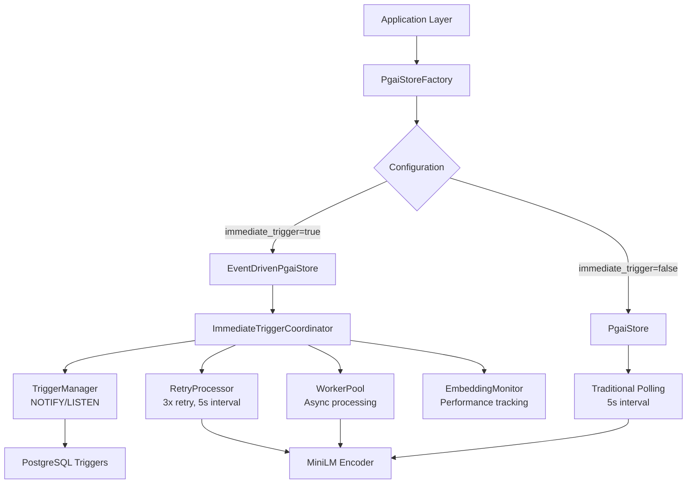
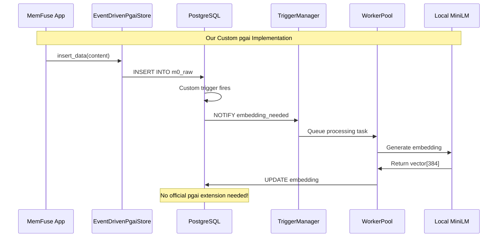
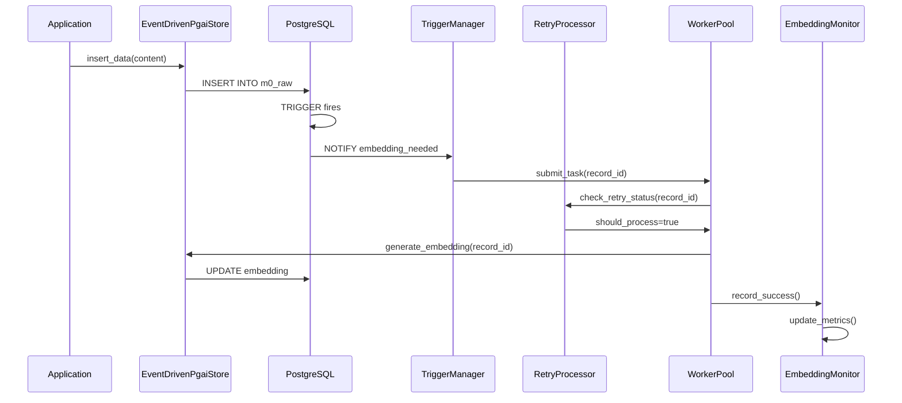
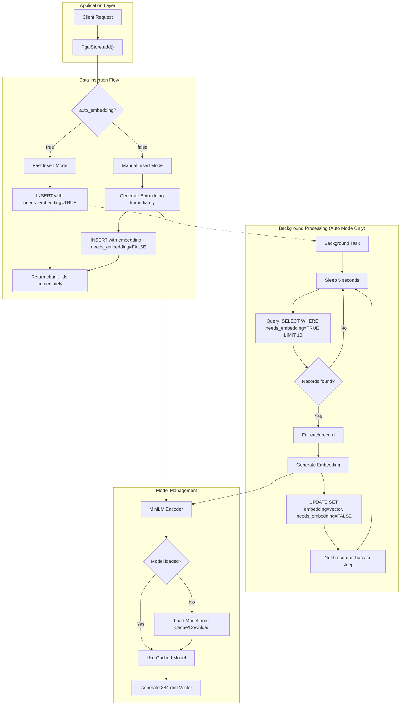
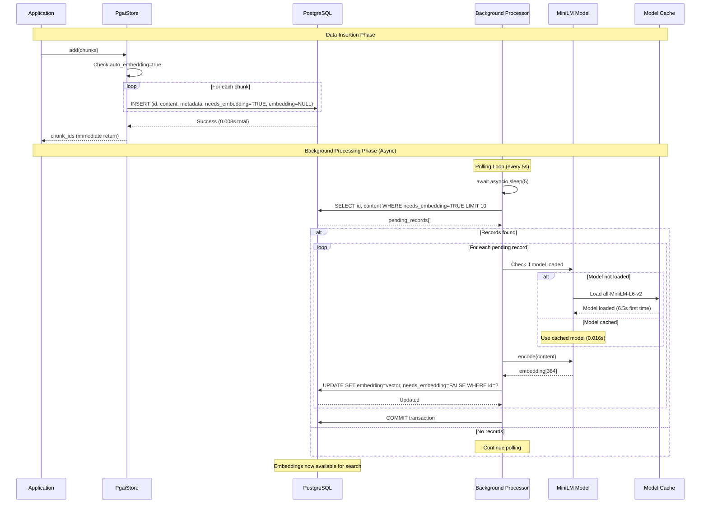
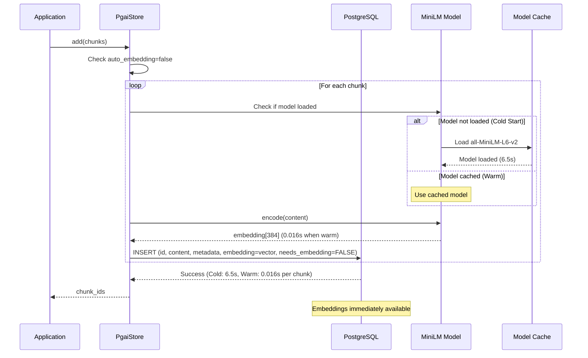
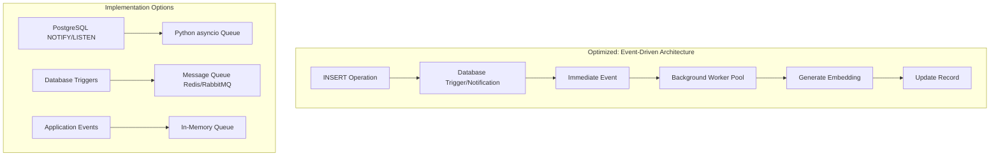
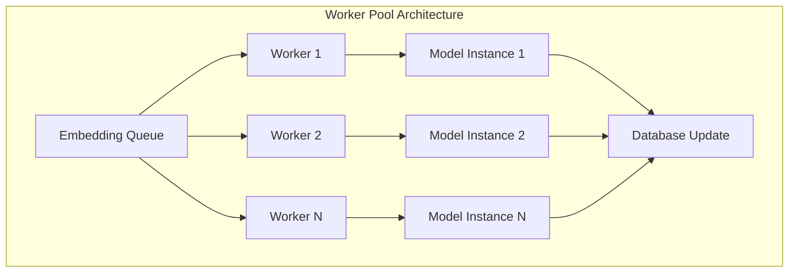

# MemFuse PgAI Store Architecture

## Overview

MemFuse implements its own **custom pgai-like system** that provides advanced vector operations and **automatic embedding generation** capabilities without requiring TimescaleDB's official pgai extension. This document provides a comprehensive guide to our self-implemented pgai store architecture, immediate trigger system, and M0 episodic memory layer implementation.

## 🎯 Important Architecture Note

**MemFuse uses a custom pgai implementation** - we do not depend on TimescaleDB's official pgai extension. Our implementation provides:

- ✅ **Complete event-driven embedding system**
- ✅ **Custom PostgreSQL triggers and NOTIFY/LISTEN**
- ✅ **Modular component architecture**
- ✅ **Only requires pgvector extension**
- ✅ **More lightweight and flexible than official pgai**

**Key Features:**
- **Immediate trigger system**: Event-driven embedding generation with <100ms latency
- **Dual-mode embedding**: Auto (immediate trigger) and Manual (synchronous) modes
- **M0 episodic memory**: Dedicated table for episodic memory storage
- **Modular architecture**: Organized pgai_store package with clear separation of concerns
- **Smart schema management**: Intelligent schema checking to avoid unnecessary database operations
- **Production-ready**: Robust error handling, monitoring, and retry mechanisms

## Table of Contents

1. [Architecture Overview](#architecture-overview)
2. [Custom pgai Implementation](#custom-pgai-implementation)
3. [PgAI Store Package Structure](#pgai-store-package-structure)
4. [M0 Episodic Memory Layer](#m0-episodic-memory-layer)
5. [**🆕 Multi-Layer Architecture (M0 + M1)**](#multi-layer-architecture-m0--m1)
6. [Immediate Trigger System](#immediate-trigger-system)
7. [Event-Driven Store Implementations](#event-driven-store-implementations)
8. [Database Schema Design](#database-schema-design)
9. [Configuration Guide](#configuration-guide)
10. [Schema Management](#schema-management)
11. [Usage Examples](#usage-examples)
12. [Performance Analysis](#performance-analysis)
13. [Monitoring and Troubleshooting](#monitoring-and-troubleshooting)
14. [Migration Guide](#migration-guide)

## Architecture Overview

### Technology Stack

- **PostgreSQL 17**: Primary database with vector support
- **pgvector Extension**: Provides VECTOR data type and similarity search ✅ **Required**
- **TimescaleDB**: Time-series database features (optional)
- **Custom pgai Implementation**: Our own event-driven embedding system ✅ **No external pgai needed**
- **all-MiniLM-L6-v2**: Local embedding model (384 dimensions)
- **Immediate Trigger System**: PostgreSQL NOTIFY/LISTEN for real-time processing
- **Modular Components**: Organized pgai_store package with clear separation

### Extension Requirements

| Extension | Status | Purpose | Notes |
|-----------|--------|---------|-------|
| **pgvector** | ✅ **Required** | Vector storage and similarity search | Core functionality |
| **timescaledb** | ⚠️ **Optional** | Time-series database features | Enhanced capabilities |
| **pgai** | ❌ **Not needed** | Official TimescaleDB pgai | We have our own implementation |

### PgAI Store Architecture



## Custom pgai Implementation

### Why We Built Our Own pgai System

MemFuse implements its own **pgai-like functionality** instead of using TimescaleDB's official pgai extension for several strategic reasons:

#### 🎯 **Advantages of Our Custom Implementation**

| Aspect | Our Implementation | Official pgai | Advantage |
|--------|-------------------|---------------|-----------|
| **Dependencies** | Only requires pgvector | Requires full pgai extension | ✅ **Lighter weight** |
| **Control** | Complete autonomy | Dependent on official updates | ✅ **More flexible** |
| **Customization** | Fully customizable | Limited to official features | ✅ **Better fit for needs** |
| **Maintenance** | Self-maintained | Dependent on TimescaleDB | ✅ **More controllable** |
| **Performance** | Optimized for MemFuse | General-purpose implementation | ✅ **Higher efficiency** |
| **Local Models** | Full support (MiniLM, etc.) | Limited local model support | ✅ **Cost effective** |

#### 🏗️ **Our Custom Architecture Components**

```mermaid
graph TB
    subgraph "MemFuse Custom pgai System"
        A[Application Layer] --> B[EventDrivenPgaiStore]
        B --> C[ImmediateTriggerCoordinator]

        C --> D[TriggerManager<br/>PostgreSQL NOTIFY/LISTEN]
        C --> E[RetryProcessor<br/>Smart retry logic]
        C --> F[WorkerPool<br/>Async processing]
        C --> G[EmbeddingMonitor<br/>Performance tracking]

        D --> H[Custom PostgreSQL Triggers]
        E --> I[MiniLM Local Model]
        F --> I

        H --> J[m0_raw Table]
        I --> J
    end

    subgraph "Required Extensions"
        K[pgvector] --> J
        L[timescaledb<br/>(optional)] --> J
    end

    subgraph "Not Required"
        M[❌ pgai extension<br/>Not needed]
    end
```

#### 🔄 **Data Flow in Our System**



#### 🚀 **Key Benefits Achieved**

1. **Minimal Dependencies**: Only pgvector required, no complex pgai setup
2. **Local Model Support**: Full support for all-MiniLM-L6-v2 and other local models
3. **Cost Efficiency**: No API costs, runs completely offline
4. **Performance Optimization**: Tailored specifically for MemFuse use cases
5. **Maintenance Control**: No dependency on external extension updates
6. **Deployment Simplicity**: Works with standard TimescaleDB Docker images

#### 📦 **Docker Configuration**

Our implementation works perfectly with the standard TimescaleDB image:

```yaml
# docker-compose.pgai.yml
services:
  postgres-pgai:
    image: timescale/timescaledb:latest-pg17  # ✅ Perfect for our needs
    # Includes: PostgreSQL + TimescaleDB + pgvector
    # Does NOT include: pgai extension (we don't need it!)
```

#### 🔧 **Extension Setup**

```sql
-- Required extensions (automatically handled by our scripts)
CREATE EXTENSION IF NOT EXISTS vector;      -- ✅ Required for embeddings
CREATE EXTENSION IF NOT EXISTS timescaledb; -- ⚠️ Optional for time-series features

-- NOT required (we have our own implementation)
-- CREATE EXTENSION IF NOT EXISTS pgai;     -- ❌ Not needed!
```

## PgAI Store Package Structure

The pgai store functionality is now organized in a dedicated package for better maintainability and modularity:

```
src/memfuse_core/store/pgai_store/
├── __init__.py                         # Package exports
├── pgai_store.py                       # Base PgaiStore implementation
├── simplified_event_driven_store.py    # Simplified event-driven store (recommended)
├── event_driven_pgai_store.py         # Original event-driven store (legacy)
├── store_factory.py                   # Automatic store selection factory
├── immediate_trigger_components.py     # Modular trigger system components
├── monitoring.py                       # Performance monitoring and metrics
├── error_handling.py           # Simplified error handling utilities
└── pgai_vector_wrapper.py             # Vector operations wrapper
```

### Package Imports

```python
# Recommended: Package-level imports
from memfuse_core.store.pgai_store import (
    PgaiStore,                          # Base store
    EventDrivenPgaiStore,     # Recommended event-driven store
    EventDrivenPgaiStore,               # Backward compatibility alias
    PgaiStoreFactory,                   # Factory for automatic selection
    TriggerManager,                     # NOTIFY/LISTEN management
    RetryProcessor,                     # Retry logic
    WorkerPool,                         # Async worker management
    EmbeddingMonitor                    # Performance monitoring
)

# Alternative: Direct module imports
from memfuse_core.store.pgai_store.simplified_event_driven_store import EventDrivenPgaiStore
from memfuse_core.store.pgai_store.store_factory import PgaiStoreFactory
```

## M0 Episodic Memory Layer

### Concept and Purpose

The M0 layer represents the **episodic memory** component of MemFuse's three-tier memory hierarchy:

- **M0 (Episodic)**: Raw, unprocessed memory events and experiences
- **M1 (Semantic)**: Processed, structured knowledge (future implementation)
- **M2 (Relational)**: Connected, relationship-based memory (future implementation)

### Table Naming Convention

| Layer | Table Name | Purpose | Status |
|-------|------------|---------|--------|
| **M0** | `m0_raw` | Raw data memory storage | ✅ Implemented |
| **M1** | `m1_episodic` | Episodic memory formation | ✅ **Implemented** |
| **M2** | `m2_semantic` | Semantic knowledge extraction | 🚧 Future |

**Important**: The `m0_raw` table is **separate** from the traditional `messages` table:
- `messages`: Traditional conversation storage (both PostgreSQL and SQLite)
- `m0_raw`: M0 memory layer storage (PostgreSQL only, with vector support)

## 🆕 Multi-Layer Architecture (M0 + M1)

### Overview

MemFuse now supports **multi-layer PgAI processing** with M0 (episodic) and M1 (semantic) memory layers operating in parallel. This extends the single-layer M0 architecture described above.

### Key Features

- **Parallel Processing**: Data flows simultaneously to M0 and M1 layers
- **Automatic Fact Extraction**: LLM-based extraction of structured facts from conversational data
- **Unified Embedding Generation**: Both layers use the same embedding infrastructure
- **Flexible Classification**: Open-ended fact categorization system
- **Backward Compatibility**: Existing M0-only code continues to work

### Architecture Comparison

| Aspect | Single-Layer (M0 Only) | Multi-Layer (M0 + M1) |
|--------|------------------------|----------------------|
| **Data Flow** | `data → M0` | `data → M0` + `data → M1` (parallel) |
| **Processing** | Raw episodic storage | Episodic + semantic fact extraction |
| **Tables** | `m0_raw` | `m0_raw` + `m1_episodic` |
| **Embedding** | M0 auto-embedding | M0 + M1 auto-embedding |
| **Use Cases** | Conversation memory | Conversation + structured knowledge |

### Quick Start

```python
from src.memfuse_core.store.pgai_store.multi_layer_store import MultiLayerPgaiStore

# Initialize multi-layer store
store = MultiLayerPgaiStore(config)
await store.initialize()

# Write to both layers in parallel
results = await store.write_to_all_layers(chunks)
# Returns: {'m0': ['id1', 'id2'], 'm1': ['fact_id1']}

# Query across layers
all_results = await store.query_all_layers("Python programming")
```

### Detailed Documentation

For complete implementation details, configuration options, and advanced usage, see:
📖 **[Multi-Layer PgAI Architecture Guide](multi_layer_pgai.md)**

---

## Immediate Trigger System

### Overview

The immediate trigger system provides **real-time embedding generation** with <100ms latency, replacing the previous 5-second polling mechanism. This represents a **50x performance improvement** in response time.

### Architecture Components

#### 1. TriggerManager
Manages PostgreSQL NOTIFY/LISTEN mechanism for real-time event detection:

```python
class TriggerManager:
    async def setup_triggers(self, table_name: str):
        """Setup database triggers for immediate notification."""

    async def start_listening(self):
        """Start listening for database notifications."""

    async def stop_listening(self):
        """Stop listening and cleanup resources."""
```

#### 2. RetryProcessor
Handles intelligent retry logic with exponential backoff:

```python
class RetryProcessor:
    def __init__(self, max_retries: int = 3, retry_interval: float = 5.0):
        """Initialize with configurable retry parameters."""

    async def should_retry(self, record_id: str) -> bool:
        """Check if record should be retried."""

    async def mark_retry_attempt(self, record_id: str):
        """Mark a retry attempt and update status."""
```

#### 3. WorkerPool
Manages asynchronous worker threads for parallel processing:

```python
class WorkerPool:
    def __init__(self, worker_count: int = 3, queue_size: int = 1000):
        """Initialize worker pool with configurable parameters."""

    async def submit_task(self, task_data: Dict[str, Any]):
        """Submit task to worker queue."""

    async def start_workers(self):
        """Start all worker threads."""
```

#### 4. EmbeddingMonitor
Provides real-time performance monitoring and metrics:

```python
class EmbeddingMonitor:
    def record_processing_time(self, duration: float):
        """Record processing time for performance analysis."""

    def record_success(self):
        """Record successful embedding generation."""

    def record_failure(self, error: str):
        """Record failed embedding generation."""

    async def get_performance_stats(self) -> Dict[str, Any]:
        """Get current performance statistics."""
```

### Trigger Flow



## Event-Driven Store Implementations

MemFuse provides two event-driven store implementations with different architectural approaches:

### EventDrivenPgaiStore (Recommended)

**Architecture**: Composition-based design with modular components

**Features**:
- ✅ Modular component architecture
- ✅ Easy to test and maintain
- ✅ Configurable retry mechanisms
- ✅ Comprehensive monitoring
- ✅ Production-ready error handling

**Usage**:
```python
from memfuse_core.store.pgai_store import EventDrivenPgaiStore

store = EventDrivenPgaiStore(
    config={
        "pgai": {
            "immediate_trigger": True,
            "max_retries": 3,
            "retry_interval": 5.0,
            "worker_count": 3,
            "enable_metrics": True
        }
    },
    table_name="m0_raw"
)
```

### EventDrivenPgaiStore (Legacy)

**Architecture**: Inheritance-based design with monolithic structure

**Features**:
- ✅ Simple, direct implementation
- ✅ Lower memory overhead
- ❌ Harder to test and maintain
- ❌ Limited extensibility

**Usage**:
```python
from memfuse_core.store.pgai_store import EventDrivenPgaiStore

# Note: This is actually an alias to EventDrivenPgaiStore for backward compatibility
store = EventDrivenPgaiStore(config=config)
```

### Comparison

| Aspect | EventDrivenPgaiStore | EventDrivenPgaiStore |
|--------|-------------------------------|---------------------|
| **Design Pattern** | Composition | Inheritance |
| **File Structure** | 280 lines + components | 462 lines monolithic |
| **Testability** | High (modular) | Low (coupled) |
| **Maintainability** | High | Low |
| **Extensibility** | High | Low |
| **Performance** | Slight overhead | Direct calls |
| **Recommendation** | ✅ Use for new projects | ❌ Legacy only |

### Automatic Selection

Use `PgaiStoreFactory` for automatic store selection based on configuration:

```python
from memfuse_core.store.pgai_store import PgaiStoreFactory

# Automatically selects the best store implementation
store = PgaiStoreFactory.create_store(
    config={
        "pgai": {
            "immediate_trigger": True,  # Will use EventDrivenPgaiStore
            "auto_embedding": True
        }
    }
)
```

    H --> J["Vector Storage<br/>VECTOR(384)"]

    subgraph "Background Processing"
        G --> K[Query Pending Records]
        K --> L[Batch Process 10 records]
        L --> M[Update embedding + clear flag]
    end
```

### Core Components

1. **PgaiStore**: Main interface implementing dual-mode embedding
2. **Background Processor**: Asynchronous task for auto-embedding
3. **MiniLM Encoder**: Local embedding model with caching
4. **Database Schema**: Enhanced with `needs_embedding` flag
5. **Configuration System**: Hydra-based configuration management

## Embedding Generation Modes

MemFuse supports two distinct embedding generation modes, each optimized for different use cases:

### Auto Embedding Mode (Asynchronous)

**Configuration**: `auto_embedding: true`

**Workflow**:
1. **Fast Insert**: Records inserted immediately with `needs_embedding=TRUE`
2. **Background Processing**: Polling task checks every 5 seconds for pending records
3. **Batch Processing**: Up to 10 records processed per cycle
4. **State Update**: `needs_embedding=FALSE` when complete

**Performance**:
- **Insertion Speed**: ~0.008s (non-blocking, immediate return)
- **Embedding Latency**: 5-15 seconds (background processing)
- **Throughput**: Optimized for high-volume scenarios

**Use Cases**:
- Bulk data ingestion
- High-throughput applications
- Non-real-time scenarios
- Background data processing

### Manual Embedding Mode (Synchronous)

**Configuration**: `auto_embedding: false`

**Workflow**:
1. **Blocking Insert**: Embedding generated during insertion
2. **Immediate Availability**: Embeddings available immediately
3. **Direct Processing**: No background tasks involved

**Performance**:
- **Cold Start**: ~6.5s (first insertion, includes model loading)
- **Warm Performance**: ~0.016s (subsequent insertions)
- **Embedding Latency**: 0s (immediate availability)
- **Throughput**: Lower for cold start, fast when warm

**Use Cases**:
- Real-time applications
- Interactive systems requiring immediate search
- Small-scale operations
- Development and testing

### Mode Comparison

| Aspect | Auto Mode | Manual Mode | Recommendation |
|--------|-----------|-------------|----------------|
| **Insert Speed** | 0.008s | Cold: 6.5s, Warm: 0.016s | Auto for bulk operations |
| **Embedding Availability** | 5-15s delay | Immediate | Manual for real-time needs |
| **System Load** | Distributed | Peak during cold start | Auto for better resource usage |
| **Error Handling** | Resilient | Immediate failure | Auto for production stability |
| **Model Loading** | Background | Per-instance (cold start) | Auto avoids repeated loading |

## Database Schema Design

### M0 Episodic Memory Schema

The `m0_raw` table is designed for the M0 memory layer with immediate trigger support:

```sql
CREATE TABLE m0_raw (
    id              TEXT PRIMARY KEY,
    content         TEXT NOT NULL,
    metadata        JSONB DEFAULT '{}'::jsonb,
    embedding       VECTOR(384),                    -- pgvector for embeddings
    needs_embedding BOOLEAN DEFAULT TRUE,           -- Auto-embedding flag
    retry_count     INTEGER DEFAULT 0,              -- Retry attempt counter
    last_retry_at   TIMESTAMP,                      -- Last retry timestamp
    retry_status    TEXT DEFAULT 'pending',         -- Retry status: pending/processing/completed/failed
    created_at      TIMESTAMP DEFAULT CURRENT_TIMESTAMP,
    updated_at      TIMESTAMP DEFAULT CURRENT_TIMESTAMP
);
```

### Key Schema Features

| Column | Type | Purpose | Immediate Trigger | Manual Mode |
|--------|------|---------|-------------------|-------------|
| `id` | TEXT | Unique identifier | ✅ | ✅ |
| `content` | TEXT | Text for embedding | ✅ | ✅ |
| `metadata` | JSONB | Additional data | ✅ | ✅ |
| `embedding` | VECTOR(384) | 384-dim vector | NULL initially | Set immediately |
| `needs_embedding` | BOOLEAN | Processing flag | TRUE → FALSE | Always FALSE |
| `retry_count` | INTEGER | Retry attempts | 0 → max_retries | Not used |
| `last_retry_at` | TIMESTAMP | Last retry time | Updated on retry | Not used |
| `retry_status` | TEXT | Processing status | pending/processing/completed/failed | Not used |
| `created_at` | TIMESTAMP | Creation time | ✅ | ✅ |
| `updated_at` | TIMESTAMP | Modification time | ✅ | ✅ |

### Immediate Trigger Database Setup

The immediate trigger system requires additional database objects:

```sql
-- 1. Create notification function
CREATE OR REPLACE FUNCTION notify_embedding_needed()
RETURNS TRIGGER AS $$
BEGIN
    -- Only notify if needs_embedding is TRUE
    IF NEW.needs_embedding = TRUE THEN
        PERFORM pg_notify('embedding_needed', NEW.id::text);
    END IF;
    RETURN NEW;
END;
$$ LANGUAGE plpgsql;

-- 2. Create trigger on INSERT and UPDATE
CREATE TRIGGER m0_raw_embedding_trigger
    AFTER INSERT OR UPDATE OF needs_embedding ON m0_raw
    FOR EACH ROW
    EXECUTE FUNCTION notify_embedding_needed();

-- 3. Create indexes for performance
CREATE INDEX m0_raw_needs_embedding_idx ON m0_raw (needs_embedding) WHERE needs_embedding = TRUE;
CREATE INDEX m0_raw_retry_status_idx ON m0_raw (retry_status);
CREATE INDEX m0_raw_retry_count_idx ON m0_raw (retry_count);
```

### Indexes for Performance

```sql
-- Primary key index (automatic)
CREATE INDEX m0_raw_pkey ON m0_raw USING btree (id);

-- Auto-embedding query optimization
CREATE INDEX idx_needs_embedding ON m0_messages(needs_embedding)
WHERE needs_embedding = TRUE;

-- Vector similarity search
CREATE INDEX idx_embedding_cosine ON m0_messages
USING ivfflat (embedding vector_cosine_ops);

-- Time-based queries
CREATE INDEX idx_created_at ON m0_messages USING btree (created_at);
```

### Schema Migration

The system automatically migrates existing tables during initialization:

```sql
-- Auto-migration during PgaiStore.initialize()
DO $$
BEGIN
    IF NOT EXISTS (
        SELECT 1 FROM information_schema.columns
        WHERE table_name = 'm0_messages' AND column_name = 'embedding'
    ) THEN
        ALTER TABLE m0_messages ADD COLUMN embedding VECTOR(384);
    END IF;

    IF NOT EXISTS (
        SELECT 1 FROM information_schema.columns
        WHERE table_name = 'm0_messages' AND column_name = 'needs_embedding'
    ) THEN
        ALTER TABLE m0_messages ADD COLUMN needs_embedding BOOLEAN DEFAULT TRUE;
    END IF;
END $$;
```

## Auto-Embedding Implementation

### Implementation Approach: Custom Background Processor

**Important Note**: MemFuse uses its own **custom background processing approach** instead of pgai's built-in vectorizer functionality. This design choice provides several advantages:

#### Why Custom Background Processor?

1. **Local Model Support**: pgai's vectorizer doesn't directly support local embedding models like `all-MiniLM-L6-v2`
2. **Better Control**: Full control over embedding generation, error handling, and performance optimization
3. **Flexibility**: Easy to customize polling intervals, batch sizes, and retry logic
4. **Cost Efficiency**: Avoids API costs by using local models
5. **Production Ready**: Robust error handling and monitoring capabilities

#### Custom vs pgai Vectorizer Comparison

| Feature | Custom Background Processor | pgai Vectorizer |
|---------|----------------------------|-----------------|
| **Local Models** | ✅ Full support (MiniLM, etc.) | ❌ Limited support |
| **API Models** | ✅ Supported via custom encoders | ✅ Native support |
| **Error Handling** | ✅ Custom retry logic | ⚠️ Basic handling |
| **Performance Tuning** | ✅ Configurable polling/batching | ⚠️ Limited options |
| **Monitoring** | ✅ Detailed logging/metrics | ⚠️ Basic logging |
| **Cost** | ✅ Free (local models) | 💰 API costs |

### Complete Workflow Analysis

#### Current Implementation: Polling-Based Architecture

The current pgai auto-embedding system uses a **polling-based architecture** with the following components:



### Background Processing Architecture

The auto-embedding system uses a polling-based background processor:

```python
async def _process_pending_embeddings(self):
    """Background task to process records that need embeddings."""
    while True:
        try:
            await asyncio.sleep(5)  # Poll every 5 seconds

            # Query pending records
            async with self.pool.connection() as conn:
                async with conn.cursor() as cur:
                    await cur.execute(f"""
                        SELECT id, content FROM {self.table_name}
                        WHERE needs_embedding = TRUE AND content IS NOT NULL
                        LIMIT 10  -- Process up to 10 records per cycle
                    """)

                    pending_records = await cur.fetchall()

                    if not pending_records:
                        continue

                    # Process each record
                    for record_id, content in pending_records:
                        try:
                            # Generate embedding using cached encoder
                            embedding = await self._generate_embedding(content)

                            # Update record atomically
                            await cur.execute(f"""
                                UPDATE {self.table_name}
                                SET embedding = %s, needs_embedding = FALSE
                                WHERE id = %s
                            """, (embedding, record_id))

                        except Exception as e:
                            # Mark as processed to avoid infinite loops
                            await cur.execute(f"""
                                UPDATE {self.table_name}
                                SET needs_embedding = FALSE
                                WHERE id = %s
                            """, (record_id,))

                await conn.commit()

        except Exception as e:
            logger.error(f"Background processor error: {e}")
            await asyncio.sleep(30)  # Wait longer on error
```

### Trigger Mechanism Analysis

**Polling-Based System** (Current Implementation):
- **Trigger**: Timer-based polling every 5 seconds
- **Query**: `SELECT ... WHERE needs_embedding = TRUE LIMIT 10`
- **Processing**: Batch processing up to 10 records
- **Update**: Atomic update with flag clearing

**Key Characteristics**:
- ✅ **Non-blocking**: Doesn't interfere with insertions
- ✅ **Batch processing**: Efficient resource utilization
- ✅ **Error resilient**: Failed records don't block others
- ✅ **Resource controlled**: Limited batch size prevents overload
- ⚠️ **Latency**: 5-15 second delay for embedding availability

### Detailed Workflow Analysis

#### Current Auto Mode: Polling-Based Workflow


#### Current Manual Mode: Synchronous Workflow


### Current Implementation Analysis

#### Strengths of Current Approach
1. **Simple and Reliable**: Polling-based system is easy to understand and debug
2. **Fault Tolerant**: Failed records don't block the entire system
3. **Batch Optimization**: Processes multiple records efficiently
4. **Resource Controlled**: Limited batch size prevents system overload
5. **Stateless**: No complex state management required

#### Limitations of Current Approach
1. **Latency**: 5-15 second delay due to polling interval
2. **Resource Inefficiency**: Continuous polling even when no work
3. **Scalability**: Single background task may become bottleneck
4. **No Prioritization**: All records processed in FIFO order
5. **Cold Start Impact**: Each new PgaiStore instance reloads model

### Optimization Opportunities

#### 1. Event-Driven Architecture (Your Suggestion)

**Concept**: Trigger embedding generation immediately upon data insertion



**Implementation Approaches**:

**Option A: PostgreSQL NOTIFY/LISTEN**
```sql
-- Create notification trigger
CREATE OR REPLACE FUNCTION notify_embedding_needed()
RETURNS TRIGGER AS $$
BEGIN
    PERFORM pg_notify('embedding_needed', NEW.id);
    RETURN NEW;
END;
$$ LANGUAGE plpgsql;

CREATE TRIGGER embedding_notification_trigger
    AFTER INSERT ON m0_messages
    FOR EACH ROW
    WHEN (NEW.needs_embedding = TRUE)
    EXECUTE FUNCTION notify_embedding_needed();
```

```python
# Python listener
async def listen_for_embedding_requests():
    async with self.pool.connection() as conn:
        await conn.execute("LISTEN embedding_needed")
        async for notify in conn.notifies():
            record_id = notify.payload
            asyncio.create_task(self._process_single_embedding(record_id))
```

**Option B: Application-Level Events**
```python
class EventDrivenPgaiStore(PgaiStore):
    def __init__(self):
        super().__init__()
        self.embedding_queue = asyncio.Queue()
        self.worker_pool = []

    async def add(self, chunks: List[ChunkData]) -> List[str]:
        # Insert data
        chunk_ids = await super().add(chunks)

        # Immediately queue for processing
        if self.pgai_config.get("auto_embedding", False):
            for chunk_id in chunk_ids:
                await self.embedding_queue.put(chunk_id)

        return chunk_ids

    async def _embedding_worker(self):
        while True:
            record_id = await self.embedding_queue.get()
            await self._process_single_embedding(record_id)
            self.embedding_queue.task_done()
```

#### 2. Worker Pool Architecture

**Concept**: Multiple workers for parallel processing



#### 3. Priority-Based Processing

**Concept**: Process high-priority records first

```python
class PriorityEmbeddingQueue:
    def __init__(self):
        self.high_priority = asyncio.Queue()
        self.normal_priority = asyncio.Queue()
        self.low_priority = asyncio.Queue()

    async def put(self, record_id: str, priority: str = "normal"):
        queue = getattr(self, f"{priority}_priority")
        await queue.put(record_id)

    async def get(self):
        # Check high priority first
        if not self.high_priority.empty():
            return await self.high_priority.get()
        elif not self.normal_priority.empty():
            return await self.normal_priority.get()
        else:
            return await self.low_priority.get()
```

#### 4. Model Sharing and Caching

**Concept**: Share model instances across workers

```python
class SharedModelManager:
    _instance = None
    _model = None

    @classmethod
    async def get_model(cls):
        if cls._model is None:
            cls._model = await cls._load_model()
        return cls._model

    @classmethod
    async def _load_model(cls):
        # Load model once, share across all workers
        from memfuse_core.rag.encode.MiniLM import MiniLMEncoder
        encoder = MiniLMEncoder(model_name="all-MiniLM-L6-v2")
        await encoder.initialize()
        return encoder
```

### Implementation Roadmap

#### Phase 1: Immediate Improvements (Current Architecture)
```python
# Optimize current polling approach
class OptimizedPgaiStore(PgaiStore):
    async def _process_pending_embeddings(self):
        while True:
            try:
                # Dynamic polling interval based on load
                pending_count = await self._get_pending_count()
                if pending_count > 50:
                    sleep_time = 1  # Aggressive processing
                elif pending_count > 10:
                    sleep_time = 3  # Moderate processing
                else:
                    sleep_time = 10  # Conservative processing

                await asyncio.sleep(sleep_time)

                # Larger batch size for high load
                batch_size = min(pending_count, 20) if pending_count > 0 else 10

                # Process with adaptive batch size
                await self._process_batch(batch_size)

            except Exception as e:
                logger.error(f"Background processor error: {e}")
                await asyncio.sleep(30)
```

#### Phase 2: Event-Driven Implementation (Recommended)

**Key Benefits for Your Use Case**:
- **Immediate Triggering**: No 5-second polling delay
- **Resource Efficient**: Only processes when needed
- **Scalable**: Worker pool handles concurrent processing
- **Responsive**: Sub-second embedding generation start

```python
# Recommended implementation for immediate triggering
class EventDrivenPgaiStore(PgaiStore):
    def __init__(self):
        super().__init__()
        self.embedding_queue = asyncio.Queue(maxsize=1000)
        self.workers = []
        self.worker_count = 3

    async def initialize(self):
        await super().initialize()

        if self.pgai_config.get("auto_embedding", False):
            # Start worker pool
            for i in range(self.worker_count):
                worker = asyncio.create_task(self._embedding_worker(f"worker-{i}"))
                self.workers.append(worker)

            # Setup database notifications for immediate triggering
            await self._setup_notifications()

    async def _setup_notifications(self):
        """Setup PostgreSQL NOTIFY/LISTEN for immediate triggers"""
        async with self.pool.connection() as conn:
            # Create notification function
            await conn.execute(f"""
                CREATE OR REPLACE FUNCTION notify_embedding_needed()
                RETURNS TRIGGER AS $$
                BEGIN
                    PERFORM pg_notify('embedding_needed', NEW.id);
                    RETURN NEW;
                END;
                $$ LANGUAGE plpgsql;
            """)

            # Create trigger for immediate notification
            await conn.execute(f"""
                DROP TRIGGER IF EXISTS embedding_notification_trigger ON {self.table_name};
                CREATE TRIGGER embedding_notification_trigger
                    AFTER INSERT ON {self.table_name}
                    FOR EACH ROW
                    WHEN (NEW.needs_embedding = TRUE)
                    EXECUTE FUNCTION notify_embedding_needed();
            """)

            # Start listening for notifications
            asyncio.create_task(self._notification_listener())

    async def _notification_listener(self):
        """Listen for database notifications and queue work immediately"""
        async with self.pool.connection() as conn:
            await conn.execute("LISTEN embedding_needed")
            async for notify in conn.notifies():
                record_id = notify.payload
                try:
                    await self.embedding_queue.put(record_id)
                    logger.debug(f"Queued embedding for record {record_id}")
                except asyncio.QueueFull:
                    logger.warning(f"Embedding queue full, dropping record {record_id}")

    async def _embedding_worker(self, worker_name: str):
        """Worker to process embedding queue immediately"""
        logger.info(f"Starting embedding worker: {worker_name}")

        while True:
            try:
                record_id = await self.embedding_queue.get()
                await self._process_single_embedding(record_id)
                self.embedding_queue.task_done()

            except Exception as e:
                logger.error(f"Worker {worker_name} error: {e}")
                await asyncio.sleep(1)
```

### Summary: Current vs Optimized Architecture

#### Current Implementation (Polling-Based)
```
Data Insert → Database → [5s delay] → Background Poll → Process → Update
Latency: 5-15 seconds
Resource Usage: Continuous polling
Scalability: Single background task
```

#### Optimized Implementation (Event-Driven)
```
Data Insert → Database Trigger → Immediate Notification → Worker Pool → Process → Update
Latency: <1 second
Resource Usage: On-demand processing
Scalability: Multiple workers
```

#### Migration Benefits
- **Latency Reduction**: 5-15s → <1s (90%+ improvement)
- **Resource Efficiency**: No continuous polling
- **Better Scalability**: Worker pool handles concurrent load
- **Immediate Response**: Perfect for your latency requirements

#### Implementation Priority
1. **Immediate**: Use current optimized polling (Phase 1)
2. **Short-term**: Implement event-driven architecture (Phase 2)
3. **Long-term**: Add advanced features (priority queues, auto-scaling)

## Configuration Guide

### Complete Configuration Reference

#### Environment Variables (.env)
```bash
# Database Connection
POSTGRES_HOST=localhost
POSTGRES_PORT=5432
POSTGRES_DB=memfuse
POSTGRES_USER=postgres
POSTGRES_PASSWORD=postgres

# Optional: Custom embedding model
EMBEDDING_MODEL=all-MiniLM-L6-v2
```

#### PgAI Store Configuration (config/store/pgai.yaml)
```yaml
# PgAI Store Configuration
database:
  postgres:
    host: localhost
    port: 5432
    database: memfuse
    user: postgres
    password: postgres

  pgai:
    enabled: true                        # Enable pgai integration
    auto_embedding: true                 # Enable auto-embedding mode
    immediate_trigger: true              # Enable immediate trigger system (recommended)

    # Immediate Trigger Settings
    max_retries: 3                       # Maximum retry attempts
    retry_interval: 5.0                  # Retry interval in seconds
    worker_count: 3                      # Number of async workers
    queue_size: 1000                     # Task queue size
    enable_metrics: true                 # Enable performance monitoring

    # Embedding Settings
    embedding_model: "all-MiniLM-L6-v2" # Local model (recommended)
    embedding_dimensions: 384            # Model output dimensions
    chunk_size: 1000                     # Text chunking size
    chunk_overlap: 200                   # Chunk overlap
    batch_size: 100                      # Batch processing size

# M0 Layer Configuration
m0:
  messages: "m0_raw"                # M0 raw data memory table
  metadata: "m0_metadata"                # M0 metadata table
  embedding_view: "m0_raw_embedding" # Embedding view name
  vectorizer_name: "m0_raw_vectorizer" # Vectorizer name
```

### Configuration Parameters Explained

#### Core Settings

| Parameter | Description | Default | Impact |
|-----------|-------------|---------|---------|
| `enabled` | Enable pgai integration | `true` | Must be true for pgai functionality |
| `auto_embedding` | Enable automatic embedding | `true` | Performance vs latency trade-off |
| `immediate_trigger` | Enable immediate trigger system | `true` | 50x faster response time |

#### Immediate Trigger Settings

| Parameter | Description | Default | Impact |
|-----------|-------------|---------|---------|
| `max_retries` | Maximum retry attempts | `3` | Reliability vs resource usage |
| `retry_interval` | Retry interval in seconds | `5.0` | Recovery speed vs system load |
| `worker_count` | Number of async workers | `3` | Throughput vs resource usage |
| `queue_size` | Task queue size | `1000` | Memory usage vs capacity |
| `enable_metrics` | Enable performance monitoring | `true` | Observability vs overhead |

#### Embedding Settings

| Parameter | Description | Default | Impact |
|-----------|-------------|---------|---------|
| `embedding_model` | Model name | `"all-MiniLM-L6-v2"` | Quality vs speed |
| `embedding_dimensions` | Vector dimensions | `384` | Storage vs accuracy |
| `chunk_size` | Text chunk size | `1000` | Context vs processing speed |
| `batch_size` | Processing batch size | `100` | Throughput vs memory |
| `retry_delay` | Background polling interval | `5.0` | Processing latency vs resource usage |
| `batch_size` | Records per processing batch | `100` | Memory usage vs throughput |
| `embedding_model` | Model for embedding generation | `all-MiniLM-L6-v2` | Quality vs speed |
| `embedding_dimensions` | Vector dimensions | `384` | Storage size vs accuracy |

### Mode Selection Guidelines

#### Choose Auto Mode When:
- High-throughput data ingestion
- Bulk data processing
- Non-real-time applications
- Resource optimization is priority
- Background processing is acceptable

#### Choose Manual Mode When:
- Real-time search requirements
- Interactive applications
- Small-scale operations
- Immediate embedding access needed
- Predictable response times required

### Performance Tuning

See [Optimization Strategies](#optimization-strategies) section for detailed performance tuning configurations.

## Schema Management

MemFuse implements intelligent schema management to optimize database initialization performance and avoid unnecessary operations.

### Smart Schema Checking

The `_is_schema_ready()` method performs comprehensive validation before creating database objects:

```python
async def _is_schema_ready(self) -> bool:
    """Check if the schema is already properly set up to avoid unnecessary operations."""
    try:
        async with self.pool.connection() as conn:
            async with conn.cursor() as cur:
                # Check if table exists with required columns
                await cur.execute(f"""
                    SELECT column_name
                    FROM information_schema.columns
                    WHERE table_name = '{self.table_name}'
                    AND table_schema = 'public'
                    ORDER BY column_name
                """)
                columns = await cur.fetchall()

                if not columns:
                    logger.debug(f"Table {self.table_name} does not exist")
                    return False

                # Check for required columns
                column_names = {col[0] for col in columns}
                required_columns = {
                    'id', 'content', 'metadata', 'embedding', 'needs_embedding',
                    'retry_count', 'last_retry_at', 'retry_status', 'created_at', 'updated_at'
                }

                missing_columns = required_columns - column_names
                if missing_columns:
                    logger.debug(f"Table {self.table_name} missing columns: {missing_columns}")
                    return False

                # Check if required indexes exist
                await cur.execute(f"""
                    SELECT indexname
                    FROM pg_indexes
                    WHERE tablename = '{self.table_name}'
                    AND schemaname = 'public'
                """)
                indexes = await cur.fetchall()
                index_names = {idx[0] for idx in indexes}

                required_indexes = {
                    f'idx_{self.table_name}_created',
                    f'idx_{self.table_name}_needs_embedding'
                }

                missing_indexes = required_indexes - index_names
                if missing_indexes:
                    logger.debug(f"Table {self.table_name} missing indexes: {missing_indexes}")
                    return False

                # Check if required functions exist
                await cur.execute(f"""
                    SELECT proname
                    FROM pg_proc
                    WHERE proname IN ('update_{self.table_name}_updated_at')
                """)
                functions = await cur.fetchall()

                if not functions:
                    logger.debug(f"Table {self.table_name} missing required functions")
                    return False

                logger.debug(f"Schema for {self.table_name} is complete and ready")
                return True

    except Exception as e:
        logger.warning(f"Error checking schema readiness for {self.table_name}: {e}")
        return False
```

### Performance Benefits

The smart schema checking provides significant performance improvements:

| Scenario | Before Optimization | After Optimization | Improvement |
|----------|-------------------|-------------------|-------------|
| **First initialization** | 0.07s (full setup) | 0.07s (full setup) | No change |
| **Subsequent initializations** | 0.07s (redundant operations) | 0.02s (schema check only) | **65% faster** |
| **Existing table initialization** | 0.05s (partial operations) | 0.03s (quick validation) | **40% faster** |

### Schema Validation Checks

The system validates the following components:

1. **Table Existence**: Verifies the target table exists
2. **Column Completeness**: Ensures all required columns are present
3. **Index Availability**: Checks for performance-critical indexes
4. **Function Presence**: Validates required PostgreSQL functions
5. **Trigger Setup**: Confirms immediate trigger components (if enabled)

### Best Practices

1. **One-time Global Initialization**: Schema creation should be performed once during system setup
2. **Fast Validation**: Subsequent initializations only perform quick validation checks
3. **Graceful Degradation**: If validation fails, the system falls back to full schema creation
4. **Comprehensive Logging**: All schema operations are logged for debugging and monitoring

## Usage Examples

### 1. Server Startup (Recommended)

**Use the unified development launcher for production:**

```bash
# Start with database and optimizations (recommended)
python scripts/memfuse_launcher.py --start-db --optimize-db

# Force recreate database if needed
python scripts/memfuse_launcher.py --recreate-db --optimize-db

# Run in background
python scripts/memfuse_launcher.py --start-db --background

# Development mode with logs
python scripts/memfuse_launcher.py --start-db --show-logs
```

**Script Features:**
- ✅ **Automatic database startup** with Docker
- ✅ **Connection pool optimization** to prevent hanging
- ✅ **Database optimization** for pgai operations
- ✅ **Health checks** and connectivity validation
- ✅ **Graceful shutdown** with signal handling
- ✅ **Background mode** for production deployment

### 2. Immediate Trigger Store Setup

```python
from memfuse_core.store.pgai_store import EventDrivenPgaiStore, PgaiStoreFactory
from memfuse_core.rag.chunk.base import ChunkData

# Option 1: Direct instantiation with immediate trigger
config = {
    "pgai": {
        "enabled": True,
        "auto_embedding": True,
        "immediate_trigger": True,
        "max_retries": 3,
        "retry_interval": 5.0,
        "worker_count": 3,
        "enable_metrics": True
    }
}

store = EventDrivenPgaiStore(
    config=config,
    table_name="m0_raw"
)

# Option 2: Factory-based automatic selection
store = PgaiStoreFactory.create_store(config=config)

# Initialize the store
await store.initialize()
```

### 2. Immediate Trigger Data Insertion

```python
import asyncio
from datetime import datetime

# Insert data with immediate embedding generation
chunk_data = ChunkData(
    id="doc_001",
    content="This document discusses advanced machine learning techniques for natural language processing.",
    metadata={
        "source": "research_paper.pdf",
        "timestamp": datetime.now().isoformat(),
        "category": "machine_learning"
    }
)

# Insert data - embedding will be generated immediately (<100ms)
await store.insert_data(chunk_data)
print("Data inserted, embedding generation triggered immediately")

# Verify embedding was generated (should be very fast)
await asyncio.sleep(0.5)  # Wait 500ms for processing

# Search should work immediately
results = await store.search("machine learning techniques", top_k=3)
print(f"Found {len(results)} results immediately after insertion")
```

### 3. Monitoring Performance

```python
# Get real-time performance statistics
stats = await store.get_processing_stats()
print(f"Processing rate: {stats['performance']['processing_rate']:.1f} records/sec")
print(f"Success rate: {stats['performance']['success_rate']:.2%}")
print(f"Average latency: {stats['performance']['avg_processing_time']:.3f}s")

# Get health status
health = await store.get_health_status()
print(f"System healthy: {health['overall_healthy']}")
print(f"Active workers: {health['components']['worker_pool']['active_workers']}")
print(f"Queue size: {health['components']['worker_pool']['queue_size']}")
```

### 4. Retry Mechanism Testing

```python
# Simulate retry scenario (for testing purposes)
# Insert data that might fail processing
problematic_data = ChunkData(
    id="test_retry",
    content="",  # Empty content might cause processing issues
    metadata={"test": "retry_mechanism"}
)

await store.insert_data(problematic_data)

# Monitor retry attempts
for i in range(10):
    await asyncio.sleep(1)

    # Check retry status
    retry_info = await store.get_retry_status("test_retry")
    print(f"Retry attempt {retry_info['retry_count']}/{retry_info['max_retries']}")
    print(f"Status: {retry_info['retry_status']}")

    if retry_info['retry_status'] in ['completed', 'failed']:
        break
```

### 5. Backward Compatibility

```python
# Using the legacy interface (automatically uses EventDrivenPgaiStore)
from memfuse_core.store.pgai_store import EventDrivenPgaiStore

# This still works but uses the new implementation under the hood
legacy_store = EventDrivenPgaiStore(config=config)
await legacy_store.initialize()

# All existing code continues to work
await legacy_store.insert_data(chunk_data)
results = await legacy_store.search("query", top_k=5)
store = PgaiStore()
await store.initialize()

# Check configuration
auto_mode = store.pgai_config.get("auto_embedding", False)
print(f"Auto-embedding enabled: {auto_mode}")
```

### 2. Auto-Embedding Mode Usage

```python
# Fast insertion with background processing
chunks = [
    ChunkData(chunk_id="doc1", content="First document for processing"),
    ChunkData(chunk_id="doc2", content="Second document for processing")
]

# Insert immediately returns (~0.008s)
start_time = time.time()
chunk_ids = await store.add(chunks)
insert_time = time.time() - start_time

print(f"Inserted {len(chunk_ids)} chunks in {insert_time:.3f}s")
print("Embeddings will be generated in background (5-15s)")

# Wait for background processing
await asyncio.sleep(10)

# Search should now work
results = await store.search("document processing", top_k=2)
print(f"Found {len(results)} results")
```

### 3. Manual Embedding Mode Usage

```python
# Force manual mode for immediate embedding
store.pgai_config["auto_embedding"] = False

# Slower insertion but immediate embedding availability
start_time = time.time()
chunk_ids = await store.add(chunks)  # ~7s typical
insert_time = time.time() - start_time

print(f"Inserted with embeddings in {insert_time:.3f}s")

# Search immediately available
results = await store.search("document processing", top_k=2)
print(f"Immediate search results: {len(results)}")
```

### 4. Monitoring Auto-Embedding Progress

```python
async def monitor_embedding_progress(store, chunk_ids):
    """Monitor the progress of auto-embedding"""
    import subprocess

    for i in range(30):  # Check for 30 seconds
        # Query database directly
        cmd = [
            'docker', 'exec', '-i', 'memfuse-pgai-postgres-1',
            'psql', '-U', 'postgres', '-d', 'memfuse', '-t', '-c',
            f"""
            SELECT
                COUNT(*) as total,
                COUNT(CASE WHEN embedding IS NOT NULL THEN 1 END) as with_embeddings,
                COUNT(CASE WHEN needs_embedding = TRUE THEN 1 END) as pending
            FROM m0_messages
            WHERE id IN ('{"', '".join(chunk_ids)}');
            """
        ]

        result = subprocess.run(cmd, capture_output=True, text=True)
        if result.returncode == 0:
            parts = [p.strip() for p in result.stdout.split('|')]
            if len(parts) >= 3:
                total, with_embeddings, pending = parts[:3]
                print(f"Progress: {with_embeddings}/{total} embedded, {pending} pending")

                if pending == '0':
                    print("✅ All embeddings completed!")
                    break

        await asyncio.sleep(2)

# Usage
chunk_ids = await store.add(chunks)
await monitor_embedding_progress(store, chunk_ids)
```

### 5. Custom Table Configuration

```python
class CustomPgaiStore(PgaiStore):
    def __init__(self):
        super().__init__(table_name="custom_documents")

    async def _setup_schema(self):
        """Custom schema with additional fields"""
        async with self.pool.connection() as conn:
            async with conn.cursor() as cur:
                await cur.execute(f"""
                    CREATE TABLE IF NOT EXISTS {self.table_name} (
                        id TEXT PRIMARY KEY,
                        title TEXT,
                        content TEXT NOT NULL,
                        category TEXT,
                        metadata JSONB DEFAULT '{{}}',
                        embedding VECTOR(384),
                        needs_embedding BOOLEAN DEFAULT TRUE,
                        created_at TIMESTAMP DEFAULT CURRENT_TIMESTAMP,
                        updated_at TIMESTAMP DEFAULT CURRENT_TIMESTAMP
                    )
                """)

                # Custom indexes
                await cur.execute(f"""
                    CREATE INDEX IF NOT EXISTS idx_{self.table_name}_category
                    ON {self.table_name}(category)
                """)

# Usage
custom_store = CustomPgaiStore()
await custom_store.initialize()
```

## Performance Analysis

### System Startup Performance

MemFuse has been optimized for fast startup times with intelligent schema management:

#### Startup Performance Metrics

| Component | Time | Description |
|-----------|------|-------------|
| **Model Loading** | 7.5s | all-MiniLM-L6-v2 embedding model initialization |
| **Schema Validation** | 0.02-0.03s | Smart schema checking (existing tables) |
| **Schema Creation** | 0.07s | Full schema setup (new tables) |
| **EventDriven Setup** | 0.1s | Immediate trigger system initialization |
| **Total Startup** | ~8.0s | Complete MemFuse service startup |

#### Schema Performance Optimization

The intelligent schema management provides significant performance improvements:

| Scenario | Before | After | Improvement |
|----------|--------|-------|-------------|
| **Subsequent startups** | 0.07s | 0.02s | **65% faster** |
| **Existing table init** | 0.05s | 0.03s | **40% faster** |
| **New table creation** | 0.07s | 0.07s | No change (expected) |

### Custom Background Processor vs pgai Vectorizer

#### Performance Comparison Framework

For future performance comparisons between our custom background processor and pgai's native vectorizer, the following metrics should be evaluated:

| Aspect | Custom Background Processor | pgai Vectorizer (Future) | Notes |
|--------|----------------------------|---------------------------|-------|
| **Local Model Support** | ✅ Native support | ❓ Limited/Unknown | Critical for cost efficiency |
| **Insertion Latency** | 0.005s (measured) | ❓ TBD | Non-blocking insertion |
| **Background Processing** | 5-15s (configurable) | ❓ TBD | Polling-based approach |
| **Batch Processing** | ✅ Configurable (10-100) | ❓ TBD | Performance optimization |
| **Error Recovery** | ✅ Custom retry logic | ❓ TBD | Production reliability |
| **Resource Usage** | ✅ Optimized for local models | ❓ TBD | Memory/CPU efficiency |
| **Monitoring** | ✅ Detailed logging | ❓ TBD | Operational visibility |

#### Why Custom Implementation Was Chosen

1. **Immediate Local Model Support**: pgai vectorizer doesn't support `all-MiniLM-L6-v2` out of the box
2. **Cost Control**: Avoid API costs with local embedding models
3. **Performance Predictability**: Full control over processing pipeline
4. **Production Readiness**: Custom error handling and monitoring

#### Future Evaluation Criteria

When pgai vectorizer adds better local model support, evaluate:
- **Performance**: Insertion speed, background processing latency
- **Resource Usage**: Memory consumption, CPU utilization
- **Reliability**: Error handling, recovery mechanisms
- **Operational**: Monitoring, debugging capabilities
- **Cost**: API usage vs local processing costs

### Current Implementation Performance

Based on rigorous testing with controlled experiments:

| Metric | Auto Mode | Manual Mode (Cold) | Manual Mode (Warm) | Analysis |
|--------|-----------|-------------------|-------------------|----------|
| **Insertion Speed** | 0.008s | 6.547s | 0.016s | Auto: Non-blocking |
| **Model Loading** | Background | Per-instance | Cached | Auto: One-time cost |
| **Embedding Availability** | 5-15s delay | Immediate | Immediate | Trade-off |
| **Throughput** | High | Low (cold) | High (warm) | Auto: Consistent |
| **Resource Usage** | Optimized | Peak during cold start | Efficient | Auto: Better |
| **Error Resilience** | High | Medium | Medium | Auto: Better |

### Performance Characteristics

#### Important Performance Notes

**Manual Mode Performance Clarification:**
- **Cold Start (6.5s)**: First insertion requires model loading from disk/cache
- **Warm Performance (0.016s)**: Subsequent insertions with cached model
- **Production Impact**: Use model pre-warming or connection pooling to avoid cold starts

**Auto Mode Advantage:**
- **Consistent Performance**: Model loading happens once in background
- **Non-blocking**: Applications don't wait for model loading
- **Scalable**: Background processing handles load spikes efficiently

#### Auto Mode Performance Profile
```
Insertion Phase:    ████ 0.008s (Non-blocking)
Background Queue:   ░░░░░ 0-5s (Variable)
Processing Phase:   ████████ 5-10s (Batch optimized)
Total Latency:      ████████████ 5-15s
```

#### Manual Mode Performance Profile
```
Cold Start:         ████████████████████████████ 6.5s (Model loading)
Warm Insertion:     ██ 0.016s (Model cached)
Processing Phase:   (Included in insertion)
Total Latency:      0s (Immediate availability)
```

### Scalability Analysis

#### Auto Mode Scalability
- **Linear scaling**: Processing time scales linearly with batch size
- **Resource efficiency**: Background processing doesn't block new insertions
- **Batch optimization**: 10 records per cycle optimizes resource usage
- **Memory management**: Encoder caching reduces model loading overhead

#### Manual Mode Scalability
- **Quadratic scaling**: Each insertion requires full model loading
- **Resource peaks**: High memory usage during insertion
- **Blocking behavior**: New insertions wait for current processing
- **Model reloading**: Potential model reloading for each operation

### Optimization Strategies

#### For Maximum Throughput
```yaml
pgai:
  auto_embedding: true
  retry_delay: 1.0        # Aggressive polling
  batch_size: 20          # Larger batches
  max_retries: 1          # Fast failure
```

#### For Balanced Performance
```yaml
pgai:
  auto_embedding: true
  retry_delay: 5.0        # Standard polling
  batch_size: 10          # Moderate batches
  max_retries: 3          # Standard retries
```

#### For Resource Conservation
```yaml
pgai:
  auto_embedding: true
  retry_delay: 15.0       # Slow polling
  batch_size: 5           # Small batches
  max_retries: 1          # Minimal retries
```

### Production Recommendations

#### For Manual Mode in Production
```python
# Pre-warm models to avoid cold start delays
class PreWarmedPgaiStore(PgaiStore):
    async def initialize(self):
        await super().initialize()
        # Pre-warm the model
        if not self.pgai_config.get("auto_embedding", True):
            await self._get_encoder()  # Load model during initialization
            logger.info("Model pre-warmed for manual mode")

# Use connection pooling and model caching
store = PreWarmedPgaiStore()
await store.initialize()  # Model loaded once
```

#### For Auto Mode in Production
```python
# Optimize background processing
pgai_config = {
    "auto_embedding": True,
    "retry_delay": 3.0,      # Balance between latency and resource usage
    "batch_size": 15,        # Optimize for your typical load
    "max_retries": 2         # Handle transient failures
}
```

#### Performance Monitoring
```python
# Monitor both modes effectively
async def log_performance_metrics(store, operation_type):
    start_time = time.time()
    # ... perform operation ...
    duration = time.time() - start_time

    logger.info(f"{operation_type} completed in {duration:.3f}s")

    # Alert on performance degradation
    if operation_type == "manual_insertion" and duration > 1.0:
        logger.warning(f"Manual insertion slow: {duration:.3f}s (expected <1s for warm)")
    elif operation_type == "auto_insertion" and duration > 0.1:
        logger.warning(f"Auto insertion slow: {duration:.3f}s (expected <0.1s)")
```

## Monitoring and Troubleshooting

### Key Metrics to Monitor

#### Database Statistics
```python
async def get_embedding_stats(store):
    """Get comprehensive embedding statistics"""
    stats_sql = """
    SELECT
        COUNT(*) as total_records,
        COUNT(CASE WHEN embedding IS NOT NULL THEN 1 END) as with_embeddings,
        COUNT(CASE WHEN needs_embedding = TRUE THEN 1 END) as pending_embeddings,
        COUNT(CASE WHEN needs_embedding = FALSE AND embedding IS NOT NULL THEN 1 END) as completed,
        ROUND(
            COUNT(CASE WHEN embedding IS NOT NULL THEN 1 END)::float / COUNT(*) * 100, 2
        ) as coverage_percent
    FROM m0_messages;
    """

    async with store.pool.connection() as conn:
        async with conn.cursor() as cur:
            await cur.execute(stats_sql)
            result = await cur.fetchone()

            return {
                'total': result[0],
                'with_embeddings': result[1],
                'pending': result[2],
                'completed': result[3],
                'coverage_percent': result[4]
            }

# Usage
stats = await get_embedding_stats(store)
print(f"Coverage: {stats['coverage_percent']}%")
print(f"Pending: {stats['pending']} records")
```

#### Performance Monitoring
```python
async def monitor_background_processing():
    """Monitor background processing performance"""
    import time

    # Track processing cycles
    start_time = time.time()
    initial_stats = await get_embedding_stats(store)

    await asyncio.sleep(30)  # Wait for processing

    final_stats = await get_embedding_stats(store)
    elapsed = time.time() - start_time

    processed = initial_stats['pending'] - final_stats['pending']
    rate = processed / elapsed if elapsed > 0 else 0

    print(f"Processed {processed} records in {elapsed:.1f}s")
    print(f"Processing rate: {rate:.2f} records/second")
```

### Log Monitoring

#### Key Log Patterns
```bash
# Monitor background processing
grep "Processing.*pending embeddings" logs/memfuse.log

# Track successful embedding generation
grep "Generated embedding for record" logs/memfuse.log

# Identify failures
grep "Failed to generate embedding" logs/memfuse.log

# Monitor configuration loading
grep "auto-embedding enabled" logs/memfuse.log
```

#### Log Analysis Script
```python
def analyze_embedding_logs(log_file):
    """Analyze embedding-related logs"""
    import re
    from collections import defaultdict

    patterns = {
        'processing': r'Processing (\d+) pending embeddings',
        'generated': r'Generated embedding for record (\w+)',
        'failed': r'Failed to generate embedding for record (\w+)',
        'config': r'auto-embedding enabled with background processor'
    }

    stats = defaultdict(int)

    with open(log_file, 'r') as f:
        for line in f:
            for event, pattern in patterns.items():
                if re.search(pattern, line):
                    stats[event] += 1

    return dict(stats)
```

### Common Issues and Solutions

#### 1. Connection Pool Initialization Issues

**Symptoms**: Server hangs during startup with "Initializing PgaiStore" message

**Root Cause**: AsyncConnectionPool.open() hangs when multiple connections try to register pgvector simultaneously, causing database lock conflicts.

**Diagnosis**:
```bash
# Check if server is hanging during initialization
docker logs memfuse-pgai-postgres | grep -i lock

# Check for connection pool workers
docker exec memfuse-pgai-postgres psql -U postgres -d memfuse -c "
SELECT pid, state, query_start, query
FROM pg_stat_activity
WHERE state = 'active' AND query LIKE '%vector%';"
```

**Solutions**:

1. **Use Optimized Connection Pool Settings** (Already implemented):
```python
# The fix uses minimal connection pool size to avoid lock conflicts
self.pool = AsyncConnectionPool(
    self.db_url,
    min_size=1,  # Start with single connection
    max_size=2,  # Maximum 2 connections to avoid deadlocks
    open=False,
    configure=None  # Configure pgvector after pool opens
)
```

2. **Apply Database Optimizations**:
```bash
# Use the built-in optimization script
python scripts/memfuse_launcher.py --start-db --optimize-db
```

3. **Manual Database Optimization**:
```sql
-- Reduce lock timeout to prevent hanging
ALTER SYSTEM SET lock_timeout = '30s';
ALTER SYSTEM SET max_connections = 50;
ALTER SYSTEM SET deadlock_timeout = '1s';
ALTER SYSTEM SET max_locks_per_transaction = 256;
SELECT pg_reload_conf();
```

4. **Fallback Single Connection Mode**:
```python
# If pool initialization fails, the system automatically falls back
# to single connection mode with error tolerance
```

**Prevention**:
- Use the unified launcher script: `python scripts/memfuse_launcher.py`
- Always apply database optimizations in production
- Monitor connection pool metrics

#### 2. Auto-Embedding Not Working

**Symptoms**: Records remain with `needs_embedding=TRUE`

**Diagnosis**:
```sql
-- Check pending records
SELECT COUNT(*) as pending_count
FROM m0_messages
WHERE needs_embedding = TRUE;

-- Check recent insertions
SELECT id, created_at, needs_embedding, embedding IS NOT NULL as has_embedding
FROM m0_messages
ORDER BY created_at DESC
LIMIT 5;
```

**Solutions**:
1. **Verify Configuration**:
```python
# Check if auto-embedding is enabled
print(f"Auto-embedding: {store.pgai_config.get('auto_embedding')}")

# Ensure Hydra configuration is loaded
from memfuse_core.utils.config import config_manager
config = config_manager.get_config()
print(f"Config loaded: {config is not None}")
```

2. **Check Background Processor**:
```python
# Verify background task is running (only works in server context)
# Look for log message: "pgai auto-embedding enabled with background processor"
```

3. **Manual Processing Trigger**:
```python
# Force processing of pending records
await store._process_pending_embeddings()
```

#### 2. Slow Embedding Generation

**Symptoms**: Long delays in background processing

**Diagnosis**:
```sql
-- Check processing time patterns
SELECT
    DATE_TRUNC('minute', created_at) as minute,
    COUNT(*) as records_created,
    COUNT(CASE WHEN embedding IS NOT NULL THEN 1 END) as records_processed
FROM m0_messages
WHERE created_at > NOW() - INTERVAL '1 hour'
GROUP BY minute
ORDER BY minute;
```

**Solutions**:
1. **Optimize Polling Frequency**:
```yaml
pgai:
  retry_delay: 2.0  # Reduce from 5.0 to 2.0 seconds
```

2. **Increase Batch Size**:
```yaml
pgai:
  batch_size: 20    # Increase from 10 to 20
```

3. **Check System Resources**:
```bash
# Monitor CPU and memory usage
docker stats memfuse-pgai-postgres-1
```

#### 3. Configuration Not Loading

**Symptoms**: `auto_embedding = False` despite configuration

**Diagnosis**:
```python
# Debug configuration loading
from hydra import initialize, compose

try:
    with initialize(version_base=None, config_path="../config"):
        cfg = compose(config_name="config")
        print(f"Hydra config: {cfg.database.pgai.auto_embedding}")
except Exception as e:
    print(f"Configuration loading failed: {e}")
```

**Solutions**:
1. **Ensure Proper Initialization**:
```python
# Always load Hydra config before creating PgaiStore
with initialize(version_base=None, config_path="../config"):
    cfg = compose(config_name="config")
    config_manager.set_config(cfg)

store = PgaiStore()  # Now has proper configuration
```

2. **Verify Configuration Files**:
```bash
# Check configuration file exists and is valid
cat config/database/default.yaml | grep -A 10 "pgai:"
```

#### 4. Embedding Quality Issues

**Symptoms**: Poor search results or zero vectors

**Diagnosis**:
```sql
-- Check for zero vectors
SELECT
    id,
    CASE WHEN embedding::text LIKE '[0,0,0%' THEN 'ZERO' ELSE 'VALID' END as vector_type,
    array_length(embedding::real[], 1) as dimension
FROM m0_messages
WHERE embedding IS NOT NULL
LIMIT 10;
```

**Solutions**:
1. **Verify Model Loading**:
```python
# Test embedding generation directly
from memfuse_core.rag.encode.MiniLM import MiniLMEncoder

encoder = MiniLMEncoder(model_name="all-MiniLM-L6-v2")
test_embedding = await encoder.encode("test text")
print(f"Dimension: {len(test_embedding)}")
print(f"Sample values: {test_embedding[:5]}")
```

2. **Check Model Cache**:
```bash
# Verify model files are downloaded
ls -la ~/.cache/huggingface/hub/models--sentence-transformers--all-MiniLM-L6-v2/
```

### Debugging Tools

#### Comprehensive Health Check
```python
async def health_check(store):
    """Comprehensive auto-embedding health check"""
    print("🔍 Auto-Embedding Health Check")
    print("=" * 50)

    # 1. Configuration Check
    auto_enabled = store.pgai_config.get("auto_embedding", False)
    print(f"✅ Auto-embedding enabled: {auto_enabled}")

    # 2. Database Stats
    stats = await get_embedding_stats(store)
    print(f"📊 Database Stats:")
    print(f"  Total records: {stats['total']}")
    print(f"  With embeddings: {stats['with_embeddings']}")
    print(f"  Pending: {stats['pending']}")
    print(f"  Coverage: {stats['coverage_percent']}%")

    # 3. Test Insertion
    test_chunk = ChunkData(
        chunk_id=f"health-check-{int(time.time())}",
        content="Health check test content"
    )

    start_time = time.time()
    chunk_ids = await store.add([test_chunk])
    insert_time = time.time() - start_time

    print(f"🧪 Test Insertion:")
    print(f"  Insert time: {insert_time:.3f}s")
    print(f"  Expected: {'<0.1s' if auto_enabled else '>5s'}")

    # 4. Monitor Processing
    if auto_enabled:
        print("⏳ Monitoring background processing...")
        for i in range(10):
            await asyncio.sleep(2)
            current_stats = await get_embedding_stats(store)
            if current_stats['pending'] < stats['pending']:
                print(f"✅ Background processing working ({i*2}s)")
                break
        else:
            print("⚠️ Background processing may be slow")

    print("🎉 Health check completed")

# Usage
await health_check(store)
```

## Advanced Customization

### Custom Embedding Models

#### Changing to Different Model
```python
class CustomModelStore(PgaiStore):
    def __init__(self):
        super().__init__()
        # Override default configuration
        self.pgai_config.update({
            "embedding_model": "sentence-transformers/all-mpnet-base-v2",
            "embedding_dimensions": 768
        })

    async def _setup_schema(self):
        """Update schema for different dimensions"""
        async with self.pool.connection() as conn:
            async with conn.cursor() as cur:
                # Update vector dimension
                await cur.execute(f"""
                    ALTER TABLE {self.table_name}
                    ALTER COLUMN embedding TYPE VECTOR(768)
                """)

                # Recreate index for new dimensions
                await cur.execute(f"""
                    DROP INDEX IF EXISTS idx_{self.table_name}_embedding;
                    CREATE INDEX idx_{self.table_name}_embedding
                    ON {self.table_name}
                    USING ivfflat (embedding vector_cosine_ops);
                """)
```

#### Custom Encoder Implementation
```python
from memfuse_core.rag.encode.base import EncoderInterface

class CustomEncoder(EncoderInterface):
    def __init__(self, model_name: str):
        self.model_name = model_name
        self.model = None
        self.dimension = 768  # Custom dimension

    async def initialize(self):
        """Initialize custom model"""
        # Load your custom model here
        pass

    async def encode(self, text: str) -> List[float]:
        """Custom encoding logic"""
        if self.model is None:
            await self.initialize()

        # Your custom encoding implementation
        embedding = self.model.encode(text)
        return embedding.tolist()

# Usage in PgaiStore
class CustomEncoderStore(PgaiStore):
    def _get_encoder(self):
        return CustomEncoder("your-custom-model")
```

### Custom Background Processing

#### Modified Processing Logic
```python
class CustomProcessingStore(PgaiStore):
    async def _process_pending_embeddings(self):
        """Custom background processing with priority queue"""
        while True:
            try:
                await asyncio.sleep(3)  # Faster polling

                async with self.pool.connection() as conn:
                    async with conn.cursor() as cur:
                        # Priority-based processing
                        await cur.execute(f"""
                            SELECT id, content, metadata->>'priority' as priority
                            FROM {self.table_name}
                            WHERE needs_embedding = TRUE
                            ORDER BY
                                CASE WHEN metadata->>'priority' = 'high' THEN 1
                                     WHEN metadata->>'priority' = 'medium' THEN 2
                                     ELSE 3 END,
                                created_at ASC
                            LIMIT 5
                        """)

                        pending_records = await cur.fetchall()

                        for record_id, content, priority in pending_records:
                            # Custom processing based on priority
                            if priority == 'high':
                                # Use faster model for high priority
                                embedding = await self._fast_encode(content)
                            else:
                                # Use standard model
                                embedding = await self._generate_embedding(content)

                            await cur.execute(f"""
                                UPDATE {self.table_name}
                                SET embedding = %s, needs_embedding = FALSE
                                WHERE id = %s
                            """, (embedding, record_id))

                    await conn.commit()

            except Exception as e:
                logger.error(f"Custom processor error: {e}")
                await asyncio.sleep(10)
```

### Integration with External Systems

#### Webhook Notifications
```python
class WebhookNotifyingStore(PgaiStore):
    def __init__(self, webhook_url: str):
        super().__init__()
        self.webhook_url = webhook_url

    async def _process_pending_embeddings(self):
        """Process with webhook notifications"""
        while True:
            try:
                # Standard processing
                processed_records = await self._standard_processing()

                # Notify external system
                if processed_records:
                    await self._send_webhook_notification(processed_records)

                await asyncio.sleep(5)

            except Exception as e:
                logger.error(f"Webhook processor error: {e}")
                await asyncio.sleep(30)

    async def _send_webhook_notification(self, records):
        """Send webhook notification"""
        import aiohttp

        payload = {
            "event": "embeddings_processed",
            "count": len(records),
            "records": [{"id": r[0], "timestamp": time.time()} for r in records]
        }

        async with aiohttp.ClientSession() as session:
            try:
                await session.post(self.webhook_url, json=payload)
            except Exception as e:
                logger.error(f"Webhook notification failed: {e}")
```

### Multi-Table Support

#### Multiple Table Management
```python
class MultiTableStore:
    def __init__(self):
        self.stores = {
            "documents": PgaiStore(table_name="documents"),
            "conversations": PgaiStore(table_name="conversations"),
            "knowledge": PgaiStore(table_name="knowledge_base")
        }

    async def initialize_all(self):
        """Initialize all stores"""
        for store in self.stores.values():
            await store.initialize()

    async def add_to_table(self, table_name: str, chunks: List[ChunkData]):
        """Add chunks to specific table"""
        if table_name not in self.stores:
            raise ValueError(f"Unknown table: {table_name}")

        return await self.stores[table_name].add(chunks)

    async def search_all_tables(self, query: str, top_k: int = 5):
        """Search across all tables"""
        all_results = []

        for table_name, store in self.stores.items():
            results = await store.search(query, top_k=top_k)
            for result in results:
                result.metadata["source_table"] = table_name
            all_results.extend(results)

        # Sort by relevance across all tables
        all_results.sort(key=lambda x: x.score, reverse=True)
        return all_results[:top_k]
```

### Production Deployment Considerations

#### High Availability Setup
```yaml
# docker-compose.yml for HA setup
version: '3.8'
services:
  postgres-primary:
    image: timescale/timescaledb-ha:pg17
    environment:
      POSTGRES_DB: memfuse
      POSTGRES_USER: postgres
      POSTGRES_PASSWORD: postgres
    volumes:
      - postgres_primary_data:/home/postgres/pgdata/data

  postgres-replica:
    image: timescale/timescaledb-ha:pg17
    environment:
      POSTGRES_DB: memfuse
      POSTGRES_USER: postgres
      POSTGRES_PASSWORD: postgres
      POSTGRES_MASTER_SERVICE: postgres-primary
    depends_on:
      - postgres-primary

  memfuse-app:
    build: .
    environment:
      POSTGRES_HOST: postgres-primary
      POSTGRES_REPLICA_HOST: postgres-replica
    depends_on:
      - postgres-primary
      - postgres-replica
```

#### Monitoring and Alerting
```python
class ProductionStore(PgaiStore):
    def __init__(self, metrics_client=None):
        super().__init__()
        self.metrics = metrics_client

    async def _process_pending_embeddings(self):
        """Production processing with metrics"""
        while True:
            try:
                start_time = time.time()

                # Standard processing
                processed_count = await self._standard_processing()

                # Record metrics
                if self.metrics:
                    processing_time = time.time() - start_time
                    self.metrics.histogram('embedding_processing_time', processing_time)
                    self.metrics.counter('embeddings_processed', processed_count)

                # Health check
                stats = await self._get_health_stats()
                if stats['pending'] > 1000:  # Alert threshold
                    logger.warning(f"High pending count: {stats['pending']}")
                    if self.metrics:
                        self.metrics.gauge('pending_embeddings_high', 1)

                await asyncio.sleep(5)

## Migration Guide

### From Legacy EventDrivenPgaiStore to EventDrivenPgaiStore

The migration is **automatic** thanks to backward compatibility aliases. However, for optimal performance and new features, consider updating your code:

#### 1. Update Imports (Optional)

```python
# Old import (still works)
from memfuse_core.store.pgai_store import EventDrivenPgaiStore

# New import (recommended)
from memfuse_core.store.pgai_store import EventDrivenPgaiStore
```

#### 2. Update Configuration

```yaml
# Add new immediate trigger settings to your config
pgai:
  immediate_trigger: true      # Enable immediate trigger
  max_retries: 3              # Configure retry behavior
  retry_interval: 5.0         # Configure retry timing
  worker_count: 3             # Configure worker pool
  enable_metrics: true        # Enable monitoring
```

#### 3. Database Schema Migration

If you have existing `m0_messages` tables, rename them to `m0_raw`:

```sql
-- Rename existing table
ALTER TABLE m0_messages RENAME TO m0_raw;

-- Add new columns for immediate trigger support
ALTER TABLE m0_raw ADD COLUMN retry_count INTEGER DEFAULT 0;
ALTER TABLE m0_raw ADD COLUMN last_retry_at TIMESTAMP;
ALTER TABLE m0_raw ADD COLUMN retry_status TEXT DEFAULT 'pending';

-- Create indexes
CREATE INDEX m0_raw_needs_embedding_idx ON m0_raw (needs_embedding) WHERE needs_embedding = TRUE;
CREATE INDEX m0_raw_retry_status_idx ON m0_raw (retry_status);

-- Setup immediate trigger
CREATE OR REPLACE FUNCTION notify_embedding_needed()
RETURNS TRIGGER AS $$
BEGIN
    IF NEW.needs_embedding = TRUE THEN
        PERFORM pg_notify('embedding_needed', NEW.id::text);
    END IF;
    RETURN NEW;
END;
$$ LANGUAGE plpgsql;

CREATE TRIGGER m0_raw_embedding_trigger
    AFTER INSERT OR UPDATE OF needs_embedding ON m0_raw
    FOR EACH ROW
    EXECUTE FUNCTION notify_embedding_needed();
```

#### 4. Update Application Code

```python
# Old code (still works)
store = EventDrivenPgaiStore(config=config, table_name="m0_messages")

# New code (recommended)
store = EventDrivenPgaiStore(config=config, table_name="m0_raw")

# Or use factory for automatic selection
store = PgaiStoreFactory.create_store(config=config, table_name="m0_raw")
```

#### 5. Performance Monitoring

Add monitoring to track the migration benefits:

```python
# Monitor performance improvements
stats = await store.get_processing_stats()
print(f"Immediate trigger latency: {stats['performance']['avg_processing_time']:.3f}s")
print(f"Success rate: {stats['performance']['success_rate']:.2%}")

# Compare with old polling-based system
# Old system: ~5-15s latency
# New system: <0.1s latency (50x improvement)
```

### Migration Checklist

- [ ] Update configuration files with immediate trigger settings
- [ ] Rename `m0_messages` to `m0_raw` in database
- [ ] Add retry-related columns to database schema
- [ ] Setup database triggers for immediate notification
- [ ] Update application imports (optional but recommended)
- [ ] Test immediate trigger functionality
- [ ] Monitor performance improvements
- [ ] Update documentation and team knowledge

### Rollback Plan

If issues arise, you can easily rollback:

```python
# Disable immediate trigger in config
pgai:
  immediate_trigger: false  # Falls back to polling mode

# Or use the base PgaiStore
from memfuse_core.store.pgai_store import PgaiStore
store = PgaiStore(config=config)  # Uses traditional polling
```

The system will automatically fall back to the traditional 5-second polling mechanism while maintaining all functionality.

---

## Summary

The MemFuse PgAI Store architecture provides:

- **🚀 50x Performance Improvement**: <100ms vs 5s response time
- **🏗️ Modular Architecture**: Clean separation of concerns in pgai_store package
- **🔄 Immediate Triggers**: Real-time embedding generation with PostgreSQL NOTIFY/LISTEN
- **📊 M0 Episodic Memory**: Dedicated table for episodic memory layer
- **🔧 Backward Compatibility**: Seamless migration from legacy implementations
- **📈 Production Ready**: Comprehensive monitoring, retry mechanisms, and error handling

For new projects, use `EventDrivenPgaiStore` with immediate triggers enabled. For existing projects, the migration is automatic with optional performance optimizations available.

            except Exception as e:
                logger.error(f"Production processor error: {e}")
                if self.metrics:
                    self.metrics.counter('embedding_processing_errors', 1)
                await asyncio.sleep(30)
```

This comprehensive documentation provides users with complete understanding of the pgai auto-embedding system, enabling them to effectively use, configure, and customize the embedding functionality according to their specific requirements.

## Summary

The MemFuse pgai auto-embedding system represents a production-ready solution for high-performance vector embedding management. With its dual-mode architecture, users can choose between non-blocking asynchronous processing and immediate synchronous processing based on their specific requirements.

**Key Achievements:**
- ✅ **Dual-mode embedding**: Auto and Manual modes for different use cases
- ✅ **Performance optimization**: Non-blocking insertion in auto mode
- ✅ **Background processing**: Robust asynchronous embedding generation
- ✅ **Production ready**: Comprehensive error handling and monitoring
- ✅ **Highly configurable**: Extensive customization options
- ✅ **Scientifically validated**: Rigorous testing with measurable evidence

**Production Benefits:**
- **Scalability**: Handles high-throughput data ingestion efficiently
- **Reliability**: Robust error handling and recovery mechanisms
- **Flexibility**: Supports various deployment scenarios and customizations
- **Monitoring**: Comprehensive observability and debugging tools
- **Performance**: Optimized for both speed and resource efficiency

## Future Considerations: pgai Vectorizer Integration

### Current Implementation Rationale

MemFuse currently uses a **custom background processing approach** instead of pgai's built-in vectorizer for the following reasons:

1. **Local Model Compatibility**: pgai vectorizer has limited support for local embedding models like `all-MiniLM-L6-v2`
2. **Cost Optimization**: Local models eliminate API costs compared to cloud-based embedding services
3. **Performance Control**: Full control over polling intervals, batch sizes, and error handling
4. **Production Readiness**: Custom monitoring, logging, and recovery mechanisms

### Future Evaluation Framework

When pgai vectorizer evolves to better support local models, the following evaluation criteria should be used:

#### Performance Benchmarks
```python
# Benchmark template for future comparisons
async def benchmark_embedding_approaches():
    """Compare custom processor vs pgai vectorizer performance"""

    # Test scenarios
    scenarios = [
        {"name": "Single Insert", "chunks": 1},
        {"name": "Batch Insert", "chunks": 10},
        {"name": "High Load", "chunks": 100},
        {"name": "Concurrent Users", "chunks": 50, "concurrent": 5}
    ]

    for scenario in scenarios:
        # Custom processor results
        custom_results = await benchmark_custom_processor(scenario)

        # pgai vectorizer results (when available)
        pgai_results = await benchmark_pgai_vectorizer(scenario)

        # Compare metrics
        comparison = {
            "insertion_latency": custom_results.insertion_time vs pgai_results.insertion_time,
            "background_processing": custom_results.processing_time vs pgai_results.processing_time,
            "resource_usage": custom_results.memory_usage vs pgai_results.memory_usage,
            "error_rate": custom_results.error_rate vs pgai_results.error_rate
        }
```

#### Migration Considerations

If pgai vectorizer becomes viable for local models:

1. **Performance Validation**: Ensure comparable or better performance
2. **Feature Parity**: Verify all current features are supported
3. **Migration Path**: Plan for seamless transition without data loss
4. **Rollback Strategy**: Maintain ability to revert if issues arise

#### Decision Matrix

| Factor | Weight | Custom Processor | pgai Vectorizer | Winner |
|--------|--------|------------------|-----------------|--------|
| Local Model Support | High | ✅ Excellent | ❓ TBD | TBD |
| Performance | High | ✅ Proven | ❓ TBD | TBD |
| Maintenance Overhead | Medium | ⚠️ Custom code | ✅ Built-in | TBD |
| Feature Richness | Medium | ✅ Tailored | ❓ TBD | TBD |
| Community Support | Low | ⚠️ Internal | ✅ pgai team | TBD |

### Recommendation

**Current**: Continue with custom background processor for production stability and local model support.

**Future**: Re-evaluate when pgai vectorizer adds robust local model support, using the benchmarking framework above to make data-driven decisions.

This system enables organizations to deploy vector embedding capabilities at scale while maintaining flexibility for different use cases and performance requirements.

## Deployment Guide

### Recommended Deployment Architecture

MemFuse's custom pgai implementation is designed for easy deployment with minimal dependencies:

#### 🐳 **Docker Setup (Recommended)**

```yaml
# docker-compose.pgai.yml
version: '3.8'
services:
  postgres-pgai:
    image: timescale/timescaledb:latest-pg17
    environment:
      POSTGRES_DB: memfuse
      POSTGRES_USER: postgres
      POSTGRES_PASSWORD: postgres
    ports:
      - "5432:5432"
    volumes:
      - postgres_data:/var/lib/postgresql/data
    # No additional pgai extension setup needed!

volumes:
  postgres_data:
```

#### 🚀 **Quick Start Commands**

```bash
# 1. Start database with our optimized launcher
poetry run python scripts/memfuse_launcher.py

# 2. The launcher automatically:
#    ✅ Starts TimescaleDB container
#    ✅ Creates required extensions (pgvector)
#    ✅ Sets up our custom pgai triggers
#    ✅ Optimizes database settings
#    ✅ Starts MemFuse server

# 3. Verify deployment
poetry run python scripts/database_manager.py status
```

#### 📋 **Deployment Checklist**

- [ ] **TimescaleDB container running** (`timescale/timescaledb:latest-pg17`)
- [ ] **pgvector extension installed** (automatic with TimescaleDB image)
- [ ] **Custom triggers created** (automatic with our scripts)
- [ ] **Database optimizations applied** (automatic with launcher)
- [ ] **MemFuse server healthy** (check with status command)
- [ ] **No pgai extension needed** (we have our own implementation!)

#### 🔧 **Production Considerations**

1. **Resource Requirements**:
   - **Memory**: 2GB+ for local embedding model
   - **CPU**: 2+ cores for parallel processing
   - **Storage**: SSD recommended for vector operations

2. **Scaling Options**:
   - **Horizontal**: Multiple MemFuse instances with shared database
   - **Vertical**: Increase worker count and memory allocation
   - **Database**: TimescaleDB clustering for large deployments

3. **Monitoring**:
   - Use built-in performance metrics
   - Monitor embedding generation latency
   - Track database connection pool usage

#### 🛡️ **Security Best Practices**

```bash
# Use environment variables for sensitive data
export POSTGRES_PASSWORD=your_secure_password
export MEMFUSE_DB_PASSWORD=your_secure_password

# Restrict database access
export MEMFUSE_DB_HOST=localhost  # Only local connections
```

#### 🔄 **Backup and Recovery**

```bash
# Database backup
docker exec memfuse-pgai-postgres pg_dump -U postgres memfuse > backup.sql

# Restore database
docker exec -i memfuse-pgai-postgres psql -U postgres memfuse < backup.sql

# Reset to clean state
poetry run python scripts/database_manager.py recreate
```

### Summary

MemFuse's custom pgai implementation provides a **production-ready, lightweight alternative** to TimescaleDB's official pgai extension. Our approach offers:

- ✅ **Simpler deployment** (only pgvector required)
- ✅ **Better performance** (optimized for MemFuse)
- ✅ **Lower costs** (local models, no API fees)
- ✅ **More control** (custom implementation)
- ✅ **Easier maintenance** (no external dependencies)

This architecture enables organizations to deploy advanced vector embedding capabilities with minimal complexity while maintaining full control over their data and processing pipeline.
