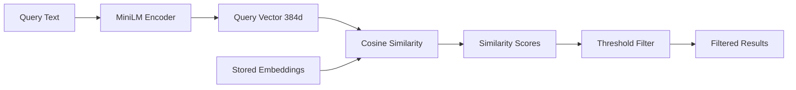
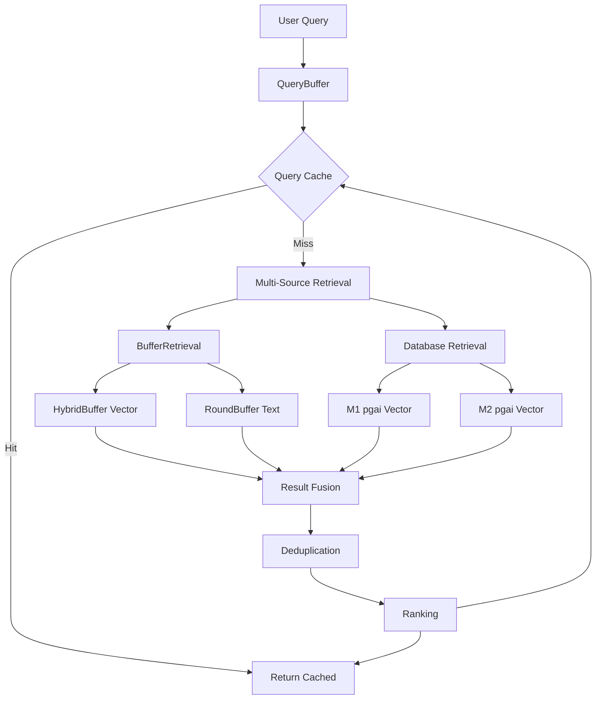

# RAG Infrastructure Integration

## Overview

MemFuse leverages a comprehensive RAG (Retrieval-Augmented Generation) infrastructure to provide modular, high-performance vector retrieval capabilities. The system integrates existing RAG components with buffer-specific retrieval implementations to create a unified, scalable architecture.

## RAG Module Structure

```
src/memfuse_core/rag/
├── base.py                 # BaseRetrieval interface
├── encode/                 # Encoding infrastructure
│   ├── base.py            # EncoderBase & EncoderRegistry
│   └── MiniLM.py          # MiniLM encoder implementation
├── retrieve/              # Retrieval implementations
│   ├── hybrid.py          # HybridRetrieval (existing)
│   └── buffer.py          # BufferRetrieval (new)
├── fusion/                # Score fusion strategies
│   └── strategies.py      # SimpleWeightedSum, etc.
└── rerank/                # Result reranking
    └── base.py            # RerankHandler interface
```

## Core Integration Points

### 1. EncoderRegistry System

**Purpose**: Centralized encoder management and instantiation

```python
# Encoder Registration
@EncoderRegistry.register("minilm")
class MiniLMEncoder(EncoderBase):
    async def encode_text(self, text: str) -> np.ndarray:
        # MiniLM encoding implementation
        
# Encoder Usage in BufferRetrieval
encoder = EncoderRegistry.create("minilm", **config)
query_embedding = await encoder.encode_text(query)
```

**Benefits**:
- **Pluggable Encoders**: Easy to swap different embedding models
- **Configuration Management**: Centralized encoder configuration
- **Resource Sharing**: Single encoder instance across components
- **Extensibility**: Simple registration of new encoders

### 2. BaseRetrieval Interface

**Purpose**: Unified retrieval interface for all retrieval implementations

```python
class BaseRetrieval(ABC):
    @abstractmethod
    async def retrieve(
        self,
        query: str,
        user_id: Optional[str] = None,
        session_id: Optional[str] = None,
        top_k: int = 5,
        **kwargs
    ) -> List[Dict[str, Any]]:
        pass
```

**Implementations**:
- **HybridRetrieval**: Multi-store retrieval (vector + graph + keyword)
- **BufferRetrieval**: Buffer-specific retrieval (new)

**Benefits**:
- **Consistent Interface**: Same API across all retrieval types
- **Interchangeable Components**: Easy to switch retrieval strategies
- **Testing**: Simplified mocking and testing
- **Composition**: Easy to combine multiple retrievers

### 3. BufferRetrieval Implementation

**Purpose**: Specialized retrieval for buffer layers using RAG infrastructure

```python
class BufferRetrieval(BaseRetrieval):
    def __init__(self, encoder_name="minilm", similarity_threshold=0.1):
        self.encoder_name = encoder_name
        self.similarity_threshold = similarity_threshold
        self.encoder = None
        
    async def retrieve(self, query, **kwargs):
        # Extract buffer references
        hybrid_buffer = kwargs.get('hybrid_buffer')
        round_buffer = kwargs.get('round_buffer')
        
        # Vector search in HybridBuffer
        hybrid_results = await self._retrieve_from_hybrid_buffer(
            query, hybrid_buffer, top_k
        )
        
        # Text search in RoundBuffer
        round_results = await self._retrieve_from_round_buffer(
            query, round_buffer, top_k
        )
        
        # Combine and deduplicate
        return await self._deduplicate_and_sort(
            hybrid_results + round_results, top_k
        )
```

## Vector Similarity Implementation

### Cosine Similarity Calculation

```python
def _cosine_similarity(self, vec1: np.ndarray, vec2: np.ndarray) -> float:
    """Calculate cosine similarity between two vectors."""
    # Normalize vectors
    vec1_norm = vec1 / np.linalg.norm(vec1)
    vec2_norm = vec2 / np.linalg.norm(vec2)
    
    # Calculate cosine similarity
    similarity = np.dot(vec1_norm, vec2_norm)
    
    # Ensure result is between 0 and 1
    return max(0.0, min(1.0, (similarity + 1) / 2))
```

### Embedding Generation Pipeline



## Multi-Source Retrieval Architecture

### Complete Retrieval Flow



### Source Integration Matrix

| Source | Type | Method | Latency | Use Case |
|--------|------|--------|---------|----------|
| **HybridBuffer** | Vector | Cosine Similarity | ~20ms | Recent semantic search |
| **RoundBuffer** | Text | Keyword Overlap | ~10ms | Recent exact matches |
| **M1 Database** | Vector | pgai + pgvector | ~50ms | Historical episodic data |
| **M2 Database** | Vector | pgai + pgvector | ~50ms | Semantic facts |

## Score Fusion Strategies

### SimpleWeightedSum Implementation

```python
class SimpleWeightedSum(ScoreFusionStrategy):
    def fuse_scores(self, results_by_id, weights):
        """Fuse scores using simple weighted sum."""
        fused_results = []
        
        for item_id, results_list in results_by_id.items():
            total_score = 0.0
            total_weight = 0.0
            base_result = None
            
            for result in results_list:
                source_type = result.metadata.get('source_type')
                weight = weights.get(source_type, 1.0)
                
                total_score += result.score * weight
                total_weight += weight
                
                if base_result is None:
                    base_result = result
            
            # Calculate final score
            final_score = total_score / total_weight if total_weight > 0 else 0.0
            
            # Create fused result
            fused_result = QueryResult(
                id=base_result.id,
                content=base_result.content,
                score=final_score,
                metadata={
                    **base_result.metadata,
                    'fusion_method': 'SimpleWeightedSum',
                    'source_count': len(results_list)
                }
            )
            
            fused_results.append(fused_result)
        
        return sorted(fused_results, key=lambda x: x.score, reverse=True)
```

### Source Weighting Configuration

```python
# Default source weights for fusion
source_weights = {
    'hybrid_buffer_vector': 0.4,    # Recent semantic data
    'round_buffer_text': 0.3,       # Recent exact matches
    'database_m0_vector': 0.2,      # Historical episodic
    'database_m1_vector': 0.1       # Semantic facts
}
```

## Performance Optimizations

### Encoder Caching

```python
class BufferRetrieval:
    async def _get_encoder(self):
        """Get or initialize the encoder with caching."""
        if self.encoder is None:
            async with self._encoder_lock:
                if self.encoder is None:
                    self.encoder = EncoderRegistry.create(
                        self.encoder_name, **self.encoder_config
                    )
        return self.encoder
```

### Batch Processing

```python
# Batch embedding generation for multiple queries
embeddings = await encoder.encode_texts([query1, query2, query3])

# Batch similarity calculation
similarities = np.dot(query_embeddings, stored_embeddings.T)
```

### Threshold Filtering

```python
# Early filtering to reduce computation
if similarity >= self.similarity_threshold:
    results.append({
        'similarity': similarity,
        'content': chunk.content,
        'metadata': chunk.metadata
    })
```

## Error Handling & Resilience

### Graceful Degradation

```python
async def retrieve(self, query, **kwargs):
    try:
        # Attempt vector search
        vector_results = await self._vector_search(query, hybrid_buffer)
    except Exception as e:
        logger.warning(f"Vector search failed: {e}")
        vector_results = []
    
    try:
        # Attempt text search
        text_results = await self._text_search(query, round_buffer)
    except Exception as e:
        logger.warning(f"Text search failed: {e}")
        text_results = []
    
    # Return whatever results we have
    return vector_results + text_results
```

### Fallback Strategies

1. **Encoder Failure**: Fall back to text-only search
2. **Vector Search Failure**: Use keyword matching only
3. **Buffer Unavailable**: Query database directly
4. **Complete Failure**: Return empty results gracefully

## Testing Infrastructure

### Unit Testing

```python
class TestBufferRetrieval:
    @pytest.mark.asyncio
    async def test_vector_similarity_calculation(self):
        buffer_retrieval = BufferRetrieval()
        vec1 = np.array([1.0, 0.0, 0.0])
        vec2 = np.array([1.0, 0.0, 0.0])
        similarity = buffer_retrieval._cosine_similarity(vec1, vec2)
        assert similarity > 0.9
    
    @pytest.mark.asyncio
    async def test_multi_source_retrieval(self):
        # Test with mock buffers
        results = await buffer_retrieval.retrieve(
            query="test query",
            hybrid_buffer=mock_hybrid,
            round_buffer=mock_round
        )
        assert len(results) > 0
```

### Integration Testing

```python
class TestRAGIntegration:
    @pytest.mark.asyncio
    async def test_encoder_registry_integration(self):
        # Test encoder creation and usage
        encoder = EncoderRegistry.create("minilm")
        embedding = await encoder.encode_text("test")
        assert len(embedding) == 384
    
    @pytest.mark.asyncio
    async def test_end_to_end_retrieval(self):
        # Test complete retrieval pipeline
        query_buffer = QueryBuffer()
        results = await query_buffer.query("test query")
        assert isinstance(results, list)
```

## Configuration Management

### RAG Configuration

```yaml
rag:
  encoders:
    minilm:
      model_name: "all-MiniLM-L6-v2"
      cache_size: 10000
      device: "cpu"
  
  retrieval:
    buffer:
      encoder_name: "minilm"
      similarity_threshold: 0.1
      fusion_strategy: "SimpleWeightedSum"
    
    fusion:
      source_weights:
        hybrid_buffer_vector: 0.4
        round_buffer_text: 0.3
        database_m0_vector: 0.2
        database_m1_vector: 0.1
```

## Future Enhancements

### Planned Improvements

1. **Advanced Encoders**: Support for larger models (BGE, E5)
2. **Hybrid Fusion**: More sophisticated score combination
3. **Adaptive Thresholds**: Dynamic similarity threshold adjustment
4. **Semantic Caching**: Cache embeddings for repeated queries
5. **Distributed Retrieval**: Multi-node retrieval coordination

### Extension Points

- **Custom Encoders**: Easy registration of new embedding models
- **Fusion Strategies**: Pluggable score combination algorithms
- **Retrieval Sources**: Additional data source integrations
- **Ranking Models**: Advanced reranking implementations

## Related Documentation

- **[QueryBuffer Architecture](buffer/query_buffer.md)** - Complete query system
- **[Buffer Overview](buffer/overview.md)** - Buffer system architecture
- **[Performance Analysis](optimization/)** - Performance optimization guides
- **[Configuration Guide](configuration/)** - Complete configuration reference
