# MemFuse Chunking System

## Overview

The MemFuse chunking system transforms message-based conversations into retrievable chunks for efficient storage and retrieval. This document provides a comprehensive guide to the chunking architecture, implementation, and usage.

## Architecture

### Core Components


### Data Flow Architecture


### Component Interaction Diagram


### Data Processing Pipeline

The chunking system processes data through the following pipeline:

1. **Client Request** → MessageList (List of Messages)
2. **BufferService.add()** → Wraps as MessageBatchList and calls add_batch()
3. **WriteBuffer** → Accumulates MessageLists (threshold: 5 lists)
4. **Batch Processing** → Triggers MemoryService.add_batch(MessageBatchList)
5. **ChunkStrategy** → Converts MessageBatchList to List[ChunkData]
6. **Storage** → Stores chunks to Vector/Keyword/Graph stores

## Data Structures

### MessageList and MessageBatchList

```python
# Type aliases for better readability
MessageList = List[Dict[str, Any]]  # List of Messages
MessageBatchList = List[MessageList]  # List of lists of Messages

# Example MessageList
message_list = [
    {
        "role": "user",
        "content": "Tell me about Mars",
        "metadata": {"session_id": "session123"}
    },
    {
        "role": "assistant", 
        "content": "Mars is the fourth planet from the Sun...",
        "metadata": {"session_id": "session123"}
    }
]

# Example MessageBatchList
message_batch_list = [message_list1, message_list2, message_list3]
```

### ChunkData Structure

```python
@dataclass
class ChunkData:
    content: str  # The text content of the chunk
    chunk_id: str  # Unique identifier for the chunk
    metadata: Dict[str, Any]  # Additional metadata (source info, timestamps, etc.)
    
    def __init__(self, content: str, chunk_id: str = None, metadata: Dict[str, Any] = None):
        self.content = content
        self.chunk_id = chunk_id or self._generate_chunk_id()
        self.metadata = metadata or {}
```

### MessageInterface Architecture


### Query Processing Architecture


## Interface Design

### MessageInterface

The unified interface for message processing across all services:

```python
class MessageInterface(ABC):
    """Interface for message processing.
    
    Provides consistent add() and add_batch() methods where:
    - add() takes MessageList and internally calls add_batch()
    - add_batch() takes MessageBatchList and is the core processing method
    """
    
    async def add(self, messages: MessageList, **kwargs) -> Dict[str, Any]:
        """Add a single list of messages."""
        return await self.add_batch([messages], **kwargs)
    
    @abstractmethod
    async def add_batch(self, message_batch_list: MessageBatchList, **kwargs) -> Dict[str, Any]:
        """Add a batch of message lists."""
        pass
```

### ChunkStrategy Interface

```python
class ChunkStrategy(ABC):
    """Abstract base class for chunking strategies."""
    
    @abstractmethod
    async def create_chunks(self, message_batch_list: MessageBatchList) -> List[ChunkData]:
        """Create chunks from a batch of message lists."""
        pass
```

## Chunking Strategies

### MessageChunkStrategy

The default strategy that creates one chunk per MessageList:

```python
class MessageChunkStrategy(ChunkStrategy):
    """Message-based chunking strategy that creates one chunk per MessageList."""

    async def create_chunks(self, message_batch_list: MessageBatchList) -> List[ChunkData]:
        chunks = []
        for i, message_list in enumerate(message_batch_list):
            if not message_list:
                continue

            # Combine all messages in the list into one chunk content
            chunk_content = self._combine_messages(message_list)

            # Create metadata for the chunk
            metadata = {
                "strategy": "message",
                "message_count": len(message_list),
                "source": "message_list",
                "batch_index": i,
                "roles": [msg.get("role", "unknown") for msg in message_list]
            }

            # Create the chunk
            chunk = ChunkData(
                content=chunk_content,
                metadata=metadata
            )
            chunks.append(chunk)

        return chunks
```

### ContextualChunkStrategy

Advanced strategy for handling long conversations with intelligent splitting:

```python
class ContextualChunkStrategy(ChunkStrategy):
    """Contextual chunking strategy that intelligently splits content based on context."""

    def __init__(self, max_chunk_length: int = 1000):
        self.max_chunk_length = max_chunk_length

    async def create_chunks(self, message_batch_list: MessageBatchList) -> List[ChunkData]:
        # Implementation for intelligent contextual splitting
        pass
```

### CharacterChunkStrategy

Character-based strategy for uniform chunk sizes:

```python
class CharacterChunkStrategy(ChunkStrategy):
    """Character-based chunking strategy that splits content by character count."""

    def __init__(self, max_chunk_length: int = 1000, overlap_length: int = 100):
        self.max_chunk_length = max_chunk_length
        self.overlap_length = overlap_length

    async def create_chunks(self, message_batch_list: MessageBatchList) -> List[ChunkData]:
        # Implementation for character-based splitting with overlap
        pass
```

### Strategy Comparison

```mermaid
graph TB
    subgraph "Strategy Selection Guide"
        Input[Input: MessageBatchList]

        Q1{Content Length?}
        Q2{Preserve Message Boundaries?}
        Q3{Need Overlap?}

        Input --> Q1
        Q1 -->|Short| Q2
        Q1 -->|Long| Q3

        Q2 -->|Yes| MS[MessageChunkStrategy<br/>• One chunk per MessageList<br/>• Preserves conversation structure<br/>• Best for short conversations]
        Q2 -->|No| CS[ContextualChunkStrategy<br/>• Intelligent splitting<br/>• Context-aware boundaries<br/>• Best for long conversations]

        Q3 -->|Yes| CCS[CharacterChunkStrategy<br/>• Fixed-size chunks<br/>• Configurable overlap<br/>• Best for uniform processing]
        Q3 -->|No| CS
    end

    subgraph "Use Cases"
        UC1["`**MessageChunkStrategy**
        ✅ Short conversations
        ✅ Preserve message pairs
        ✅ Simple processing
        ❌ Long content handling`"]

        UC2["`**ContextualChunkStrategy**
        ✅ Long conversations
        ✅ Intelligent splitting
        ✅ Context preservation
        ❌ Complex processing`"]

        UC3["`**CharacterChunkStrategy**
        ✅ Uniform chunk sizes
        ✅ Predictable processing
        ✅ Overlap support
        ❌ May break context`"]
    end
```



## Service Implementation

### BufferService

Manages buffering and batch processing:

```python
class BufferService(MemoryInterface, ServiceInterface, MessageInterface):
    """Buffer service with WriteBuffer, SpeculativeBuffer, QueryBuffer functionality."""
    
    async def add(self, messages: MessageList, **kwargs) -> Dict[str, Any]:
        """Add messages to WriteBuffer."""
        return await self.add_batch([messages], **kwargs)
    
    async def add_batch(self, message_batch_list: MessageBatchList, **kwargs) -> Dict[str, Any]:
        """Add batch of message lists to WriteBuffer."""
        # Add to WriteBuffer, which triggers MemoryService when threshold is reached
        pass
```

### MemoryService

Core processing service that applies chunking:

```python
class MemoryService(MessageInterface):
    """Memory service for managing user-agent interactions."""
    
    def __init__(self, user: str, agent: str, session: str, config: Dict[str, Any]):
        # Initialize chunk strategy (default: MessageChunkStrategy)
        self.chunk_strategy = MessageChunkStrategy()
    
    async def add_batch(self, message_batch_list: MessageBatchList, **kwargs) -> Dict[str, Any]:
        """Core processing method that handles MessageBatchList."""
        
        # Apply chunk strategy: MessageBatchList -> List[ChunkData]
        chunks = await self.chunk_strategy.create_chunks(message_batch_list)
        
        # Store original messages to database
        message_ids = await self._store_original_messages(message_batch_list)
        
        # Store chunks to various stores
        await self._store_chunks(chunks)
        
        return self._success_response(message_ids, f"Processed {len(chunks)} chunks")
```

## Storage Integration

### Chunk Storage Process

The `_store_chunks` method converts ChunkData to store-specific formats:

```python
async def _store_chunks(self, chunks: List[ChunkData]) -> None:
    """Store chunks to various stores."""
    
    # Store chunks to vector store
    if self.vector_store:
        vector_items = []
        for chunk in chunks:
            vector_items.append(Item(
                id=chunk.chunk_id,
                content=chunk.content,
                metadata={
                    **chunk.metadata,
                    "type": "chunk",
                    "user_id": self._user_id,
                }
            ))
        await self.vector_store.add_batch(vector_items)
    
    # Store chunks to keyword store
    if self.keyword_store:
        keyword_items = [Item(...) for chunk in chunks]
        await self.keyword_store.add_batch(keyword_items)
    
    # Store chunks to graph store
    if self.graph_store:
        graph_nodes = [Node(...) for chunk in chunks]
        await self.graph_store.add_nodes(graph_nodes)
```

### Data Transformation Architecture

```mermaid
graph TB
    subgraph "RAG Layer - Chunking Domain"
        CD[ChunkData]
        CD --> CDProps["`**ChunkData Properties:**
        • content: str
        • chunk_id: str
        • metadata: Dict[str, Any]
        • Chunking-specific logic`"]
    end

    subgraph "Store Layer - Storage Domain"
        IT[Item/Node]
        IT --> ITProps["`**Item/Node Properties:**
        • id: str
        • content: str
        • metadata: Dict[str, Any]
        • Storage-specific logic
        • Universal storage interface`"]
    end

    subgraph "Transformation Layer"
        TL["`**Why Transform?**
        1. **Separation of Concerns**
           - ChunkData: RAG/Chunking logic
           - Item/Node: Storage logic

        2. **Universal Interface**
           - Stores handle multiple data types:
             • Chunks (from ChunkData)
             • Messages (direct)
             • Knowledge (direct)

        3. **Extensibility**
           - Easy to add new data types
           - Consistent storage interface`"]
    end

    CD --> TL
    TL --> IT

    subgraph "Store Types"
        IT --> VS[VectorStore<br/>List of Item]
        IT --> KS[KeywordStore<br/>List of Item]
        IT --> GS[GraphStore<br/>List of Node]
    end
```



### Store Input Confirmation

After implementing the chunking system, stores receive **List of Items/Nodes** (converted from ChunkData) rather than List of Messages:

- **VectorStore**: Receives `List[Item]` created from `List[ChunkData]`
- **KeywordStore**: Receives `List[Item]` created from `List[ChunkData]`
- **GraphStore**: Receives `List[Node]` created from `List[ChunkData]`

**Design Rationale:**
1. **Layer Separation**: ChunkData belongs to RAG layer, Item/Node belongs to Storage layer
2. **Universal Interface**: Stores handle chunks, messages, knowledge with same interface
3. **Future Extensibility**: Easy to add new data types without changing store interfaces

## Query and Retrieval

### Query Processing

The system supports querying both original messages and chunks:

```python
query_obj = Query(
    text="Mars exploration",
    metadata={
        "include_messages": True,   # Include original messages
        "include_knowledge": True,  # Include knowledge items
        "include_chunks": True,     # Include chunk data
        "user_id": "user123"
    }
)
```

### Buffer Integration

The QueryBuffer handles mixed data formats from different sources:

- **Storage**: Returns standard dictionary objects
- **WriteBuffer**: Contains MessageList objects (List of Messages)
- **SpeculativeBuffer**: Contains standard dictionary objects

The QueryBuffer converts MessageList objects to standardized format before returning results.

## Performance Characteristics

### Current Performance

- **Service startup time**: ~7 seconds (including model loading)
- **Message addition latency**: <50ms (WriteBuffer)
- **Query response time**: ~200ms (including rerank)
- **Batch processing trigger**: 5 MessageList threshold

### Optimization Targets

- **Service startup time**: <5 seconds
- **Message addition latency**: <20ms
- **Query response time**: <100ms
- **Batch processing delay**: <1 second

## Implementation Status

### ✅ Completed Features

1. **Chunk Module Architecture**: Complete implementation of ChunkData and ChunkStrategy
2. **Message Interface**: BufferService and MemoryService implement the interface
3. **Retrieval System**: Supports `include_chunks=True` parameter
4. **Reranker Adaptation**: Processes MessageList format data
5. **Service Integration**: Services start normally and process requests
6. **Error Fixes**: Resolved `'list' object has no attribute 'get'` error

### 🔄 In Progress

1. **Data Addition**: Successfully adds data to WriteBuffer
2. **Data Retrieval**: Retrieves from WriteBuffer and performs reranking
3. **Batch Processing**: Requires threshold (5 MessageLists) to trigger full chunking

### 🎯 Future Enhancements

#### Short-term (1-2 weeks)
- [ ] Basic testing validation
- [ ] Performance optimization
- [ ] Enhanced error handling

#### Medium-term (1 month)
- [ ] Semantic similarity chunking
- [ ] Time window chunking
- [ ] Adaptive chunking strategies
- [ ] Monitoring and metrics

#### Long-term (2-3 months)
- [ ] Distributed processing support
- [ ] Streaming processing capabilities
- [ ] ML-enhanced features
- [ ] Advanced RAG capabilities

## Usage Examples

### Basic Usage

```python
# Initialize services
buffer_service = BufferService(memory_service, config)
await buffer_service.initialize()

# Add messages
messages = [
    {"role": "user", "content": "Hello"},
    {"role": "assistant", "content": "Hi there!"}
]
result = await buffer_service.add(messages)

# Query
query_result = await buffer_service.query("greeting", max_results=5)
```

### Custom Chunking Strategy

```python
# Use different strategies
from memfuse_core.rag.chunk import MessageChunkStrategy, ContextualChunkStrategy, CharacterChunkStrategy

# Default: One chunk per MessageList
memory_service.chunk_strategy = MessageChunkStrategy()

# For long conversations: Intelligent context-aware splitting
memory_service.chunk_strategy = ContextualChunkStrategy(max_chunk_length=1500)

# For uniform chunks: Character-based splitting with overlap
memory_service.chunk_strategy = CharacterChunkStrategy(
    max_chunk_length=1000,
    overlap_length=100
)

# Custom strategy
class CustomChunkStrategy(ChunkStrategy):
    async def create_chunks(self, message_batch_list: MessageBatchList) -> List[ChunkData]:
        # Custom implementation
        pass

memory_service.chunk_strategy = CustomChunkStrategy()
```

## Troubleshooting

### Common Issues

1. **"'list' object has no attribute 'get'" Error**
   - **Cause**: Mixed data formats in query results
   - **Solution**: Fixed in QueryBuffer and API layer with proper type checking

2. **Batch Processing Not Triggering**
   - **Cause**: WriteBuffer threshold not reached
   - **Solution**: Add more MessageLists or reduce threshold in configuration

3. **Performance Issues**
   - **Cause**: Large chunk sizes or inefficient strategies
   - **Solution**: Optimize chunk strategy or adjust parameters

### Debug Information

Enable debug logging to trace the chunking process:

```python
import logging
logging.getLogger("memfuse_core.rag.chunk").setLevel(logging.DEBUG)
logging.getLogger("memfuse_core.services").setLevel(logging.DEBUG)
```

## Contributing

### Code Standards
- Use English comments for all new code
- Follow Python PEP 8 conventions
- Include type hints
- Write unit tests for new features

### Documentation Updates
- Update relevant documentation for significant changes
- Add usage examples for new features
- Update API documentation for interface changes

### Testing Requirements
- Unit tests required for new functionality
- Integration tests for significant changes
- Performance benchmarks for optimization changes

---

**Last Updated**: 2025-01-27  
**Document Version**: v2.0  
**System Version**: MemFuse Core v0.1.0
