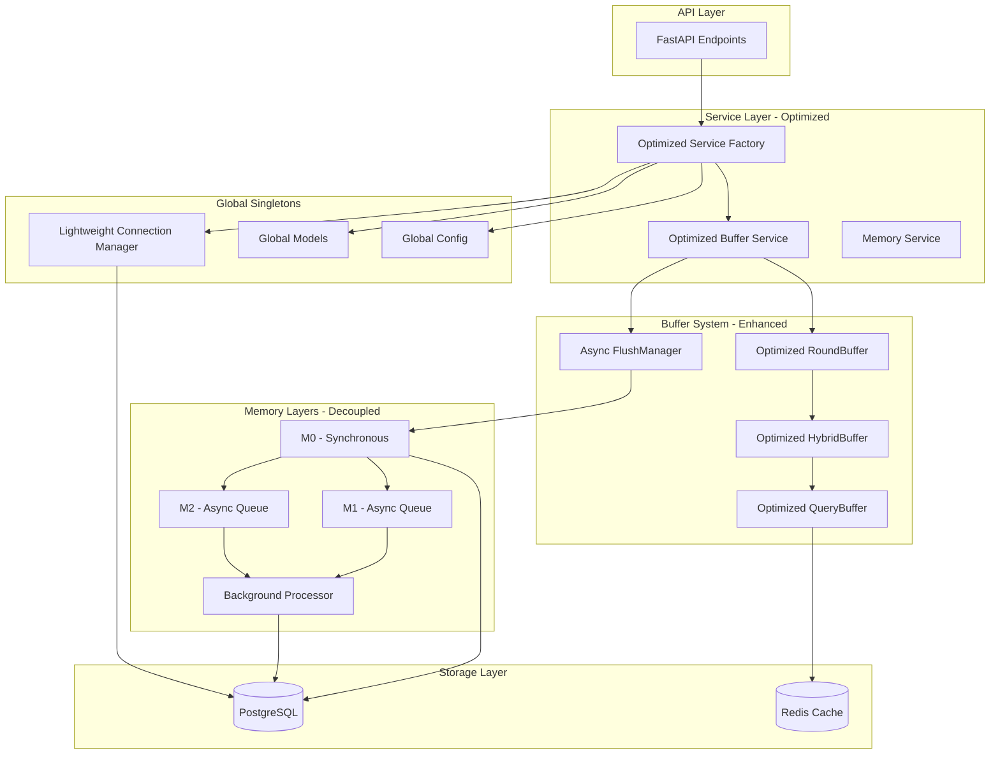

# MemFuse Performance Optimization Design

## Overview

This design document outlines the architecture and implementation strategy for optimizing MemFuse performance while maintaining all existing functionality. The focus is on eliminating redundant operations, implementing true asynchronous processing, and optimizing the buffer system for high-throughput scenarios.

## Architecture

### Core Design Principles

1. **Buffer-First Architecture**: Optimize buffer system as the primary performance enhancement mechanism
2. **Async Decoupling**: Separate synchronous critical path (M0) from asynchronous processing (M1/M2)
3. **Global Singleton Pattern**: Load expensive resources once and share globally
4. **Lightweight Operations**: Eliminate redundant checks and operations from critical paths
5. **Resource Pooling**: Optimize connection and resource management for minimal overhead

### High-Level Architecture Diagram



## Components and Interfaces

### 1. Optimized Service Factory

#### Design Goals
- Eliminate repeated initialization overhead
- Implement true global singleton pattern
- Provide sub-10ms service access for cached instances

#### Interface Design
```python
class OptimizedServiceFactory:
    """High-performance service factory with aggressive caching."""
    
    # Global singleton instances
    _global_config: Optional[DictConfig] = None
    _global_models: Dict[str, Any] = {}
    _global_connection_manager: Optional[ConnectionManager] = None
    
    # User-level cached services
    _service_cache: Dict[str, Any] = {}
    _cache_lock = asyncio.Lock()
    
    @classmethod
    async def get_buffer_service(cls, user: str) -> BufferService:
        """Get buffer service with <10ms access time for cached instances."""
        
    @classmethod
    async def initialize_globals(cls) -> None:
        """One-time global initialization at startup."""
        
    @classmethod
    def get_global_config(cls) -> DictConfig:
        """Access pre-loaded global configuration."""
```

#### Key Optimizations
- **Startup Initialization**: Load all global resources during server startup
- **Lazy User Services**: Create user-specific services only when first accessed
- **Memory-Efficient Caching**: Use weak references for automatic cleanup
- **Thread-Safe Access**: Minimize lock contention with read-optimized patterns

### 2. Enhanced Buffer System

#### Design Goals
- Achieve 60% performance improvement over current implementation
- Implement true streaming data optimization
- Minimize memory allocations and copies

#### RoundBuffer Optimization
```python
class OptimizedRoundBuffer:
    """Token-based buffer with optimized operations."""
    
    def __init__(self, max_tokens: int = 800, token_cache_size: int = 1000):
        self.max_tokens = max_tokens
        self.rounds: deque = deque()
        self.current_tokens = 0
        
        # Performance optimizations
        self.token_cache = LRUCache(token_cache_size)
        self.batch_processor = BatchProcessor()
        
    async def add_optimized(self, messages: MessageList) -> AddResult:
        """Optimized message addition with caching and batching."""
        
        # Fast path: use cached token count if available
        cache_key = self._get_cache_key(messages)
        if cache_key in self.token_cache:
            token_count = self.token_cache[cache_key]
        else:
            token_count = await self._count_tokens_optimized(messages)
            self.token_cache[cache_key] = token_count
        
        # Batch processing for efficiency
        return await self.batch_processor.add_batch([messages], token_count)
```

#### HybridBuffer Optimization
```python
class OptimizedHybridBuffer:
    """Dual-format buffer with optimized transfers."""
    
    def __init__(self, max_size: int = 5):
        self.max_size = max_size
        self.items: deque = deque(maxlen=max_size)
        
        # Performance optimizations
        self.transfer_queue = AsyncQueue()
        self.batch_embedder = BatchEmbedder()
        
    async def transfer_optimized(self, rounds: List[MessageList]) -> None:
        """Optimized transfer with batch processing."""
        
        # Batch embedding for efficiency
        embedded_rounds = await self.batch_embedder.embed_batch(rounds)
        
        # Async transfer without blocking
        await self.transfer_queue.put(embedded_rounds)
```

#### QueryBuffer Optimization
```python
class OptimizedQueryBuffer:
    """Query buffer with intelligent caching."""
    
    def __init__(self, cache_size: int = 100):
        self.query_cache = TTLCache(cache_size, ttl=300)  # 5-minute TTL
        self.result_cache = LRUCache(cache_size)
        
    async def query_optimized(self, query: str, top_k: int) -> List[Any]:
        """Optimized query with multi-level caching."""
        
        cache_key = f"{hash(query)}:{top_k}"
        
        # L1 Cache: Exact query results
        if cache_key in self.result_cache:
            return self.result_cache[cache_key]
        
        # L2 Cache: Similar queries with reranking
        similar_results = self._find_similar_cached_results(query)
        if similar_results:
            results = await self._rerank_cached_results(query, similar_results)
            self.result_cache[cache_key] = results
            return results
        
        # L3: Full query execution
        results = await self._execute_full_query(query, top_k)
        self.result_cache[cache_key] = results
        return results
```

### 3. Asynchronous Memory Layer Decoupling

#### Design Goals
- M0 operations complete in <50ms synchronously
- M1/M2 processing happens asynchronously without blocking
- Background processing uses separate resource pools

#### Architecture Design
```python
class DecoupledMemoryLayer:
    """Memory layer with true async decoupling."""
    
    def __init__(self):
        # Synchronous M0 processor
        self.m0_processor = M0Processor()
        
        # Asynchronous background processors
        self.background_queue = AsyncQueue(maxsize=1000)
        self.background_workers = []
        self.background_connection_pool = BackgroundConnectionPool()
        
    async def process_batch(self, messages: MessageBatchList) -> ProcessResult:
        """Process with immediate M0 return and async M1/M2."""
        
        # Step 1: Synchronous M0 processing (critical path)
        m0_result = await self.m0_processor.process_immediate(messages)
        
        # Step 2: Queue M1/M2 for background processing
        background_task = BackgroundTask(
            messages=messages,
            m0_result=m0_result,
            timestamp=time.time()
        )
        
        try:
            self.background_queue.put_nowait(background_task)
        except asyncio.QueueFull:
            logger.warning("Background queue full, M1/M2 processing delayed")
        
        # Return immediately with M0 results
        return ProcessResult(
            status="success",
            m0_result=m0_result,
            background_queued=True
        )
```

#### Background Processing System
```python
class BackgroundProcessor:
    """Dedicated background processor for M1/M2 layers."""
    
    def __init__(self, worker_count: int = 3):
        self.worker_count = worker_count
        self.workers = []
        self.connection_pool = BackgroundConnectionPool(
            min_size=2,
            max_size=worker_count * 2
        )
        
    async def start_workers(self) -> None:
        """Start background worker processes."""
        for i in range(self.worker_count):
            worker = BackgroundWorker(
                worker_id=i,
                connection_pool=self.connection_pool,
                queue=self.background_queue
            )
            self.workers.append(worker)
            asyncio.create_task(worker.run())
    
    async def process_background_task(self, task: BackgroundTask) -> None:
        """Process M1/M2 layers asynchronously."""
        
        try:
            # M1 Processing (Episodic)
            if self.config.m1_enabled:
                m1_result = await self.m1_processor.process(task.messages)
                await self._store_m1_result(m1_result)
            
            # M2 Processing (Semantic)  
            if self.config.m2_enabled:
                m2_result = await self.m2_processor.process(task.messages)
                await self._store_m2_result(m2_result)
                
        except Exception as e:
            logger.error(f"Background processing failed: {e}")
            await self._schedule_retry(task)
```

### 4. Lightweight Connection Manager

#### Design Goals
- Eliminate health check overhead from critical path
- Provide <5ms connection acquisition for existing pools
- Minimize memory and CPU overhead

#### Simplified Design
```python
class LightweightConnectionManager:
    """Minimal overhead connection manager."""
    
    def __init__(self):
        self._pools: Dict[str, AsyncConnectionPool] = {}
        self._pool_configs: Dict[str, PoolConfig] = {}
        self._creation_locks: Dict[str, asyncio.Lock] = {}
        
    async def get_pool(self, db_url: str) -> AsyncConnectionPool:
        """Get pool with minimal overhead - no health checks."""
        
        # Fast path: return existing pool immediately
        if db_url in self._pools:
            return self._pools[db_url]
        
        # Slow path: create pool with per-URL locking
        if db_url not in self._creation_locks:
            self._creation_locks[db_url] = asyncio.Lock()
            
        async with self._creation_locks[db_url]:
            # Double-check pattern
            if db_url in self._pools:
                return self._pools[db_url]
                
            # Create pool with optimized settings
            pool = await self._create_optimized_pool(db_url)
            self._pools[db_url] = pool
            return pool
    
    async def _create_optimized_pool(self, db_url: str) -> AsyncConnectionPool:
        """Create pool with performance-optimized settings."""
        
        config = self._get_optimized_config()
        
        pool = AsyncConnectionPool(
            db_url,
            min_size=config.min_size,
            max_size=config.max_size,
            timeout=config.timeout,
            open=True,  # Open immediately
            configure=self._configure_connection
        )
        
        return pool
```

### 5. Global Configuration Management

#### Design Goals
- Load configuration once at startup
- Provide instant access to configuration values
- Support hot-reload for non-critical settings

#### Design
```python
class GlobalConfigManager:
    """Global configuration with instant access."""
    
    _instance: Optional['GlobalConfigManager'] = None
    _config: Optional[DictConfig] = None
    _config_cache: Dict[str, Any] = {}
    
    @classmethod
    async def initialize(cls, config_path: str) -> None:
        """One-time initialization at startup."""
        if cls._instance is None:
            cls._instance = cls()
            cls._config = await cls._load_config(config_path)
            cls._build_cache()
    
    @classmethod
    def get(cls, key: str, default: Any = None) -> Any:
        """Instant configuration access from cache."""
        return cls._config_cache.get(key, default)
    
    @classmethod
    def get_section(cls, section: str) -> Dict[str, Any]:
        """Get entire configuration section."""
        return cls._config_cache.get(section, {})
```

## Data Models

### Performance Metrics Model
```python
@dataclass
class PerformanceMetrics:
    """Performance tracking data model."""
    operation_name: str
    start_time: float
    end_time: float
    duration: float
    success: bool
    error_message: Optional[str] = None
    metadata: Dict[str, Any] = field(default_factory=dict)
    
    @property
    def duration_ms(self) -> float:
        return self.duration * 1000
```

### Background Task Model
```python
@dataclass
class BackgroundTask:
    """Background processing task model."""
    task_id: str
    messages: MessageBatchList
    m0_result: Dict[str, Any]
    timestamp: float
    priority: int = 0
    retry_count: int = 0
    max_retries: int = 3
    
    @property
    def age_seconds(self) -> float:
        return time.time() - self.timestamp
```

## Error Handling

### Performance-Aware Error Handling
```python
class PerformanceAwareErrorHandler:
    """Error handling that doesn't impact performance."""
    
    def __init__(self):
        self.error_cache = TTLCache(1000, ttl=60)
        self.circuit_breakers = {}
    
    async def handle_error(self, operation: str, error: Exception) -> ErrorResponse:
        """Handle errors with minimal performance impact."""
        
        error_key = f"{operation}:{type(error).__name__}"
        
        # Check circuit breaker
        if self._is_circuit_open(error_key):
            return ErrorResponse.circuit_open(operation)
        
        # Cache similar errors to avoid repeated processing
        if error_key in self.error_cache:
            cached_response = self.error_cache[error_key]
            cached_response.increment_count()
            return cached_response
        
        # Process new error
        response = await self._process_error(operation, error)
        self.error_cache[error_key] = response
        
        return response
```

## Testing Strategy

### Performance Testing Framework
```python
class PerformanceTestSuite:
    """Comprehensive performance testing."""
    
    async def test_buffer_performance(self) -> TestResults:
        """Test buffer system performance improvements."""
        
        # Baseline measurement
        baseline_time = await self._measure_current_implementation()
        
        # Optimized measurement
        optimized_time = await self._measure_optimized_implementation()
        
        improvement = (baseline_time - optimized_time) / baseline_time * 100
        
        assert improvement >= 60, f"Buffer optimization target not met: {improvement}%"
        
        return TestResults(
            baseline_ms=baseline_time * 1000,
            optimized_ms=optimized_time * 1000,
            improvement_percent=improvement
        )
    
    async def test_async_decoupling(self) -> TestResults:
        """Test M0/M1/M2 async decoupling."""
        
        start_time = time.time()
        
        # Process batch and measure M0 completion time
        result = await self.memory_layer.process_batch(test_messages)
        m0_completion_time = time.time() - start_time
        
        # Verify M0 completed quickly
        assert m0_completion_time < 0.05, f"M0 took too long: {m0_completion_time}s"
        
        # Verify M1/M2 are queued for background processing
        assert result.background_queued, "Background processing not queued"
        
        return TestResults(
            m0_completion_ms=m0_completion_time * 1000,
            background_queued=result.background_queued
        )
```

### Load Testing
```python
class LoadTestSuite:
    """Load testing for concurrent performance."""
    
    async def test_concurrent_users(self, user_count: int = 10) -> LoadTestResults:
        """Test performance under concurrent load."""
        
        async def simulate_user(user_id: str) -> UserTestResults:
            service = await ServiceFactory.get_buffer_service(f"user_{user_id}")
            
            start_time = time.time()
            
            # Simulate typical operations
            await service.add_batch([generate_test_messages()])
            await service.query("test query", top_k=5)
            await service.get_messages_by_session("session_1", limit=10)
            
            total_time = time.time() - start_time
            
            return UserTestResults(
                user_id=user_id,
                total_time_ms=total_time * 1000,
                operations_completed=3
            )
        
        # Run concurrent users
        tasks = [simulate_user(str(i)) for i in range(user_count)]
        results = await asyncio.gather(*tasks)
        
        return LoadTestResults(
            user_count=user_count,
            user_results=results,
            avg_time_ms=sum(r.total_time_ms for r in results) / len(results),
            max_time_ms=max(r.total_time_ms for r in results)
        )
```

## Implementation Phases

### Phase 1: Global Singleton Implementation (Week 1)
- Implement GlobalConfigManager with startup initialization
- Create LightweightConnectionManager without health checks
- Optimize ServiceFactory with aggressive caching
- **Target**: 50% reduction in service initialization time

### Phase 2: Buffer System Optimization (Week 2)
- Implement OptimizedRoundBuffer with token caching
- Create OptimizedHybridBuffer with batch processing
- Build OptimizedQueryBuffer with multi-level caching
- **Target**: 60% improvement in buffer processing time

### Phase 3: Async Memory Layer Decoupling (Week 3)
- Implement DecoupledMemoryLayer with immediate M0 return
- Create BackgroundProcessor for M1/M2 processing
- Set up separate connection pools for background processing
- **Target**: M0 operations complete in <50ms

### Phase 4: Integration and Optimization (Week 4)
- Integrate all optimized components
- Implement performance monitoring and metrics
- Conduct load testing and fine-tuning
- **Target**: Overall 70% latency reduction

This design provides a comprehensive approach to optimizing MemFuse performance while maintaining all existing functionality and focusing on the areas you identified as most critical.