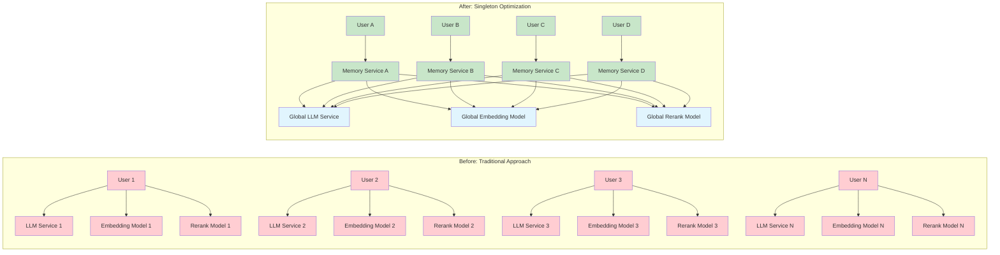
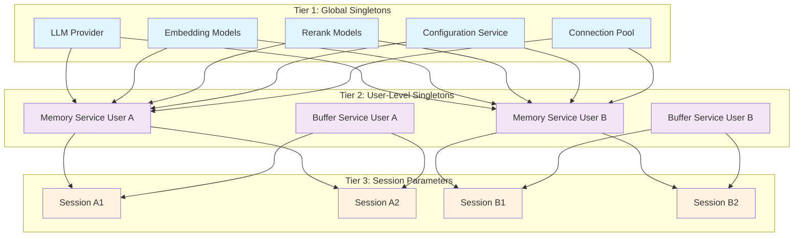

# MemFuse Singleton Optimization Strategy

## Overview

This document explores the singleton pattern optimization strategy for MemFuse, focusing on the fundamental problems it solves, where it can be effectively applied, and the underlying optimization principles. The goal is to provide a conceptual framework that remains valuable regardless of specific implementation details.

## The Problem: Resource Duplication in Multi-User Systems

### Core Challenge

In a multi-user memory system like MemFuse, naive implementation leads to exponential resource consumption:

```
Traditional Approach:
User A → LLM Service A → Embedding Model A → Rerank Model A
User B → LLM Service B → Embedding Model B → Rerank Model B
User C → LLM Service C → Embedding Model C → Rerank Model C
...
Result: N users × M models = N×M resource instances
```

### Resource Multiplication Problem

The following diagram illustrates the dramatic difference in resource usage between traditional and singleton-optimized approaches:



**Key Problems Addressed**:

1. **Memory Explosion**: Each user session creates independent service instances
2. **Model Redundancy**: Identical ML models loaded multiple times in memory
3. **Initialization Overhead**: Repeated expensive setup operations
4. **Connection Proliferation**: Multiple database connections per user
5. **Configuration Duplication**: Same settings parsed and stored repeatedly

## Singleton Applicability Analysis

### What Can Be Singleton vs. What Cannot

The key to effective singleton optimization lies in understanding **data scope** and **state isolation requirements**.

#### ✅ **Global Singleton Candidates**

**Stateless Computational Services:**
- LLM providers and inference engines
- ML model instances (embedding, reranking)
- Utility services (logging, configuration)
- Connection pools and shared resources

**Characteristics:**
- No user-specific state
- Expensive to initialize
- Thread-safe operations
- Shared computational logic

#### ⚠️ **User-Level Singleton Candidates**

**User-Scoped Services:**
- Memory services with user data
- Buffer services with user sessions
- User-specific storage managers
- Personalized configuration overlays

**Characteristics:**
- Contains user-specific state
- Shared across user's sessions
- Isolated between different users
- Moderate initialization cost

#### ❌ **Cannot Be Singleton**

**Session-Specific Data:**
- Individual conversation contexts
- Temporary session state
- Request-specific parameters
- Real-time interaction data

**Characteristics:**
- Highly dynamic state
- Short-lived lifecycle
- Session-specific context
- Frequent state changes

## Three-Tier Singleton Architecture

The following diagram illustrates the three-tier singleton architecture used in MemFuse:



### Tier 1: Global Singletons
**Scope**: Application-wide, shared across all users and sessions

```
┌─────────────────────────────────────────┐
│ LLM Providers & Inference Engines       │
│ ML Model Instances (Embedding/Rerank)   │
│ Configuration Services                   │
│ Database Connection Pools               │
│ Logging & Monitoring Services           │
└─────────────────────────────────────────┘
```

**Optimization Principle**: One instance serves all users
- **Memory**: O(1) instead of O(N) where N = number of users
- **Initialization**: One-time expensive setup
- **Thread Safety**: Must handle concurrent access

### Tier 2: User-Level Singletons
**Scope**: User-specific, shared across user's sessions

```
┌─────────────────────────────────────────┐
│ User Memory Services                     │
│ User Buffer Services                     │
│ User Storage Managers                    │
│ User-Specific Configurations            │
└─────────────────────────────────────────┘
```

**Optimization Principle**: One instance per user, shared across sessions
- **Memory**: O(U) instead of O(U×S) where U = users, S = sessions
- **State Isolation**: User data remains separate
- **Session Efficiency**: Fast session creation/switching

### Tier 3: Session Parameters
**Scope**: Session-specific, passed as parameters

```
┌─────────────────────────────────────────┐
│ Session IDs & Context                    │
│ Request Parameters                       │
│ Temporary State Variables               │
│ Real-time Interaction Data              │
└─────────────────────────────────────────┘
```

**Optimization Principle**: No instance creation, parameter passing only
- **Memory**: O(0) - no persistent objects
- **Performance**: Minimal overhead
- **Flexibility**: Dynamic context handling

## Optimization Strategies

### Strategy 1: Lazy Initialization

**Problem**: Expensive resources initialized at startup even when not needed

**Solution**: Initialize resources only when first accessed

**Benefits**:
- Faster application startup
- Reduced memory footprint for unused features
- Better resource utilization

**Implementation Approach**:
```
if resource is None:
    resource = initialize_expensive_resource()
return resource
```

### Strategy 2: Priority-Based Resource Access

**Problem**: Multiple potential sources for the same resource type

**Solution**: Implement fallback hierarchy for resource acquisition

**Priority Order**:
1. **Global Service Manager** - Centralized singleton instances
2. **Service Factory** - Shared instances with caching
3. **Local Cache** - Component-level caching
4. **New Instance** - Last resort with performance warning

**Benefits**:
- Maximizes resource reuse
- Provides graceful degradation
- Maintains system resilience

### Strategy 3: Conditional Resource Loading

**Problem**: Resources loaded regardless of configuration settings

**Solution**: Load resources only when explicitly enabled

**Implementation Principle**:
```
if feature_enabled_in_config:
    load_and_initialize_resource()
else:
    skip_resource_initialization()
```

**Benefits**:
- Respects user configuration
- Reduces unnecessary resource consumption
- Improves startup performance

## Design Patterns and Best Practices

### Pattern 1: Centralized Service Manager

**Concept**: Single point of control for all global singleton services

**Structure**:
```
GlobalServiceManager
├── LLM Services
├── ML Model Instances
├── Configuration Services
└── Shared Resources
```

**Benefits**:
- Centralized lifecycle management
- Consistent initialization patterns
- Easy monitoring and debugging
- Clear dependency relationships

### Pattern 2: Tiered Caching Strategy

**Concept**: Multiple levels of resource caching with clear hierarchy

**Cache Levels**:
1. **Global Cache**: Application-wide shared resources
2. **User Cache**: User-specific but session-shared resources
3. **Local Cache**: Component-level temporary caching
4. **No Cache**: Direct instantiation (avoided when possible)

**Benefits**:
- Optimal resource utilization
- Graceful performance degradation
- Clear cache invalidation strategies

### Pattern 3: Factory with Singleton Integration

**Concept**: Factory pattern enhanced with singleton awareness

**Factory Responsibilities**:
- Check for existing singleton instances
- Create new instances only when necessary
- Register new instances for future reuse
- Handle instance lifecycle management

**Benefits**:
- Transparent singleton usage
- Backward compatibility
- Flexible instance management

## Common Pitfalls and Solutions

### Pitfall 1: Thread Safety Issues

**Problem**: Singleton instances accessed concurrently without proper synchronization

**Solution**: Implement thread-safe initialization patterns
- Use locks for initialization
- Ensure immutable state where possible
- Design for concurrent read access

### Pitfall 2: Memory Leaks in Long-Running Services

**Problem**: Singleton instances accumulate state over time without cleanup

**Solution**: Implement proper lifecycle management
- Regular cleanup routines
- Weak references where appropriate
- Monitoring for memory growth

### Pitfall 3: Testing Difficulties

**Problem**: Singleton state persists between test cases

**Solution**: Design for testability
- Provide reset mechanisms for testing
- Use dependency injection patterns
- Mock singleton instances in tests

### Pitfall 4: Configuration Conflicts

**Problem**: Global configuration changes affect all users unexpectedly

**Solution**: Layer configuration appropriately
- Global defaults at singleton level
- User-specific overrides at user level
- Session-specific parameters passed explicitly

## Monitoring and Validation

### Key Metrics to Track

**Resource Utilization**:
- Memory usage per user vs. total users
- Model instance count vs. expected count
- Database connection pool utilization

**Performance Indicators**:
- Application startup time
- User initialization latency
- Resource access response times

**System Health**:
- Singleton instance lifecycle events
- Resource cleanup effectiveness
- Error rates in singleton access

## Implementation Guidelines

### Decision Framework

When evaluating whether a component should be a singleton, ask:

1. **State Scope**: Does this component contain user-specific or session-specific state?
   - **Yes** → Not a global singleton candidate
   - **No** → Potential global singleton

2. **Initialization Cost**: Is this component expensive to create?
   - **High cost** → Strong singleton candidate
   - **Low cost** → Evaluate other factors

3. **Thread Safety**: Can this component handle concurrent access safely?
   - **Yes** → Singleton feasible
   - **No** → Requires synchronization design

4. **Configuration Dependency**: Does this component depend on user-specific configuration?
   - **Yes** → User-level singleton at most
   - **No** → Global singleton possible

### Implementation Checklist

**Before Implementation**:
- [ ] Identify component's state scope and lifecycle
- [ ] Evaluate thread safety requirements
- [ ] Design initialization and cleanup strategies
- [ ] Plan for testing and debugging

**During Implementation**:
- [ ] Implement proper synchronization
- [ ] Add comprehensive logging
- [ ] Handle initialization failures gracefully
- [ ] Provide reset mechanisms for testing

**After Implementation**:
- [ ] Monitor resource usage patterns
- [ ] Validate performance improvements
- [ ] Test concurrent access scenarios
- [ ] Document singleton behavior and constraints

## Conclusion

Singleton optimization in multi-user systems like MemFuse requires careful analysis of component characteristics and usage patterns. The key is to identify the right balance between resource efficiency and system complexity while maintaining clear separation of concerns across different scopes of data and functionality.

Success depends on understanding the fundamental trade-offs between memory usage, initialization costs, and architectural complexity, then applying appropriate patterns based on each component's specific requirements and constraints.


