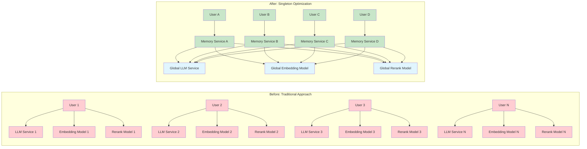
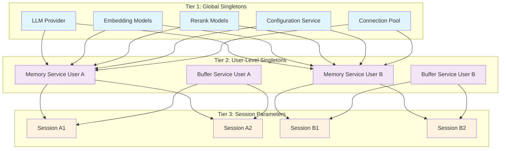

# MemFuse Singleton Optimization Strategy

## Overview

This document explores the singleton pattern optimization strategy for MemFuse, focusing on the fundamental problems it solves, where it can be effectively applied, and the underlying optimization principles. The goal is to provide a conceptual framework that remains valuable regardless of specific implementation details.

## The Problem: Resource Duplication in Multi-User Systems

### Core Challenge

In a multi-user memory system like MemFuse, naive implementation leads to exponential resource consumption:

```
Traditional Approach:
User A → LLM Service A → Embedding Model A → Rerank Model A
User B → LLM Service B → Embedding Model B → Rerank Model B
User C → LLM Service C → Embedding Model C → Rerank Model C
...
Result: N users × M models = N×M resource instances
```

### Resource Multiplication Problem

The following diagram illustrates the dramatic difference in resource usage between traditional and singleton-optimized approaches:



**Key Problems Addressed**:

1. **Memory Explosion**: Each user session creates independent service instances
2. **Model Redundancy**: Identical ML models loaded multiple times in memory
3. **Initialization Overhead**: Repeated expensive setup operations
4. **Connection Proliferation**: Multiple database connections per user
5. **Configuration Duplication**: Same settings parsed and stored repeatedly

## Singleton Applicability Analysis

### What Can Be Singleton vs. What Cannot

The key to effective singleton optimization lies in understanding **data scope** and **state isolation requirements**.

#### ✅ **Global Singleton Candidates**

**Stateless Computational Services:**
- LLM providers and inference engines
- ML model instances (embedding, reranking)
- Utility services (logging, configuration)
- Connection pools and shared resources

**Characteristics:**
- No user-specific state
- Expensive to initialize
- Thread-safe operations
- Shared computational logic

#### ⚠️ **User-Level Singleton Candidates**

**User-Scoped Services:**
- Memory services with user data
- Buffer services with user sessions
- User-specific storage managers
- Personalized configuration overlays

**Characteristics:**
- Contains user-specific state
- Shared across user's sessions
- Isolated between different users
- Moderate initialization cost

#### ❌ **Cannot Be Singleton**

**Session-Specific Data:**
- Individual conversation contexts
- Temporary session state
- Request-specific parameters
- Real-time interaction data

**Characteristics:**
- Highly dynamic state
- Short-lived lifecycle
- Session-specific context
- Frequent state changes

## Three-Tier Singleton Architecture

The following diagram illustrates the three-tier singleton architecture used in MemFuse:



### Tier 1: Global Singletons
**Scope**: Application-wide, shared across all users and sessions

```
┌─────────────────────────────────────────┐
│ LLM Providers & Inference Engines       │
│ ML Model Instances (Embedding/Rerank)   │
│ Configuration Services                   │
│ Database Connection Pools               │
│ Logging & Monitoring Services           │
└─────────────────────────────────────────┘
```

**Optimization Principle**: One instance serves all users
- **Memory**: O(1) instead of O(N) where N = number of users
- **Initialization**: One-time expensive setup
- **Thread Safety**: Must handle concurrent access

### Tier 2: User-Level Singletons
**Scope**: User-specific, shared across user's sessions

```
┌─────────────────────────────────────────┐
│ User Memory Services                     │
│ User Buffer Services                     │
│ User Storage Managers                    │
│ User-Specific Configurations            │
└─────────────────────────────────────────┘
```

**Optimization Principle**: One instance per user, shared across sessions
- **Memory**: O(U) instead of O(U×S) where U = users, S = sessions
- **State Isolation**: User data remains separate
- **Session Efficiency**: Fast session creation/switching

### Tier 3: Session Parameters
**Scope**: Session-specific, passed as parameters

```
┌─────────────────────────────────────────┐
│ Session IDs & Context                    │
│ Request Parameters                       │
│ Temporary State Variables               │
│ Real-time Interaction Data              │
└─────────────────────────────────────────┘
```

**Optimization Principle**: No instance creation, parameter passing only
- **Memory**: O(0) - no persistent objects
- **Performance**: Minimal overhead
- **Flexibility**: Dynamic context handling

## Optimization Strategies

### Strategy 1: Lazy Initialization

**Problem**: Expensive resources initialized at startup even when not needed

**Solution**: Initialize resources only when first accessed

**Benefits**:
- Faster application startup
- Reduced memory footprint for unused features
- Better resource utilization

**Implementation Approach**:
```
if resource is None:
    resource = initialize_expensive_resource()
return resource
```

### Strategy 2: Priority-Based Resource Access

**Problem**: Multiple potential sources for the same resource type

**Solution**: Implement fallback hierarchy for resource acquisition

**Priority Order**:
1. **Global Service Manager** - Centralized singleton instances
2. **Service Factory** - Shared instances with caching
3. **Local Cache** - Component-level caching
4. **New Instance** - Last resort with performance warning

**Benefits**:
- Maximizes resource reuse
- Provides graceful degradation
- Maintains system resilience

### Strategy 3: Conditional Resource Loading

**Problem**: Resources loaded regardless of configuration settings

**Solution**: Load resources only when explicitly enabled

**Implementation Principle**:
```
if feature_enabled_in_config:
    load_and_initialize_resource()
else:
    skip_resource_initialization()
```

**Benefits**:
- Respects user configuration
- Reduces unnecessary resource consumption
- Improves startup performance

## Design Patterns and Best Practices

### Pattern 1: Centralized Service Manager

**Concept**: Single point of control for all global singleton services

**Structure**:
```
GlobalServiceManager
├── LLM Services
├── ML Model Instances
├── Configuration Services
└── Shared Resources
```

**Benefits**:
- Centralized lifecycle management
- Consistent initialization patterns
- Easy monitoring and debugging
- Clear dependency relationships

### Pattern 2: Tiered Caching Strategy

**Concept**: Multiple levels of resource caching with clear hierarchy

**Cache Levels**:
1. **Global Cache**: Application-wide shared resources
2. **User Cache**: User-specific but session-shared resources
3. **Local Cache**: Component-level temporary caching
4. **No Cache**: Direct instantiation (avoided when possible)

**Benefits**:
- Optimal resource utilization
- Graceful performance degradation
- Clear cache invalidation strategies

### Pattern 3: Factory with Singleton Integration

**Concept**: Factory pattern enhanced with singleton awareness

**Factory Responsibilities**:
- Check for existing singleton instances
- Create new instances only when necessary
- Register new instances for future reuse
- Handle instance lifecycle management

**Benefits**:
- Transparent singleton usage
- Backward compatibility
- Flexible instance management

## Common Pitfalls and Solutions

### Pitfall 1: Thread Safety Issues

**Problem**: Singleton instances accessed concurrently without proper synchronization

**Solution**: Implement thread-safe initialization patterns
- Use locks for initialization
- Ensure immutable state where possible
- Design for concurrent read access

### Pitfall 2: Memory Leaks in Long-Running Services

**Problem**: Singleton instances accumulate state over time without cleanup

**Solution**: Implement proper lifecycle management
- Regular cleanup routines
- Weak references where appropriate
- Monitoring for memory growth

### Pitfall 3: Testing Difficulties

**Problem**: Singleton state persists between test cases

**Solution**: Design for testability
- Provide reset mechanisms for testing
- Use dependency injection patterns
- Mock singleton instances in tests

### Pitfall 4: Configuration Conflicts

**Problem**: Global configuration changes affect all users unexpectedly

**Solution**: Layer configuration appropriately
- Global defaults at singleton level
- User-specific overrides at user level
- Session-specific parameters passed explicitly

## Monitoring and Validation

### Key Metrics to Track

**Resource Utilization**:
- Memory usage per user vs. total users
- Model instance count vs. expected count
- Database connection pool utilization

**Performance Indicators**:
- Application startup time
- User initialization latency
- Resource access response times

**System Health**:
- Singleton instance lifecycle events
- Resource cleanup effectiveness
- Error rates in singleton access

## Case Study: PostgreSQL Connection Pool Optimization

### Problem Statement

MemFuse experienced critical PostgreSQL connection exhaustion issues:

```
[ERROR] connection failed: FATAL: sorry, too many clients already
```

**Root Cause Analysis**:
- Each PgaiStore instance created individual connection pools (1-2 connections each)
- Multiple users and memory layers (M0, M1, M2) created separate store instances
- No connection pool sharing between components
- Poor connection cleanup in async contexts
- Configuration values ignored (hardcoded pool sizes)

**Resource Multiplication**:
```
Before: Per user: 1-3 store instances × 2 connections = 2-6 connections
        Multiple users: 5 users × 6 connections = 30 connections
        Result: Connection accumulation until PostgreSQL limit reached
```

### Singleton Solution Design

**Tier 1 Global Singleton**: `GlobalConnectionManager`

```python
class GlobalConnectionManager:
    """
    Tier 1 Global Singleton: PostgreSQL Connection Pool Manager

    Features:
    - Single connection pool per database URL
    - Configuration-driven pool sizing
    - Automatic cleanup and lifecycle management
    - Connection monitoring and statistics
    - Thread-safe operations
    """

    _instance: Optional['GlobalConnectionManager'] = None
    _lock = Lock()

    async def get_connection_pool(self, db_url: str, config: Dict, store_ref: Any):
        """Get or create shared connection pool with reference tracking."""
```

**Key Design Principles Applied**:

1. **Resource Scope Analysis**:
   - Database connections: **Global scope** (shareable across all users)
   - User data: **User scope** (isolated per user)
   - Store instances: **User scope** (separate per user, shared pools)

2. **Configuration Hierarchy**:
   ```yaml
   # Priority: store.database.postgres > database.postgres > postgres > defaults
   database:
     postgres:
       pool_size: 10          # Minimum connections
       max_overflow: 20       # Additional connections
       pool_timeout: 30.0     # Connection timeout
       pool_recycle: 3600     # Connection recycling
   ```

3. **Reference Tracking**:
   - Weak references to track store instances using pools
   - Automatic cleanup when stores are destroyed
   - Force cleanup during service shutdown

### Implementation Results

**Before Optimization**:
- Connection usage: 2-6 connections per user
- Pool count: Multiple individual pools
- Leak rate: Connections accumulate over time
- Resource waste: Many idle individual pools

**After Optimization**:
- Connection usage: 10-30 connections total (configurable)
- Pool count: 1 shared pool per database
- Leak rate: Zero connection leaks
- Resource efficiency: Shared pools across all users

**Test Results**:
- ✅ **20 concurrent stores**: All share 1 connection pool
- ✅ **Connection increase**: Only 11 connections for 20 stores
- ✅ **No leaks**: 0 "too many clients already" errors
- ✅ **User isolation**: Data remains completely isolated despite shared pools

### Key Lessons Learned

1. **Singleton Scope Identification**:
   - **Global singletons**: Database connections, model instances
   - **User singletons**: Memory services, user-specific contexts
   - **Request singletons**: Query contexts, temporary resources

2. **Configuration Integration**:
   - Singleton components must respect configuration hierarchy
   - Default values should be sensible for production use
   - Environment variables should override configuration files

3. **Lifecycle Management**:
   - Explicit cleanup methods are more reliable than destructors
   - Reference counting enables automatic resource management
   - Graceful shutdown requires coordinated cleanup

4. **User Data Isolation**:
   - Shared infrastructure doesn't compromise data isolation
   - Table-level separation provides strong isolation guarantees
   - Service instances maintain user-specific contexts

5. **Testing Strategy**:
   - Stress testing reveals resource leaks under load
   - Integration tests verify isolation boundaries
   - Monitoring tools enable production observability

This case study demonstrates how singleton optimization can solve critical resource management issues while maintaining system integrity and user data isolation.

## Implementation Guidelines

### Decision Framework

When evaluating whether a component should be a singleton, ask:

1. **State Scope**: Does this component contain user-specific or session-specific state?
   - **Yes** → Not a global singleton candidate
   - **No** → Potential global singleton

2. **Initialization Cost**: Is this component expensive to create?
   - **High cost** → Strong singleton candidate
   - **Low cost** → Evaluate other factors

3. **Thread Safety**: Can this component handle concurrent access safely?
   - **Yes** → Singleton feasible
   - **No** → Requires synchronization design

4. **Configuration Dependency**: Does this component depend on user-specific configuration?
   - **Yes** → User-level singleton at most
   - **No** → Global singleton possible

5. **Resource Consumption**: What are the resource usage patterns?
   - **High memory/CPU**: Strong singleton candidate (e.g., ML models)
   - **Network connections**: Consider connection pooling patterns
   - **File handles**: Limit concurrent instances to prevent exhaustion

6. **Cleanup Complexity**: How complex is resource cleanup?
   - **Simple**: Standard destructor patterns may suffice
   - **Complex**: Implement explicit cleanup methods and reference tracking
   - **Critical**: Use coordinated shutdown and monitoring

### Enhanced Decision Matrix

Based on the connection pool optimization experience, use this matrix:

| Component Type | Scope | Singleton Pattern | Key Considerations |
|---|---|---|---|
| **Database Connections** | Global | ✅ Tier 1 Global | Pool sharing, reference tracking, configuration hierarchy |
| **ML Models** | Global | ✅ Tier 1 Global | Memory usage, initialization cost, thread safety |
| **Memory Services** | User | ✅ User-scoped | User isolation, service lifecycle, context management |
| **Configuration** | Global | ✅ Tier 1 Global | Immutable after load, environment variable support |
| **Temporary Buffers** | Request | ❌ Instance per request | Short lifecycle, minimal overhead |
| **User Data Stores** | User | ✅ User-scoped | Data isolation, table separation, shared infrastructure |

### Implementation Checklist

**Before Implementation**:
- [ ] Identify component's state scope and lifecycle
- [ ] Evaluate thread safety requirements
- [ ] Design initialization and cleanup strategies
- [ ] Plan configuration hierarchy and defaults
- [ ] Design reference tracking for automatic cleanup
- [ ] Plan for testing and debugging

**During Implementation**:
- [ ] Implement proper synchronization (asyncio.Lock for async components)
- [ ] Add comprehensive logging with URL masking for security
- [ ] Handle initialization failures gracefully with fallback strategies
- [ ] Implement explicit cleanup methods (don't rely on destructors)
- [ ] Use weak references for automatic resource tracking
- [ ] Provide reset mechanisms for testing
- [ ] Integrate with configuration management system

**After Implementation**:
- [ ] Monitor resource usage patterns and connection counts
- [ ] Validate performance improvements with stress testing
- [ ] Test concurrent access scenarios under load
- [ ] Verify user data isolation despite shared resources
- [ ] Test graceful shutdown and cleanup procedures
- [ ] Document singleton behavior and constraints
- [ ] Create monitoring and diagnostic tools

## Conclusion

Singleton optimization in multi-user systems like MemFuse requires careful analysis of component characteristics and usage patterns. The key is to identify the right balance between resource efficiency and system complexity while maintaining clear separation of concerns across different scopes of data and functionality.

The PostgreSQL connection pool optimization case study demonstrates that singleton patterns can solve critical resource management issues while preserving system integrity. Key success factors include:

### Critical Success Factors

1. **Proper Scope Identification**: Distinguish between global resources (connections, models) and user-specific resources (data, contexts)

2. **Configuration Integration**: Singleton components must respect configuration hierarchies and provide sensible defaults

3. **Lifecycle Management**: Explicit cleanup methods and reference tracking are more reliable than destructor-based cleanup

4. **User Data Isolation**: Shared infrastructure doesn't compromise data isolation when properly designed

5. **Testing Strategy**: Comprehensive testing including stress tests, isolation verification, and resource leak detection

### Performance Impact

The connection pool optimization achieved:
- **Resource Efficiency**: From 2-6 connections per user to 10-30 total connections
- **Elimination of Resource Leaks**: Zero "too many clients already" errors
- **Maintained Isolation**: Complete user data separation despite shared pools
- **Improved Scalability**: Support for more concurrent users with fewer resources

### Best Practices Learned

- **Monitor resource usage patterns** in production to identify optimization opportunities
- **Use weak references** for automatic cleanup without memory leaks
- **Implement explicit cleanup methods** rather than relying on destructors
- **Design configuration hierarchies** that allow environment-specific overrides
- **Create comprehensive test suites** that verify both functionality and resource management

Success depends on understanding the fundamental trade-offs between memory usage, initialization costs, and architectural complexity, then applying appropriate patterns based on each component's specific requirements and constraints. The singleton pattern, when properly applied, can dramatically improve system efficiency while maintaining architectural integrity.


